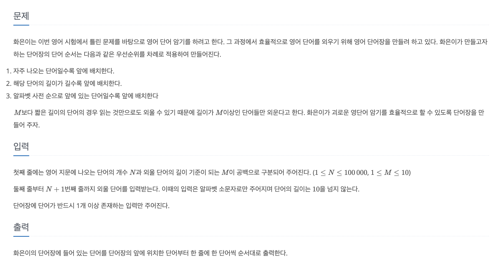

## 우선순위 큐란?
Queue는 먼저 들어온 데이터가 먼저 나가는 **FIFO**(First In First Out) 형태의 자료구조이다.  
`Priority Queue`는 먼저 들어온 데이터가 나가는 것이 아닌 **우선 순위가 높은** 데이터 순서로 나가게 되는 자료구조이다.

## 우선 순위 지정
그러면 우선 순위를 어떻게 정하는 것이 중요하다. 기본적으로는 오름차순으로 정렬된다.
```java
PriorityQueue<String> queue = new PriorityQueue<>();
    
queue.add("A");
queue.add("E");
queue.add("F");
queue.add("C");
queue.add("B");

while (!queue.isEmpty()) {
    System.out.println(queue.poll()); // ABCEF 순서로 출력
}
```

내림차순으로 정렬하려면 java.util.Collections에서 제공해주는 `Collections.reverseOrder()`를 사용하면 된다.
```java
PriorityQueue<String> queue = new PriorityQueue<>(Collections.reverseOrder());
    
queue.add("A");
queue.add("E");
queue.add("F");
queue.add("C");
queue.add("B");

while (!queue.isEmpty()) {
    System.out.println(queue.poll()); // FECBA 순서로 출력
}

``` 

### 복잡한 우선 순위 지정
이 포스트를 쓴 이유이기도 하다. 단순히 오름차순, 내림차순 정렬은 간다하지만 정렬 조건이 여러개 이거나 큐에 있는 데이터의 일부를 조건으로 정렬할 때가 복잡할 것이다.   
하지만 자바에서 제공하는 `Comparator` 인터페이스를 구현하면 원하는대로 정렬할 수 있다.
```java
PriorityQueue<String> queue = new PriorityQueue<>(new Comparator<String>() {
    @Override
    public int compare(String o1, String o2) {
        //이 부분을 구현
        return 0;
    }
});
```
구현할 때 한가지 알고 있어야 할 내용이 있다. compare 메서드를 보면 int를 반환하는 것을 알 수 있다. 

|return|설명|
|------|---|
|양수|첫 번째 객체가 두 번째 객체보다 뒤에 위치|
|0|두 객체의 순서 유지|
|음수|첫 번째 객체가 두 번째 객체보다 앞에 위치|

우선 순위 큐에 새로운 값이 들어올 때 마다 큐에 존재하는 모든 데이터를 비교하여 재정렬하게 된다.

### 적용

<p align="center"><a href="https://www.acmicpc.net/problem/20920">문제</a></p>

문제를 보면 정렬 순서는 자주 나오는 단어, 단어의 길이, 알파벳 사전순서로 정렬해야 한다.

```java
Map<String, Integer> map = new HashMap<>();
PriorityQueue<String> queue = new PriorityQueue<>((a, b) -> {
    //가장 많이 나온 단어 순서대로 정렬
    int compareByValue = Integer.compare(map.get(b), map.get(a))
    if (compareByValue != 0) {
        return compareByValue;
    }
    
    //길이가 다르면 길이가 긴 순으로 정렬
    if (a.length() != b.length()) {
        return  Integer.compare(b.length(), a.length());
    }
    
    //알파벳 순으로 정렬
    return a.compareTo(b);
});

String[] s = br.readLine().split(" ");
int N = Integer.parseInt(s[0]);
int M = Integer.parseInt(s[1])

for (int i = 0; i < N; i++) {
    String word = br.readLine()
    if (word.length() >= M) {
        int count = map.getOrDefault(word, 0);
        count++;
        map.put(word, count);
    }
}

queue.addAll(map.keySet());
```

람다식을 사용해 익명함수를 구현하여 큐에 있는 두개의 객체를 차례대로 비교해 리턴값에 따라 재정렬한다.