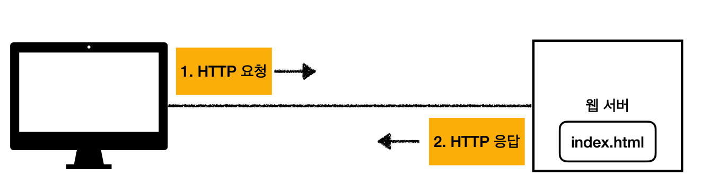
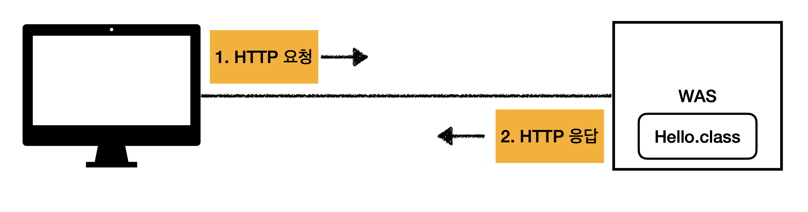
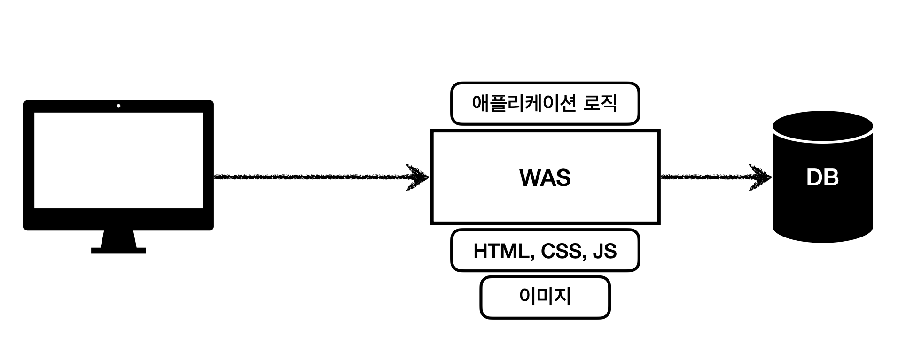
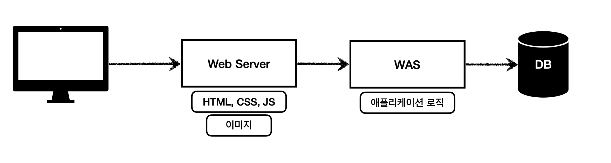
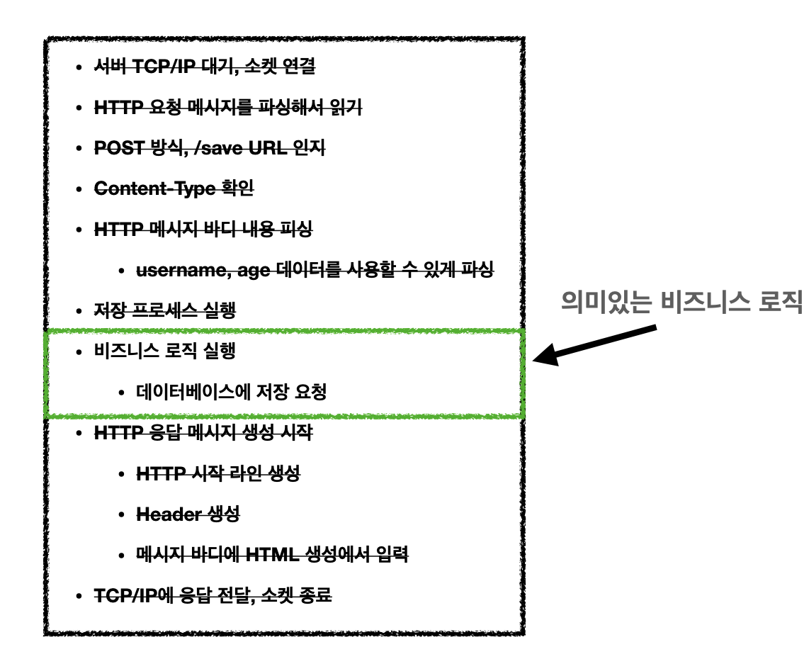
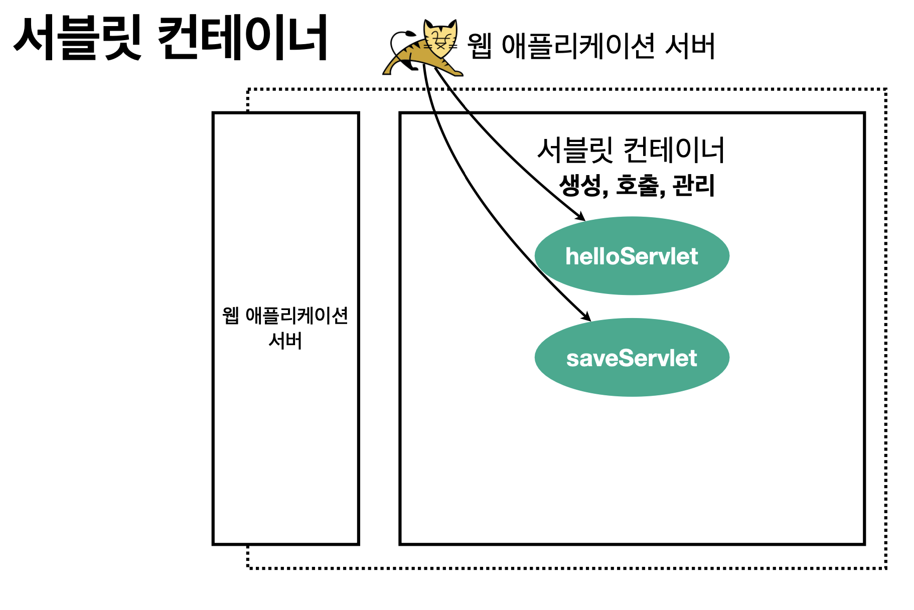
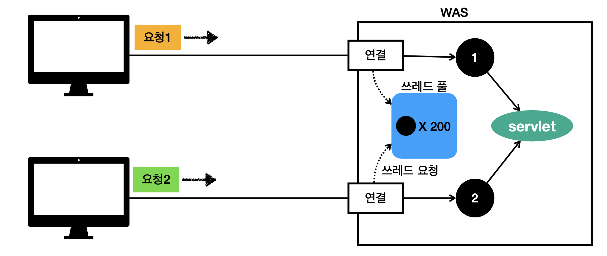
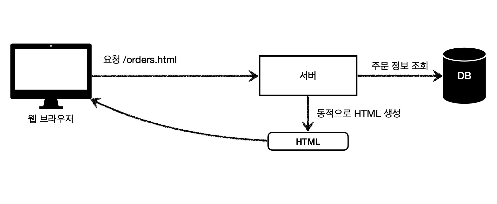
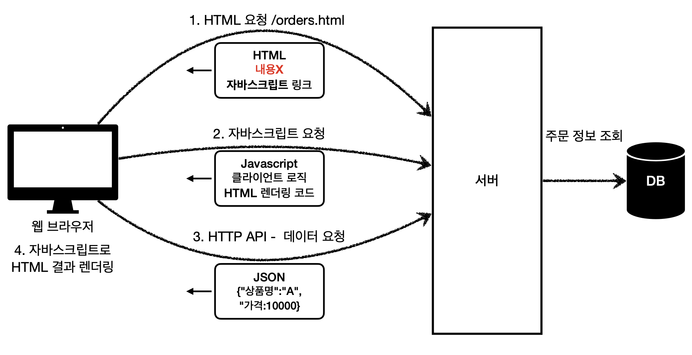

웹은 `HTTP`기반으로 클라이언트와 서버가 통신한다.  
HTML, TEXT, IMAGE, 음성, 영상, 파일, JSON, XML, 거의 모든 형태의 데이터를 전송 가능하다.  

## Web Server
HTTP 기반으로 동작하며 `정적 리소스`를 제공한다.
* 정적 HTML, CSS, JS, 이미지, 영상...
* NGINX, APACHE가 대표적인 웹 서버

## WAS - Web Application Server
HTTP 기반으로 동작하며 프로그램 코드를 실행하여 `애플리케이션 로직` 수행  
웹 서버 기능을 포함하고 있음  
* 동적 HTML, HTTP API 생성 가능
* 서블릿, JSP, 스프링 MVC가 WAS에서 동작
* Tomcat, Jetty, Undertow가 대표적인 WAS

## 웹 서버와 웹 애플리케이션 서버 차이점
둘의 용어도 경계도 모호하다.  
-> 웹 서버도 프로그램 실행하는 기능을 포함하기도 하고, 웹 애플리케이션 서버도 웹 서버의 기능을 제공한다.  
웹 서버는 **정적인 데이터**를 처리하는 서버  
웹 애플리케이션 서버는 **동적인 데이터**를 처리하는 서버

## 웹 시스템 구성
WAS는 정적 리소스, 애플리케이션 로직을 모두 제공하기 때문에 WAS와 DB로만 시스템 구성이 가능하다.  

* WAS가 너무 많은 역할을 담당하여 서버 과부하 우려
* 정적 리소스때문에 애플리케이션 로직 수행이 어려울 수 있음
* WAS에 장애가 발생하면 오류 화면을 보여줄 수 없어 클라이언트 입장에서 불편

Web Server-WAS-DB로 구성하여 정적 리소스는 **웹 서버**가 애플리케이션 로직같은 동적인 처리가 필요하면 **WAS**가 수행한다.

* 효율적인 리소스 관리: 정적 리소스가 많으면 웹 서버 증설, 동적 리소스가 많으면 WAS 증설
* WAS 서버는 잘 죽지면 웹 서버는 잘 죽지않아 WAS나 DB 오류 발생시 웹 서버에서 오류 화면 제공 가능

## 서블릿
클라이언트가 서버에게 POST 메세지를 보낸다고 생각해보자.  
서버는 TCP/IP연결, HTTP 요청 메세지 파싱부터 시작해서 로직을 처리하고 HTTP 응답 메세지를 생성하여 다시 TCP/IP연결 후 전달하고 소켓 연결을 종료하는 과정을 직접 구현해야 한다.  
👉 **비효율적**: 의미있는 로직은 DB에 저장하는 작업이지만 전체 과정을 구현하는 과정이 필요  

서블릿을 지원하는 WAS를 사용하면 로직 처리 이외의 과정들을 모두 지원해준다.

~~~java
@WebServlet(name = "helloServlet", urlPatterns = "/hello")
public class HelloServlet extends HttpServlet {
    @Override
    protected void service(HttpServletRequest request, HttpServletResponse response){
    //애플리케이션 로직
    } 
}
~~~

* urlPattern: 웹 브라우저에서 서버로 URL(/hello)이 요청되면 service 함수 실행 
* HttpServletRequest: HTTP 요청 정보를 담고있는 객체
* HttpServletRespone: HTTP 응답 정보를 담고있는 객체

HTTP 요청 -> WAS는 Request, Response 객체를 생성하여 서블릿 객체 호출 -> 개발자는 Request 객체에 HTTP 요청 정보를 꺼내서 사용 -> 개발자는 Response 객체에 HTTP 응답 정보를 입력  -> WAS는 Response 객체에 담겨있는 정보를 이용하여 HTTP 응답 메세지 생성 -> 웹 브라우저에 전달 -> 웹 브라우저는 HTTP 메세지를 렌더링하여 화면에 출력  

### 서블릿 컨테이너
톰캣처럼 **서블릿을 지원하는 WAS**를 서블릿 컨테이너라고 함

* 서블릿 객체 생성, 초기화, 호출, 종료하는 생명주기 관리
* 서블릿 객체는 `싱글톤`
* JSP도 서블릿으로 변환되어 사용
* 멀티 쓰레드 지원

## 멀티 쓰레드
쓰레드란 애플리케이션 코드를 한줄씩 **순차적**으로 실행하는 것  
동시처리가 필요하다면 쓰레드를 생성해서 수행하면 된다.  
단일 요청에는 하나의 쓰레드를 이용해서 처리하면 되지만 다중 요청에서는 만약 쓰레드가 요청수 보다 적고 쓰레드가 중간에 처리 지연이 발생한다면 모든 요청이 멈춰버리는 상황이 발생한다.  
요청 마다 쓰레드를 생성하여 처리하면 되는데 이러면 문제점이 발생한다.  
### 장점
* 동시 요청을 처리할 수 있다.
* 리소스(CPU, 메모리)가 허용할 때 까지 처리가능
* 하나의 쓰레드가 지연 되어도, 나머지 쓰레드는 정상 동작한다. 

### 단점
* 고객의 요청이 올 때 마다 쓰레드를 생성하면, 응답 속도가 늦어진다.
* 쓰레드는 `컨텍스트 스위칭` 비용이 발생한다.
* 쓰레드 생성에 제한이 없어 고객 요청이 너무 많이 오면, CPU, 메모리 임계점을 넘어서 서버가 죽을 수 있다.

> 컨텍스트 스위칭: 하나의 스레드를 수행하다 다른 스레드로 바꿔서 실행되는 순간을 의미

## 쓰레드 풀
필요한 쓰레드를 쓰레드 풀에 보관하고 관리한다.  
쓰레드가 필요하면 풀에서 꺼내서 사용 후 사용을 종료하면 다시 쓰레드 풀에 쓰레드 반납  
쓰레드를 최대로 사용중에 요청이 들어올 경우 거절하거나 특정 숫자만큼 대기하도록 설정 가능  

### 장점
* 쓰레드가 미리 생성되어있으므로 쓰레드를 생성하고 종료하는데 필요한 `비용이 절약되고 빠르다.`
* 생성 가능한 쓰레드의 최대치가 있으므로 너무 많은 요청이 들어와도 기존 요청은 `안전하게 처리할 수 있다.`

> 실무에서 WAS의 주요 튜닝 포인트는 최대 쓰레드 수이다.  
> 낮게 설정하면 서버 리소스는 여유롭지만 클라이언트는 금방 지연되고 높게 설정하면 CPU, 메모리 임계점 초과로 서버가 다운된다.  
> 적성 숫자는 애플리케이션 로직의 복잡도, CPU, 메모리, IO 리소스 상황에 따라 모두 다르다.

## WAS의 멀티 쓰레드 지원
* 멀티 쓰레드에 대한 부분은 WAS가 처리
* 개발자가 멀티 쓰레드 관련 코드를 신경쓰지 않아도 됨
* 개발자는 마치 싱글 쓰레드 프로그래밍을 하듯이 편리하게 소스 코드를 개발 
* 멀티 쓰레드 환경이므로 싱글톤 객체(서블릿, 스프링 빈)는 주의해서 사용

## SSR - Server Side Rendering
서버에서 HTML 최종 결과물을 만들어 웹 브라우저에게 전달  
주로 정적인 화면에 사용

ex)JSP, 타임리프

## CSR - Client Side Rendering
HTML 결과를 자바스크립트를 사용해 웹 브라우저에서 동적으로 생성해서 적용  
주로 동적인 화면에 사용, 웹 환경을 마치 앱 처럼 필요한 부분부분 변경할 수 있음

ex) React, Vue.js

> * React, Vue.js를 CSR + SSR 동시에 지원하는 웹 프레임워크도 있음  
> * SSR을 사용하더라도, 자바스크립트를 사용해서 화면 일부를 동적으로 변경 가능

## 자바 웹 기술 역사
* 서블릿: HTML을 생성하기 어려움
* JSP: HTML 생성은 편하지만 비지니스 로직까지 담당해 유지보수가 어려움
* 서블릿 + JSP로 MVC 패턴: Model View Controller로 역할을 나누어 개발
* MVC 패턴 프래임워크: MVC 패턴 자동화, 복잡한 웹 기술을 편리하게 사용할 수 있는 다양한 기능 지원
* 어노테이션 기반의 스프링 MVC
* 스프링 부트: 빌드 결과(Jar)에 WAS 서버 포함 -> 빌드 배포 단순화

### 최신 기술
* web servlet 기반의 spring MVC
* Web Reactive - Spring WebFlux
  * 비동기 넌 블러킹 처리
  * 최소 쓰레드로 최대 성능 - 쓰레드 컨텍스트 스위칭 비용 효율화 
  * 함수형 스타일로 개발 - 동시처리 코드 효율화
  * 서블릿 기술 사용X

그러나 웹 플럭스는 기술적 난이도도 높고 관계형 데이터베이스 미지원으로 실무에서 아직은 거의 사용하지 않는다‼️

## 자바 뷰 템플릿 역사
* JSP: 속도 느림, 기술 부족
* 프리마커, 벨로시티: 속도 문제 해결, 다양한 기능 제공 
* 타임리프
  * `내추럴 템플릿`: HTML의 모양을 유지하면서 뷰 템플릿 적용 가능
  * 스프링 MVC와 강력한 통합
  * `최선의 선택` 그러나 성능은 프리마커, 벨로시티가 좋음

