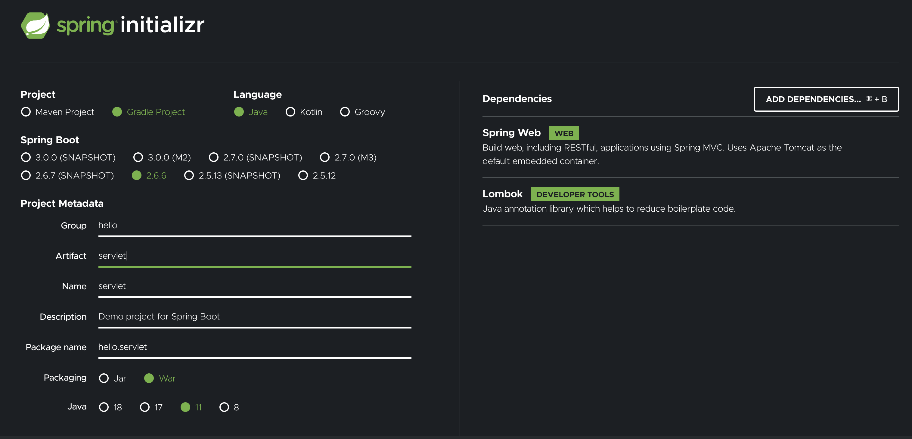
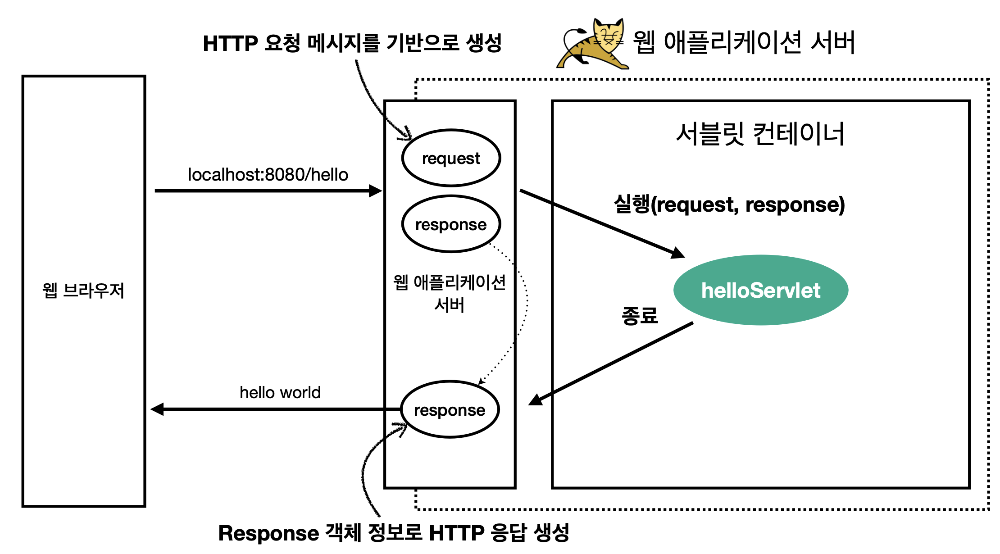
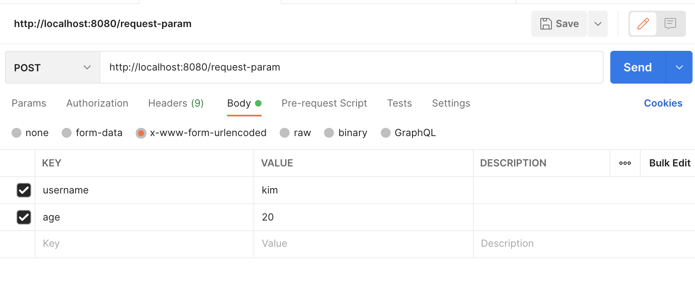
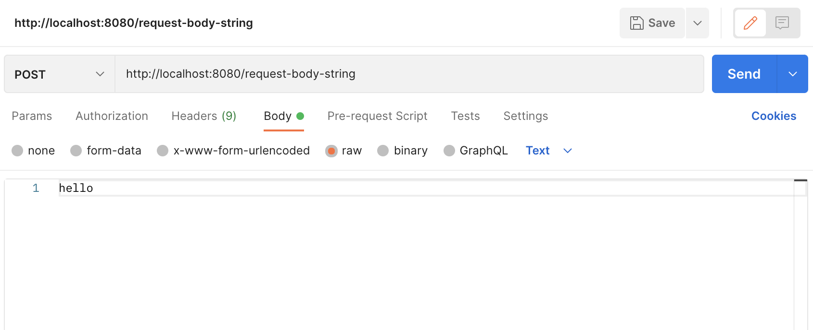
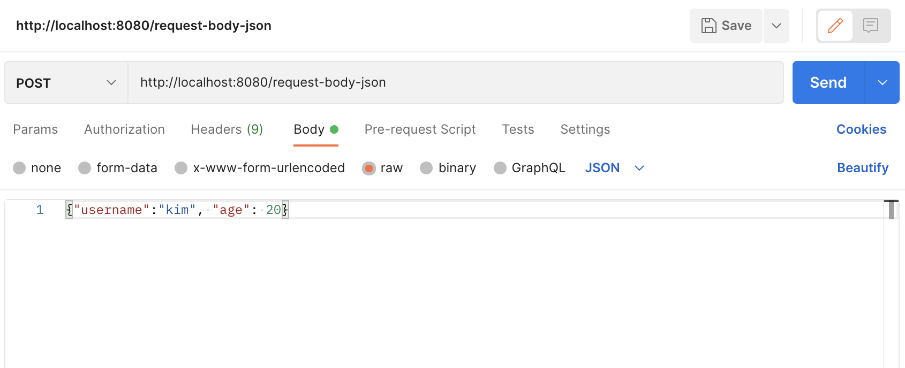

## 프로젝트 생성
<div></div>

> JSP를 실행하기 위해 **War**로 설정

ServletApplication.main() 메소드를 실행하고 localhost:8080에 접속하여 whitelabel page가 나오면 정상  

[https://postman.com/download](https://postman.com/download)에서 Postman 설치   

## Hello 서블릿
서블릿은 톰캣 같은 웹 서버를 따로 설치하고 그 위에 빌드를 해야하지만 너무 번거롭기 때문에 스프링 부트에 내장되어있는 톰캣을 이용  
스브링 부트는 서블릿을 직접 등록해서 사용할 수 있도록 `@ServletComponentScan` 지원하기 때문에 어노테이션 추가
~~~java
@ServletComponentScan // 서블릿 자동 등록
@SpringBootApplication
public class ServletApplication {

	public static void main(String[] args) {
		SpringApplication.run(ServletApplication.class, args);
	}
}
~~~

### 서블릿 등록하기
hello.servlet 아래 basic 디렉토리를 만들고 HelloServlet 자바 파일 생성
~~~java
@WebServlet(name = "helloServlet", urlPatterns = "/hello")
public class HelloServlet  extends HttpServlet {

    @Override
    protected void service(HttpServletRequest request, HttpServletResponse response) throws ServletException, IOException {

        System.out.println("HelloServlet.service");
        System.out.println("request = " + request);
        System.out.println("response = " + response);

        String username = request.getParameter("username");
        System.out.println("username = " + username);

        response.setContentType("text/plain");
        response.setCharacterEncoding("utf-8");
        response.getWriter().write("hello" + username);

    }
}
~~~
**@WebServlet** : 서블릿  어노테이션
* name: 서블릿 이름
* urlPatterns: URL이 매핑되면 service 메소드 실행

localhost:8080/hello?username=world를 입력하면 hello wold가 출력되는걸 확인할 수 있다.  
콘솔 출력 내용
```
HelloServlet.service
request = org.apache.catalina.connector.RequestFacade@477c6ec6
response = org.apache.catalina.connector.ResponseFacade@7abbc34a
username = world
```
### HTTP 요청 메세지 로그 확인하기
application.properties에 설정 추가
```
logging.level.org.apache.coyote.http11=debug
```
 
서버를 다시 실행하고 요청을 보내면 HTTP 요청 메세지 확인할 수 있다.
```
Host: localhost:8080
Connection: keep-alive
sec-ch-ua: " Not A;Brand";v="99", "Chromium";v="100", "Google Chrome";v="100"
sec-ch-ua-mobile: ?0
sec-ch-ua-platform: "macOS"
Upgrade-Insecure-Requests: 1
User-Agent: Mozilla/5.0 (Macintosh; Intel Mac OS X 10_15_7) AppleWebKit/537.36 (KHTML, like Gecko) Chrome/100.0.4896.75 Safari/537.36
Accept: text/html,application/xhtml+xml,application/xml;q=0.9,image/avif,image/webp,image/apng,*/*;q=0.8,application/signed-exchange;v=b3;q=0.9
Sec-Fetch-Site: none
Sec-Fetch-Mode: navigate
Sec-Fetch-User: ?1
Sec-Fetch-Dest: document
Accept-Encoding: gzip, deflate, br
Accept-Language: ko-KR,ko;q=0.9,en-US;q=0.8,en;q=0.7
...
```
> 운영서버에 모든 요청 정보를 남기면 성능 저하가 발생할 수 있으므로 개발 단계에서만 적용

스프링 부트에서 내장 톰캣을 생성하고 내장 톰켓 서버가 helloservlet을 서블릿 컨테이너에 생성한다.
<div></div>

> HTTP 응답에서 Content-Length는 웹 애플리케이션 서버가 **자동**으로 생성

### welcome page 추가
main/webapp 디렉토리를 만들고 index.html 파일 생성
~~~html
<!DOCTYPE html>
<html>
<head>
    <meta charset="UTF-8">
    <title>Title</title>
</head>
<body>
<ul>
    <li><a href="basic.html">서블릿 basic</a></li>
</ul>
</body>
</html><!DOCTYPE html>
<html>
<head>
    <meta charset="UTF-8">
    <title>Title</title>
</head>
<body>
<ul>
    <li><a href="basic.html">서블릿 basic</a></li>
</ul>
</body>
</html>
~~~

이번 장에서 학습할 내용을 쉽게 보기위해 basic.html을 생성
~~~html
<!DOCTYPE html>
<html>
<head>
    <meta charset="UTF-8">
    <title>Title</title>
</head>
<body>
<ul>
    <li>hello 서블릿
        <ul>
            <li><a href="/hello?username=servlet">hello 서블릿 호출</a></li>
        </ul>
    </li>
    <li>HttpServletRequest
        <ul>
            <li><a href="/request-header">기본 사용법, Header 조회</a></li>
            <li>HTTP 요청 메시지 바디 조회
                <ul>
                    <li><a href="/request-param?username=hello&age=20">GET -
                        쿼리 파라미터</a></li>
                    <li><a href="/basic/hello-form.html">POST - HTML Form</a></
                    li>
                    <li>HTTP API - MessageBody -> Postman 테스트</li>
                </ul>
            </li>
        </ul>
    </li>
    <li>HttpServletResponse
        <ul>
            <li><a href="/response-header">기본 사용법, Header 조회</a></li>
            <li>HTTP 응답 메시지 바디 조회
                <ul>
                    <li><a href="/response-html">HTML 응답</a></li>
                    <li><a href="/response-json">HTTP API JSON 응답</a></li>
                </ul>
            </li>
        </ul>
    </li>
</ul>
</body>
</html>
~~~

## HttpServletRequest 개요
서블릿은 개발자가 HTTP 요청 메세지를 편리하게 사용할 수 있도록 HTTP 요청 메시지를 파싱해주고 결과를 `HttpServletRequest` 객체에 담아서 제공  

HTTP 요청 메세지를 편리하게 조회할 수 있다.
```
Start-line: HTTP 메소드, URL, 쿼리 스트링, 스키마/프로토콜 - POST /save HTTP/1.1
```
```
Header: 헤더 조회 - HOST: localhost:8080
                  Content-Type: application/x-www-form-urlencoded                
```
```
Body: form 파라미터 형식 조회, message bdoy 데이터 직접 조회 - username=kim&age=20
```


### 부가 기능
* 임시 저장소: HTTP 요청 시작부터 끝날 때 까지 유지되는 임시 저장소 기능 제공
* 세션 관리 기능

> HTTP 스펙이 제공하는 요청, 응답 메세지 자체에 대한 이해도가 필요하다.

## HttpServeltRequest 기본 사용법
basic 디렉토리 밑에 request 디렉토리를 생성하고 RequestHeaderServlet 자바 파일 생성
~~~java
@WebServlet(name = "requestHeaderServlet", urlPatterns = "/request-header")
public class RequestHeaderServlet extends HttpServlet {

    @Override
    protected void service(HttpServletRequest request, HttpServletResponse response) throws ServletException, IOException {

        printStartLine(request);
        printHeaders(request);
        printHeaderUtils(request);
        printEtc(request);
    }

    private void printStartLine(HttpServletRequest request) {
        System.out.println("--- REQUEST-LINE - start ---");
        System.out.println("request.getMethod() = " + request.getMethod()); //GET
        System.out.println("request.getProtocal() = " + request.getProtocol()); //HTTP/1.1
        System.out.println("request.getScheme() = " + request.getScheme()); //http // http://localhost:8080/request-header
        System.out.println("request.getRequestURL() = " + request.getRequestURL());// /request-test
        System.out.println("request.getRequestURI() = " + request.getRequestURI()); //username=hi
        System.out.println("request.getQueryString() = " +
                request.getQueryString());
        System.out.println("request.isSecure() = " + request.isSecure()); //https 사용 유무
        System.out.println("--- REQUEST-LINE - end ---");
        System.out.println();
    }

    private void printHeaders(HttpServletRequest request) {
        System.out.println("--- Headers - start ---");
/*
        Enumeration<String> headerNames = request.getHeaderNames();
        while (headerNames.hasMoreElements()) {
            String headerName = headerNames.nextElement();
            System.out.println(headerName + ": " + headerName);
        }

*/
        request.getHeaderNames().asIterator()
                        .forEachRemaining(headerName -> System.out.println(headerName + ": " + headerName));


        System.out.println("--- Headers - end ---");
        System.out.println();
    }

    //Header 편리한 조회
    private void printHeaderUtils(HttpServletRequest request) {
        System.out.println("--- Header 편의 조회 start ---");
        System.out.println("[Host 편의 조회]");
        System.out.println("request.getServerName() = " + request.getServerName()); //Host 헤더
        System.out.println("request.getServerPort() = " + request.getServerPort()); //Host 헤더
        System.out.println();
        System.out.println("[Accept-Language 편의 조회]");
        request.getLocales().asIterator()
                .forEachRemaining(locale -> System.out.println("locale = " +
                        locale));
        System.out.println("request.getLocale() = " + request.getLocale());
        System.out.println();
        System.out.println("[cookie 편의 조회]");
        if (request.getCookies() != null) {
            for (Cookie cookie : request.getCookies()) {
                System.out.println(cookie.getName() + ": " + cookie.getValue());
            }
        }
        System.out.println();
        System.out.println("[Content 편의 조회]");
        System.out.println("request.getContentType() = " + request.getContentType());
        System.out.println("request.getContentLength() = " + request.getContentLength());
        System.out.println("request.getCharacterEncoding() = " + request.getCharacterEncoding());
        System.out.println("--- Header 편의 조회 end ---");
        System.out.println();
    }

    //기타 정보는 HTTP 메세지의 정보는 아니다.
    private void printEtc(HttpServletRequest request) {
        System.out.println("--- 기타 조회 start ---");
        System.out.println("[Remote 정보]");
        System.out.println("request.getRemoteHost() = " + request.getRemoteHost()); //
        System.out.println("request.getRemoteAddr() = " + request.getRemoteAddr()); //
        System.out.println("request.getRemotePort() = " + request.getRemotePort()); //
        System.out.println();
        System.out.println("[Local 정보]");
        System.out.println("request.getLocalName() = " + request.getLocalName()); //
        System.out.println("request.getLocalAddr() = " + request.getLocalAddr()); //
        System.out.println("request.getLocalPort() = " + request.getLocalPort()); //
        System.out.println("--- 기타 조회 end ---");
        System.out.println();
    }
}
~~~

localhost:8080/request-header에 접속하면 콘솔로 출력 결과 확인 가능

## HTTP 요청 데이터 개요
HTTP 요청 메세지를 통해 클라이언트에서 서버로 데이터를 전달하는 방법은 3가지가 있다.
* GET - 쿼리 파라미터: 메세지 body 없이 URL의 쿼리 파라미터에 데이터를 포함해서 전달
* POST - HTML form: 메세지 body에 쿼리 파라미터 형식으로 전달
* HTTP message body에 직접 담아서 요청: JSON, XML, TEXT

### GET - 쿼리 파라미터
검색, 필터, 페이징에서 많이 사용하는 방식  
URL에 `?`를 시작으로 보낼수 있고 추가 파라미터는 `&`으로 구분  
ex) https://localhost:8080/request-param**?username=hello&age=20**  

HttpServletRequest에서 제공하는 메소드로 쿼리 파라미터를 조회할 수 있다.
request에 RequestParamServlet 자바 파일 생성
~~~java
/**
 * 1. 파라미터 전송 기능
 * http://localhost:8080/request-param?username=hello&age=20
 */
@WebServlet(name = "requestParamServlet", urlPatterns = "/request-param")
public class RequestParamServlet extends HttpServlet {
    @Override
    protected void service(HttpServletRequest request, HttpServletResponse response) throws ServletException, IOException {

        System.out.println("[전체 파라미터 조회] - start");

        request.getParameterNames().asIterator()
                        .forEachRemaining(paramName -> System.out.println(paramName + "= " + request.getParameter(paramName)));

        System.out.println("[전체 파라미터 조회] - end");
        System.out.println();

        System.out.println("[단일 파라미터 조회 - start");
        String username = request.getParameter("username");
        System.out.println("username = " + username);
        String age = request.getParameter("age");
        System.out.println("age = " + age);
        System.out.println("[단일 파라미터 조회 - end");

        System.out.println("[이름이 같은 복수 파라미터 조회] - start");

        String[] usernames = request.getParameterValues("username");
        for (String name : usernames) {
            System.out.println("name = " + name);
        }

        response.getWriter().write("ok");
        System.out.println("[이름이 같은 복수 파라미터 조회] - end");
    }
}
~~~

> 복수 파라미터는 username=hello&username=kim처럼 같은 파라미터에 두개의 값이 있는 경우이다. request.getParameter("username")을 사용하면 첫 번째 값이 반환된다.

## HTTP 요청 데이터 - POST HTML Form
주로 회원가입이나 상품 주문들에서 사용하는 방식  
* Content-Type: applicaion/x-www-form-urlencoded
* 메세지 바디에 **쿼리 파라미터** 형식으로 전달

webapp/basic/hello-form.html 생성
~~~html
<!DOCTYPE html>
<html>
<head>
    <meta charset="UTF-8">
    <title>Title</title>
</head>
<body>
<form action="/request-param" method="post">
    username: <input type="text" name="username" />
    age: <input type="text" name="age" />
    <button type="submit">전송</button>
</form>
</body>
</html>
~~~

localhost:8080/basic/hello-form.html에 접속하고 f12 개발자 모드에서 HTTP 메세지를 확인할 수 있다.  

> request.getParameter() 메소드는 서버 입장에서 GET url 방식과 html form의 형식이 같으므로 둘 다 사용 가능하다.  

### Postman 테스트
<div></div>
사진과 같이 설정하고 send를 눌러 요청 후 확인한다.  

## HTTP 요청 데이터 - API 메시지 바디와 단순 텍스트
HTTP API에서 주로 사용하고 데이터 형식은 JSON을 많이 사용한다.  

### 단순 텍스트
InputStream으로 HTTP 메시지를 읽을 수 있다.  
RequestBodyStringServlet 생성
~~~java
@WebServlet(name = "requestBodyStringServlet", urlPatterns = "/request-body-string")
public class RequestBodyStringServlet extends HttpServlet {

    @Override
    protected void service(HttpServletRequest request, HttpServletResponse response) throws ServletException, IOException {
        ServletInputStream inputStream = request.getInputStream();
        String messageBody = StreamUtils.copyToString(inputStream, StandardCharsets.UTF_8); // byte 코드를 반환하기 때문에 우리가 읽을 수 있게 utf-8로 지정

        System.out.println("messageBody = " + messageBody);

        response.getWriter().write("ok");
    }
}
~~~

<div></div>
send후 확인  

### API 메세지
JSON 형식의 데이터를 파싱할 수 있게 객체 하나 생성
basic 밑에 HelloData 생성
~~~java
@Getter
@Setter
public class HelloData {

    private String username;
    private int age;

}
~~~
> lombok 라이브러리로 `@Getter`, `@Setter` 어노테이션을 붙여주면 자동으로 코드가 생성된다.

RequestBodyJsonServlet 생성
~~~java
@WebServlet(name = "requestBodyJsonServlet", urlPatterns = "/request-body-json")
public class RequestBodyJsonServlet extends HttpServlet {

    private ObjectMapper objectMapper = new ObjectMapper();
    @Override
    protected void service(HttpServletRequest request, HttpServletResponse response) throws ServletException, IOException {

        ServletInputStream inputStream = request.getInputStream();
        String messageBody = StreamUtils.copyToString(inputStream, StandardCharsets.UTF_8);

        System.out.println("messageBody = " + messageBody);

        HelloData helloData = objectMapper.readValue(messageBody, HelloData.class);

        System.out.println("helloData.username = " + helloData.getUsername());
        System.out.println("helloData.age = " + helloData.getAge());
    }
}
~~~

<div></div>
콘솔에서 출력 결과 확인
```
messageBody = {"username": "kim", "age": 20}
helloData.username = kim
helloData.age = 20
```

> JSON 결과를 파싱해서 사용할 수 있는 자바 객체로 변환 하려면 라이브러리가 필요한테 스프링 부트로 Spring MVC를 선택하게 되면 `Jackson 라이브러리(objectMapper)`를 제공

## HttpServletResponse 기본 사용법
* HttpServeltResponse는 **HTTP 응답 메세지**를 생성한다.
  * 응답코드 지정
  * 헤더 생성
  * 바디 생성
* Content-Tye, 쿠키, redirect 기능도 제공  

basic 디렉토리에 reponse 디렉토리를 만들고 ResponseHeaderServlet 생성
~~~java
@WebServlet(name = "responseHeaderServlet", urlPatterns = "/response-header")
public class ResponseHeaderServlet extends HttpServlet {

    @Override
    protected void service(HttpServletRequest request, HttpServletResponse response) throws ServletException, IOException {
        //[status-line]
        response.setStatus(HttpServletResponse.SC_OK); //200

        //[response-headers]
        response.setHeader("Content-Type,", "text/plain;charset=utf-8");
        response.setHeader("Cache-Control", "no-cache, no-store, must-revalidate");
        response.setHeader("Pragma","no-cache");
        response.setHeader("my-header", "hello"); // 새로운 헤더 생성

        //[Header 편의 메소드]
        content(response);
        cookie(response);
        redirect(response);

        //[message body]
        PrintWriter writer = response.getWriter();
        writer.println("ok");
    }

    private void content(HttpServletResponse response) {
        //Content-Type: text/plain;charset=utf-8
        //Content-Length: 2
        //response.setHeader("Content-Type", "text/plain;charset=utf-8");
        response.setContentType("text/plain");
        response.setCharacterEncoding("utf-8");
        //response.setContentLength(2); //(생략시 자동 생성)
    }

    private void cookie(HttpServletResponse response) {
        //Set-Cookie: myCookie=good; Max-Age=600;
        //response.setHeader("Set-Cookie", "myCookie=good; Max-Age=600");
        Cookie cookie = new Cookie("myCookie", "good");
        cookie.setMaxAge(600); //600초
        response.addCookie(cookie);
    }

    private void redirect(HttpServletResponse response) throws IOException {
        //Status Code 302
        //Location: /basic/hello-form.html

        //response.setStatus(HttpServletResponse.SC_FOUND); 302
        //response.setHeader("Location", "/basic/hello-form.html");
        response.sendRedirect("/basic/hello-form.html");
    }
}

~~~

## HTTP 응답 데이터 단순 텍스트, HTML
* 단순 텍스트
* HTML 응답
* HTTP API - MessageBody JSON

단순 텍스트는 위에 코드에서 writer.println("ok")로 확인 했기때문에 생략  

## HttpServletResponse - HTML 응답
ResponseHtmlServlet 생성
~~~java
@WebServlet(name = "responseHtmlServlet", urlPatterns = "/response-html")
public class ResponseHtmlServlet extends HttpServlet {

    @Override
    protected void service(HttpServletRequest request, HttpServletResponse response) throws ServletException, IOException {
        //Content-Type: text/html;charset=utf-8
        response.setContentType("text/html");
        response.setCharacterEncoding("utf-8");

        PrintWriter writer = response.getWriter();
        writer.println("<html>");
        writer.println("<body>");
        writer.println(" <div>안녕?</div>");
        writer.println("</body>");
        writer.println("</html>");
    }
}
~~~

HTTP 응답으로 HTML을 반환할 떄는 Content-Type을 `text/html`로 지정  

https://localhost:8080/response-html에 접속하여 페이지 소스 보기로 확인 가능  

## HTTP 응답 데이터 - API JSON
ResponseJsonServlet 생성
~~~java
@WebServlet(name = "responseJsonServlet", urlPatterns = "/response-json")
public class ResponseJsonServlet extends HttpServlet {

    private ObjectMapper objectMapper = new ObjectMapper();

    @Override
    protected void service(HttpServletRequest request, HttpServletResponse response) throws ServletException, IOException {
        //Content-Type: application/json
        response.setContentType("application/json");
        response.setCharacterEncoding("utf-8");

        HelloData helloData = new HelloData();
        helloData.setUsername("Kim");
        helloData.setAge(20);

        //{"username" : kim, "age" : 20}
        String result = objectMapper.writeValueAsString(helloData);
        response.getWriter().write(result);
    }
}
~~~

* HTTP 응답으로 HTML을 반환할 떄는 Content-Type을 `application/json`으로 지정
* Jackson 라이브러리가 제공하는 objectMapper.writeValueAsString()을 사용하면 객체를 JSON 문자로 변경 가능

https://localhost:8080/response-json에 접속하여 확인

> application/json은 스펙상 **utf-8** 형식을 사용하도록 정의 되어있어서  application/json;charset=utf-8로 지정하면 의미 없는 파라미터를 추가하게 되는 것이다. `response.getOutputStream()`을 사용하면 이런 문제 해결 가능하다.