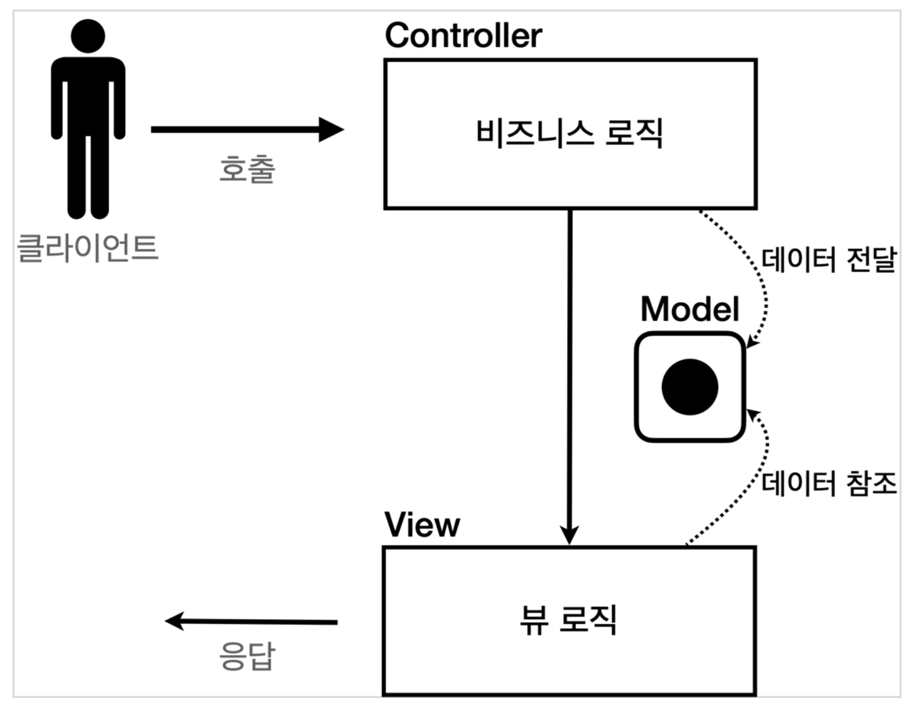
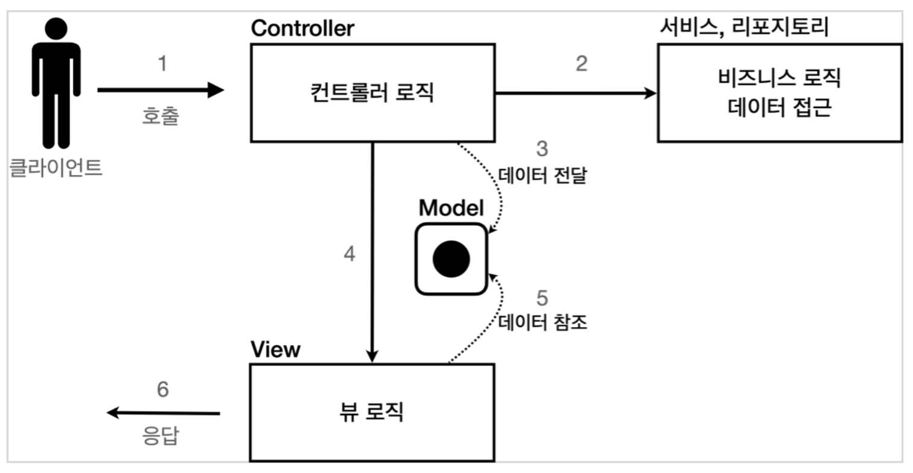

## 회원 관리 웹 애플리케이션 요구사항
* 회원 정보: username, age
* 기능: 회원 저장, 목록 조회

스프링을 사용하지 않고 서블릿 -> JSP -> MVC 순으로 구현한다.

### 회원 도메인 모델
~~~java
@Getter
@Setter
public class Member {

    private Long id;
    private String username;
    private int age;

    public Member() {
    }

    public Member(String username, int age) {
        this.username = username;
        this.age = age;
    }

}
~~~

### 회원 저장소
~~~java
public class MemberRepository {
    //동시성 문제까지 고려하면 ConcurrentHashMap, AtomicLong 사용 고려
    private static Map<Long, Member> store = new HashMap<>();
    private static Long sequence = 0L;

    private static final MemberRepository instance = new MemberRepository();

    public static MemberRepository getInstance() {
        return instance;
    }

    // 싱글톤 패턴 적용을 위해 생성자가 만들어
    private MemberRepository(){
    }

    public Member save(Member member){
        member.setId(++sequence);
        store.put(member.getId(), member);
        return member;
    }

    public Member findById(Long id){
        return store.get(id);
    }

    public List<Member> findAll() {
        return new ArrayList<>(store.values());
    }

    public void clearStore(){
        store.clear();
    }
}
~~~

### 테스트
~~~java
class MemberRepositoryTest {

    MemberRepository memberRepository = MemberRepository.getInstance();

    @AfterEach
    void afterEach(){
        memberRepository.clearStore(); // 저장소를 초기화 해야 다음 테스트 수행때 영향을 주지 않음
    }

    @Test
    void save(){
        //given
        Member member = new Member("hello", 20);

        //when
        Member savedMember = memberRepository.save(member);

        //then
        Member findMember = memberRepository.findById(savedMember.getId());
        assertThat(findMember).isEqualTo(savedMember);
    }

    @Test
    void findAll(){
        //given
        Member member1 = new Member("member1", 20);
        Member member2 = new Member("member2", 30);

        memberRepository.save(member1);
        memberRepository.save(member2);

        //when
        List<Member> members = memberRepository.findAll();

        //then
        assertThat(members.size()).isEqualTo(2);
        assertThat(members).contains(member1, member2);
    }
}
~~~

`@AfterEach`: 테스트가 실행되기 전에 수행하는 메소드

## 서블릿으로 회원 관리 예제 구현
### MemberFormServlet - 서블릿으로 회원 등록 HTML 폼 제공
~~~java
@WebServlet(name = "memberFormServlet", urlPatterns = "/servlet/members/new-form")
public class MemberFormServlet extends HttpServlet {

    private MemberRepository memberRepository = MemberRepository.getInstance();
    @Override
    protected void service(HttpServletRequest request, HttpServletResponse response) throws ServletException, IOException {

        response.setContentType("text/html");
        response.setCharacterEncoding("utf-8");

        PrintWriter w = response.getWriter();
        w.write("<!DOCTYPE html>\n" +
                        "<html>\n" +
                        "<head>\n" +
                        " <meta charset=\"UTF-8\">\n" +
                " <title>Title</title>\n" +
                        "</head>\n" +
                        "<body>\n" +
                        "<form action=\"/servlet/members/save\" method=\"post\">\n" +
                        " username: <input type=\"text\" name=\"username\" />\n" +
                        " age: <input type=\"text\" name=\"age\" />\n" +
                        " <button type=\"submit\">전송</button>\n" +
                        "</form>\n" +
                        "</body>\n" +
                        "</html>\n");
    }
}
~~~
* response 객체 내부에 HTTP 메세지 바디에 직접 데이터를 입력할 수 있는 `PrintWriter`로 html 형식의 문자열을 응답 메세지에 담아 화면에 출력  
* http://localhost:8080/**servlet/members/new-form**으로 접속하여 확인  
* 전송 버튼을 눌러서 HTML Form 데이터를 POST 방식으로 전송해도, 전달 받을 서블릿이 존재하지 않기 때문에 오류 발생

### MemberSaveServlet - 회원 저장
~~~java
@WebServlet(name = "memberSaveServlet", urlPatterns = "/servlet/members/save")
public class MemberSaveServlet extends HttpServlet {

    private MemberRepository memberRepository = MemberRepository.getInstance();

    @Override
    protected void service(HttpServletRequest request, HttpServletResponse response) throws ServletException, IOException {
        System.out.println("MemberSaveServlet.service");
        String username = request.getParameter("username");
        int age = Integer.parseInt(request.getParameter("age"));

        Member member = new Member(username, age);
        memberRepository.save(member);

        response.setContentType("text/html");
        response.setCharacterEncoding("utf-8");
        PrintWriter w = response.getWriter();
        w.write("<html>\n" +
                "<head>\n" +
                " <meta charset=\"UTF-8\">\n" +
                "</head>\n" +
                "<body>\n" +
                "성공\n" +
                "<ul>\n" +
                " <li>id="+member.getId()+"</li>\n" +
                " <li>username="+member.getUsername()+"</li>\n" +
                " <li>age="+member.getAge()+"</li>\n" +
                "</ul>\n" +
                "<a href=\"/index.html\">메인</a>\n" +
                "</body>\n" +
                "</html>");
    }
}
~~~

* 파라미터인 username, age를 이용하여 Memeber 객체 생성 후 MemberReopsitory를 통해서 저장하고 Member 객체로 결과 화면용 HTML을 만들어서 응답  
* http://localhost:8080/**/servlet/members/save** 접속하여 확인

### MemberListServlet - 회원 목록
~~~java
@WebServlet(name = "memberListServlet", urlPatterns = "/servlet/members")
public class MemberListServlet extends HttpServlet {

    private MemberRepository memberRepository = MemberRepository.getInstance();

    @Override
    protected void service(HttpServletRequest request, HttpServletResponse response) throws ServletException, IOException {

        List<Member> members = memberRepository.findAll();

        response.setContentType("text/html");
        response.setCharacterEncoding("utf-8");

        PrintWriter w = response.getWriter();
        w.write("<html>");
        w.write("<head>");
        w.write(" <meta charset=\"UTF-8\">");
        w.write(" <title>Title</title>");
        w.write("</head>");
        w.write("<body>");
        w.write("<a href=\"/index.html\">메인</a>");
        w.write("<table>");
        w.write(" <thead>");
        w.write(" <th>id</th>");
        w.write(" <th>username</th>");
        w.write(" <th>age</th>");
        w.write(" </thead>");
        w.write(" <tbody>");
/*
 w.write(" <tr>");
 w.write(" <td>1</td>");
 w.write(" <td>userA</td>");
 w.write(" <td>10</td>");
 w.write(" </tr>");
*/
        for (Member member : members) {
            w.write(" <tr>");
            w.write(" <td>" + member.getId() + "</td>");
            w.write(" <td>" + member.getUsername() + "</td>");
            w.write(" <td>" + member.getAge() + "</td>");
            w.write(" </tr>");
        }
        w.write(" </tbody>");
        w.write("</table>");
        w.write("</body>");
        w.write("</html>");

    }
}
~~~

* memberRespository.findAll() 메소드를 이용하여 저장되어 있는 모든 회원을 List에 담고 for문을 돌면서 하나씩 출력한 HTML을 응답
* http://localhost:8080/**/servlet/members**에 접속하여 확인

서블릿을 이용하여 동적인 HTML을 만들었지만 코드가 너무 **비효율적**이다. 자바 코드로 HTML을 만들어야하고 오타 확인이나 디버깅이 어렵다.  
`템플릿 엔진`은 HTML 문서에 동적으로 변경해야하는 부분만 자바 코드를 사용하여 변경할 수 있다.  
ex) JSP, Thymleaf, Freemarker, Velocity...

> JSP는 성과 기능면에서 다른 템플릿 엔진에 밀려 점점 사장되어가는 추세이다. 템플릿 엔진마다 장단점이 있지만 새로 프로젝트를 시작한다면 스프링과 잘 통합되는 `Thymleaf`를 추천한다.

## JSP로 회원 관리 예제 구현
JSP를 사용하려면 build.gradle에 라이브러리를 추가해야 한다.
~~~
//JSP 추가
implementation 'org.apache.tomcat.embed:tomcat-embed-jasper'
implementation 'javax.servlet:jstl'
~~~

### 회원 등록 폼
main/webapp/jsp/members/new-form.jsp
~~~jsp
<%@ page contentType="text/html;charset=UTF-8" language="java" %> <!--JSP 문서라는 뜻-->
<html>
<head>
    <title>Title</title>
</head>
<body>
<form action="/jsp/members/save.jsp" method="post">
    username: <input type="text" name="username" />
    age: <input type="text" name="age" />
    <button type="submit">전송</button>
</form>
</body>
</html>
~~~

* 첫 줄을 제외하고 완전히 HTML와 똑같다.
* JSP는 서버 내부에서 서블릿으로 변환된다.
* http://localhost:8080/**/jsp/members/new-form.jsp**에 접속하여 확인

### 회원 저장 
main/webapp/jsp/members/save.jsp
~~~jsp
<%@ page import="hello.servlet.domain.member.MemberRepository" %> <!-- 자바의 import문과 같음-->
<%@ page import="hello.servlet.domain.member.Member" %>
<%@ page contentType="text/html;charset=UTF-8" language="java" %>
<%
    // request, response 사용 가능
    MemberRepository memberRepository = MemberRepository.getInstance();
    System.out.println("save.jsp");
    String username = request.getParameter("username");
    int age = Integer.parseInt(request.getParameter("age"));
    Member member = new Member(username, age);
    System.out.println("member = " + member);
    memberRepository.save(member);
%>
<html>
<head>
    <meta charset="UTF-8">
</head>
<body>
성공
<ul>
    <li>id=<%=member.getId()%></li>
    <li>username=<%=member.getUsername()%></li>
    <li>age=<%=member.getAge()%></li>
</ul>
<a href="/index.html">메인</a>
</body>
</html>
~~~
* `<% ~~ %>`: 자바 코드 입력
* `<%= ~~ %>`: 자바 코드 출력

### 회원 목록 
main/webapp/jsp/members.jsp
~~~jsp
<%@ page import="java.util.List" %>
<%@ page import="hello.servlet.domain.member.MemberRepository" %>
<%@ page import="hello.servlet.domain.member.Member" %>
<%@ page contentType="text/html;charset=UTF-8" language="java" %>
<%
    MemberRepository memberRepository = MemberRepository.getInstance();
    List<Member> members = memberRepository.findAll();
%>
<html>
<head>
    <meta charset="UTF-8">
    <title>Title</title>
</head>
<body>
<a href="/index.html">메인</a>
<table>
    <thead>
    <th>id</th>
    <th>username</th>
    <th>age</th>
    </thead>
<tbody>
<%
    for (Member member : members) {
    out.write(" <tr>");
    out.write(" <td>" + member.getId() + "</td>");
    out.write(" <td>" + member.getUsername() + "</td>");
    out.write(" <td>" + member.getAge() + "</td>");
    out.write(" </tr>");
 }
%>
</tbody>
</table>
</body>
</html>
~~~

## 서블릿과 JSP의 한계
Java 코드를 포함한 다양한 코드가 JSP에 노출되어있다. 이렇게 되면 JSP가 너무 많은 역할을 담당하기 때문에 **유지 보수**에 어려움이 있다.  
그래서 등장한게 `MVC 패턴`이다. 비즈니스 로직은 서블릿처럼 다른 곳에서 처리하고, JSP는 목적에 맞게 HTML로 화면을 그리는 역할에 집중한다.

> 변경의 라이프 사이클이 다르면 유지보수에 안좋다.  
> UI를 일부 수정하는 일과 비즈니스 로직을 수정하는 일은 각각 다르게 발생할 가능성이 높고 대부분 서로에게 영향이 없다.  
> 이런 부분을 하나의 코드로 관리하게 되면 유지보수에 좋지않음

## MVC 패턴
Model, View, Controller라는 영역으로 역할을 나눈 것  
* **컨트롤러**: HTTP 요청을 받아서 파라미터를 검증하고, 비즈니스 로직을 수행. 뷰에 전달할 결과 데이터를 조회해서 모델에 담는다.
* **모델**: 뷰에 출력할 데이터를 담아둔다. 
* **뷰**: 모델에 있는 데이터를 사용하여 화면을 그린다.

> 일반적으로 비즈니스 로직은 **서비스** 계층을 별도로 만들어서 처리

MVC 패턴1

MVC 패턴2

서블릿을 컨트롤러로 사용하고, JSP를 뷰로 사용해서 MVC 패턴을 적용  
모델은 HttpServletRequest 객체를 사용한다. `request.setAttribute`, `request.getAttribute()`로 데이터를 저장하고 보관할 수 있다.
### 회원 등록 폼 - 컨트롤러
~~~java
@WebServlet(name = "mvcMemberFormServlet", urlPatterns = "/servlet-mvc/members/new-form")
public class MvcMemberFormServlet extends HttpServlet {
    @Override
    protected void service(HttpServletRequest request, HttpServletResponse response) throws ServletException, IOException {
        String viewPattern = "/WEB-INF/views/new-form.jsp";
        RequestDispatcher requestDispatcher = request.getRequestDispatcher(viewPattern);
        requestDispatcher.forward(request, response);

    }
}
~~~
`dispatcher.forword()`: 다른 서블릿이나 JSP로 이동할 수 있느 기능으로 서버 내부에서 다시 호출이 발생한다.

> `WEB-INF`: 이 경로안에 있는 JSP는 외부에서 직접 호출할 수 없다.  
> **redirect vs forword**  
> 리다이렉트는 클라이언트에 응답이 나갔다가, 클라이언트가 redirect 경로로 다시 요청  
> 포워드는 서버 내부에서 일어나는 호출

### 회원 등록 폼 - 뷰
main/webapp/WEB-INF/views/new-form.jsp
~~~jsp
<%@ page contentType="text/html;charset=UTF-8" language="java" %>
<html>
<head>
    <title>Title</title>
</head>
<body>
<form action="save" method="post"> 
    username: <input type="text" name="username" /> 
    age: <input type="text" name="age" /> 
    <button type="submit">전송</button>
</form>
</body>
</html>
~~~

* 상대경로를 사용하여 폼 전송시 현재 URL이 속한 계층 경로인 /servlet-mvc/members에 save가 붙은 /servlet-mvc/members/save가 호출된다.
* http://localhost:8080/**servlet-mvc/members/new-form**으로 접속하여 확인

> 이후 코드에서 jsp를 계속 사용하기 때문에 상대 경로 유지

### 회원 저장 - 컨트롤러
~~~java
@WebServlet(name = "mvcMemberSaveServlet", urlPatterns = "/servlet-mvc/members/save")
public class MvcMemberSaveServlet extends HttpServlet {

    private MemberRepository memberRepository = MemberRepository.getInstance();

    @Override
    protected void service(HttpServletRequest request, HttpServletResponse response) throws ServletException, IOException {

        String username = request.getParameter("username");
        int age = Integer.parseInt(request.getParameter("age"));

        Member member = new Member(username, age);
        memberRepository.save(member);

        //Model에 데이터 보관
        request.setAttribute("member", member);

        String viewPath = "/WEB-INF/views/save-result.jsp";
        RequestDispatcher dispatcher = request.getRequestDispatcher(viewPath);
        dispatcher.forward(request, response);
    }
}
~~~

### 회원 저장 - 뷰
main/webapp/WEB-INF/views/save-result.jsp
~~~jsp
<%@ page contentType="text/html;charset=UTF-8" language="java" %>
  <html>
  <head>
      <meta charset="UTF-8">
  </head>
<body> 성공
  <ul>
      <li>id=${member.id}</li> 
      <li>username=${member.username}</li>
      <li>age=${member.age}</li>
</ul>
<a href="/index.html">메인</a>
  </body>
  </html
~~~

* `<%= request.getAttribute("member")%>`로 객체를 꺼낼수 있지만 JSP에서 제공하는 문법인 `${}`을 사용하여 편리하게 조회
* http://localhost:8080/**servlet-mvc/members/new-form**에 접속하여 확인

### 회원 목록 조회 - 컨트롤러
~~~java
@WebServlet(name = "mvcMemberListServlet", urlPatterns = "/servlet-mvc/members")
public class MvcMemberListServlet extends HttpServlet {

    private MemberRepository memberRepository = MemberRepository.getInstance();

    @Override
    protected void service(HttpServletRequest request, HttpServletResponse response) throws ServletException, IOException {
        List<Member> members = memberRepository.findAll();

        request.setAttribute("members", members);

        String viewPath = "/WEB-INF/views/members.jsp";
        RequestDispatcher dispatcher = request.getRequestDispatcher(viewPath);

        dispatcher.forward(request, response);
    }
}
~~~

### 회우너 목록 조회 - 뷰
main/webapp/WEB-INF/views/members.jsp
~~~jsp
<%@ page contentType="text/html;charset=UTF-8" language="java" %>
<%@ taglib prefix="c" uri="http://java.sun.com/jsp/jstl/core"%>
<html>
<head>
    <meta charset="UTF-8">
    <title>Title</title>
</head>
<body>
<a href="/index.html">메인</a>
<table>
    <thead>
        <th>id</th>
        <th>username</th>
        <th>age</th>
        </thead>
        <tbody>
        <c:forEach var="item" items="${members}">
            <tr>
                <td>${item.id}</td>
                <td>${item.username}</td>
                <td>${item.age}</td>
            </tr>
        </c:forEach>
    </tbody>
</table>
</body>
</html>
~~~

* JSP가 제공하는 `taglib` 기능으로 반복하면서 출력
  * members를 순서대로 꺼내 item 변수에 넣고 출력
  * <%@ taglib prefix="c" uri="http://java.sun.com/jsp/jstl/core"%> 선언 필수
* http://localhost:8080/**servlet-mvc/members**에 접속하여 확인

## MVC 패턴의 한게
### 포워드 중복
~~~java
RequestDispatcher dispatcher = request.getRequestDispatcher(viewPath);
dispatcher.forward(request, response);
~~~

View로 이동하는 코드가 항상 중복 호출 되어야한다.

### ViewPath에 중복
~~~java
String viewPath = "/WEB-INF/views/members.jsp";
~~~

prefix: WEB-INF/views, subfix: jsp가 항상 나오고 다른 뷰로 변경하거나 확장자가 바뀌면 전체 코드를 바꿔야한다.

### 사용하지 않는 코드
~~~java
HttpServletRequest request, HttpServletResponse response
~~~

* 사용할 때도 있고 아닐 때도 있지만 특히 response 객체는 현재 코드에서 사용되지 않는다.  
* 또한 HttpServletRequest, Response는 테스트 케이스 작성에도 어려움이 있다.

### 공통 처리가 어렵다.
기능이 복잡해질 수 록 컨트롤러에서 공통으로 처리해야 하는 부분이 증가한다. 공통 처리할 기능을 메소드로 뽑아도 결국은 만든 메소드를 다시 호출해야하고 실수로 호출하지 않으면 문제가 발생한다.  
이 문제를 해결하려면 컨트롤러 호출 전에 공통 기능을 처리해야하는데 **프론트 컨트롤러** 패턴을 도입하면 해결할 수 있다.  
스프링 MVC의 핵심도 이 프론트 컨트롤러