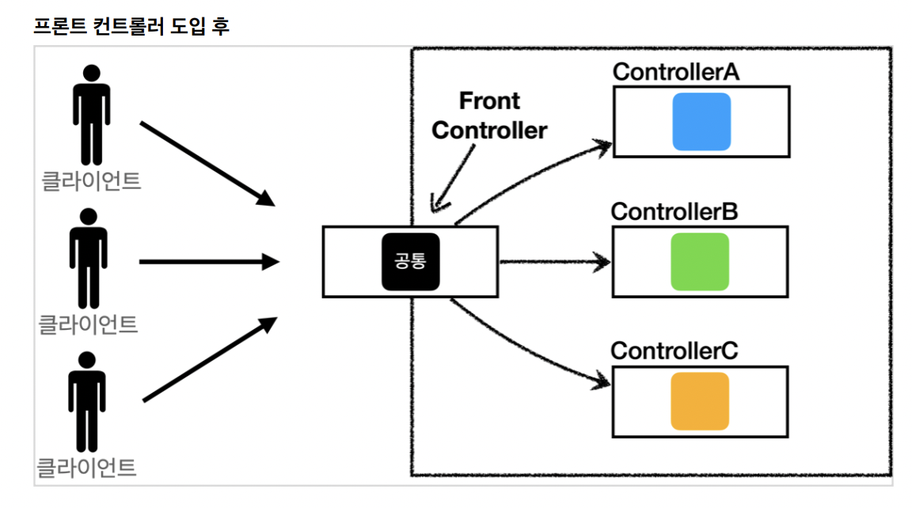
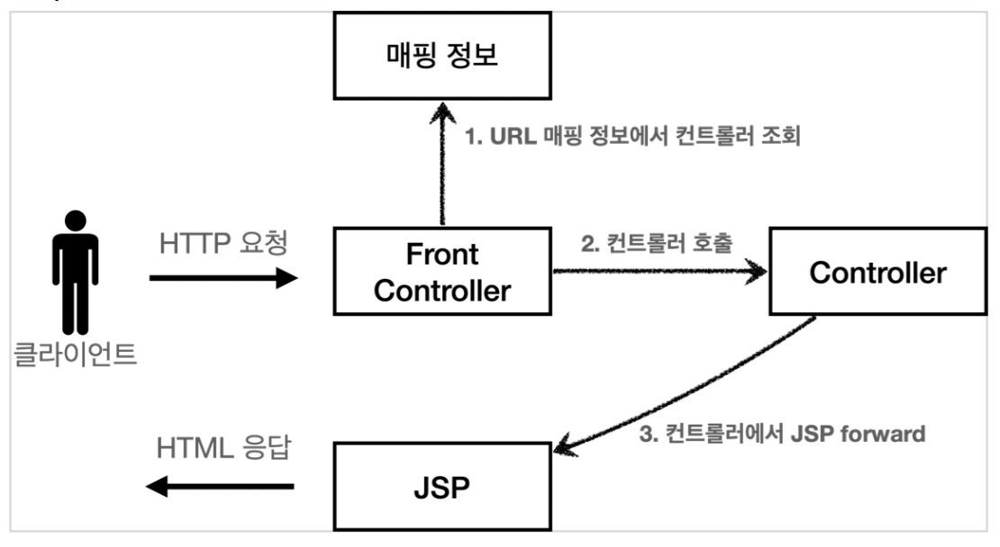
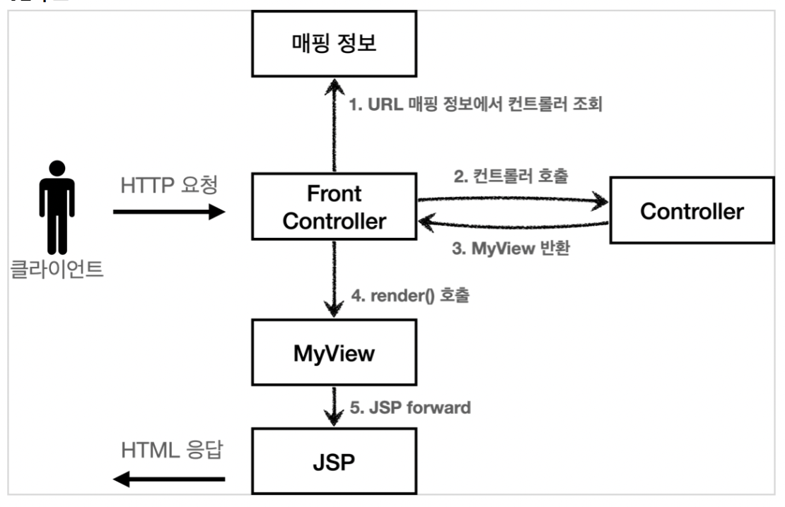
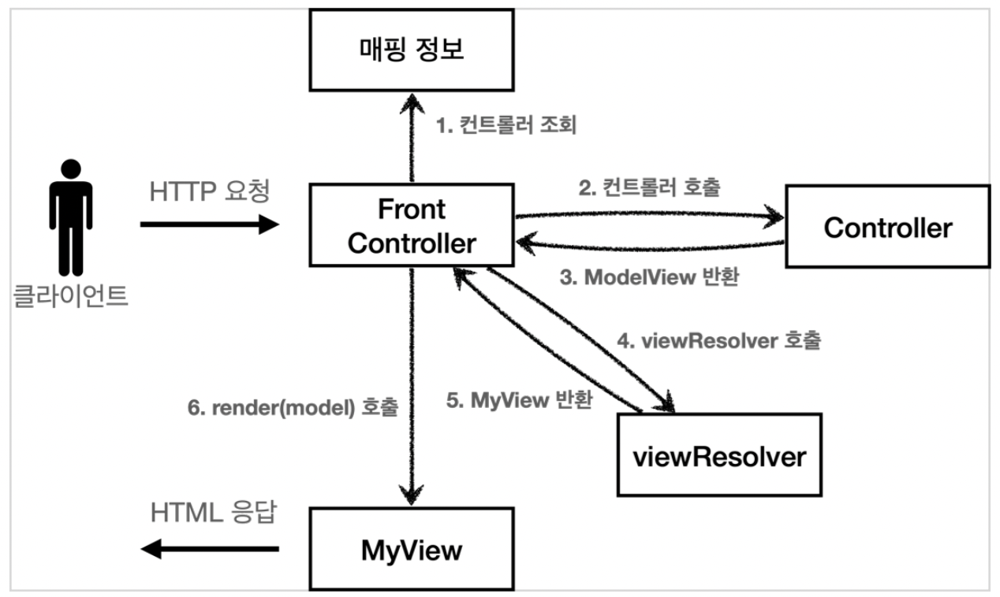
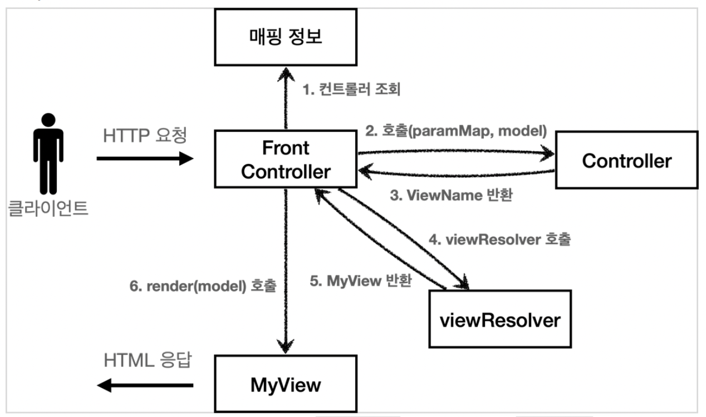
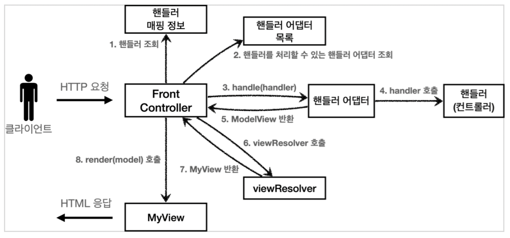

## 프론트 컨트롤러 패턴 소개
프론트 컨트롤러 패턴이란 공통으로 로직을 처리하는 `서블릿` 하나로 클라이언트 요청을 받는 패턴이다.  

### 특징
* 프론트 컨트롤러 서블릿 하나로 클라이언트의 요청을 받는다.
* 프론트 컨트롤러가 클라이언트의 요청에 맞는 컨트롤러를 찾아 호출해준다.
* 컨트롤러에 대한 공통 로직에 대한 처리가 가능하다.
* 프론트 컨트롤러를 제외한 나머지 컨트롤러는 서블릿을 사용하지 않아도 된다.

> 스프링 웹 MVC의 **DispatcherServlet**도 FrontController로 구현 되어있음

프론트 컨트롤러를 단계적으로 도입하고 점차 MVC 프레임워크를 완성 하는 것이 목표이다.

## FrontController 도입 Version1

HTTP 요청한 URL과 매핑 되어있는 컨트롤러를 조회하고 해당 컨트롤러에서 JSP forward로 JSP 호출해서 HTML 응답으로 화면을 확인하는 구조이다.  

### ControllerV1
~~~java
public interface ControllerV1 {

    void process(HttpServletRequest request, HttpServletResponse response) throws ServletException, IOException;
}
~~~

다형성을 적극 활용하기 위해 인터페이스와 구현체를 분리한다. 또한 프론트 컨트롤러가 인터페이스를 호출하여 구현과 관계없이 **로직의 일관성**을 유지한다.  
기존 로직인 회원 등록, 회원 저장, 회원 목록 조회의 구현체를 만들면 된다.

### MemberFormControllerV1 - 회원 등록 컨트롤러 구현체
~~~java
public class MemberFormControllerV1 implements ControllerV1 {

    @Override
    public void process(HttpServletRequest request, HttpServletResponse response) throws ServletException, IOException {
        String viewPath = "/WEB-INF/views/new-form.jsp";
        RequestDispatcher dispatcher = request.getRequestDispatcher(viewPath);
        dispatcher.forward(request, response);

    }
}
~~~

### MemberSaveControllerV1 - 회원 저장 컨트롤러 구현체
~~~java
public class MemberSaveControllerV1 implements ControllerV1 {

    private MemberRepository memberRepository = MemberRepository.getInstance();

    @Override
    public void process(HttpServletRequest request, HttpServletResponse response) throws ServletException, IOException {
        String username = request.getParameter("username");
        int age = Integer.parseInt(request.getParameter("age"));

        Member member = new Member(username, age);
        memberRepository.save(member);

        //Model에 데이터 보관
        request.setAttribute("member", member);

        String viewPath = "/WEB-INF/views/save-result.jsp";
        RequestDispatcher dispatcher = request.getRequestDispatcher(viewPath);
        dispatcher.forward(request, response);

    }
}
~~~

### MemberListControllerV1 - 회원 목록 컨트롤러 구현체
~~~java
public class MemberListControllerV1 implements ControllerV1 {

    private MemberRepository memberRepository = MemberRepository.getInstance();

    @Override
    public void process(HttpServletRequest request, HttpServletResponse response) throws ServletException, IOException {
        List<Member> members = memberRepository.findAll();
        request.setAttribute("members", members);
        String viewPath = "/WEB-INF/views/members.jsp";
        RequestDispatcher dispatcher = request.getRequestDispatcher(viewPath);
        dispatcher.forward(request, response);

    }
}
~~~

내부 로직은 기존 서블릿과 거의 같다.

### FrontControllerV1 - 프론트 컨트롤러
~~~java
@WebServlet(name = "frontControllerServletV1", urlPatterns = "/front-controller/v1/*")
public class FrontControllerServletV1 extends HttpServlet {

    private Map<String, ControllerV1> controllerMap = new HashMap<>();

    public FrontControllerServletV1() {
        controllerMap.put("/front-controller/v1/members/new-form", new MemberFormControllerV1());
        controllerMap.put("/front-controller/v1/members/save", new MemberSaveControllerV1());
        controllerMap.put("/front-controller/v1/members", new MemberListControllerV1());
    }

    @Override
    protected void service(HttpServletRequest request, HttpServletResponse response) throws ServletException, IOException {
        System.out.println("FrontControllerServletV1.service");

        String requestURI = request.getRequestURI();

        ControllerV1 controller = controllerMap.get(requestURI);
        //페이가 없으면 에러
        if(controller == null) {
            response.setStatus(HttpServletResponse.SC_NOT_FOUND);
            return;
        }

        controller.process(request, response);
    }
}
~~~

* `urlPatterns = "/front-controller/v1/*"`: /front-controller/v1을 포함한 하위 요청에 대해서 서블릿이 동작한다.
* `controllerMap`: URL에 따라서 그에 맞는 컨트롤러를 호출하기 위한 매핑

service() 메소드를 보면 요청 url에 맞는 컨트롤러를 찾고 없으면 404 상태코드를, 있으면 해당 컨트롤러를 실행하고 컨트롤러 구현체에서 JSP를 호출해서 HTML 응답한다.  

* 등록: http://localhost:8080/front-controller/v1/members/new-form
* 목록: http://localhost:8080/front-controller/v1/members

## View 분리 Version2
~~~java
String viewPath = "/WEB-INF/views/xxx.jsp";
RequestDispatcher dispatcher = request.getRequestDispatcher(viewPath);
dispatcher.forward(request, response);
~~~
모든 컨트롤러에 뷰로 이동하는 부분이 중복으로 나타나고 있어 이 코드를 줄이기 위해 벌도로 뷰를 처리하는 객체를 만들어서 해결

### MyView
다른 버전에서도 사용하기 때문에 한단계 상위 패키지에 생성
~~~java
public class MyView {

    private String viewPath;

    public MyView(String viewPath) {
        this.viewPath = viewPath;
    }
    
    public void render(HttpServletRequest request, HttpServletResponse response) throws ServletException, IOException {
        RequestDispatcher dispatcher = request.getRequestDispatcher(viewPath);
        dispatcher.forward(request, response);
    }
}
~~~

### ControllerV2
~~~java
public interface ControllerV2 {
    MyView process(HttpServletRequest request, HttpServletResponse response) throws ServletException, IOException;
}
~~~

### MemberFormControllerV2
~~~java
public class MemberFormControllerV2 implements ControllerV2 {
    @Override
    public MyView process(HttpServletRequest request, HttpServletResponse response) throws ServletException, IOException {
        return new MyView("/WEB-INF/views/new-form.jsp");
    }
}
~~~

### MemberSaveContorllerV2
~~~java
public class MemberSaveControllerV2 implements ControllerV2 {

    private MemberRepository memberRepository = MemberRepository.getInstance();

    @Override
    public MyView process(HttpServletRequest request, HttpServletResponse response) throws ServletException, IOException {

        String username = request.getParameter("username");
        int age = Integer.parseInt(request.getParameter("age"));

        Member member = new Member(username, age);
        memberRepository.save(member);

        //Model에 데이터 보관
        request.setAttribute("member", member);

        return new MyView("/WEB-INF/views/save-result.jsp");
    }
}
~~~

### MemberListControllerV2
~~~java
public class MemberListControllerV2 implements ControllerV2 {

    private MemberRepository memberRepository = MemberRepository.getInstance();

    @Override
    public MyView process(HttpServletRequest request, HttpServletResponse response) throws ServletException, IOException {

        List<Member> members = memberRepository.findAll();
        
        request.setAttribute("members", members);
        
        return new MyView("/WEB-INF/views/members.jsp");
    }
}
~~~

### FrontControllerV2
~~~java
@WebServlet(name = "frontControllerServletV2", urlPatterns = "/front-controller/v2/*")
public class FrontControllerServletV2 extends HttpServlet {

    private Map<String, ControllerV2> controllerMap = new HashMap<>();

    public FrontControllerServletV2() {
        controllerMap.put("/front-controller/v2/members/new-form", new MemberFormControllerV2());
        controllerMap.put("/front-controller/v2/members/save", new MemberSaveControllerV2());
        controllerMap.put("/front-controller/v2/members", new MemberListControllerV2());
    }

    @Override
    protected void service(HttpServletRequest request, HttpServletResponse response) throws ServletException, IOException {
        System.out.println("FrontControllerServletV2.service");

        String requestURI = request.getRequestURI();

        ControllerV2 controller = controllerMap.get(requestURI);
        //페이가 없으면 에러
        if(controller == null) {
            response.setStatus(HttpServletResponse.SC_NOT_FOUND);
            return;
        }

        MyView view = controller.process(request, response);
        view.render(request, response);
    }
}

~~~

이제 각 컨트롤러에 dispatcher.forward()를 직접 생성하여 호출하지 않고 MyView 객체를 만들어 반환해주면 프론트 컨트롤러에서 MyView를 받아 `render()` 메소드를 호출해 forward 로직을 수행하여 JSP가 실행된다.

* 등록: http://localhost:8080/front-controller/v2/members/new-form
* 목록: http://localhost:8080/front-controller/v2/members

## Model 추가 Version3
컨트롤러가 서블릿 기술을 사용하지 않으면서 중복되는 뷰 이름을 제거하여 코드가 더 간결해지고 테스트 코드 작성이 쉽다.  
또한 컨트롤러는 뷰의 논리 이름(파일 이름)을 반환하고 프론트 컨트롤러에서 실제 위치를 처리하도록 구현한다.
서블릿 종속을 제거하기 위해 **Model**을 만들고, **View 이름**까지 전달하는 `ModelView`객체를 만들어 사용한다.  

### ModelView
~~~java
public class ModelView {

    private String viewName;
    private Map<String, Object> model = new HashMap<>();

    public ModelView(String viewName) {
        this.viewName = viewName;
    }

    public String getViewName() {
        return viewName;
    }

    public void setViewName(String viewName) {
        this.viewName = viewName;
    }

    public Map<String, Object> getModel() {
        return model;
    }

    public void setModel(Map<String, Object> model) {
        this.model = model;
    }
}
~~~

### ControllerV3
~~~java
public interface ControllerV3 {
    ModelView process(Map<String, String> paramMap);
}
~~~
HttpServletRequest가 제공하는 파라미터는 프론트 컨트롤러가 paramMap에 담아서 호출해주고 응답 결과로 뷰 이름과 뷰에 전달할 Model 데이터를 가지고 있는 ModelView 객체를 반환한다.

### MemberFormControllerV3
~~~java
public class MemberFormControllerV3 implements ControllerV3 {

    @Override
    public ModelView process(Map<String, String> paramMap) {
        return new ModelView("new-form");
    }
}
~~~

### MemberSaveControllerV3
~~~java
public class MemberSaveControllerV3 implements ControllerV3 {

    private MemberRepository memberRepository = MemberRepository.getInstance();

    @Override
    public ModelView process(Map<String, String> paramMap) {
        String username = paramMap.get("username");
        int age = Integer.parseInt(paramMap.get("age"));

        Member member = new Member(username, age);
        memberRepository.save(member);

        ModelView mv = new ModelView("save-result");
        mv.getModel().put("member", member);
        return mv;
    }
}
~~~

### MemberListControllerV3
~~~java
public class MemberListControllerV3 implements ControllerV3 {

    private MemberRepository memberRepository = MemberRepository.getInstance();

    @Override
    public ModelView process(Map<String, String> paramMap) {
        List<Member> members = memberRepository.findAll();
        ModelView mv = new ModelView("members");
        mv.getModel().put("members", members);
        return mv;
    }
}
~~~

### FrontControllerV3
~~~java
@WebServlet(name = "frontControllerServletV3", urlPatterns = "/front-controller/v3/*")
public class FrontControllerServletV3 extends HttpServlet {

    private Map<String, ControllerV3> controllerMap = new HashMap<>();

    public FrontControllerServletV3() {
        controllerMap.put("/front-controller/v3/members/new-form", new MemberFormControllerV3());
        controllerMap.put("/front-controller/v3/members/save", new MemberSaveControllerV3());
        controllerMap.put("/front-controller/v3/members", new MemberListControllerV3());
    }

    @Override
    protected void service(HttpServletRequest request, HttpServletResponse response) throws ServletException, IOException {
        System.out.println("FrontControllerServletV3.service");

        String requestURI = request.getRequestURI();

        ControllerV3 controller = controllerMap.get(requestURI);
        
        //페이가 없으면 에러
        if(controller == null) {
            response.setStatus(HttpServletResponse.SC_NOT_FOUND);
            return;
        }

        //paramMap
        Map<String, String> paramMap = createParamMap(request);
        ModelView mv = controller.process(paramMap);

        String viewName = mv.getViewName();
        MyView view = viewResolver(viewName);

        view.render(mv.getModel(), request, response);

    }

    private MyView viewResolver(String viewName) {
        return new MyView("/WEB-INF/views/" + viewName + ".jsp");
    }

    private Map<String, String> createParamMap(HttpServletRequest request) {
        Map<String, String> paramMap = new HashMap<>();
        request.getParameterNames().asIterator()
                .forEachRemaining(paramName -> paramMap.put(paramName, request.getParameter(paramName)));
        return paramMap;
    }
}
~~~

* `creatParam()`: HttpServletRequest에서 파라미터 정보를 꺼내서 Map으로 변환
* `viewResolver()`: 컨트롤러가 반환한 논리 뷰 이름을 **실제 물리 뷰 경로**로 변환
* 등록: http://localhost:8080/front-controller/v3/members/new-form
* 목록: http://localhost:8080/front-controller/v3/members 

## 단순하고 실용적인 컨트롤러 Version4
구조적으로는 V3에서 거의 완성 되었지만 개발자 입장에서 항상 ModelView 객체를 생성하고 반환하는 부분이 번거롭게 느껴진다. ModelView 대신 **viewName**만 반환한다.

### ContorllerV4
~~~java
public interface ControllerV4 {

    /**
     *
     * @param paramMap
     * @param model
     * @return
     */
    String process(Map<String, String> paramMap, Map<String, Object> model);
}
~~~

### MemberFormControllerV4
~~~java
public class MemberFormControllerV4 implements ControllerV4 {
    @Override
    public String process(Map<String, String> paramMap, Map<String, Object> model) {
        return "new-form"; // 뷰의 논리 이름만 반환
    }
}
~~~

### MemberSaveControllerV4
~~~java
public class MemberSaveControllerV4 implements ControllerV4 {

    private MemberRepository memberRepository = MemberRepository.getInstance();

    @Override
    public String process(Map<String, String> paramMap, Map<String, Object> model) {
        String username = paramMap.get("username");
        int age = Integer.parseInt(paramMap.get("age"));

        Member member = new Member(username, age);
        memberRepository.save(member);

        model.put("member", member);
        return "save-result";
    }
}
~~~

`model.put()`: 모델이 파라미터로 전달되기 때문에 모델을 직접 생성하지 않는다.

### MemberListControllerV4
~~~java
public class MemberListControllerV4 implements ControllerV4 {

    private MemberRepository memberRepository = MemberRepository.getInstance();

    @Override
    public String process(Map<String, String> paramMap, Map<String, Object> model) {
        List<Member> members = memberRepository.findAll();

        model.put("members", members);
        return "members";
    }
}
~~~

### FrontControllerV4
~~~java
@WebServlet(name = "frontControllerServletV4", urlPatterns = "/front-controller/v4/*")
public class FrontControllerServletV4 extends HttpServlet {

    private Map<String, ControllerV4> controllerMap = new HashMap<>();

    public FrontControllerServletV4() {
        controllerMap.put("/front-controller/v4/members/new-form", new MemberFormControllerV4());
        controllerMap.put("/front-controller/v4/members/save", new MemberSaveControllerV4());
        controllerMap.put("/front-controller/v4/members", new MemberListControllerV4());
    }

    @Override
    protected void service(HttpServletRequest request, HttpServletResponse response) throws ServletException, IOException {
        System.out.println("FrontControllerServletV4.service");

        String requestURI = request.getRequestURI();

        ControllerV4 controller = controllerMap.get(requestURI);
        
        //페이가 없으면 에러
        if(controller == null) {
            response.setStatus(HttpServletResponse.SC_NOT_FOUND);
            return;
        }
        
        //paramMap
        Map<String, String> paramMap = createParamMap(request);
        Map<String, Object> model = new HashMap<>();
        String viewName = controller.process(paramMap, model);

        MyView view = viewResolver(viewName);
        view.render(model, request, response);
    }

    private MyView viewResolver(String viewName) {
        return new MyView("/WEB-INF/views/" + viewName + ".jsp");
    }

    private Map<String, String> createParamMap(HttpServletRequest request) {
        Map<String, String> paramMap = new HashMap<>();
        request.getParameterNames().asIterator()
                .forEachRemaining(paramName -> paramMap.put(paramName, request.getParameter(paramName)));
        return paramMap;
    }
}
~~~

* 등록: http://localhost:8080/front-controller/v4/members/new-form
* 목록: http://localhost:8080/front-controller/v4/members

> 프레임워크가 점차 발전하는 과정속에서 개발자가 편라하게 작성하는 방법을 찾은 것

## 유연한 컨트롤러 Version5
지금까지 만들어온 구조는 한가지 컨트롤러 인터페이스만 사용할 수 있었다. `어댑터 패턴`을 사용하면 프론트 컨트롤러가 다양한 방식의 컨트롤러를 처리할 수 있다.

* 핸틀러: 컨트롤러의 이름을 더 넓은 범위로 변경한 것으로 컨트롤러 개념뿐만 아니라 해당 종류의 어댑터만 있으면 처리 가능
* 핸들러 어댑터: 다양한 종류의 컨트롤러를 호출하기 위한 어댑터

### MyHandlerAdapter
~~~java
public interface MyHandlerAdapter {

    boolean supports(Object handler); // handler는 컨트롤러

    ModelView handle(HttpServletRequest request, HttpServletResponse response, Object handler) throws ServletException, IOException;
}
~~~

* `supports()`: 어댑터가 해당 컨트롤러를 처리할 수 있는지 판별
* `handle()`: 실제 컨트롤러를 호출하고 그 결과로 ModelView를 반환

### ControllerV3HandlerAdapter
~~~java
public class ControllerV3HandlerAdapter implements MyHandlerAdapter {
    @Override
    public boolean supports(Object handler) {
        return (handler instanceof ControllerV3); 
    }

    @Override
    public ModelView handle(HttpServletRequest request, HttpServletResponse response, Object handler) throws ServletException, IOException {
        ControllerV3 controller = (ControllerV3) handler;

        Map<String, String> paramMap = createParamMap(request);
        ModelView mv = controller.process(paramMap);

        return mv;
    }

    private Map<String, String> createParamMap(HttpServletRequest request) {
        Map<String, String> paramMap = new HashMap<>();
        request.getParameterNames().asIterator()
                .forEachRemaining(paramName -> paramMap.put(paramName, request.getParameter(paramName)));
        return paramMap;
    }
}
~~~

* handler instanceof ContorllerV3: handler가 ControllerV3의 객체 타입이면 ture, 아니면 false 반환
* handle(): V3 컨트롤러로 변환하고 ModelView 반환

### FrontControllerServletV5
~~~java
@WebServlet(name = "frontControllerServletV5", urlPatterns = "/front-controller/v5/*")
public class FrontControllerServletV5 extends HttpServlet {

    private final Map<String, Object> handlerMappingMap = new HashMap<>();
    private final List<MyHandlerAdapter> handlerAdapters = new ArrayList<>();

    public FrontControllerServletV5() {
        initHandlerMappingMap();
        initHandlerAdapters();
    }

    // 핸들러 매핑 정보 등록
    private void initHandlerMappingMap() {
        handlerMappingMap.put("/front-controller/v5/v3/members/new-form", new MemberFormControllerV3());
        handlerMappingMap.put("/front-controller/v5/v3/members/save", new MemberSaveControllerV3());
        handlerMappingMap.put("/front-controller/v5/v3/members", new MemberListControllerV3());
    }

    // 핸들러 어댑터 등록
    private void initHandlerAdapters() {
        handlerAdapters.add(new ControllerV3HandlerAdapter());
    }

    @Override
    protected void service(HttpServletRequest request, HttpServletResponse response) throws ServletException, IOException {
        
        //요청 url과 매핑된 핸들러 반환 받음
        Object handler = getHandler(request);

        //페이가 없으면 에러
        if(handler == null) {
            response.setStatus(HttpServletResponse.SC_NOT_FOUND);
            return;
        }

        // 핸들러를 처리할 수 있는 어댑터 조회 
        MyHandlerAdapter adapter = getHandlerAdapter(handler);

        //컨트롤러를 사용하여 ModelView 반환받음
        ModelView mv = adapter.handle(request, response, handler);

        String viewName = mv.getViewName();
        MyView view = viewResolver(viewName);

        //JSP 호출하여 화면 랜더링
        view.render(mv.getModel(), request, response);
    }

    private MyHandlerAdapter getHandlerAdapter(Object handler) {
        for (MyHandlerAdapter adapter : handlerAdapters) {
            if (adapter.supports(handler)) {
                return adapter;
            }
        }
        throw  new IllegalArgumentException("handler adapter를 찾을 수 없습니다 handler = " + handler);
    }

    // url과 매핑된 핸들러 반환
    private Object getHandler(HttpServletRequest request) {
        String requestURI = request.getRequestURI();
        return handlerMappingMap.get(requestURI);
    }

    private MyView viewResolver(String viewName) {
        return new MyView("/WEB-INF/views/" + viewName + ".jsp");
    }
}
~~~

* 등록: http://localhost:8080/front-controller/v5/v3/members/new-form
* 목록: http://localhost:8080/front-controller/v5/v3/members 

이제 다른 컨트롤러인 V4를 사용할 수 있게 기능을 추가  
### FrontController에 V4 컨트롤러 추가
~~~java
@WebServlet(name = "frontControllerServletV5", urlPatterns = "/front-controller/v5/*")
public class FrontControllerServletV5 extends HttpServlet {
    ...
    private void initHandlerMappingMap() {
        handlerMappingMap.put("/front-controller/v5/v3/members/new-form", new MemberFormControllerV3());
        handlerMappingMap.put("/front-controller/v5/v3/members/save", new MemberSaveControllerV3());
        handlerMappingMap.put("/front-controller/v5/v3/members", new MemberListControllerV3());

        //v4 추가
        handlerMappingMap.put("/front-controller/v5/v4/members/new-form", new MemberFormControllerV4());
        handlerMappingMap.put("/front-controller/v5/v4/members/save", new MemberSaveControllerV4());
        handlerMappingMap.put("/front-controller/v5/v4/members", new MemberListControllerV4());

    }

    private void initHandlerAdapters() {
        handlerAdapters.add(new ControllerV3HandlerAdapter());
        
        //v4추가
        handlerAdapters.add(new ControllerV4HandlerAdapter());
    }
    ...
}
~~~

### ControllerV4HandlerAdapter
~~~java
public class ControllerV4HandlerAdapter implements MyHandlerAdapter {
    @Override
    public boolean supports(Object handler) {
        return (handler instanceof ControllerV4);
    }

    @Override
    public ModelView handle(HttpServletRequest request, HttpServletResponse response, Object handler) throws ServletException, IOException {
        ControllerV4 controller = (ControllerV4) handler;

        Map<String, String> paramMap = createParamMap(request);
        HashMap<String, Object> model = new HashMap<>();

        //뷰 이름 반환받음
        String viewName = controller.process(paramMap, model);

        // 중요 부분
        // V4는 뷰 이름을 반환했지만 어댑터가 ModelView를 생성하여 반환 이것이 어댑터가 필요한 이유 - 다형성
        ModelView mv = new ModelView(viewName);
        mv.setModel(model);

        return mv;
    }

    private Map<String, String> createParamMap(HttpServletRequest request) {
        Map<String, String> paramMap = new HashMap<>();
        request.getParameterNames().asIterator()
                .forEachRemaining(paramName -> paramMap.put(paramName, request.getParameter(paramName)));
        return paramMap;
    }
}
~~~

* 등록: http://localhost:8080/front-controller/v5/v4/members/new-form
* 목록: http://localhost:8080/front-controller/v5/v4/members 

> 스프링 MVC 프레임워크의 핵심 코드의 축약 버전이다.