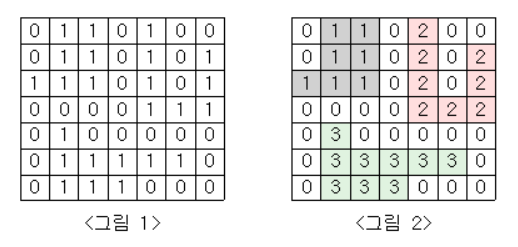

<a href="https://www.acmicpc.net/problem/2667">문제</a>

## 문제
<그림 1>과 같이 정사각형 모양의 지도가 있다. 1은 집이 있는 곳을, 0은 집이 없는 곳을 나타낸다. 철수는 이 지도를 가지고 연결된 집의 모임인 단지를 정의하고, 단지에 번호를 붙이려 한다. 여기서 연결되었다는 것은 어떤 집이 좌우, 혹은 아래위로 다른 집이 있는 경우를 말한다. 대각선상에 집이 있는 경우는 연결된 것이 아니다. <그림 2>는 <그림 1>을 단지별로 번호를 붙인 것이다. 지도를 입력하여 단지수를 출력하고, 각 단지에 속하는 집의 수를 오름차순으로 정렬하여 출력하는 프로그램을 작성하시오.

## 입력
첫 번째 줄에는 지도의 크기 N(정사각형이므로 가로와 세로의 크기는 같으며 5≤N≤25)이 입력되고, 그 다음 N줄에는 각각 N개의 자료(0혹은 1)가 입력된다.

## 출력
첫 번째 줄에는 총 단지수를 출력하시오. 그리고 각 단지내 집의 수를 오름차순으로 정렬하여 한 줄에 하나씩 출력하시오.

## solution
~~~python
import sys

N = int(sys.stdin.readline())
graph = []
ans = []

for i in range(N):
    graph.append(list(map(int,sys.stdin.readline().strip())))

def dfs(x,y):
    global count
    if x < 0 or x >= N or y < 0 or y >= N:
        return False
    if graph[x][y] == 1:
        graph[x][y] = 0 # 방문 표시
        dfs(x-1,y)
        dfs(x+1,y)
        dfs(x,y-1)
        dfs(x,y+1)
        count += 1 # 같은 단지 갯수
        return True
    return False

count = 0
for i in range(N):
    for j in range(N):
        if dfs(i,j) == True:
            ans.append(count)
            count = 0 ## 초기화
ans.sort() 
print(len(ans))
for num in ans:
    print(num)
~~~