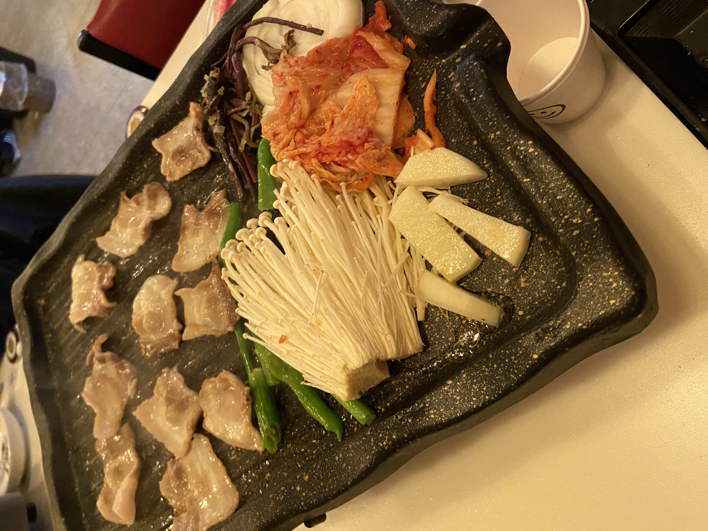

## 💥오늘 한 일💥 
깃허브 브로그 네비게이션 수정 -> 인프런 Spring 입문 강의 시작 -> 저녁

## 네비게이션 수정
오늘 2시 30분부터 9시까지 왕십리 요거프레소에서 카페 공부를 했다. 블로그 수정을 거의 다 했다고 생각했지만 생각해보니 네비게이션 바에 공부한 과목들을 하나씩 넣기에는 너무 난잡할 것 같아서 Study 아래에 submenu 형식으로 카테고리를 분헐하고 각 카테고리별 포스트를 볼 수 있게 page도 설정했다. 맨처음 블로그를 만들떄는 다른 사람의 코드를 가져와 살짝만 수정하는 정도였지만 이번에는 내가 직접 코드를 보고  
수정했다. 생각보다 금방 고쳐져서 뿌듯했다.😁

## spring 입문
인프런에 김영한 강사님의 무료 강의인 spring 입문 강의를 오늘 처음 듣고 개발환경 세팅과 웹 브라우저에 출력까지 해보았다. 그리고 강의 내용도 그렇고 다들 IntelliJ를 사용한다길래 이클립스를 지우고 갈아탔다.
IntelliJ에서 Eclips로 못돌아간다던대... 근데 확실히 IntelliJ가 단축키와 자동완성이 있어서 더 편하다ㅋㅋㅋ 진작 올걸 그랬네;; 아직 Spring 초반이고 입문 강의라 깊이있게 들어기지 않아서 좋다. 우선 가볍게  
듣고 심화 내용은 기초를 잘 배우고 들어야겠다.

## 저녁

 📌양평회관 ⭐4/5 

저녁으로 양평회관에 냉동삼겹살을 먹으러 갔다. 삼겹살은 자주 먹지만 냉삼은 정말 오랜만에 먹었는데 맛있었다. 특히 같이 찍어먹는 소스가 쌈장, 기름장, 소금, 와사비, 치즈 가루, 명란젓이 나왔는데 명란젓이 진짜
미쳤다. 명란젓을 찍은 고기와 밥을 같이 먹으면 대JMT이였다. 또 먹고싶네..ㅎ 소스가 6가지나 나와서 물리지않았고 항상 고기집이나 곱창 먹으러 갈때 계란찜을 시키는 사람으로서 서비스로 나오는게 매우 매우 마음에 들었다. 냉삼 치고는 1인분에 12,000원이나 해서 가격대가 좀 있었지만 그래도 고기가 좋은 고기인 것같아서 맛있게 먹고 왔다.