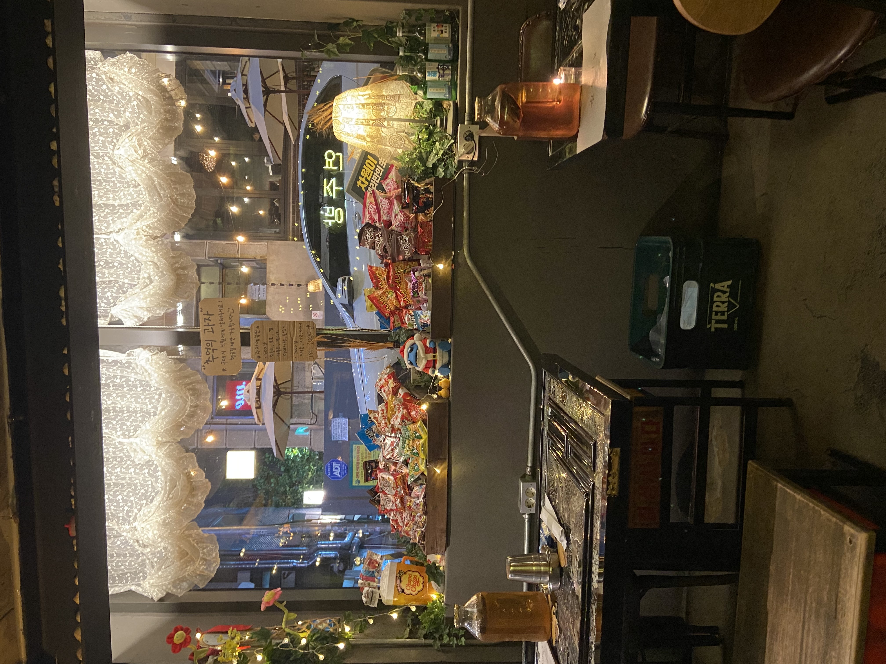
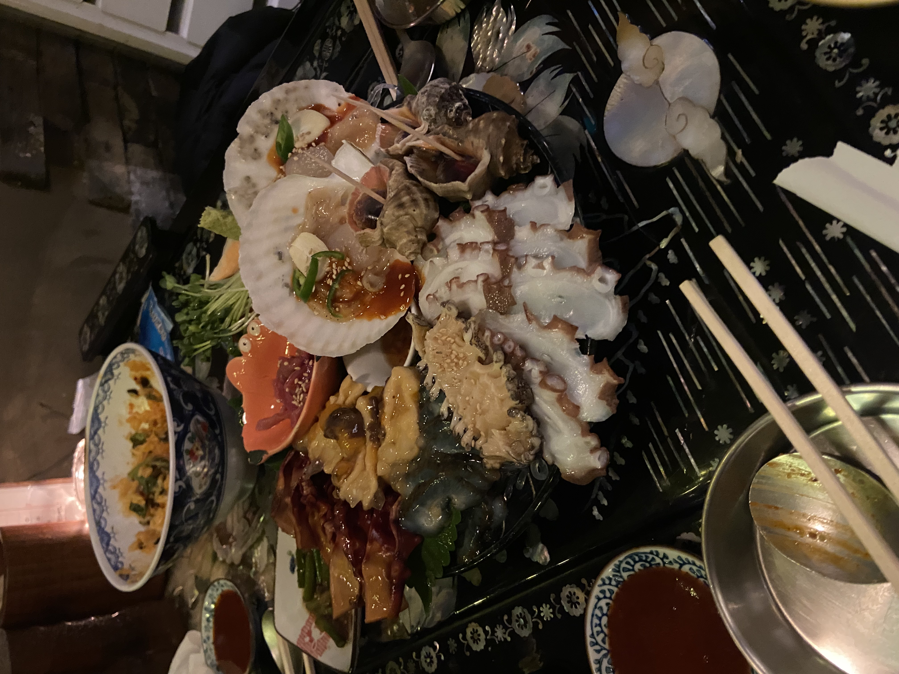
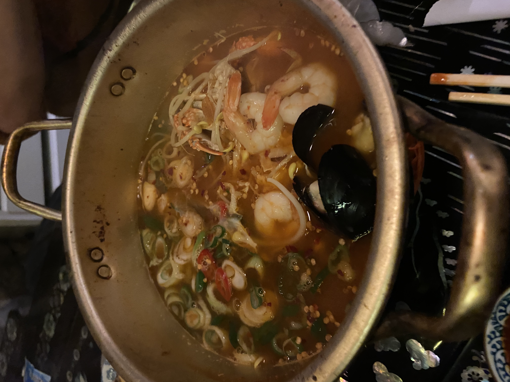

## 💥오늘 한 일💥
Spring 복습 -> 저녁 약속

## 강의 
집에서 간단하게 여태까지 공부한 spring 내용을 천천히 다시 읽었다. 입문용 자료여서 그런지 어려운 내용은 없었지만 그래도 처음 공부하는거라 완벽하게 알고있는 것이 아니였다. 꾸준히 공부하면 이해가 되겠지...

## 저녁 약속
<html>
<head>
	<meta charset='utf-8'>
	<meta name="viewport" content="width=device-width,initial-scale=1.0,minimum-scale=1.0,maximum-scale=1.0,user-scalable=no">
	
</head>
<body>

	<input type="radio" name="slide" id="slide01" checked>
	<input type="radio" name="slide" id="slide02">
	<input type="radio" name="slide" id="slide03">
    <input type="radio" name="slide" id="slide04">
	

		<ul class="slidelist">
			<li>
				<a>
					<label for="slide04" class="left"></label>
					
					<label for="slide02" class="right"></label>
				</a>
			</li>
			<li>
				<a>
					<label for="slide01" class="left"></label>
					
					<label for="slide03" class="right"></label>
				</a>
			</li>
			<li>
				<a>
					<label for="slide02" class="left"></label>
					
					<label for="slide04" class="right"></label>
				</a>
			</li>
            <li>
				<a>
					<label for="slide03" class="left"></label>
					
					<label for="slide01" class="right"></label>
				</a>
			</li>
		</ul>
	

 📌연주방 ⭐4/5 

 서울 마포구 동교로46길 7 

</body>
</html>
우리가 시킨건 모듬해산물, 낙지덮밥, 해물라면을 시켰다. 모듬해산물 재료가 정말 싱싱하고 특히 마늘 기름장에 찍어먹으면 더욱 맛있었다. 모듬 해산물은 안주로 딱이여서 배고픈 우리는 낙지 덮밥과 라면을 추가로 먹었다. 낙지 덮밥은 그럭저럭이였는데 해물 라면이 진짜 맛있었다. 사실 어느 식당을 가도 해물 라면은 실패할 수 없는 음식이지만 콩나물이 들어가서 술 먹을때 국물 한입 떠먹으면 해장하면서 술먹는 느낌을 받았다. 하지만 가격에 비해 성인 남성 3명이 먹기에는 조금 부족..?해서 2차로 역전할머니 맥주를 갔다.

2차로 가볍게 맥주 3개를 시켜서 먹고 노래방을 갔다.  

## ps 
노래방 갔다가 감자탕 집에서 또 해장술 먹었다ㅋㅋ.. 피시방으로 마무리 후 집으로 귀가