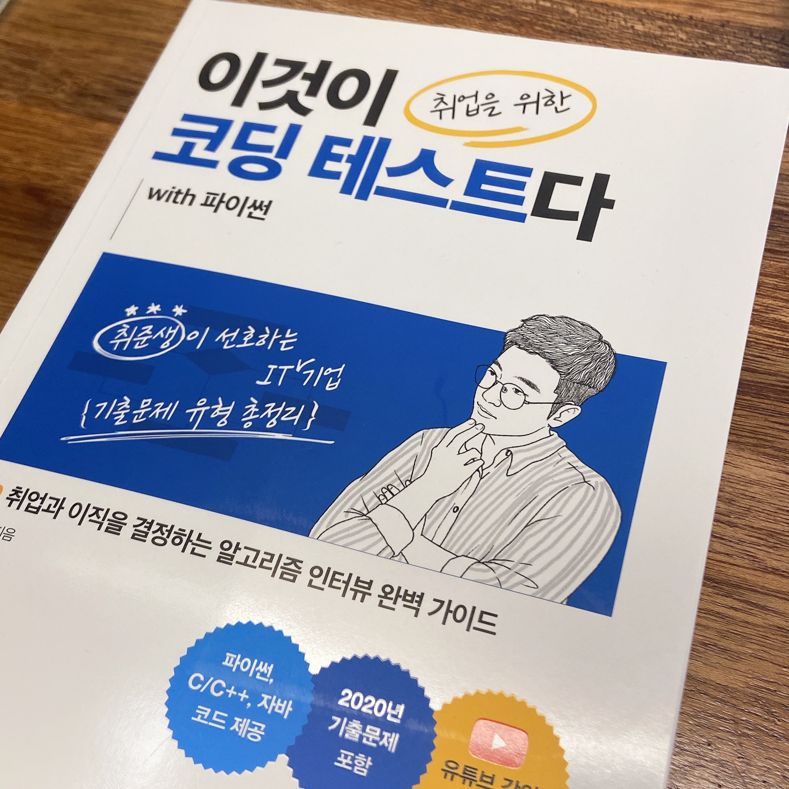

## 💥오늘 한 일💥
코딩 테스트 공부시작❗❗

## 알고리즘 공부

 📌이것이 코딩 테스트다 with python 

알고리즘 문제를 풀때 구글에서 검색하거나 유튜브 강의로 필요한 알고리즘을 찾아서 공부했더니 내가 잘 이해할 수 있게 설명 되어있는 글이나 강의를 찾는게 일이였다. 그래서 책을 사기로 했는데 2학년 2학기 알고리즘 수업때 교수님의 내용에서 이해가 잘 안되는 부분을 유튜브 동빈나분의 강의를 들었어서 이분이 쓴 책을 사기로 했다. 추천을 받기도 했고...ㅎ 그리디까지 봤는데 설명도 잘 되어있고 내가 생각하지 못한 해결 방법도 나와 있어서 괜찮은거같다. 사실 구글에 검색하면 다 나오는 내용이지만 나는 역시 책이나 강의 자료가 있어야 공부가 더 잘되는거 같다. 열코해야지🔥
