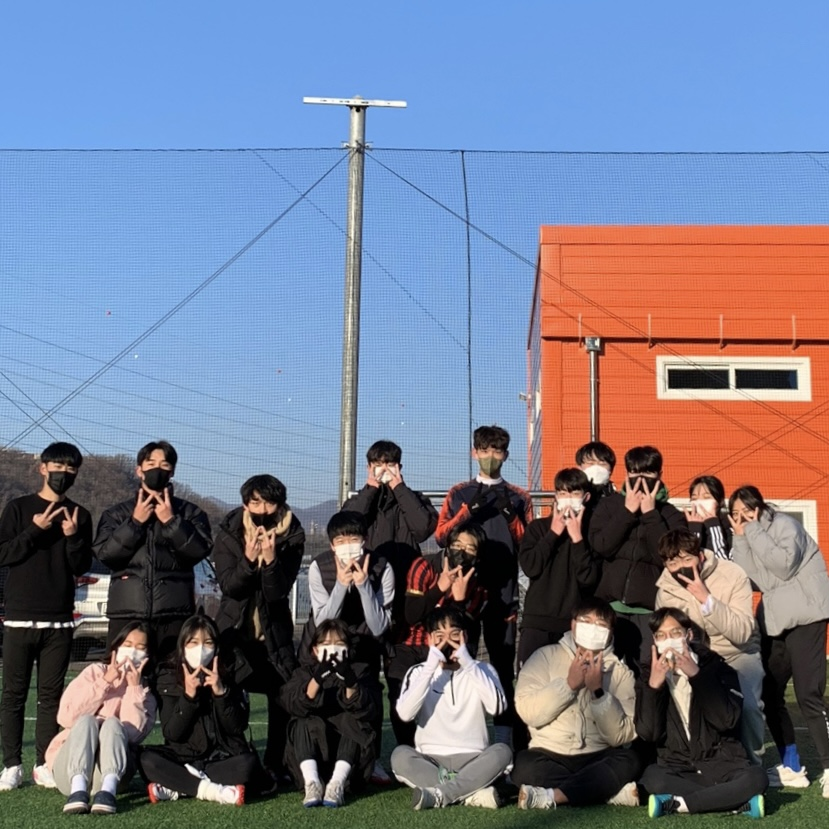

## 💥오늘 한 일💥
풋살 -> 알고리즘❗❗

## ⚽풋살

14시~16시 오금다신풋살장에서 동아리 활동을 하였다. 처음에는 다들 어색했지만 두달이 지난 지금은 꽤 친해져서 더욱 재밌어진거같다. 추운데 다치면 큰 부상으로 이어지는데 다들 안다치게 조심히 차서 다행이다😁 대충 1등으로 마무리한거같은데 사실 잘 모른다...ㅎ 다음주 동아리 리그전 개막이라 매우 기대가 되는데 세레머니상도 있다길래 연구 좀 해봐야지ㅋㅋ(축신 린가드 피리 뺏어올 예정)

## 이것이 코딩 테스트다
스프링 웹 프로젝트를 하려고 했지만 프론트 만들기가 너무 귀찮고 새로 다시 공부해야되어서 시간도 많이 잡아먹길래 일단 중단했다. 노트북을 바꾸고 안드로이드 + 스프링으로 다시 프로젝트를 시작하려고 존버중이다(아마 다음주면 노트북 살듯!) 한달동안 연말연시라 약속도 많고 공부도 하기싫었지만 그래도 꾸역꾸역 알고리즘 공부는 했다. 구현, 정렬, BFS/DFS, 이진 탐색을 공부했고 지금은 다이나믹 프로그래밍을 시작했다. 앞서 배웠던것은 그래도 괜찮았는데 다이나믹 프로그래밍이 너무 이해가 안된다,,,ㅠ 하다보면 되겠지라는 마인드로 버텨오고 있는데 정 안되면 인강이라도 들어야지😫