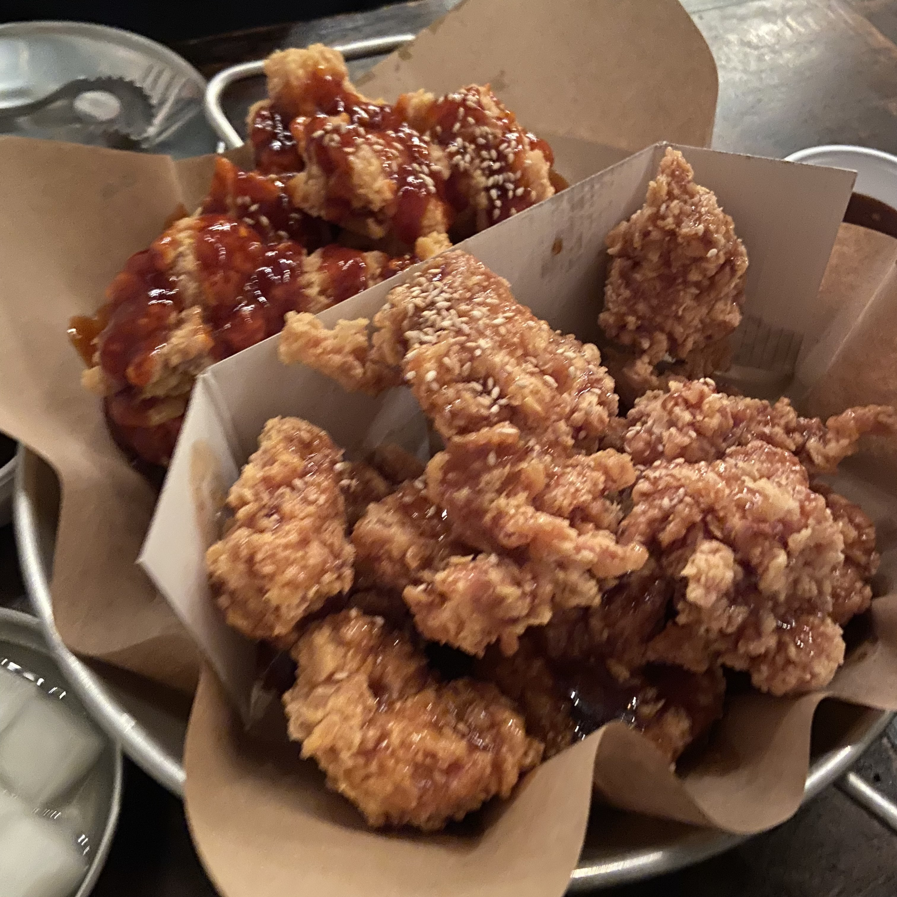

## 💥오늘 한 일💥
생활 맥주 -> 스카

## 치맥

 📌생활 맥주 홍대동교동점 ⭐4/5 

 서울특별시 마포구 월드컵로3길 28 

고등학교 친구들과 오랜만에 만나서 치맥을 했다. 친구 한명이 치맥 땡긴다고 해서 찾아보다가 요즘 그 해 우리는을 보고 있는데 드라마속 PPL로 나온 생활 맥주가 너무 맛있어 보여 영업 당했다...ㅋㅋㅋ 앵그리 치킨인가? 그거 하나랑 레드 블랙 반반을 시켰더니 서비스라고 감튀도 나왔다. 남자 셋이서 3조각 정도 남기고 나왔다. 배부르게 먹은듯ㅋㅋ 먹고 디저트로 설빙가서 와르르딸기빙수를 봤는데 딸기가 두조각만 보여서 ㄹㅇ 와르르 무너진건가? 했는데 빙수 안에 딸기가 있는거였다. 후식 야무지게 먹고 스카로 출발~

## 스카
인프런 스프링 기본편을 듣고 좋은 객체 지향 프로그래밍은 정리할 필요가 있을꺼 같아서 구글 서치 + 강의자료를 바탕으로 블로그에 정리를 했다. 공부하면서 느낀건데 정말 구현만 되게 개발하는게 아니라 클린 코드로 깔끔하게 짜는게 정말 어려운거 같다. 첫 개발할때는 나름 객체 활용한다고 했는데 이 강의를 들어보니까 무지성으로 코드를 짰다는 생각만 들어서 부끄럽다..ㅎ 막 작성하면 시간은 단축 되겠지만 앞으로는 5가지 원칙을 지키려고 노력하면서 코드를 작성해야겠다.