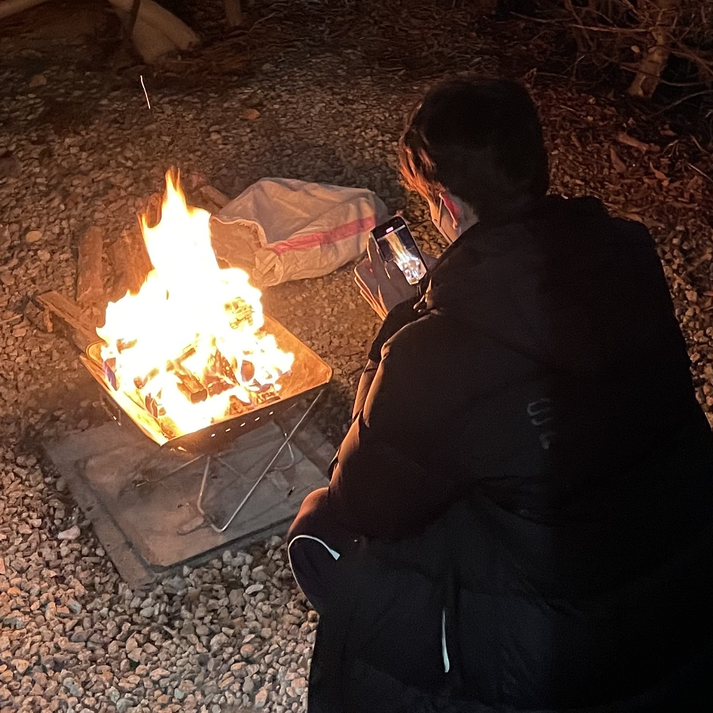
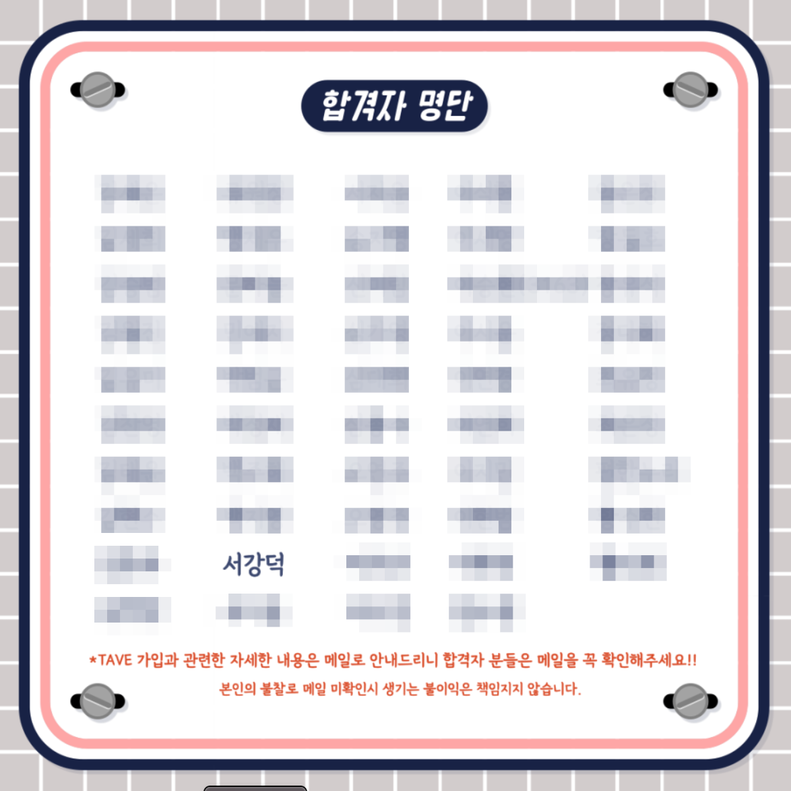

## 캠핑

 📌북한산 럭셔리카라반

 서울특별시 은평구 북한산로 242 

날도 풀린거 같고 오랜만에 여행으로 카라반에 갔다왔다. 처음 사용해보는 카라반인데 생각보다 안에도 넓고 깨끗하고 따뜻했다. 캠핑 와서 먹는 고기는 언제나 맛있다. 불멍 하면서 오로라 가루 + 군고구마 + 마시멜로우 구워 먹었는데 구운 마시멜로우는 처음 먹어봤다. 생각보다 쉽게 타서 굽기 힘들었지만 바삭한 식감이 너무 좋아 맛있었다. 근데 너무 달다...ㅎ 배터지게 먹은 하루

## TAVE 9기 합격!

캠핑 당일 7시 발표길래 솔직히 기대하지않았다. 같이 면접 본 사람한테 나보다 질문도 많이 했고 관심을 더 가지는거 같아서 열정을 더 보였어야했나? 하면서 면접을 마무리했다. 고기 굽다가 확인 했는데 붙었다!! 다 태울뻔,,ㅋㅋㅋㅋ 스프링 하는사람 많아서 스터디 팀까지 만들었다. 열심히 해야지..! 

