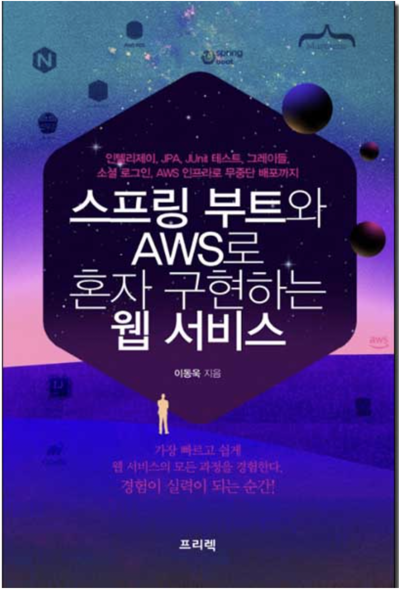

## 테이브 전반기 스프링 스터디 끝
7주동안 동아리에서 진행한 스프링 스터디가 끝이 났다. 강남에서 만났고 2-3시간동안 책에 있는 내용 실습하면서 모르는 부분이나 잘 되는 부분을 서로 도와주면서 책 한권을 끝냈다.

`스프링 부트와 AWS로 구현하는 웹 서비스`
aws는 처음 실습해봐서 걱정도 많았고 과금이 되지 않을까 매우 조심스럽게 진행하다 보니 솔직히 매끄럽게 배포가 안되었다. 오류도 터지고 책에 있는 내용과 버전도 다르고 구글링과 깃허브 이슈를 보면서 겨우 했지만 무엇보다 팀원들과 같이 진도를 나가면서 많은 도움이 되었다. 막히는게 있으면 바로 질문도 되고 내가 답변을 해줄때도 있고 오류 코드 보면서 같이 고민하고 혼자 공부했다면 분명 중간에 포기했겠지만 팀원들과 같이 공부해서 너무 좋았다. 다들 고생 많았다 **봄에 Spring**  
ps. 봄에 시작한 스프링 공부인데 왜 이제 곧 여름이지...
