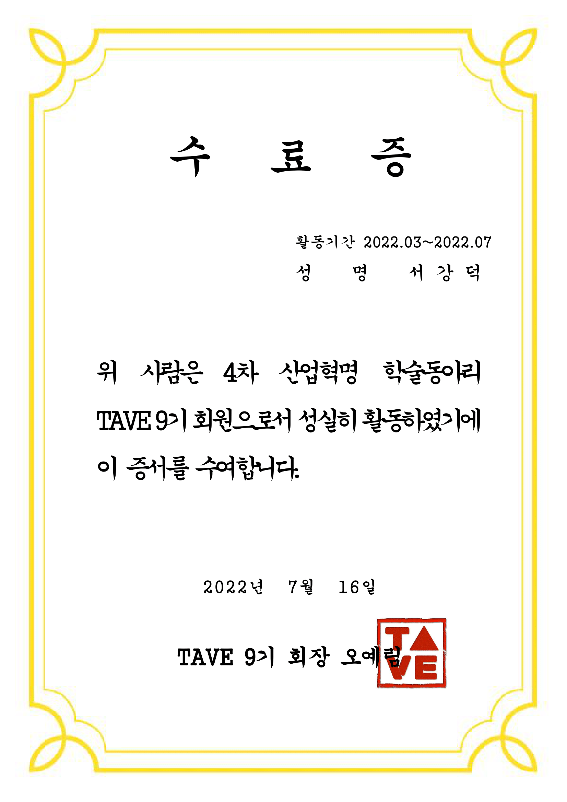

## TAVE 9기 활동 끝

길다면 길고 짧다면 짧은 9기 활동이 끝났다. 전반기때는 스프링과 AWS 연동하는 스터디를 했고 후반기때는 전반기 스터디를 바탕으로 앱 프로젝트를 진행하였다. 깃허브 사용법과 협업에서 프론트 팀과 소통하는 법을 많이 배웠다. 모든 팀원이 정말 열심히 했고 특히 프로젝트는 매일 카톡방이 불타올랐다🔥 최근 2주동안은 코드짜고 핫픽스하고 배포하고 정신 없었지만 그래도 재미있었다. 내가 생각하지 못한 부분에서 팀원들이 해결책을 찾아주고 예외사항이나 조금 더 나은 코드를 만들기 위해서 다같이 노력했다. 사실상 명세서 만들고 레이아웃 만들고 하는 시간을 빼면 개발 투자시간은 2주정도였는데 서버가 생각보다 늦게 완성되는 바람에 안드로이드 팀원들이 막판에 너무 고생했다. 그걸 알기에 카톡방 항상 열어두고 질문, 요청사항, 오류나는 부분들 거의 실시간으로 해결하면서 완성하였다.

## 컨퍼런스 2등

처음 목적은 CV모델을 탑재하여 사진을 올리면 어떤 식물이고 물은 얼마나 주는지 알아서 추천해주는 기능을 우선적으로 넣고 싶었는데 모델을 찾아보니 야생화나 감자, 옥수수와 같은 일반 가정집에서 키울만한 식물 분류 모델이 없어서 아쉽게도 이런 기능은 빼고 식물 물주기 알림 기능과 양육하면서 기록할 수 있는 일기, 서로의 식물을 자랑하며 공유하고 정보를 얻는 다양한 서비스를 기획하고 개발에 시작했다. ERD, API 명세서를 작성한 뒤 안드로이드팀은 뷰 구현, 서버팀은 각자 맡은 부분을 개발했다. 서버를 다 만들고 안드로이드와 연결하는 과정에서 예상치 못한 이슈나 오류사항을 먄냐서 고전했지만 그래도 완성을 하였고 무엇보다 팀장이 피피티와 발표를 완벽하게 준비해서 2등을 하지않았나싶다. 상금은 무려 20만원이나 받았고 조만간 뒷풀이를 할 예정이라 너무 기대된다!! 