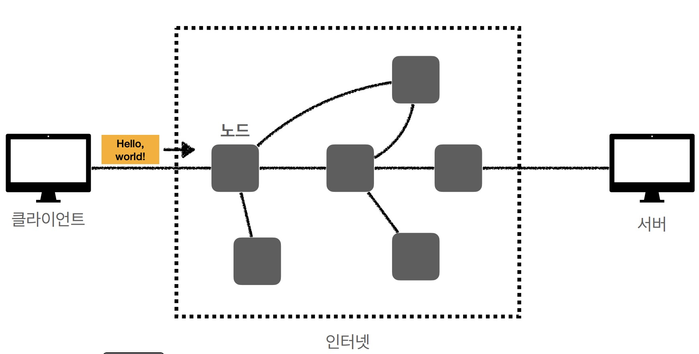
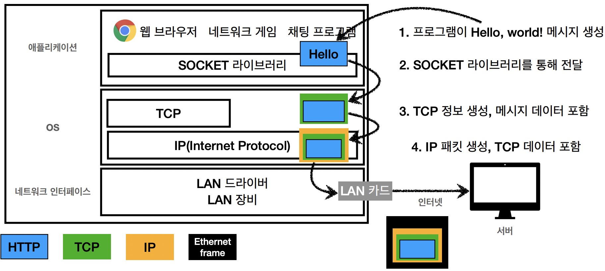
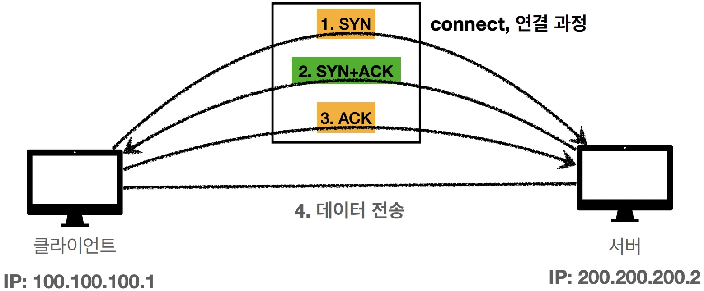
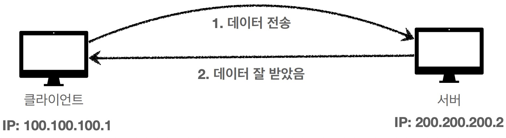
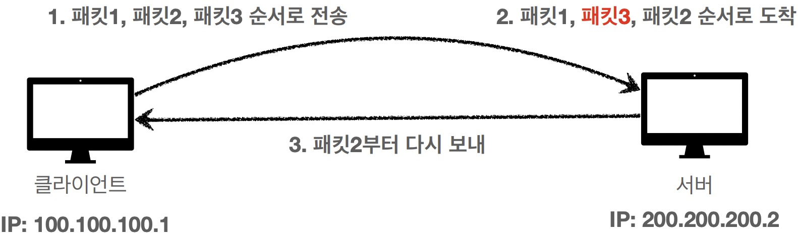
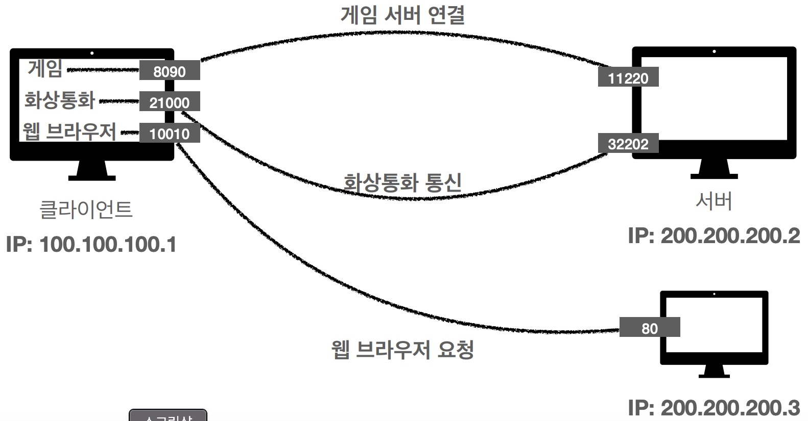

## 인터넷 통신
인터넷이란?  
전세계 컴퓨터를 연결해놓은 것

<p align="center"></p>
클라이언트가 데이터를 보내면 중간에 있는 수많은 노드(서버)를 거쳐 목적지까지 도달하게 된다.

* network-edge: 클라이언트나 서버와 같은 `end-system`들이 있는 네트워크의 가장자리
* core-network: 시스템 중앙에 위치하여 `데이터 전송` 역할의 핵심

core-network에서 라우팅과 포워딩을 사용해 목적지까지 데이터를 전송한다.

## IP
Internet Protocol의 약자로 네트워크에서 컴퓨터를 구분시켜주는 통신 규약이다.  
호스트간의 통신만 담당하며 `패킷`이라는 통신 단위로 데이터를 전달한다.

### 패킷이란?
데이터 전송하는데 필요한 정보들을 담은 블록  
출발지에서 패킷 생성 -> 인터넷에 전송 -> 수많은 노드들을 거쳐 목적지에 도달 -> 도착 확인 -> 출발지로 확인 메세지 전달 

### 문제점
* `비연결성`: 패킷을 받을 대상을 신경 쓰지 않고 패킷을 전송
* `비신뢰성`: 중간 노드들의 문제로 패킷 손실이 되어도 알 수 없음
* `순서 보장이 안됨`

## TCP/UDP
### 인터넷 프로토콜 스택의 4계층
```
어플리케이션 계층: 프로세스 간의 통신을 위해 설계된 계층 - HTTP, FTP...
```
```
전송 계층: 송신자와 수신자를 연결하는 서비스에 대한 정보를 담는 계층 - TCP, UDP...
```
```
인터넷 계층: 패킷을 목적지로 전송하는 계층 - IP
```
```
네트워크 인터페이스 계층: LAN 드라이버, LAN 장비 등 물리적 전송을 위한 계층
```

### 프로토콜 계층
<p align="center"></p>
<p align="center"> 캡슐화</p>
호스트가 데이터를 전송하면 캡슐화 과정을 거쳐 스위치와 라우터를 통해 목적지로 도달한다.

### TCP
Transmisson Conrol Protocol의 약자로 전송 제어 프로토콜이다.  
* `연결지향`: 3 way handshake
  <p align="center"></p>
* `데이터 전달 보증`: 패킷 손실이 일어나면 확인 가능
  <p align="center"></p>
* `순서 보장`
  <p align="center"></p>

### UDP
User Datagram Protocol의 약자로 사용자 데이터그램 프로토콜이다.  
TCP와 달리 연결지향x, 데이터 전달 보증x, 순서 보장x  
단순하고 빠르다.  
IP와 거의 같지만 port와 checksum 기능이 있다.
> checksum-
 에러를 확인을 위한 16bit 필드

## PORT
컴퓨터끼리 정보를 교환하기 위해 사용하는 가상의 논리적 접속 위치이다.
<p align="center"></p>

* 0 ~ 65535번까지 할당 가능
* 0 ~ 1023번은 well-kwon port로 가끔적 사용하지 않는 것이 좋음

## DNS
Domain Name System의 약자  
IP를 외우는 것이 불가능하고 주소가 바뀔 가능성이 있어 이름으로 DNS 서버에 등록하여 접속 가능하게 한다.  
<p align="center"></p>


