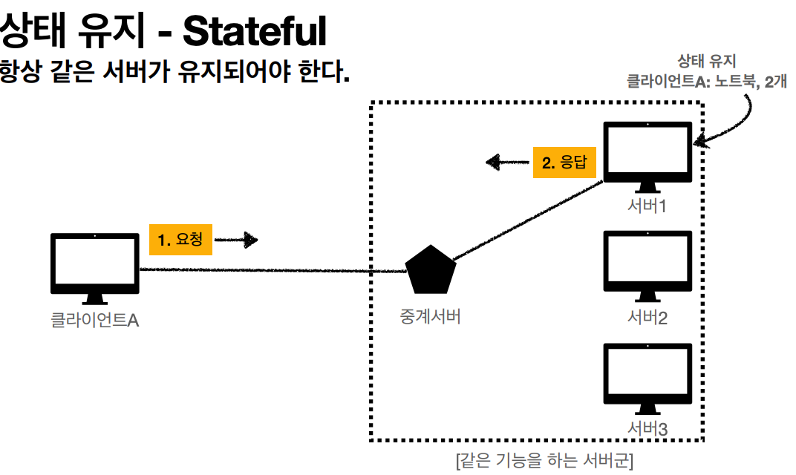
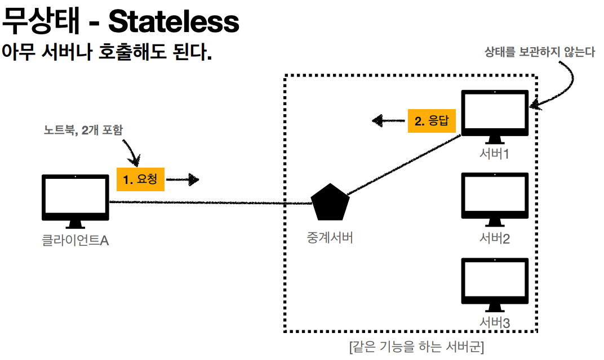
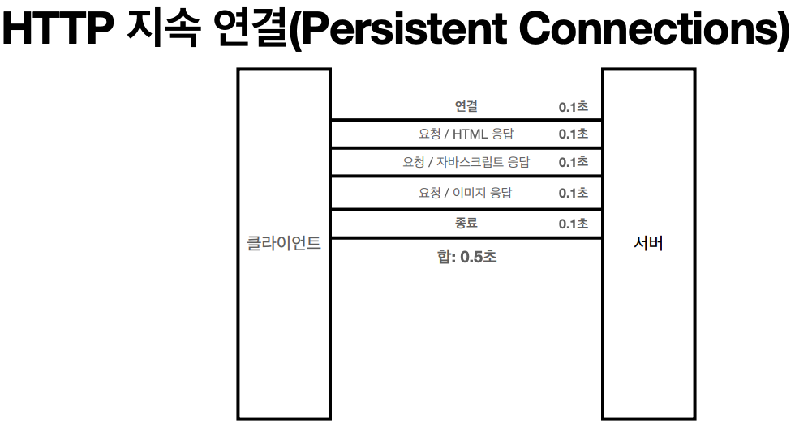

## HTTP
Hyper Text Transfer Protocol의 약자  
텍스트 기반의 통신 규약으로 인터넷에서 주고받을 수 있는 프로토콜  
HTML, TEXT, IMAGE, 음성, 영상, 파일, Json, Xml 등 거의 모든 형태의 데이터 전송 가능

### 특징
* 클라이언트-서버 구조
  * Request<->Response 구조
  * 클라이언트: 서버에 요청을 보내고 응답 대기
  * 서버: 요청에 대한 결과를 만들어서 응답
* 무상태(stateless) 프로토콜, 비연결성
  * 서버가 클라이언트의 상태를 보존 하지 않음
  * 장점: 서버 확장성 높음
  * 단점: 클라이언트가 추가 데이터 전송
* HTTP 메세지
* 단순함, 확장 가능

> ## Stateful vs Stateless

### Stateful
<p align="center"></p>
서버가 클라이언트의 상태를 보존한다.  
-> 웹서버가 사용자의 상태(쿠키)나 서버 정보(세션)를 기억하고 있다가 유용한 정보로써 활용한다.  

상태 유지를 하는 서버에 문제가 생기면 상태정보가 모두 다 날아가 처음부터 다시 요청해야한다.  

### Stateless
<p align="center"></p>
서버가 클라이언트의 상태를 보존하지 않는다.  
-> 클라이언트가 이전 요청에 대한 추가적인 요청을 할 경우 서버는 이미 처리한 요청에 대한 정보를 저장하지 않는다.  

중간에 서버에 문제가 생겨도 다른 서버로 요청하면 된다.

**한계**
* 모든 것을 무상태로 설계 할 수 있는 경우도 있고 없는 경우도 있다.
* 무상태
  * ex) 로그인이 필요없는 단순 서비스 소개 화면
* 상태 유지
  * ex) 로그인: 로그인한 상태를 서버에 유지 - 쿠키와 세션 사용
* 상태 유지는 최소한만으로 사용

## 비연결성
* 서버의 응답이 끝나면 연결을 끊음
  * 요청을 할때마다 TCP/IP 연결을 새로 맺어야 함 - 3 way handshake 시간 추가
  * 웹 브라우저 요청이 있을때마다 리소스를 다운로드 해야되는 낭비
* HTTP는 기본이 연결을 유지하는 모델 
* 초 단위 이하의 빠른 속도로 응답

<p align="center"></p>
<p align="center">웹 브라우저에 필요한 리소스를 모두 응답 받으면 연결 종료</p>

> Stateless는 같은 시간에 딱 맞추어 발생하는 **대용량 트래픽**에서 사용하자.  
> ex) 수강신청, 선착순 이벤트...

## HTTP 메세지 구조
<p align="center"></p>
<p align="center"><a href="https://datatracker.ietf.org/doc/html/rfc7230#section-3">공식 스펙</a></p>

* start-line: 요청이나 응답의 상태- request-line과 status-line으로 구분
* header: 요청에 대한 설명이나 메세지 본문에 대한 설명
* empty line: 요청에 대한 모든 메타 정보가 전송되었음을 의미하는 빈 줄
* message body: 요청과 관련된 내용(HTML)이나 응답과 관련된 데이터 또는 문서


## 요청 메세지
<p align="center"></p>
```
request-line =  method SP(공백) request-target SP HTTP-version CRLF(엔터)
```

* http 메소드: 서버가 수행해야 할 동작 지정
  * GET: 리소스 조회
  * POST: 요청 내역 처리
* 요청 대상: absolute-path[?query] (절대경로[?쿼리])
* HTTP 버전

## 응답 메세지
<p align="center"></p>
```
status-line = HTTP-version SP status-code SP reason-phrase CRLF
```

* HTTP 버전
* HTTP 상태 코드 - 200(성공), 400(클라이언트 요청 오류), 500(서버 내부 오류)...
* 이유 문구 - 사람이 이해할 수 있는 짧은 글
* HTTP 헤더 - HTTP 전송에 필요한 모든 부가 정보
  * ex) 메세지 바디 내용, 크기, 압충, 인증, 요청 클라이언트 정보 등등
* HTTP 메세지 바디 - 실제 전송할 데이터 내용
  * ex) HTML 문서, 이미지, 영상, Json 등 byte로 표현할 수 있는 모든 데이터

> HTTP는 단순해서 메세지 또한 단순하고 확장 가능한 기술
