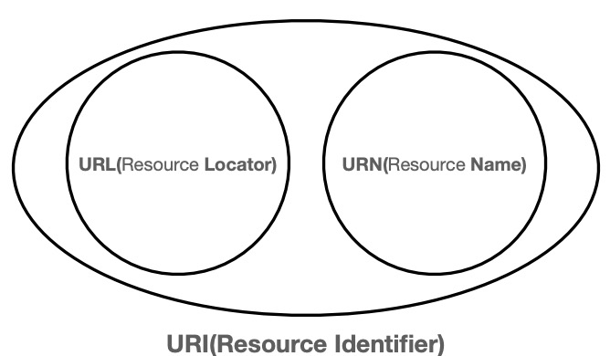
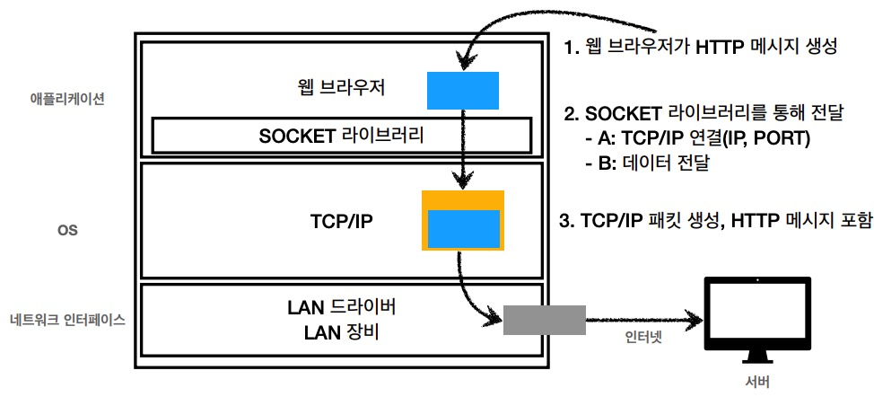

## URI
Uniform Resource Identifier의 약자로 통합 자원 식별자이다.
<p align="center"></p>

URL는 `로케이터`(locater), `이름`(name) 또는 둘 다 추가로 분류될 수 있다.

* URL: Uniform Resource Locator -> 리소스가 있는 위치를 지정
* URN: Uniform Resource Name -> 리소스에 이름을 부여

> URN 이름만으로 실제 리소스를 찾을 수 잇는 방법이 보편화 되지 않아 사용하지 않음

### 구조
```
scheme:[//[user[:password]@]host[:port]][/path][?query][#fragment]
```
ex) https://google.com:433/search?q=hello&hl=ko

* scheme: 사용할 프로토콜 - http, https...
* user와 password: 서버에 있는 데이터에 접근하기 위한 사용자 인증
* host: 도메인명 또는 ip주소
* port: 접속 포트 - 생략 가능
* path: 접근할 대상의 경로
* query: 접근할 대상에 전달하는 추가적인 정보 - 파라미터
* fragment: HTML속 특정 id로 스크롤을 위한 정보 - 서버에 전송되지 않음

## 웹 브라우저 요청 흐름
<p align="center"></p>

1. url(ex https://google.com:433/search?q=hello&hl=ko)을 입력하면 도메인과 포트 정보를 찾는다.
2. DNS 서버를 통해 실제 IP주소로 변환하여 요청
3. HTTP 요청 메세지 생성
   ```
   GET/search?q=hello&hl=ko HTTP/1.1
   Host:www.google.com
   ```
4. TCP 3 way handshake를 통해 서버와 연결
5. TCP/IP 패킷(HTTP 패킷 포함)을 생성하고 소켓을 통해 전달
6. 노드들을 거쳐 서버에 도착
7. 서버는 도착한 HTTP 패킷을 해석하고 요청사항 수행
8. 서버에서 HTTP 응답 패킷 생성
   ```
   HTTP/1.1 200 OK
    Content-Type: text/html;charset=UTF-8
    Content-Length: 3423

    Host: www.google.com
    <html>
        <body>...</body>
    </html>
   ```
9. 5번과 같이 TCP/IP 패킷을 생성 후 클라이언트에게 전달
10. 패킷이 도착하면 응답 메세지를 해석하고 추가 작업으로 마무리
