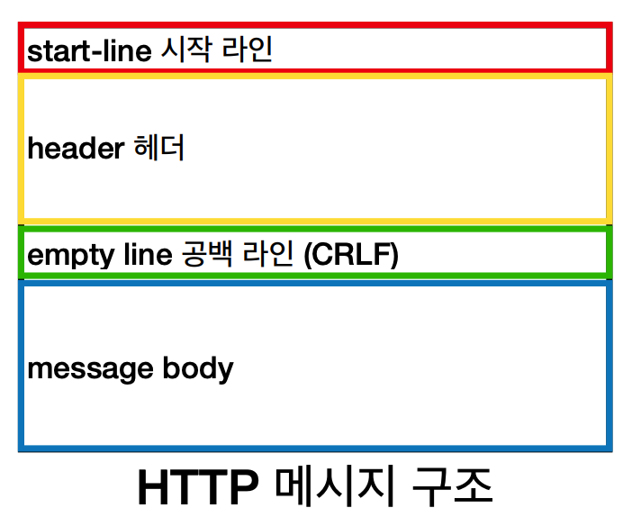
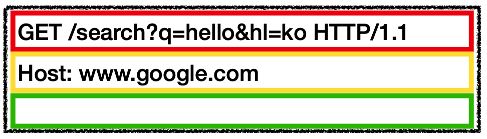
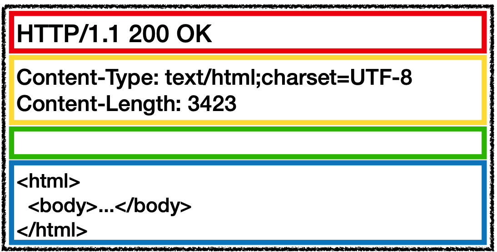

## HTTP 메세지 구조
<p align="center"></p>
<p align="center"><a href="https://datatracker.ietf.org/doc/html/rfc7230#section-3">공식 스펙</a></p>

* start-line: 요청이나 응답의 상태- request-line과 status-line으로 구분
* header: 요청에 대한 설명이나 메세지 본문에 대한 설명
* empty line: 요청에 대한 모든 메타 정보가 전송되었음을 의미하는 빈 줄
* message body: 요청과 관련된 내용(HTML)이나 응답과 관련된 데이터 또는 문서


## 요청 메세지
<p align="center"></p>
```
request-line =  method SP(공백) request-target SP HTTP-version CRLF(엔터)
```

* http 메소드: 서버가 수행해야 할 동작 지정
  * GET: 리소스 조회
  * POST: 요청 내역 처리
* 요청 대상: absolute-path[?query] (절대경로[?쿼리])
* HTTP 버전

## 응답 메세지
<p align="center"></p>
```
status-line = HTTP-version SP status-code SP reason-phrase CRLF
```

* HTTP 버전
* HTTP 상태 코드 - 200(성공), 400(클라이언트 요청 오류), 500(서버 내부 오류)...
* 이유 문구 - 사람이 이해할 수 있는 짧은 글
* HTTP 헤더 - HTTP 전송에 필요한 모든 부가 정보
  * ex) 메세지 바디 내용, 크기, 압충, 인증, 요청 클라이언트 정보 등등
* HTTP 메세지 바디 - 실제 전송할 데이터 내용
  * ex) HTML 문서, 이미지, 영상, Json 등 byte로 표현할 수 있는 모든 데이터

> HTTP는 단순해서 메세지 또한 단순하고 확장 가능한 기술

