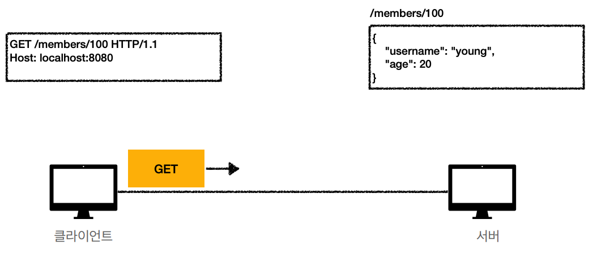
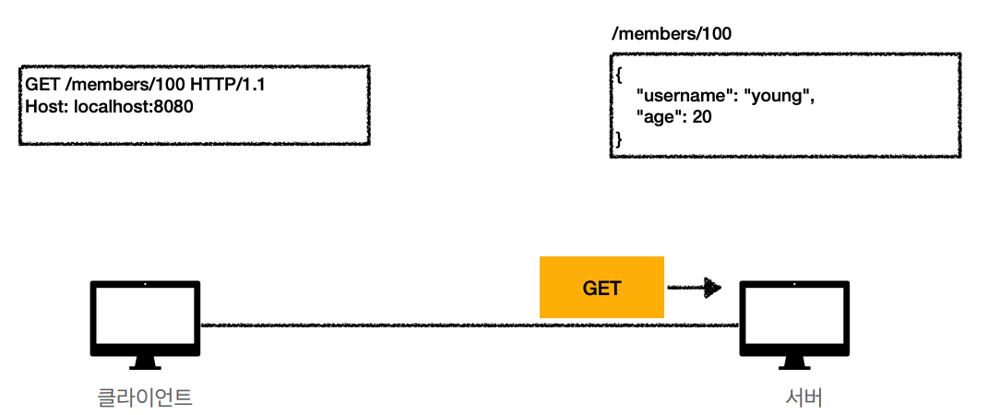
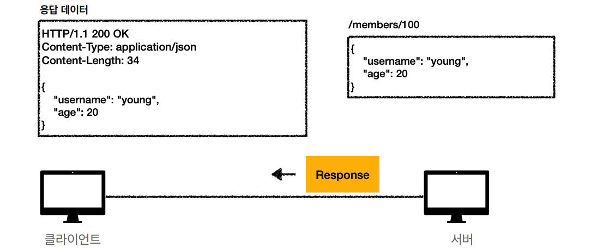
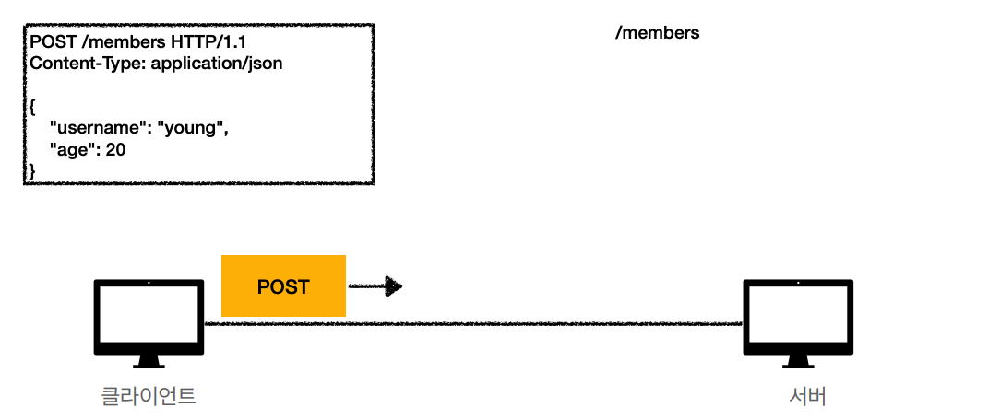
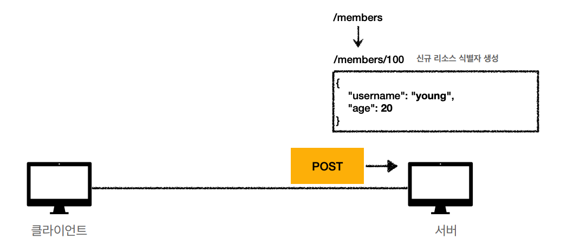
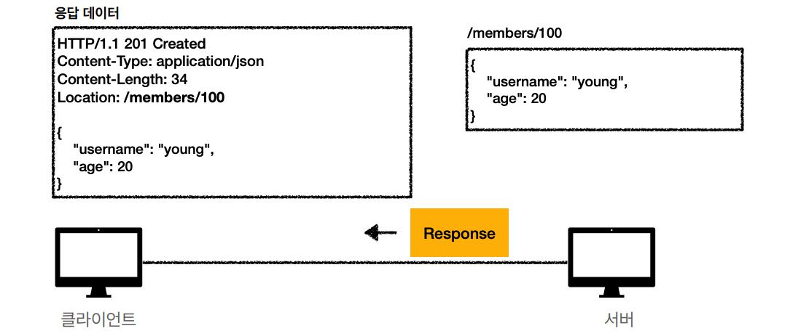

## HTTP api
### 요구사항
* 회원 목록 조회
* 회원 조회, 등록, 수정, 삭제
  
### URI 설계 
* 회원 목록 조회: /read-member-list
* 회원 CRUD: /create-member, /read-member-by-id, /update-member, /delete-member
-> 잘못된 설계

회원을 등록하고 등록하는 이런 **동사**는 리소스로 식별하지 않는다.  
**회원**이라는 개념 자체가 리소스  

**계층 구조**를 활용하여 설계
* 회원 목록 조회: /members
* 회원 CRUD: /members/{id}

URI는 `리소스`만 식별하고 해당 리소스를 대상으로 하는 행위를 분리 시켜야한다.
* 리소스: 회원
* 행위(메소드): 조회, 등록, 삭제, 변경

## HTTP 메소드
* GET: 리소스 조회
* POST: 요청 데이터 처리 - 주로 등록에 사용 
* PUT: 리소스 대체 - 없으면 생성
* PATCH: 리소스 부분 변경
* DELETE: 리소스 삭제=
* HEAD: GET과 동일하지만 상태 줄과 헤더만 반환
* OPTIONS: 대상 리소스에 대한 통신 가능 옵션(메소드)를 설명 - CORS에서  사용
* CONNECT: 대상 자원으로 식별되는 서버에 대한 터널을 설정
* TRACE: 리소스에 대한 경로를 따라 메세지 루프백 테스트를 수행


### GET
리소스 조회  
서버에 전달하고 싶은 query를 통해서 전달
```
GET /search?q=hello&hl=ko HTTP/1.1
Host: www.google.com
```

<p align="center"></p>
<p align="center"></p>
<p align="center"></p>

> 메세지 바디를 사용해서 데이터를 전달할 수 있지만 지원하지 않는 곳이 많아서 권장하지 않음

### POST
요청 데이터 처리
```
POST /members HTTP/1.1
Content-Type: application/json
{
 "username": "hello",
 "age": 20
}
```
**메세지 바디**를 통해서 서버로 요청 데이터를 전달 -> 서버는 요청 데이터를 처리  
주로 전달된 데이터로 신규 리소스 등록, 프로세스 처리에 사용

<p align="center"></p>
<p align="center"></p>
<p align="center"></p>

> 스펙: POST 메서드는 대상 리소스가 리소스의 고유한 의미 체계에 따라 요청에 포함 된 표현을 처리하도록 요청

* HTML 양식에 입력 된 필드와 같은 데이터 블록을 데이터 처리 프로세스에 제공
  * 예) HTML FORM에 입력한 정보로 회원 가입, 주문 등에서 사용
* 게시판, 뉴스 그룹, 메일링 리스트, 블로그 또는 유사한 기사 그룹에 메시지 게시
  * 예) 게시판 글쓰기, 댓글 달기
* 서버가 아직 식별하지 않은 새 리소스 생성
  * 예) 신규 주문 생성
* 기존 자원에 데이터 추가 
  * 예) 한 문서 끝에 내용 추가하기

### PUT
리소스가 있으면 대체, 없으면 생성  
```
PATCH /members/100 HTTP/1.1
Content-Type: application/json
{
 "age": 50 
}
```
`클라이언트가 리소스를 식별`: 클라언트가 리소스의 위치를 알고 URI 지정

> 완전히 덮어버리게 되어 필드 값이 새로 생성되거나 지워질 수 있다.

### PATCH
리소스 부분 변경
```
PATCH /members/100 HTTP/1.1
Content-Type: application/json
{
 "age": 50
}
```
특정 필드 값을 변경한다.


### DELETE
리소스 제거
```
DELETE /members/100 HTTP/1.1
Host: localhost:8080
```

## HTTP 메소드 속성
* 안전: 호출해도 리소스를 변경하지 않는다.
* 멱등: 한번 호출하든 n번 호출하든 결과가 똑같다.
  * GET
  * PUT
  * DELETE
* 캐시 가능: 응답 결과 리소스를 캐시해서 사용한다.
  * GET, HEAD, POST, PATCH
  * 실제로는 GET, HEAD 정도만 사용

> POST는 멱등이 아니다. 두 번 호출하면 같은 결제가 중복해서 발생하기 때문