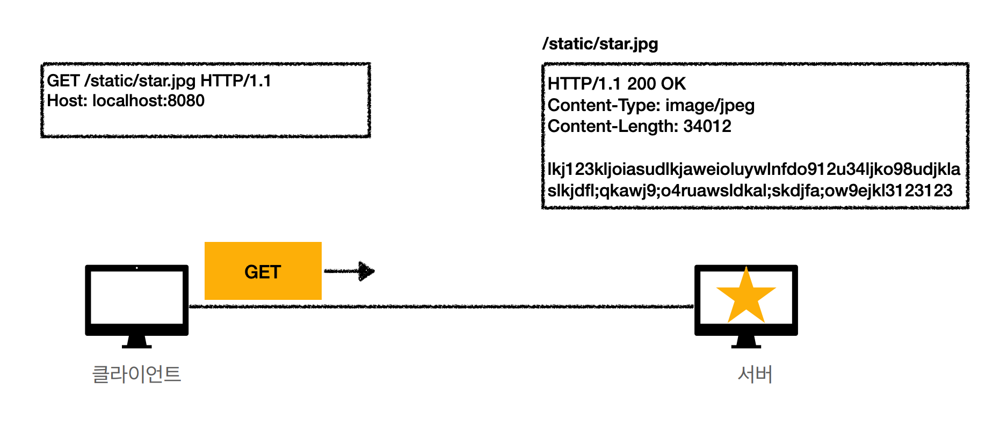
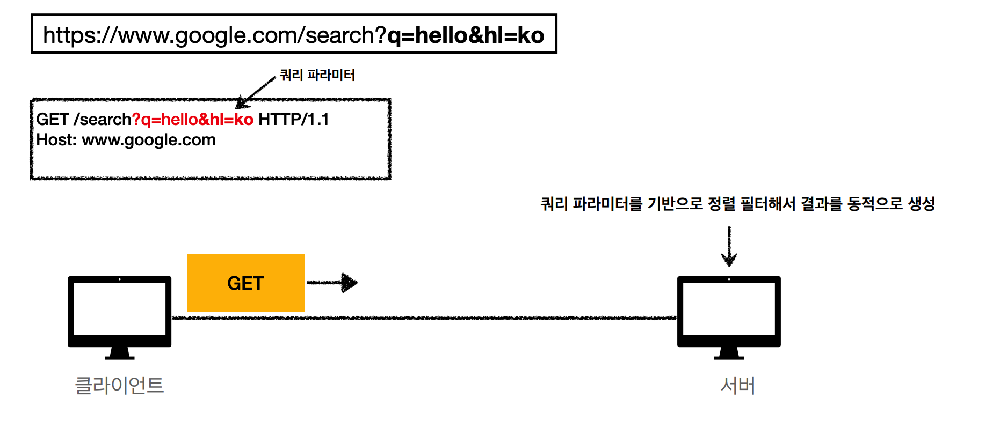
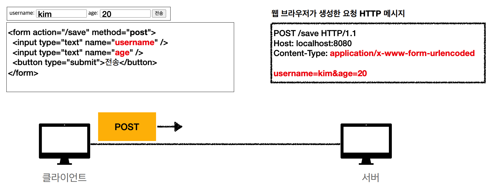
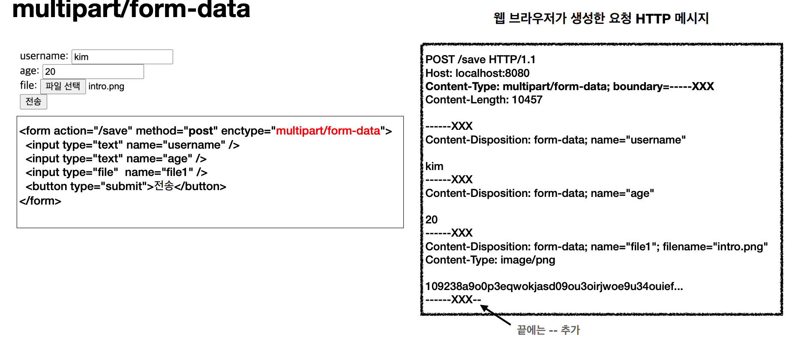

## 클라이언트에서 서버로 데이터 전송
* 쿼리 파라미터를 통한 전송: 정렬 필터
  * GET
* 메세지 바디를 통한 전송: 회원 가입, 상품 주문, 리소스 등록, 리소스 변경
  * POST, PUT, PATCH

### 정적 데이터 조회
이미지나, 정적 테스트 문서를 쿼리 파라미터 대신 `리소스 경로`를 이용해 조회  
GET 사용

### 동적 데이터 조회
검색, 게시판 목록에성 정렬할 때 `쿼리 파라미터` 사용
GET 사용

### HTML Form 데이터 전송

submit 버튼을 누르면 POST 사용하여 데이터 전송

Content-Type: application/x-www-form-urlencoded
* form의 내용을 메세지 바디를 통해서 전송(Key=value, 쿼리파라미터)

> html 폼에서 메소드를 get으로 변경하여 데이터를 전송할 수 있지만 리소스 변경이 발생하는 곳에서 GET 메소드를 사용하면 안된다.

multipart/form-data

Content-Type: multipart/form-data 
* boundary=-----XXX: 파일 업로드 같은 바이너리 데이터 전송시 사용
* 다른 종류의 여러 파일과 폼의 내용 함께 전송 가능

> HTML Form 전송은 **GET**과 **POST**만 지원

### API 데이터 전송
* 서버 to 서버
  * 벡엔드 시스템 통신
* 앱 클라이언트
  * 아이폰, 안드로이드에서 서버로 데이터 전송
* 웹 클라이언트
  * AJAX
  
POST, PUT, PATCH: 메세지 바디를 통해 데이터 전송  
GET: 조회, 쿼리 파라미터로 데이터 전달

Content-Type: application/json으로 주로 사용(사실상 표준)

## HTTP API 설계 예시 - POST 기반 등록
* 회원 목록 /members -> GET
* 회원 등록 /members -> POST
* 회원 조회 /members/{id} -> GET
* 회원 수정 /members/{id} -> PATCH, PUT, POST
* 회원 삭제 /members/{id} -> DELETE

### 특징
* 클라이언트는 등록될 리소소의 URI를 모른다: 단순히 서버에 데이터 등록 요청
* 서버가 새로 등록된 리소스 URI 생성
* 컬랙션(Collection)
  * 서버가 관리하는 리소스 디렉토리

## HTTP API 설계 예시 - PUT 기반 등록
* 파일 목록 /files -> GET
* 파일 조회 /files/{filename} -> GET
* 파일 등록 /files/{filename} -> PUT
* 파일 삭제 /files/{filename} -> DELETE
* 파일 대량 등록 /files -> POST

### 특징
* 클라이언트가 리소스 URI를 알고 있어야 한다.
* 클라이언트가 직접 리소스의 URI를 지정한다.
* 스토어(Store)
  * 클라이언트가 관리하는 리소스 저장소

## HTML FORM 사용
* 회원 목록 /members -> GET
* 회원 등록 폼 /members/new -> GET
* 회원 등록 /members/new, /members -> POST
* 회원 조회 /members/{id} -> GET
* 회원 수정 폼 /members/{id}/edit -> GET
* 회원 수정 /members/{id}/edit, /members/{id} -> POST
* 회원 삭제 /members/{id}/delete -> POS

### 특징
* GET, POST만 지원
* 컨트롤 URI
  * 동사로 된 리소스 경로 사용
  * ex) /new, /edit, /delete...

## URI 설계 개념
* 문서(document)
  * 단일 개념(파일 하나, 객체 인스턴스, 데이터베이스 row)
  * 예) /members/100, /files/star.jpg
* 컬렉션(collection)
  * 서버가 관리하는 리소스 디렉터리
  * 서버가 리소스의 URI를 생성하고 관리
  * 예) /members
* 스토어(store)
  * 클라이언트가 관리하는 자원 저장소
  * 클라이언트가 리소스의 URI를 알고 관리
  * 예) /files
* 컨트롤러(controller), 컨트롤 URI
  * 문서, 컬렉션, 스토어로 해결하기 어려운 추가 프로세스 실행
  * 동사를 직접 사용
  * 예) /members/{id}/delete

 

