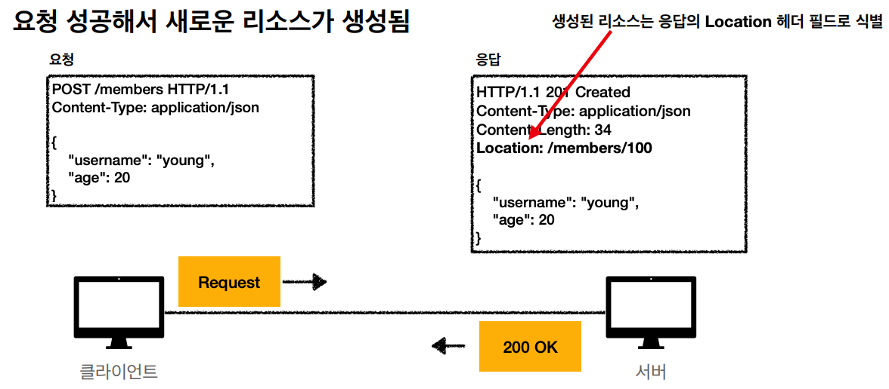
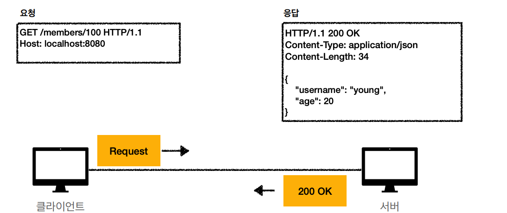
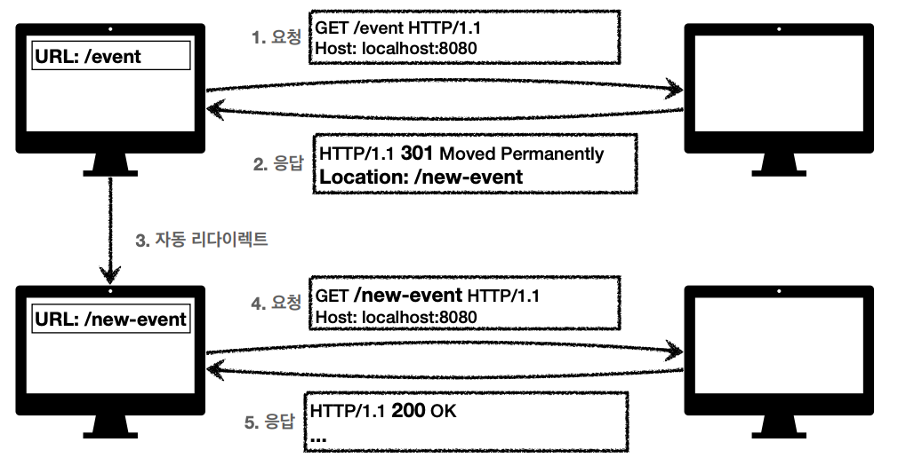
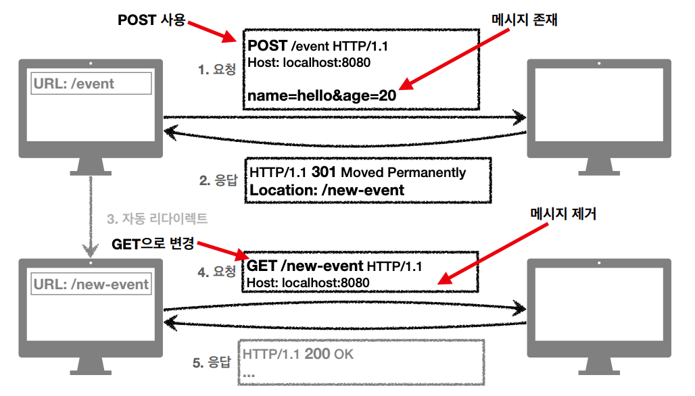
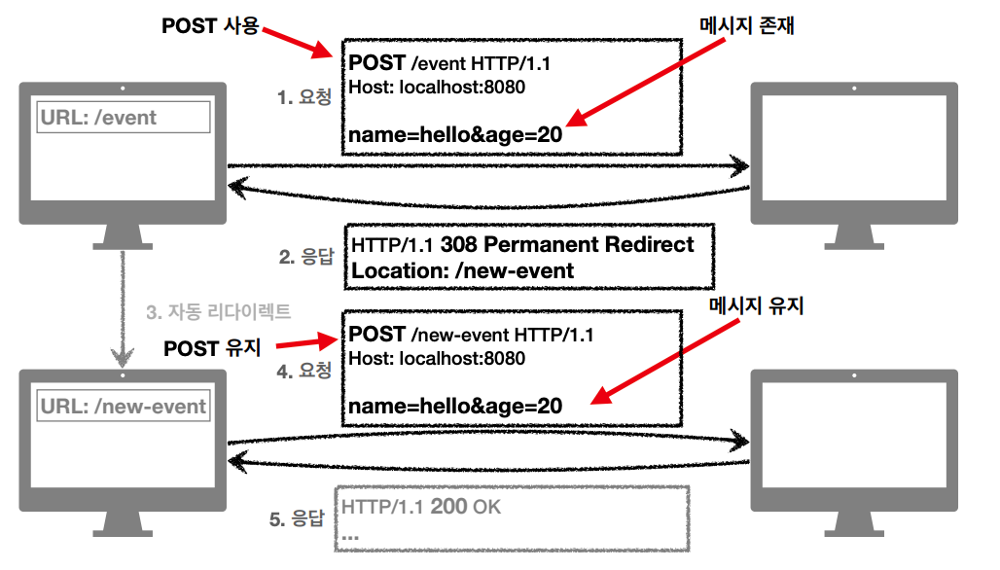
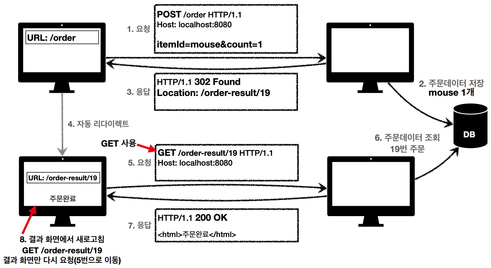

## 상태 코드
클라이언트가 보낸 요청의 처리 상태를 **응답**에서 알려주는 기능

* 100~199: 요청이 수신되어 처리중 - 거의 사용하지 않음
* 200~299: 요청 정상 처리
* 300~399: 요청을 완료하려면 추가 행동 필요
* 400~499: 클라이언트 오류
* 500~599: 서버 오류

## 2xx Successful
클라이언트의 요청을 성공적으로 처리

### 200 OK
요청 성공

### 201 Created
요청 성공해서 새로운 리소스가 생성됨

### 202 Accepted
요청이 접수 되었으나 처리가 완료되지 않았음

* 배치 처리 같은 곳에서 사용 - 요청 접수 후 일정 시간이 지나면 배치 프로세스가 처리

### 204 No Content
서버가 요청을 성공적으로 수행했지만 응답 페이로드 본문에 보낼 데이터가 없음

웹 편집기 같은 경우 텍스트를 수정하고 저장버튼을 누르지만 버튼을 눌렀다고 응답 메세지에 내용을 보낼 필요가 없다.

## 3xx Redirection
요청을 완료하기 위해 유저 에이전트의 추가 조치 필요

> 리다이렌션이란?  
> 웹 브라우저는 3xx 응답 결과에 Location 헤더가 있으면, Location 위치로 이동
> 

> * 영구 리다이렉션 - 특정 리소스의 URI가 영구적으로 이동
> * 일시 리다이렉션 - 일시적인 변경
> * 특수 리다이렉션 - 결과 대신 캐시 사용

### 301 Moved Permanently
리다이렉트시 요청 메소드가 **GET**으로 변하고, 본문이 제거될 수 있음

URI가 /event에서 /new-event로 변경되엇다고 가정해보자.  
서버에서 변경된 /new-event uri와 301 응답코드를 보낸다.  
브라우저에서 /new-event로 GET으로 요청하기 때문에 본문 내용이 제거된다.  
응답을 받고 새로 POST 요청을 해야된다.

### 308 Permanent Redirect
301과 기능은 같지만 리다이렉드 하고 **POST**요청을 유지해 기존에 보냈던 메세지가 유지 된다.

### 302 Found
리다이렉트 요청시 메서드가 **GET**으로 변하고, 본문이 제거될 수 있음

### 307 Temporary Redirect
302와 기능은 같음  
리다이렉트시 **요청 메서드와 본문 유지**

### 303 See Other
302와 기능은 같은
리다이렉트시 요청 메서드가 **GET**으로 변경

> PRG: **P**ost/**R**edirect/**G**et
> > 중복 요청으로 인한 문제를 방지
> 

> * URL이 이미 POST -> GET으로 리다이렉트 됨
> * 새로고침 해도 GET으로 결과만 조회 - 중복 주문 방지

### 기타 리다이렉션
* 300 Multiple Choices: 안쓴다
* 304 Not Modified
  * 캐시를 목적으로 사용
  * 클라이언트에게 리소스가 수정되지 않았음을 알려준다. -> 로컬PC에 저장된 캐시로 리다이렉트 한다.
  * 304 응답은 응답에 메세지 바디를 포함하면안된다.
  * 조건부 GET, HEAD 요청시 사용

## 4xx Client Error
클라이언트의 요청이 잘못되어 서버가 요청을 수행할 수 없음
> 클라이언트가 이미 잘못된 요청, 데이터를 보내고 있기 때문에 똑같이 재시도 해도 **실패**

### 400 Bad Request
요청 구문, 메세지 오류 등 클라이언트가 잘못된 요청을 해서 서버가 요청 처리할 수 없음  
클라이언트는 요청 내용을 검토하고 다시 보내야 된다.

### 401 Unauthorized
클라이언트가 해당 리소스에 대한 인증이 필요함  
401 오류 발생시 응답에 WWW-Authenticate 헤더와 함께 인증 방법을 설명  
ex) 클라이언트가 누구인지 로그인 필요

### 403 Forbidden
서버가 요청을 이해했지만 승인을 거부함  
인증 자격은 있지만 접근 권한이 불충분할 경우  
ex) 로그인 한 사용자의 등급은 일반이지만 Admin 등급의 리소스에 접근했을 경우

### 404 Not Found
요청 리소스가 서버에 없음
잘못된 URL을 입력했거나 권한이 없는 클라이언트가 리소스에 접근할 때 해당 리소스를 숨길 경우

## 5xx Server Error
서버 문제로 오류 발생  
> 서버에 문제가 있기 때문에 재시도하면 성공할 수도 있음

### 500 Internal Server Error
서버 내부 문제로 오류 발생  
애매하면 500오류

### 503 Service Unavailable
서버가 일시적인 과부하 또는 예정된 작업으로 잠시 요청 처리를 막아둔 경우  
Retry-After 헤더 필드로 얼마뒤에 복귀되는지 보낼 수 있음

> API 스펙에는 맞지만 비지니스 로직으로 문제가 있는 경우는 절대 5xx 에러를 보내면 안된다.
> [해결방안](https://www.inflearn.com/questions/111465)

