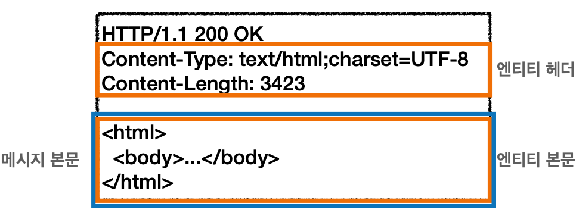
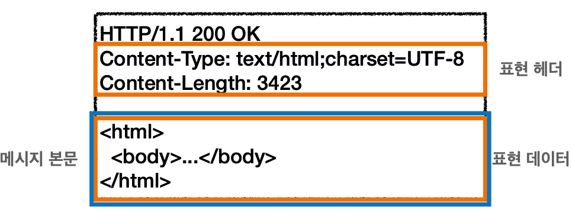
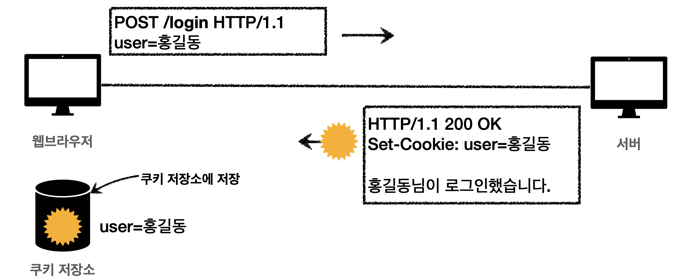
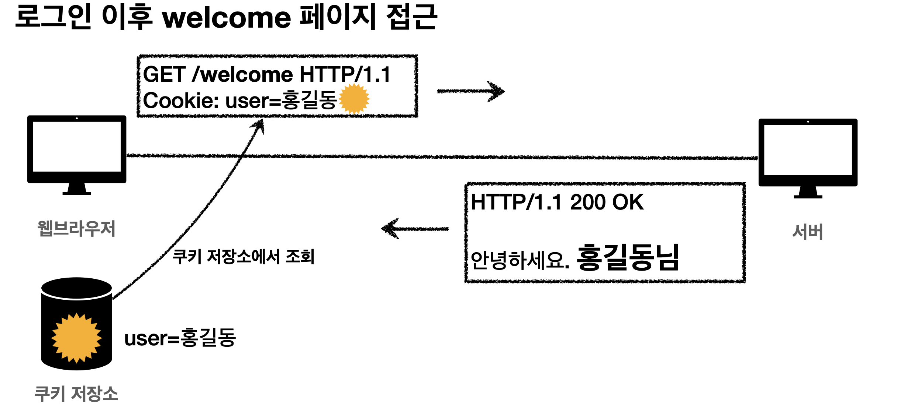
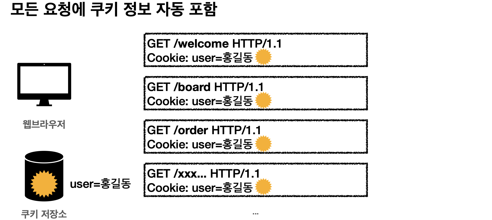

## HTTP 헤더
```
filed-name: OWS(띄어쓰기 허용) field-value OWS
ex) Content-Type: text/html;charset=UTF-8
```
HTTP 전송에 필요한 모든 부가정보  
ex) 메세지 바디의 내용, 크기, 압축, 인증, 요청 클라이언트, 서버 정보, 캐시 관리 정보...

과거에는 4개로 분류
* General 헤더: 메시지 전체에 적용되는 정보
* Request 헤더: 요청 정보
* Response 헤더: 응답 정보
* Entity 헤더: 엔티티 바디 정보

<p align="center"></p>

메세지 본문은 **엔티티 본문**을 전달하는데 사용
- 엔티티 본문: 요청이나 응답에서 전달할 실제 데이터
- 엔티티 헤더는 엔티티 본문의 데이터를 해설할 수 있는 정보 제공: 데이터 유형, 길이, 압축 정보 등등

HTTP 표준이 바뀌면서 `엔티티(Entity) -> 표현(Presentation)`  
표현 = 표현 메타데이터 + 표현 데이터  

<p align="center"></p>

메세지 본문을 통해 **표현 데이터** 전달
- 메세지 본문을 페이로드(payload)라고도 부른다.
- 표현: 요청이나 응답에서 전달할 실제 데이터
- 표현 헤더는 표현 데이터를 해설할 수 있는 정보 제동: 데이터 유형, 길이, 압축 정보 등등

> 표현 헤더는 표현 메타데이터와, 페이로드 메세지를 구분해야 하지만 여기서는 생략...

## 표현
* Content-Type: 표현 데이터의 형식
  * 미디어 타입, 문자 인코딩
  * ex) Content-Type: text/html..., application/jason, image/png...
* Content-Encoding: 표현 데이터의 압축 방식
  * 데이터를 전달하는 곳에서 압축 후 인코딩 헤더 추가
  * 데이터를 읽는 쪽에서 인코딩 헤더의 정보를 가지고 압축 해제
  * ex) Content-Encoding: gzip
* Content-Language: 표현 데이터의 자연 언어
  * 데이터 본문에 어떤 언어가 들어가 있는지 확인 가능
  * ex) Content-Language: en
* Content-Length: 표현 데이터의 길이
  * 바이트 단위
  * **Transfer-Encodin**을 사용하면 Content-Length를 사용하면 안된다.

> 표현 헤더는 전속, 응답 둘다 사용


## 콘텐츠 협상
클라이언트가 서버에게 선호하는 표현을 요청
* Accept: 클라이언트가 선호하는 미디어 타입 전달
* Accept-Charset: 클라이언트가 선호하는 문자 인코딩
* Accpet-Encoding: 클라이언트가 선호하는 압축 인코딩
* Accept-Language: 클라이언트가 선호하는 자연 언어

> 협상 헤더는 `요청`시에만 사용

다중 언어를 지원하는 서버의 경우 클라이언트가 Accpet-Language: ko라고 요청하면 Content-Language: ko로 응답  
그러나 클라이언트가 한국어 > 영어 > 다른 언어 순으로 원하여 독일어(기본)와 영어만 지원하는 서버에 ko로 요청하면 기본 설정인 독일어로 나온다.  
이를 해결하기 위해 협상과 우선순위를 사용한다.

## 협상과 우선순위
지원하는 형태중에서 우선순위가 높은 순으로 응답
```
GET /event
Accpept-Language: ko-KR;ko;q=0.9,en-US;q=0.8,en;q=0.7
```
여기서 q는 **Quality Values**  
0~1 사이의 값을 가질수 있으며 높을수록 우선순위가 높다.  
1은 생략 가능하다.  

구체적인 것이 우선한다.
```
GET /event
Accpept-Language: text/*, text/plain, text/plain;format=flowed, */*
```
우선 순위는 text/plain;format=flowed > text/plain > text/* > * / *  

구체적인 것을 기준으로 미디어 타입을 맞춘다.  
Accpept: text/*;q=0.3, text/html;q=0.7, text/html;level=1, text/html;level=2;q=0.4, * / *;q=0.5  
만약 위와 같이 요청이 왔다고 가정해보자.  
text/plain, text/html;level=3의 Quality는 가장 비슷한 타입인 0.3, 0.7에 맞춰지게 된다.

## 전송 방식
* 단순 전송
  * 요청후 한번에 다 전송 받음
  * Content-Length를 알고 있을때 사용
* 압축 전송
  * 압축하고 압축 정보를 포함하여 전송
* 분할 전송
  * 바이트 별로 쪼개서 전송
  * Transfer-Encoding: chunked
  * Content-Length를 예상하지 못하여 사용하면 안된다.
  * 마지막에는 ₩r₩n으로 표현
* 범위 전송
  * 특정 구간의 데이터를 요청하고 응답 받을때 사용
  * Range: bytes=1001-2000
  * 만약 데이터를 받다가 중간에 끊겼을 경우 끊긴 구간부터 다시 전송 받을 수 있음

## 일반 정보
* From: 유저 에이전트의 이메일 정보 
  * 검색 엔진 같은 곳에서 주로 사용하지만 일반적으로 사용되지 않음
* Referer: 현재 요청된 페이지의 이전 웹 페이지 주소
  * 새로운 페이지를 요청했을때 현재 웹 페이지를 포함하여 요청
  * 유입 경로 분석 가능
* User-Agent: 클라이언트의 애플리케이션 정보(웹 브라우저 정보...)
  * 어떤 종류의 브라우저에서 장애가 발생했는지 확인 가능
* Server: 요청을 처리하는 **ORIGIN** 서버의 소프트웨어 정보
* Date: 메세지가 발생한 날짜와 시간

> From, Referer, User-Agent는 **요청**, Server, Date는 **응답**에서 사용

## 특별한 정보
* Host: 요청한 호스트 정보
  * 필수 정보
  * 하나의 서버가 여러 도메인을 처리할 수 있을때 클라이언트가 호스트 정보를 보내줌으로써 서버가 명확히 처리
* Location: 페이지 리다이렉션
  * 3xx 응답 결과에 Loacation 헤더가 있으면 해당 위치로 자동 이동
  * 201: 요청에 의해 생성된 리소스 URI
* Allow: 허용가능한 HTTP 메소드
  * Allow: GET, HEAD, PUT일 때 클라이언트가 POST 요청을 보낼 경우 응답에 405 코드로 지원하지 않는다고 알림
* Retry-After: 유저 에이전트가 다음 요청을 하기까지 기다려야 하는 시간
  * 서비스가 언제까지 불능인지 알려줄 수 있음
  * 날짜 표기, 초단위 표기 가능

## 인증
* Authorization: **클라이언트 인증 정보**를 서버에 전달
  * Authorization: Basic xxxxxxxxxxxxxxxx
  * 인증 메커니즘마다 들어가는 값이 다름
* WWW-Authenticate: 리소스 접근시 필요한 **인증 방법** 정의
  * 리소스에 접근시 인증 방법이 잘못 되었을 경우 401 응답 코드와 함께 인증에 필요한 내용을 정의하여 보내준다.

## 쿠키
* Set-Cookie: 서버에서 클라이언트로 쿠키 전달(응답)
* Cookie: 클라이언트가 서버에서 받은 쿠키를 저장하고, HTTP 요청시 서버로 전달

쿠키를 사용하지 않을 경우  
HTTP는 무상태 프로토콜이기 때문에 로그인 등 유지해야될 기능이 새로고침하면 다 없어진다(로그인이 풀린다)  
모든 요청에 사용자 정보가 포함되도록 개발해야하지만 브라우저를 완전히 종료하고 다시 열면 문제가 생긴다.  

쿠키 사용

<p align="center"></p>
<p align="center"></p>
<p align="center"></p>

요청할 때마다 쿠키를 조회하여 사용  
사용자 로그인 세션관리나 광고 정보 트래킹에 주로 사용됨  
쿠키 정보는 항상 서버에 전송되기 때문에 네트워크 트래픽이 추가로 발생한다. 그러므로 최소한의 정보(세션 id, 인증 토큰)만 사용  
서버에 전송하지 않고 웹 브라우저 내부에 데이터를 저장하는 **웹 스토리지** 방법도 존재  
보안에 민감한 데이터는 저장하면 안된다.  

### 쿠키 생명주기 
* Set-Cookie: **expire** = Sat, 26-Dec-2020 xx:xx:xx GMT
  * 만료일이 되면 쿠키 삭제
* Set-Cookie: max-age=3600(초단위)
  * 0이나 음수를 지정하면 쿠키 삭제

> 세션 쿠키: 만료 날짜를 생략하면 브라우저 종료시 까지만 유지  
> 영속 쿠키: 만료 날짜를 입력하면 해당 날짜까지 유지

### 쿠키 도메인
* 명시: 명시한 문서 기준 도메인 + 서브 도메인을 포함하여 접근 가능
* 생략: 현재 문서 기준 도메인만 적용 서브 도메인에서는 쿠키에 접근 불가


### 쿠키 경로
이 경로를 포함한 하위 경로 페이지만 쿠키 접근

### 쿠키 보안
* Secure
  * HTTPS인 경우에만 전송
* HttpOnly
  * XSS 공격 방지
  * 자바스크립트에서 접근 불가
  * HTTP 전송에만 사용
* SameSite
  * XSRF 공격 방지
  * 요청 도메인과 쿠키에 설정된 도메인이 같은 경우에만 쿠키 전송