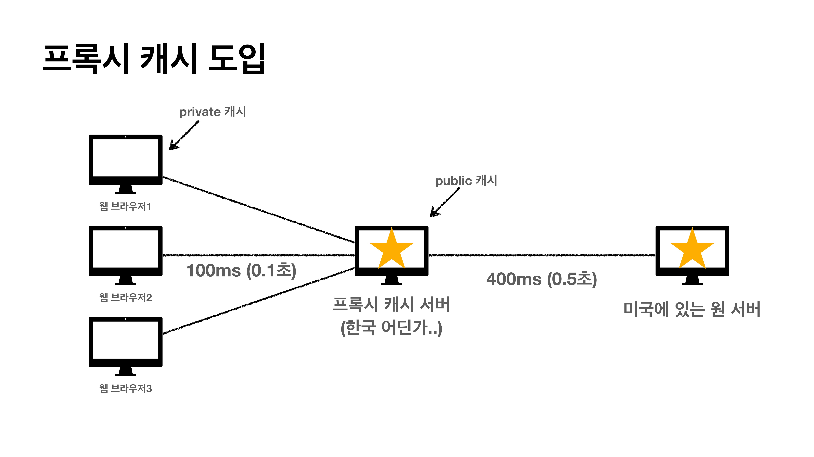
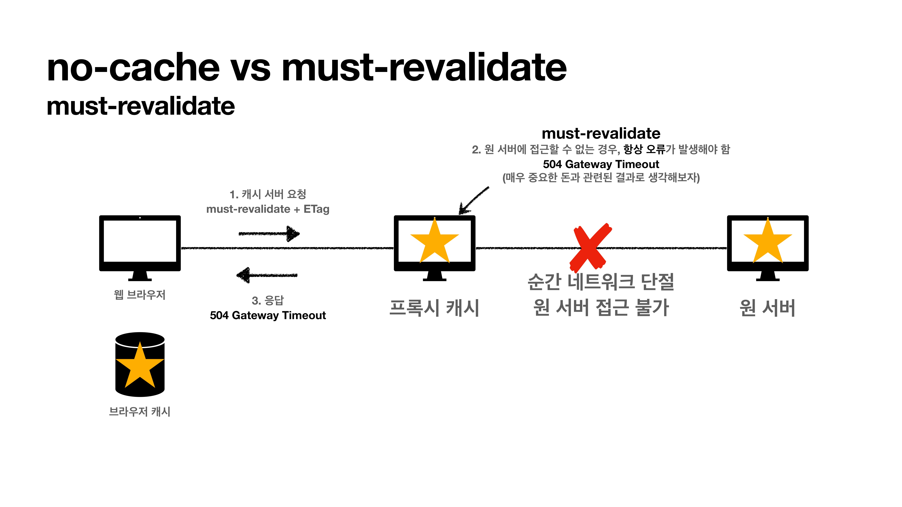

## 캐시란?
자주 사용하는 데이터나 값을 미리 저장해두는 임시 저장소  
캐시를 사용하지 않으면 변경 되지 않은 데이터도 항상 네트워크를 통해 다운로드 받아야한다.  
-> 브라우저 로딩 속도 저하  

캐시를 적용하면 첫 번째 요청때 받은 데이터를 브라우저 캐시에 저장하고 해당 데이터를 요청시에 캐시에서 조회 후 사용  
-> 캐시 유효 시간동안 네트워크를 사용하지 않아 사용량을 줄이고 브라우저 로딩 속도 향상  

캐시 유효시간이 지나 만료되었을 경우 다시 네트워크를 통해 데이터 다운로드하고 캐시 갱신

## 검증 헤더와 조건부 요청
캐시 유효 시간이 초과해서 서버에 다시 요청하면 다음 두가지 상황이 발생
1. 서버에서 기존 데이터를 변경항: A -> B
2. 서버에서 기존 데이터를 변경하지 않음: A 유지

만약 서버에서 데이터를 변경하지 않았다면 기존에 저장해둔 캐시를 그대로 사용할 수 있다.  
클라이언트의 데이터와 서버의 데이터가 같다는 사실을 확인하기 위해 `검증 헤더`를 추가한다.

### 검증헤더
1. 클라이언트에서 데이터 요청
2. 서버에서 cache-control:max-age(캐시 유효 시간)와 Last-Moditfied(최종 수정일)를 포함하여 응답
3. 응답 결과를 캐시에 저장
4. 다음 요청때 만약 캐시가 만료되었으면 서버에 if-modified-since를 포함하여 데이터 요청
5. 서버쪽 데이터 수정일과 if-modified-since가 같으면 데이터가 수정되지 않음
6. 304 Not Modified 상태코드를 포함한 헤더만 응답, HTTP body는 필요없음
7. 캐시에서 응답 결과를 재사용하고 헤더 데이터 갱신
8. 웹 브라우저는 캐시에서 데이터 조회

* 검증 헤더: 캐시 데이터와 서버 데이터가 같은지 검증하는 데이터
  * Last-Modified, ETag
* 조건부 요청 헤더: 검증 헤더로 조건에 따른 분기
  * If-Modified-Since: Last-Modified 사용
  * If-None-Match: ETag 사용

조건이 만족하면 200 OK, 아니면 304 Not Modified  
데이터가 변경 되었다면 304 Not Modified와 `헤더 데이터만` 전송  
데이터가 변경되지 않았다면 200 OK, `모든 데이터` 전송  

###  Last-Modified, If-Modified-Since 단점
* 1초 미만 단위로 캐시 조정이 불가능: 날짜 기반의 로직 사용
* 같은 데이터를 수정하여 수정 날짜만 다른 경우 데이터를 다시 다운 받음

### ETag
* Hash 알고리즘을 사용하여 캐시용 데이터에 임의의 고유한 버전 이름을 달아둠  
* 데이터가 변경되면 이름을 바꾸어서 변경한다.  
* ETag가 같으면 유지, 다르면 다시 받으면 된다. 
* Last-Modified 대신 ETag 사용, If-Modified-Since 대신 If-None-Match 사용

## 캐시 제어 헤더
* Cache-Control: 캐시 제어
  * Cache-Control:max-age(초) 캐시 유효 시간
  * Cache-Control: no cache 데이터는 캐시 해도 되지만 항상 origin 서버에 검증하고 사용
  * Cache-Control: no-store 데이터에 민감한 정보가 있으므로 저장하면 안됨
* Pragma: 캐시 제어(하위 호환)
  * Prama:no-cache
  * HTTP 1.0 하위 호환
* Expire: 캐시 유효 기간(하위 호환)
  * 캐시 만료일을 정확한 날짜로 지정
  * HTTP 1.0부터 사용
  * max-age와 함께 사용하면 expire는 무시

## 프록시 캐시
origin 서버가 멀리 있는 경우 사용자가 응답을 받기까지 오랜 시간이 걸린다. 이를 해결하기 위해 프록시 서버를 이용

클라이언트는 origin 서버로 바로 접근하는 것이 아닌 프록시 캐시 서버를 한번 거쳐서 가기 때문에 요청한 데이터가 캐시 서버에 있다면 바로 응답 받을 수 있다.  

### 프록시 캐시 지시어
* Cache-Control: public 응답이 캐시에 저장되어도 됨
* Cache-Control: private 응답이 해당 사용만을 위한 것, private 캐시에 저장
* Cache-Control: s-maxage 프록시 캐시에만 적용되는 max-age
* Age: 60(HTTP 헤더) origin 서버에서 응답 후 프록시 캐시 내에 머문 시간(초)

## 캐시 무효화
* Cache-Control: must-revalidate 
  * 캐시 만료 후 최초 조회시 **origin 서버**에 검증 해야함
  * origin 서버에 접근 실패시 504 오류 코드 발생
  * 캐시 유효 시간이라면 캐시를 사용함

#### no-cache vs must-revalidate
no-cache

must-validate

