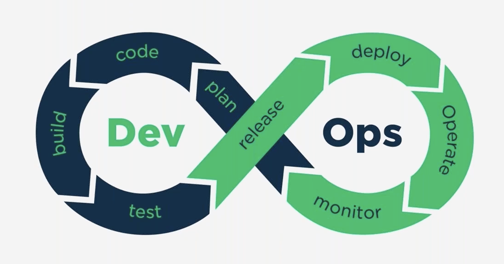
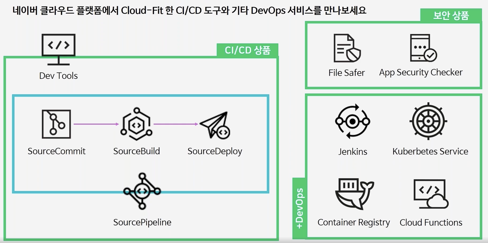
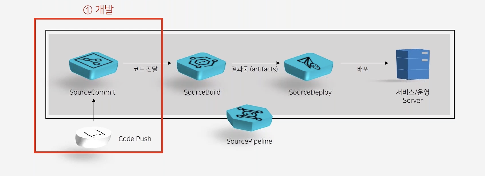
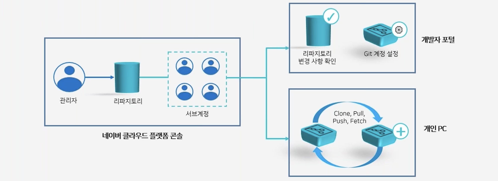
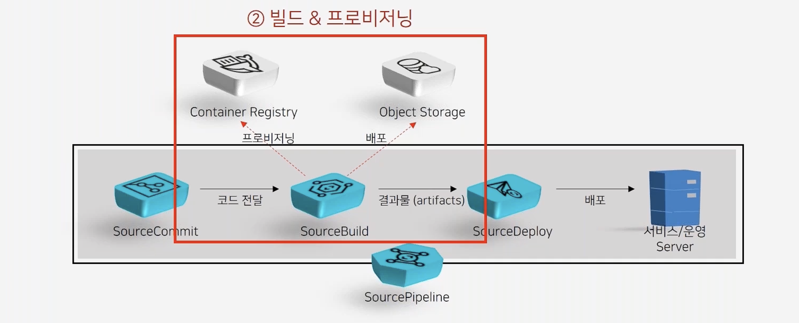
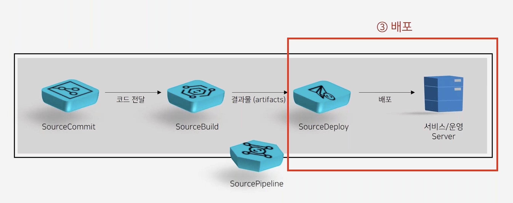
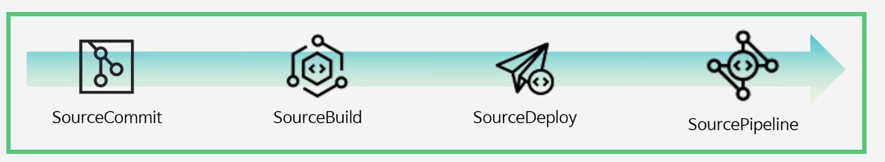

# DevOps
## DevOps란?
DevOps는 소프트웨어 개발을 뜻하는 `Dev`와 소프트웨어 운영을 뜻하는 `Ops`을 통합하는 단어로 **빠른 개발 사이클**과 **지속적 배포**를 위한 개발 및 운영 방법론

## DevOps의 등장
DevOps의 등장 전까지 개발자와 운영자의 업무가 완전히 분리되어있는 형태  
즉, 개발자는 비즈니스 요구사항에 따라 필요한 기능을 개발하는 업무와 소프트웨어를 유지보수하고 테스트를 통해 비즈니스 요구사항을 충족시키는 역할  
오퍼레이터는 개발자가 완성한 코드를 시간 내에 문제 없이 빌드하고 배포하는 역할  

이처럼 두 역할을 가진 인력이 필요했고 각 역할 별 업무가 달랐기 때문에 개발부터 배포까지 상당한 시간이 소요되었고 자동화의 어려움이 생겼다.  
DevOps 개념이 등장하면서 개발자와 오퍼레이터 역할을 모두 할 수 있는 데브옵스 엔지니어가 탄생했고 최소 인원으로 빠른 시간내에 개발과 배포가 가능해졌다.

## CI/CD의 필요성
소프트웨어 개발과 배포 주기가 빨라졌기 때문에 업무의 효율성을 위한 지속적인 고민이 시작되었고 CI/CD 개념이 등장했다.  
CI는 코드의 변경 사항을 통합하여 빌드하고 테스트하는 역할 
CD는 CI에서 빌드하고 테스트한 소스를 실제 프로덕트 환경에 배포하는 역할을 수행한다.  

코드를 통합하고 배포하는 과정을 모두 자동화 하여 개발과 배포 효율성을 올리는 것이 CI/CD의 핵심이다.

# 클라우드 상에서의 CI/CD
CI/CD에 필요한 툴을 구축하고 운영하기 위해서는 도구/스킬/경험이 필요하기 때문에 진입 장벽이 높다.  
클라우드에서 제공하는 CI/CD 서비스를 사용하면 구축과 운영에 대한 걱정을 해결할 수 있고 간편하게 보안 환경을 구축하고 접근할 수 있다.  

## 네이버클라우드에서 제공하는 CI/CD 서비스
네이버클라우드에서 CI/CD뿐만 아니라 보안과 DevOps를 위한 다양한 서비스가 존재한다.

### SourceCommit
대옹량의 리파지토리를 인프라에 대한 고민 없이 언제 어디서나 쉽고 빠르게 사용할 수 있게 도와준다.

* 모든 Git 명령어 사용 가능
* 다양한 Git Client(Smart Tree, Source Tree...)와 호환 가능
* 외부의 Git Repository와 연동 가능
* 네이버 클라우드에서 파일들에 대한 보안 취약점을 체크해주는 File Safer 서비스와 연동 가능
* Sub Account 사용자 별 접근제어를 통해 리포지토리 별 접근 권한 부여로 보안 강화

#### SourceCommit 워크플로우

### SourceBuild
다양한 언어로 개발된 소스코드를 쉽고 빠르게 빌드, 테스트, 배포할 수 있도록 도와준다.

* 파이썬, 자바, C# 등 다양한 빌드 환경 제공
* 고성능의 전용 인프라 제공
* 빌드 전후 명령어를 통해 빌드에 관련된 명령어 사용 가능
* 개발자가 주로 이용하는 라이브러리와 툴을 제공하기 때문에 별도의 설치 명령어 없이 빌드 가능
* 원하는 환경의 이미지를 만들어 Container Registry, Public Registry에 저장하여 빌드 환경을 생성하고 사용 가능
* 결과물을 Object Storage에 보관 가능

### SourceDeploy
미리 설정된 사용자 기반 명령어들을 통해 소스 배포, 실행 및 검증을 자동화할 수 있다.

* Object Storage 및 Source Build 배포 파일 선택
* 사용자가 지정한 서버에 자동 배포 가능
* Auto Scaling 연동 시 Scale-Out된 서버에도 자동 배포
* 배포 단계 별 명령어 실행
* 배포 승인을 통한 제어

> 💡타겟 서버에 배포하기 위해서는 에이전트를 설치해야 타겟 서버와 통신이 가능하다.

### SourcePipline
쉽게 새로운 기능을 출시할 수 있도록 리파지토리, 빌드, 배포 프로세스를 통합하여 제공하는 서비스

# Summary
네이버 클라우드에서 소스 코드의 통합과 빌드, 배포를 위해서 SourceCommit, SourceBuild, SourceDeploy, SourcePipline 서비스를 제공한다.

* 클라우드 환경에서 쉽고 빠르게 사용 가능
* 다양한 라이브러리를 제공해 설치 없이 사용 가능
* 나만의 이미지를 커스텀하여 생성 가능
* auto-scaling, 쿠버네티스 환경에서도 쉽게 배포
* Sub Account와 사용하면 특정 프로젝트에서 권한을 부여하여 보안성 증가
* 히스토리 확인 가능
* 클릭 몇번으로 기존의 작업들을 순서대로 실행 가능

#### 출처
이미지와 내용의 출처는 네이버클라우드 강의 (제목: [클라우드 상에서 효율적인 CI/CD 사용 방법](https://www.edwith.org/nclouddevtools/lecture/350981?isDesc=false))입니다.

#### 사용방법
SourceCommit, SourceBuild, SourceDeploy, SourcePipline의 자세한 사용 방법은 [네이버 클라우드의 Source 시리즈를 활용한 인프라 생성 자동화 포스팅](https://rkdejr2321.github.io/ncp/ncp_source_series/)에서 확인 가능