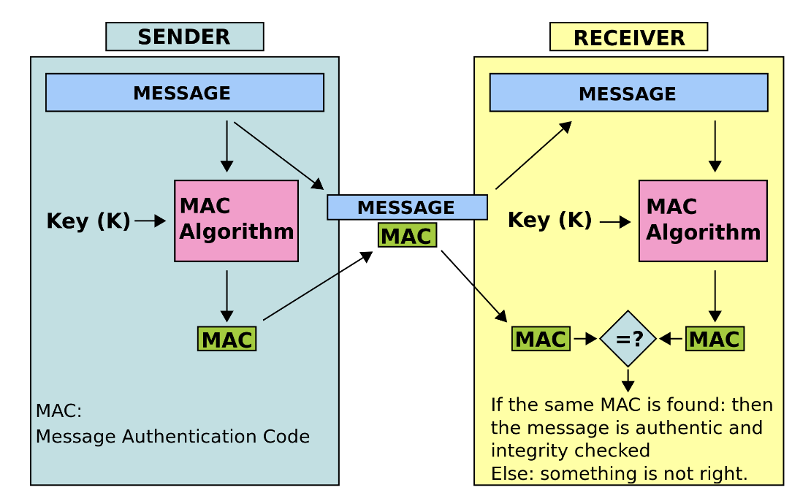

# 자원을 제어하는 다양한 방식
네이버클라우드 리소스를 제어하는 여러가지 방법이 있다.

## UI
웹 브라우저로 네이버클라우드 콘솔에 접속하여 네이버클라우드 플랫폼 리소스를 제어

## CLI
Command Line Interface로 터미널과 같은 shell 프로그램을 이용해 명령어로 리소스슬 제어하거나 Shell Script를 작성해 명령어를 순차적으로 사용해 제어할 수 있다.

## REST API와 SDK
개발자들이 어플리케이션이나 웹서비스에서 네이버클라우드가 제공하는 다양한 API를 호출하거나 SDK(Software Development Kit) 즉, 네이버클라우드 리소스를 제어할 수 있는 여러 도구를 활용할 수 있다.

# 네이버클라우드플랫폼의 API
네이버클라우플랫폼은 총 3가지의 형태의 API를 제공한다.

* Ncloud API
* AI Application API
* Object Storage API

## Ncloud API
네이버클라우드의 기본적인 리소스(Server, LB, CDN, Container Registry)를 제어할 수 있다.

## AI Application API
AI 관련된 API로 대표적으로 클로바, 파파고 등을 제공

기본적으로 Rest API로 client ID와 Client Secret을 Header에 넣고 서비스 이용에 필요한 데이터를 Body에 넣어서 요청을 보내면 된다.

## Object Storage API
HTTP 통신을 통해 Bucket에 있는 객체에 접근할 수 있고 Bucket 생성, 삭제, 수정과 파일을 업로드하고 내려받는 기능을 제공한다.

AWS S3와 호환 가능하기 때문에 S3 SDK를 사용하는 것을 권장

# REST API란?
클라이언트에서 네이버클라우드로 제어 요청을 하기 위해서는 HTTP 요청을 보내야하고 네이버클라우드 플랫폼에서 요청에 대한 응답 해주는 형태

* 목적지로 전달하기 위한 `URL`
* 요청에 대한 행동을 표시하기 위한 `Method`
* 인증에 관련된 정보가 담겨셔 있는 `Headers`
* 요청에 보낼 데이터를 담는 `Body`

## Ncloud API Headers
API에서 Header에 들어가는 데이터는 총 4가지

|Header|Description|
|------|-----------|
|x-ncp-apigw-timestamp|1970년 1월 1일 00:00:00(UTC)부터 경과시간을 밀리초로 나타낸 값 APIGW 서버와 시간차가 5분 이상 나는 경우 유효하지 않는 요청으로 판단|
|                     |APIGW 서버와 시간차가 5분 이상 나는 경우 유효하지 않는 요청으로 판단|
|x-ncp-apigw-api-key|API Gateway에서 발급받은 키|
|x-ncp-iam-aceess-key|네이버 클라우드 플랫폼 또는 sub account에서 발급받은 Access Key ID|
|x-ncp-apigw-signature-v1|Body를 Access Key ID와 맵핑되는 Secret Key로 암호화한 서명
|                        |HMAC 암호화 알고리즘은 HmacSHA256 사용|

### HMAC(Hash Message Authentication Code)
Sender와 Receiver가 서로 API를 주고 받을 때 Sender가 보낸 메시지인지, 변조가 되지 않았는지 확인하는 데 사용하는 인증 방식



1. Sender와 Receiver가 동일한 Key를 공유 (대칭키)
2. Sender는 Key를 이용해 원본 메시지를 해싱하는데 이때 해싱 된 값이 바로 MAC
3. Sender는 원본 메시지와 MAC을 Receiver에게 전달
4. Receiver는 Key를 이용해 전달 받은 원본 메시지를 해싱하여 나온 값과 전달 받은 해시 값을 비교
5. 일치하면 변조되지 않았고 불일치하면 위조된 메시지


### Ncloud API Signature 생성 - JAVA
```java
public String makeSignature() {
	String space = " ";					// one space
	String newLine = "\n";					// new line
	String method = "GET";					// method
	String url = "/photos/puppy.jpg?query1=&query2";	// url (include query string)
	String timestamp = "{timestamp}";			// current timestamp (epoch)
	String accessKey = "{accessKey}";			// access key id (from portal or Sub Account)
	String secretKey = "{secretKey}";

	String message = new StringBuilder()
		.append(method)
		.append(space)
		.append(url)
		.append(newLine)
		.append(timestamp)
		.append(newLine)
		.append(accessKey)
		.toString();

	SecretKeySpec signingKey = new SecretKeySpec(secretKey.getBytes("UTF-8"), "HmacSHA256");
	Mac mac = Mac.getInstance("HmacSHA256");
	mac.init(signingKey);

	byte[] rawHmac = mac.doFinal(message.getBytes("UTF-8"));
	String encodeBase64String = Base64.encodeBase64String(rawHmac);

  return encodeBase64String;
}
```

### Ncloud API Signature 생성 - Python
```python
import sys
import os
import hashlib
import hmac
import base64
import requests
import time

def	make_signature():
	timestamp = int(time.time() * 1000)
	timestamp = str(timestamp)

	access_key = "{accessKey}"				# access key id (from portal or Sub Account)
	secret_key = "{secretKey}"				# secret key (from portal or Sub Account)
	secret_key = bytes(secret_key, 'UTF-8')

	method = "GET"
	uri = "/photos/puppy.jpg?query1=&query2"

	message = method + " " + uri + "\n" + timestamp + "\n"
	+ access_key
	message = bytes(message, 'UTF-8')
	signingKey = base64.b64encode(hmac.new(secret_key, message, digestmod=hashlib.sha256).digest())
	return signingKey
```

JAVA에서 encodeBase64String, Python에서 siging_key가 Rest API 헤더부분 시그니처로 들어가면 된다.

## Ncloud API -URL
https://ncloud.apigw.ntruss.com/{service}/{version}/{action}?{parameter}

* {service} : API로 제어할 서비스 이름
* {version} : 서비스의 버전
* {action} : API 요청을 통해 수행할 작업
* {parameter} : 요청에 필요한 여러가지 파라미터 값

# 실습
네이버클라우드 콘솔에 생성되어 있는 서버를 조회해보자

❗️시그니처를 생성할 때 timestamp 값과 http 헤더에 들어가는 timestamp 값은 반드시 같은 값이여야 함  
❗️URI에서 /vserver/v2...는 vpc 환경의 서버를 말하고 /server/v2는 classic 환경의 서버를 뜻한다.

## 코드
```java
class Main {
    static String currentTimestamp = String.valueOf(System.currentTimeMillis());

    public static void main(String[] args) throws Exception {

        HttpRequest httpRequest = HttpRequest.newBuilder()
                .uri(new URI("https://ncloud.apigw.ntruss.com/vserver/v2/getServerInstanceList"))
                .header("x-ncp-apigw-timestamp", currentTimestamp)
                .header("x-ncp-iam-access-key", "HIJl3lUo0K953kHptDci")
                .header("x-ncp-apigw-signature-v2", makeSignature())
                .GET().build();

        HttpClient httpClient = HttpClient.newHttpClient();

        HttpResponse<String> response = httpClient.send(httpRequest, HttpResponse.BodyHandlers.ofString());

        System.out.println(response.statusCode());
        System.out.println(response.body());
    }

    public static String makeSignature() throws UnsupportedEncodingException, NoSuchAlgorithmException, InvalidKeyException {
        String space = " ";					// one space
        String newLine = "\n";					// new line
        String method = "GET";					// method
        String url = "/vserver/v2/getServerInstanceList";
        String timestamp = currentTimestamp;	// current timestamp (epoch)
        String accessKey = "HIJl3lUo0K953kHptDci";			// access key id (from portal or Sub Account)
        String secretKey = "pMBn5MSL6eaOQXl03evO7XnA9FxSJ5OBtPXszSoo";

        String message = new StringBuilder()
                .append(method)
                .append(space)
                .append(url)
                .append(newLine)
                .append(timestamp)
                .append(newLine)
                .append(accessKey)
                .toString();

        SecretKeySpec signingKey = new SecretKeySpec(secretKey.getBytes("UTF-8"), "HmacSHA256");
        Mac mac = Mac.getInstance("HmacSHA256");
        mac.init(signingKey);

        byte[] rawHmac = mac.doFinal(message.getBytes("UTF-8"));
        String encodeBase64String = Base64.getEncoder().encodeToString(rawHmac);

        return encodeBase64String;
    }
}
```
