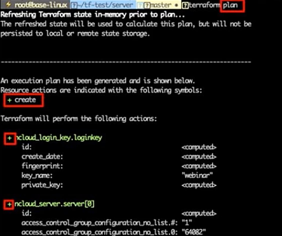
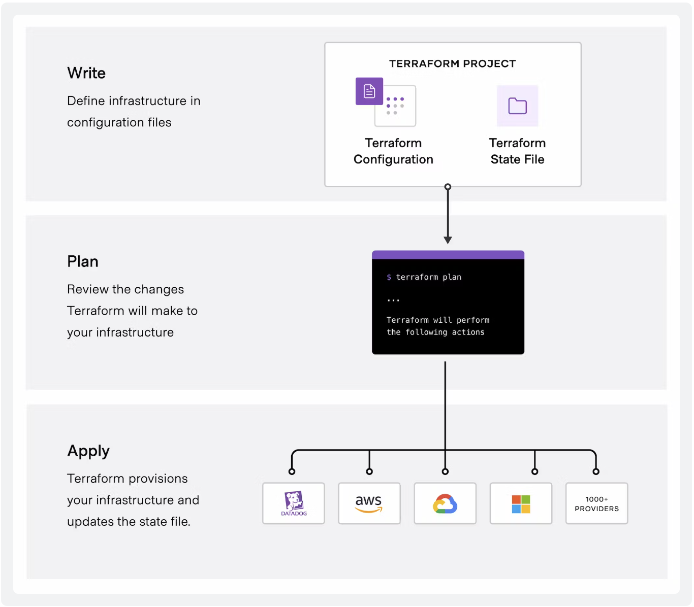

# 코드 형태의 인프라 및 도구
IaC (Infastructure as a Code)는 코드 기반으로 인프라를 정의하여 프로비저닝하고 관리하는 방식

코드 기반이기 때문에 인프라를 표준화된 패턴을 사용하여 배포하고, 최신 버전으로 업데이트하거나, 복제를 통해 다양한 환경에서 동일한 인프라 구성 매칭이 가능

## 장점
IaC로 인프라 리소스를 구성햇을 때 self-service 형태를 인프라를 서비스화 가능하며, 안전하게 리소스를 생성하고 복구 가능하다.

또한 문서화와 버전 관리가 쉬워 변경 이력 및 서비스 영향도를 명확하게 파악 가능하다.  
프로덕트 환경에서 인프라에 대한 변경이 필요할 경우 변경 부분에 대한 영향도를 파악 가능하다는 점이 중요

> sefl-service란? 서비스의 담당자의 지원 없이 고객이 스스로 리소스에 엑세스하는 방식

## 도구 및 특성
클라우드 플랫폼 별 IaC 도구가 존재하며, 각 클라우드 API를 통해 인터페이스 형태로 존재하는 Terraform도 존재한다.

|도구|특성|
|---|---|
|AWS CloudFormation|AWS 리소스 생성을 위한 IaC 도구로 템플릿으로 YAML, JSON을 사용한다.|
|Googlce Cloud Deployment Manager|GCP 리소스 생성을 위한 IaC 도구로 YAML, Python, Jinja2를 지원한다.|
|Terraform| 각 플랫폼 별 동일한 인터페이스 형태로 제공하는 도구로 HCL, JSON 지원|

* 장점: 플랫폼 별 새로운 서비스가 출시되면 테라폼에서 제공하기 전에 플랫폼이 제공하는 상품에서 지원
* 단점: 특정 벤더에 락인될 가능 존재

# Hachicorp Terraform
HashiCrop에서 개발한 IAC 도구로 코드를 통해 인프라를 구축 / 운영 / 관리할 수 있게 해주는 오픈소스 소프트웨어

클라우드 플랫폼에 종속되지 않고 멀티 클라우드 환경에서 사용가능하며, 실 환경에 적용 전 테스트 기능을 제공하여 서비스 영항도를 사전에 확인 가능하다.

* ➕ 표시: 새로 생성될 리소스
* ➖ 표시: 삭제될 리소스
* 〰️ 표시: 변경될 리소스

## 테라폼 특징
* Infrasctructure as Code
  * 코드 기반으로 정의
* Excution Plans
  * 실 환경에 적용 전 사전 테스트 기능 제공
* Resource Graph
  * 클라우드 플랫폼마다 리소스에 대한 의존성을 사용자가 고민할 필요가 없이 테라폼에서 그래프를 통해 의존성을 확인하는 기능 제공 
* Change Automatic
  * 수작업 없이 자동화 가능

## 테라폼 명령어
테라폼에는 다양한 명령어가 있지만 대표적으로 사용하는 명령어는 terraform init / plan / apply / detroy / graph가 있다.
- **terraform init**: 현재 디렉토리에 있는 .tf 파일을 읽어 필요한 플러그인들을 다운로드 하고 .terraform 디렉토리에 다운로드한 모듈을 보관
- **terraform plan**: terraform 구성을 검토하고 실행 전에 어떤 변경사항이 발생하는지 확인하는 용도이며 실제로 변경을 수행하지는 않음
- **terraform apply**: terraform 구성에 정의된 내용을 바탕으로 인프라를 구성하거나 업데이트 하며 error가 없다면 변경된 상태를 저장
- **terraform destroy**: terraform을 사용하여 생성된 인프라스트럭처를 삭제
- **terraform graph**: 리소스 간 의존성을 출력

## 테라폼의 워크플로우

Write → Plan → Apply

- **write**: 인프라 환경을 HCL로 작성
- **plan**: 인프라 및 구성을 기반으로 생성, 수정, 삭제하기 위한 실행 계획을 확인
- **apply**: 확인된 실행 계획을 리소스 종속성을 유지하면서 올바른 순서로 작업을 수행

Apply 수행 후 .tfstate라는 파일이 생성되는데 이 파일은 실제 환경에 적용된 리소스를 Json 형태의 파일로 나타낸 것이다. .tfstate 파일을 비교하여 원복할 수 있고 새로운 plan을 수행할 때 기존에 있는 .tfstate 파일과 비교하여 변경된 사항을 보여줄 때 사용한다.

## 테라폼 사용방법
강의 영상에서 사용한 데모 파일을 찾지 못하였지만 이전 포스팅에 있는 [Source 시리즈를 활용한 인프라 생성 자동화](https://rkdejr2321.github.io/ncp/ncp_source_series/)를 보면 vpc를 생성하는 테라폼 코드가 나와있다. 참고부탁드립니다.🙇‍♂️

# Terraform in Naver Cloud Platform의 한계
* 제어 가능한 리소스 제약
  * server, block storage, public ip, lb, nas, port 정도만 제어 가능
* ACG의 경우 이미 생성된 것을 하드 코딩해서 사용 가능