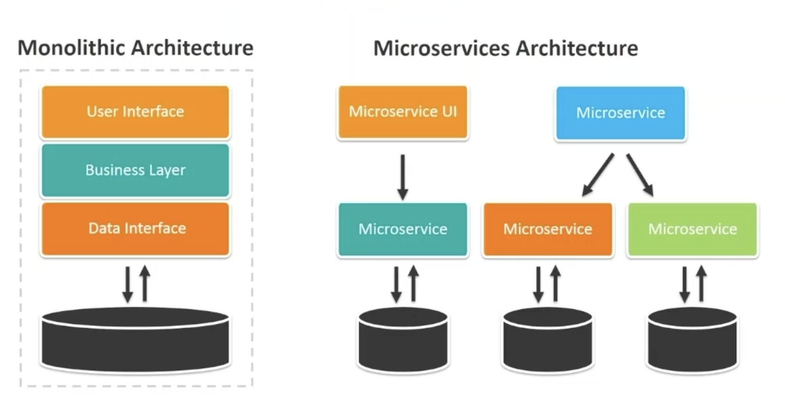
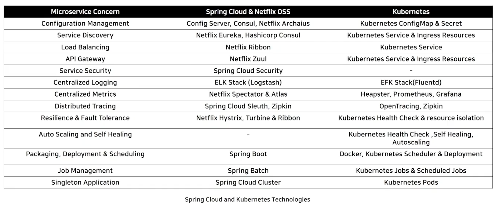
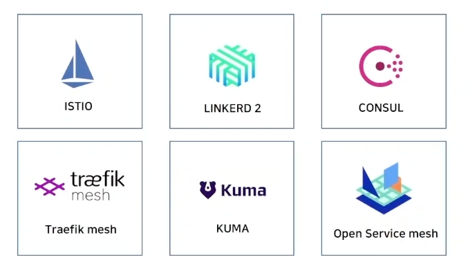
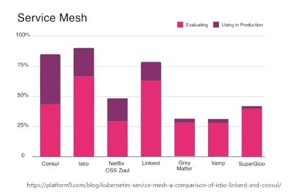
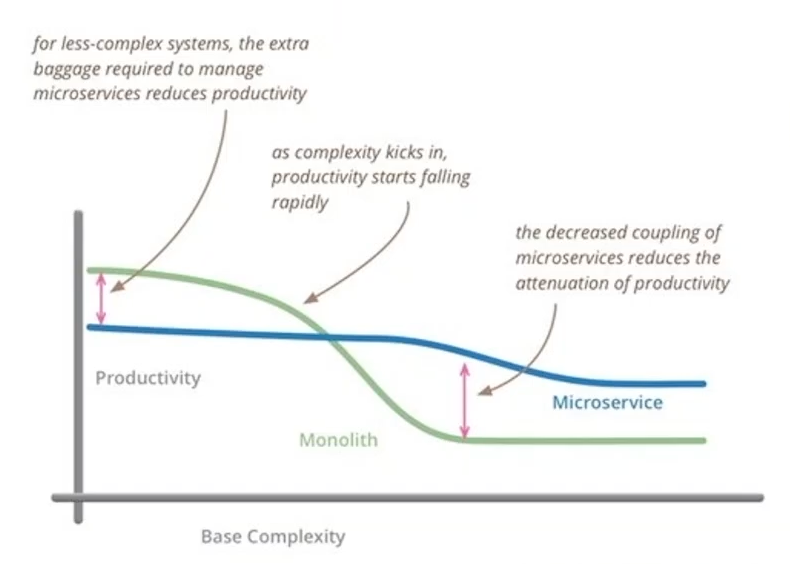
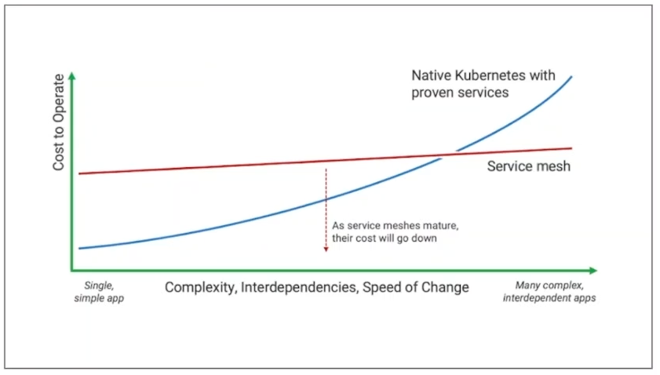
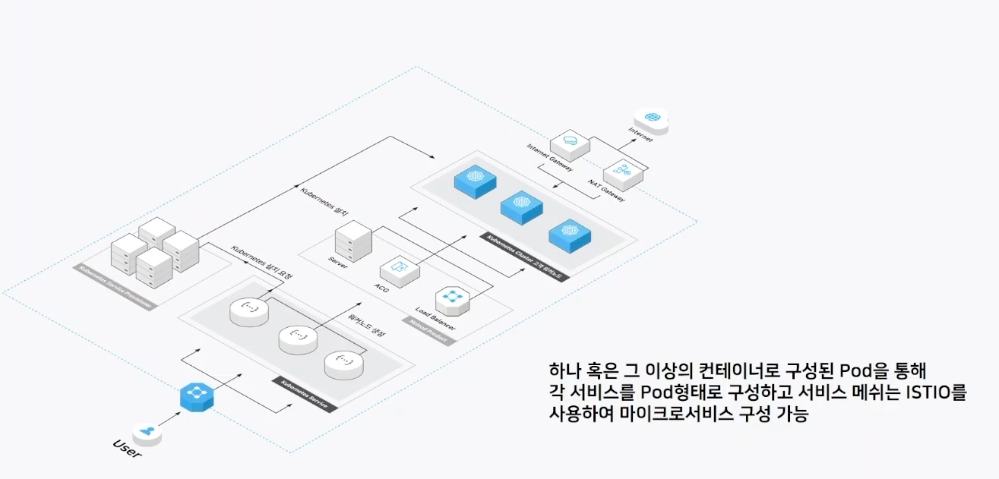

# 모놀리식 VS 마이크로서비스 아키텍처
* 모놀리식: 하나의 애플리케이션 안에 모든 비즈니슥 로직이 다 들어가 있는 구조
* 마이크로서비스: 애플리케이션의 서비스를 여러 개의 작은 구조로 분리하여 각 서비스가 독립적으로 개발되고 배포되는 구조

# 마이크로서비스 아키텍처가 인기 있는 이유
## 모놀리식 아키텍처의 문제점
1. 모놀리식 아키텍처는 소프트웨어의 모든 구성요소가 한 프로젝트에 합쳐져있어, 큰 변화에 대한 대응이 어려우며, 새로운 기능 추가 및 업데이트에 어려움 존재
2. 여러 역할을 하는 시스템이 하나의 구조로 연결되어 있기 때문에 특정 부분에 문제가 발생하면 다른 시스템도 문제가 발생할 수 있어, 큰 장애로 이어질 수 있음
3. 특정 서비스의 리소스가 부족하여 scale-out을 해야할 경우 전체 시스템을 scale-out을 해야하기 때문에 필요 없는 자원이 증가
4. 특정 서비스를 업데이트하더라도 전체 서비스에 대한 빌드 작업이 필요

## 마이크로서비스 아키텍처 장점
1. 새로운 서비스를 추가한다거나 기능 업데이트 시 모놀리식 아키텍처보다 유연하게 대처 가능
2. 특정 서비스에 문제가 발생하면 해당 서비스만 수정하여 빠른 배포 가능
3. 필요한 서비스의 서버만 scale-out
4. 특정 서비스만 배포 가능하며 빠르고 정확한 대응 가능

# MSA를 구성하는 주요 Component
* **Config Management**
  * 서비스의 재빌드 / 재부팅 없이 설정사항을 반영
* **Service Discovery**
    * MSA 기반 서비스 배포 시 서비스 검색 및 등록
* **API Management**
    * 클라이언트 접근 요청을 일원화
* **Centralized Logging**
    * 서비스별 로그의 중앙집중화
* **Distribute Tracing**
    * 마이코서비스 간의 호출 추적
* **Centralized Monitoring**
  * 서비브별 메트릭 정보의 중앙집중화
* **Resilience & Fault Tolerance**
  * MSA 구조에서 하나의 실패한 서비스가 체인에 연결된 전체 서비스들에 파급 효과를 발생시키지 않도록 하기 위한 계단식 실패 방지 구조
* **Auto-Scaling & Self-Healing**
  * 자동 스케일링, 복구 자동화를 토한 서비스 관리 효율화

# MSA를 구현하는 기반 기술
Spring Cloud와 Kubernetes는 둘 다 마이크로서비스를 개발하고 실행하는 최적의 환경

## Service Mesh
마이크로 서비스 간 통신을 위해 각 서비스를 식별(**Discorvery**)하고, 경로를 파악(**Routing**)하며, 로드밸런싱(**Load-Balancing**)을 하고 전체 서비스의 장애 전파를 차단(**Circuit Break**)하며 Telemetry와 통합되어 로긍, 모니터링, 트래이싱 기능을 담당하는 `Service Mesh`에 대한 이해도가 필요

### Service Mesh 서비스들

### Service Mesh 활용 비율

# Microservice 적용 시 고려사항
시스템의 복잡도가 높아야 마이크로서비스 아키텍처를 사용할 때 모놀리식보다 생산성이 높으며 그렇지 않을 경우 모놀리식이 더 효율적
마이크로서비스가 꼭 정답이 아니다.

# Service Mesh 적용 시 고려사항
## 복잡성
서비스 메쉬를 사용하면 런타임 인스턴스 수가 증가

## 사이드카 컨테이너 수 증가
각 서비스는 Service Mesh의 사이드카 프록시를 통해 호출되므로 개별 프록시 수가 증가.
이에 따른 부하로 서비스 운영에 문제가 발생할 가능성이 있는지 사전 검토

## 기술력의 미성숙
빠르게 발전하고는 있으나 많은 기업이 서비스 메쉬에 대한 경험이 없음

# 네이버 클라우드 플랫폼 Kubernetes Services
네이버 클라우드 플랫폼에서 제공하는 `Kubernetes Service`를 사용하면 쿠버네티스 클러스터를 손쉽게 생성할 수 있다.

