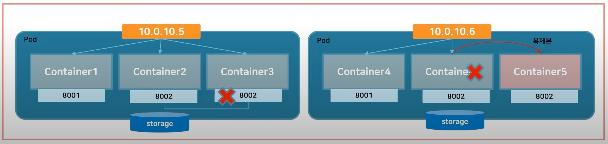
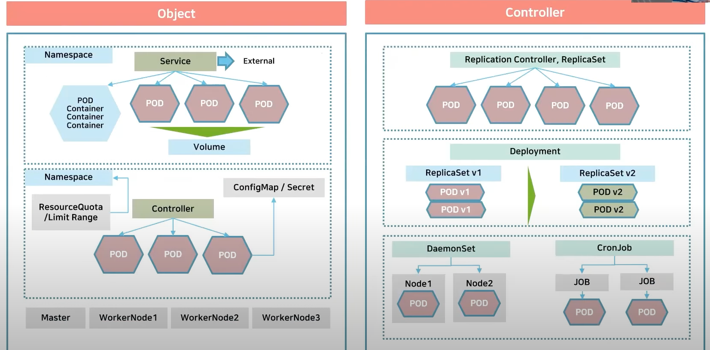
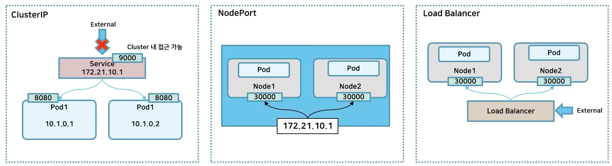
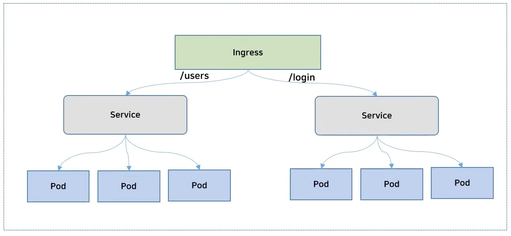
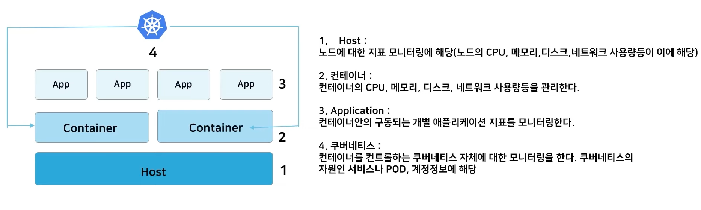
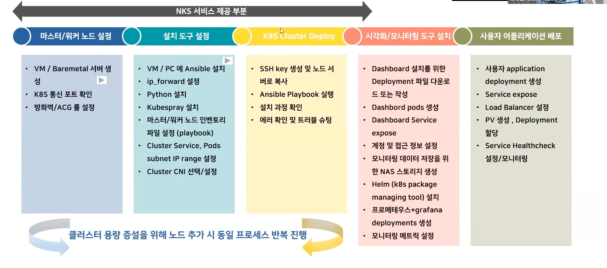
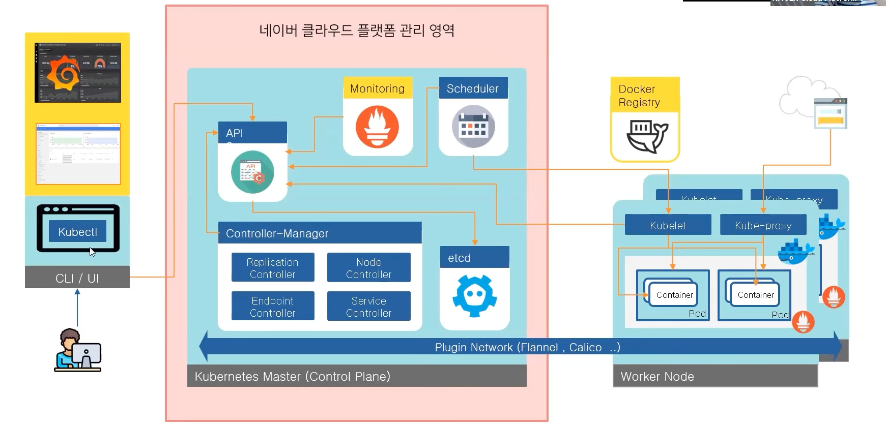
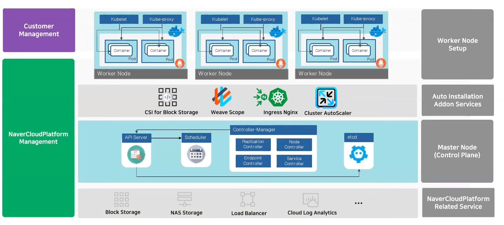
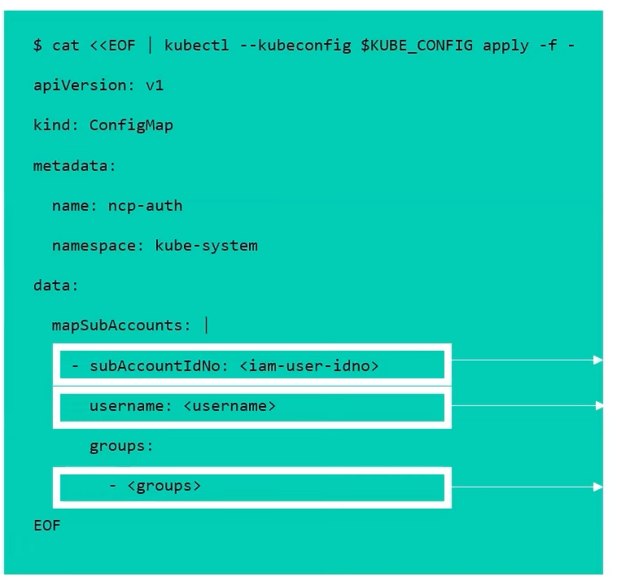

# Kubernetes Component
## Pod
Kubernetes에서 생성하고 관리할 수 있는 배포 가능한 가장 작은 단위

하나의 기능을 제공하기 위한 관련된 컨테이너가 모여있는 집합을 Pod이라고 부른다.

## Object and Controller
Object란? 쿠버네티스 클러스터를 운영하면서 실행하는 단위
네임스페이스, 파드, 볼륭 등이 존재

Controller란? Object를 관리하는 역할
Replication / ReplicaSet 등 다양한 컨트롤러가 존재

## Service
여러 Pod를 묶어 Healty한 Pod로 라우팅하는 로드 밸런싱 기능을 제공
일반적으로 pod가 생성되고 삭제되는 일이 빈번하고 IP가 변경되기 때문에 IP를 외부에 노출하지 않는다. 따라서 port만 외부로 노출시켜 통신이 가능하게 설정한다.

## Ingress
Service는 L4 로드밸런싱 (Network LoadBalancer) 역할을 하고 Ingress는 L7 로드밸런싱 (Application LoadBalancer) 역할을 한다.
URL 기반의 라우팅을 수행한다.

## Configmap
컨테이너에 들어갈 어플리케이션의 설정 값을 외부에서 제어할 수 있도록 도와주는 객체
환경변수와 같이 자주 변경되는 값이나 인증키 값을 Configmap을 사용하여 환경변수와 시크릿 값을 불러와 사용 가능하다.

## Monitoring
오브젝트에서 정의한 개수 대로 Pod를 복제 / 관리하는 객체
MSA는 서비스가 분리되어 있기 때문에 하나의 통합된 모니터링이 중요하다.
Replicaset을 단독으로 사용할 수 있으나 주로 Deployment의 spec으로 정의하는 것을 권장

# 네이버클라우드플랫폼의 Kubernetes Services
* 쉬운 Kubernetes 생성
  * 쿠버네티스 클러스터 설정 작업이 간소화되며 이를 통해 클러스터를 구축하고 운영 및 유지하는데 드는 시간을 절약
* 편한한 Kubernetes 관리
  * 작업자 노드와 관리형 제어 영역 간에 안전한 통신을 제공하고 작업자 노드를 빠르게 프로비저닝하여 손쉽게 확장 가능
  * 온 디맨드 업그레이드 및 패치 가능
* 클러스터 자동 확장
  * 수평적 Pod 자동확장, 노드 풀별로 실행되는 클러스터 자동 확장 등 다양한 워크로드 요구사항에 대응 가능

NKS를 사용하면 마스터/워커 노드 설정, 설치, 배포 등의 작업을 도와준다.

## 클러스터 구성도
네이버클라우드플랫폼의 다양한 서비스와 연계하여 클러스터를 사용할 수 있다.

## 쿠버네티스 클러스터 액세스 권한
네이버클라우드플랫폼에서 ncp-iam-authenticator를 통핸 IAM 인증을 제공하여 쿠버네티스 클러스터에 대한 액세스 권한 관리 가능

* subAccountIdNo: SubAccount 콘솔에서 확인 가능한 추가할 SubAccount 사용자의 ID
* username: Kubernetes 내에서 IAM 사용자에게 매핑할 사용자 이름
* groups: Kubernetes 내에서 사용자에게 매핑할 그룹 목록

# Service Mesh
Service Mesh는 MSA에서 마이크로 서비스간 통신을 제어하고 관리할 수 있는 인프라 계층
마이크로서비스마다 경량화 프로젝시를 서비스 내부가 아닌 사이드카 바식으로 배치하여 서비스간 총신을 제어한다.

## Istio
Istio란 Service Mesh를 구현할 수 있는 오픈소스로 코드 변경 없이 마이크로 서비스들끼리 안전하게 통신하고, 모니터링 할 수 있는 방법을 제공한다.
Istio는 데이터 영역(Data Plain)과 제어 영역(Controll Plain)으로 구성되어 있다.

* 데이터 영역: Mesh 내 서비스들 사이의 네트워크 트래픽을 관리
* 제어 영역: 데이터 영역에 배포된 Envoy를 컨트롤 하는 부분으로 파일럿, 믹서, 시타델 총 3개의 모듈로 구성되어 있다.