# Kubernetes
다수의 컨테이너를 배포하고 관리하는 오픈소스 시스템
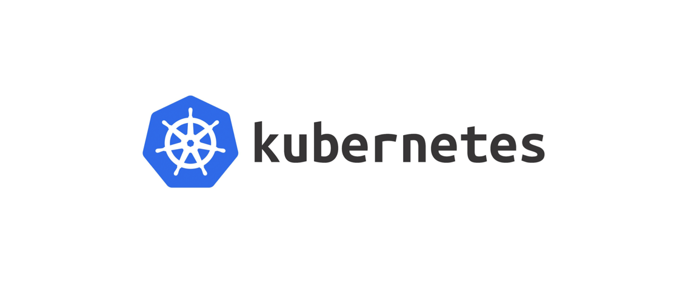


## Pod
Kubernetes에서 생성하고 관리할 수 있는 배포 가능한 가장 작은 단위

### 단일 컨테이너만 동작하는 파드
단일 컨테이너 당 한개의 파드 모델은 쿠버네티스 사용 사례 중 가장 흔하다. 이 경우, 한 개의 파드가 단일 컨테이너를 감싸고 있기 때문에 쿠버네티스는 컨테이너가 아닌 파드를 직접 관리한다라고 볼 수 있다.

### 다중 컨테이너가 동작하는 파드
파드끼리 강하게 결합되어 있고 리소스 공유를 위해 다중으로 함께 배치된 컨테이너로 구성되어 있다. 

## 쿠버네티스에서 로그 관리
쿠버네티스를 운영하다 보면 파드는 새로 생성되기도 하고 삭제되기 때문에 파드의 라이프 사이클에 따라서 로그를 수집해야한다.

그러나 쿠버네티스에서 제공하는 로깅 서비스가 존재하지 않는다.

만약 컨테이너가 죽거나 pod, node에 문제가 발생해 로그 자체를 수집할 수 없는 문제가 발생하기 때문에 로그는 노드, 파드, 컨테이너의 라이프라이클과 독립적으로 운영되어야 한다.

# 네이버클라우드플랫폼 쿠버네티스 서비스
네이버클라우드 플랫폼의 쿠버네티스 서비스는 완전 관리형 서비스로 직접 쿠버네티스를 구축하지 않아도 빠르고 간편하게 쿠버네티스를 운영할 수 있다.

## Lagacy Kubernetes
- 서버 준비, Docker / Kubernetes 설치 및 환경설정
- 쿠버네티스 서버 구성을 위한 라이브러리 설치
- 마스터 노드 구성을 위한 설멍 및 관리
- 마스터 노드의 고가용성 확보
- 다양한 서버 스펙 준비
- 확장 볼륨 필요시 추가 스토리지 구성 필요

## Kubernetes Service
- 다양한 클러스터 스펙 제공
- 마스터 노드의 관리 필요 없음
- 마스터 노드의 고가용성 제공
- 빠른 워커노드 구성 가능
- Persistent Volumes(NAS, BlockStorage) 사용 가능
- 클러스터 생성 / 설정 / 설치 제공
- Container Registry 상품과 연동


# 쿠버네티스에서의 로그 분석
EFK란 `Elasticsearch` / `Fluentd` / `Kibana`를 의미

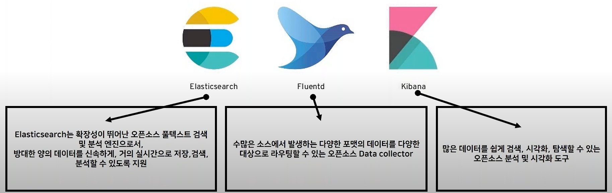

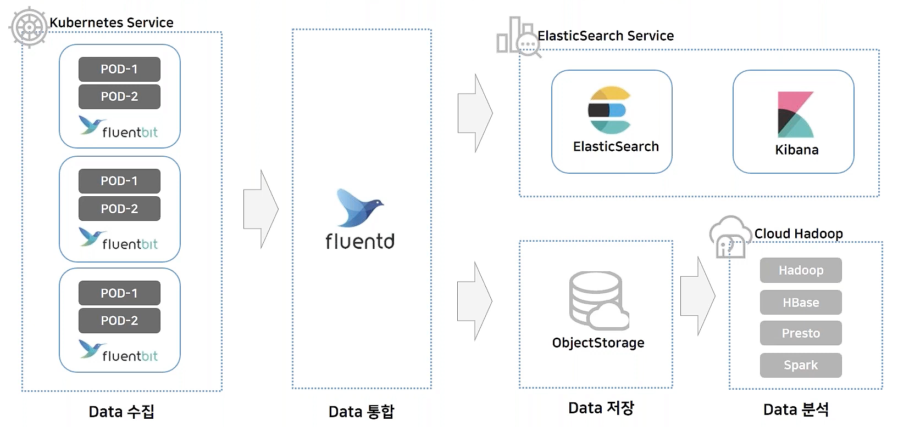


# 네이버클라우드 플랫폼 쿠버네티스 클러스터 이용
### 실습 환경
* 리전: `KR`
* 가용 Zone: `KR-2`
* bastion_server: `Ubuntu-20.0.24`


> ❗️사전 준비로 `vpc`, `subent 3개` (클러스터 subnet, LB private subnet, LB public subnet), `bastion_server` 준비
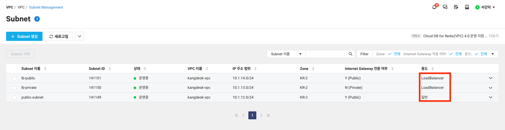

## 클러스터 설치
1. 생성하기 클릭
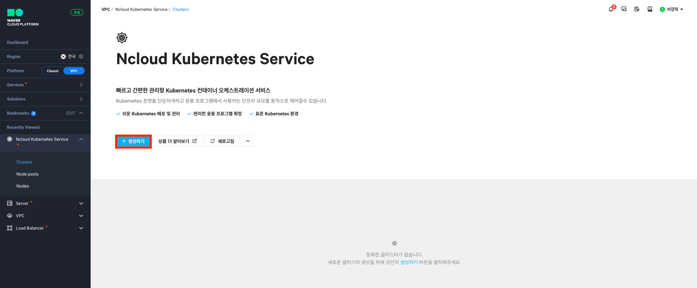

2. 사전에 준비한 vpc, subent, 가용 zone 설정
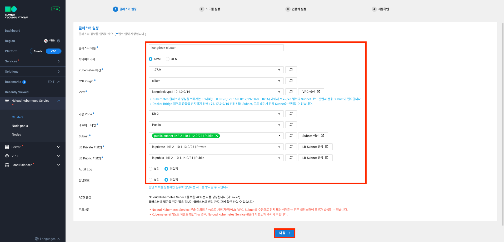

3. 노드 풀 생성
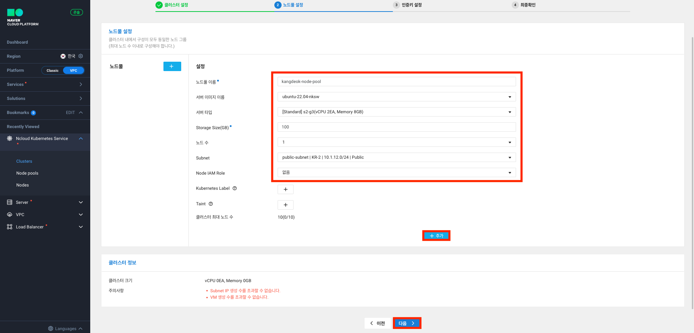

4. 인증키 설정
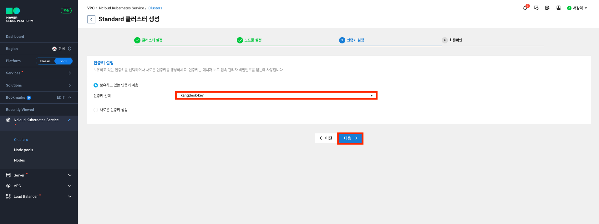

5. 생성하기 클릭
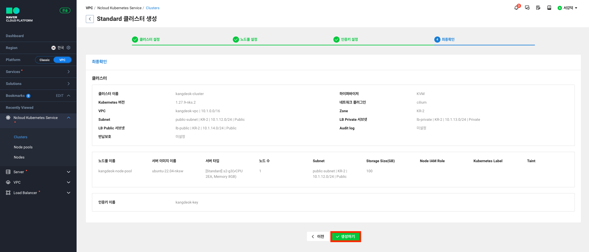

## Kubectl 설치와 IAM 인증 설정
생성한 클러스터에서 `가이드 보기`를 클릭하면 kubectl과 IAM 인증 가이드를 확인할 수 있다.
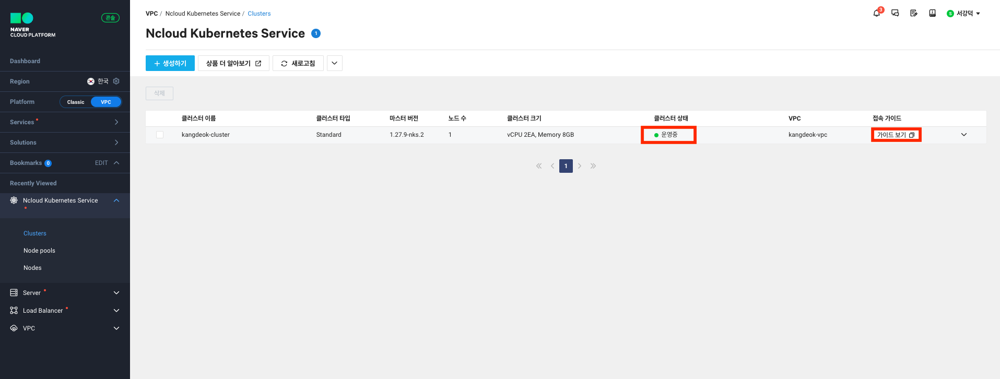
  
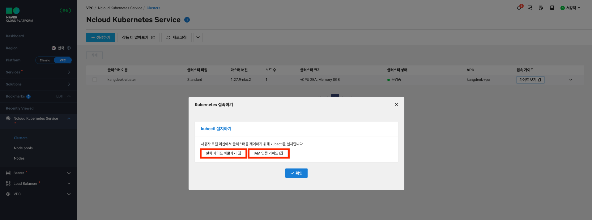


### kubectl 설치
> [설치 링크 (리눅스)](https://kubernetes.io/docs/tasks/tools/install-kubectl-linux/)

1. bastion에 접속

2. 아래의 명령어 입력
```bash
curl -LO "https://dl.k8s.io/release/$(curl -L -s https://dl.k8s.io/release/stable.txt)/bin/linux/amd64/kubectl"
```
```bash
sudo install -o root -g root -m 0755 kubectl /usr/local/bin/kubectl
```

1. 설치 확인
```bash
kubectl version --client
```
버전이 잘 뜨면 설치 완료

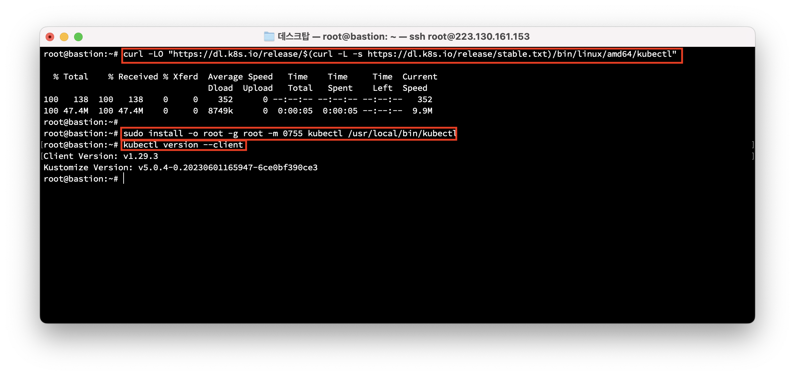

### IAM 인증 설정
> [설치 링크 (리눅스)](https://guide.ncloud-docs.com/docs/k8s-iam-auth-ncp-iam-authenticator)

1. bastion에 접속

2. ncp-iam-authenticator 설치
```bash
curl -o ncp-iam-authenticator -L https://github.com/NaverCloudPlatform/ncp-iam-authenticator/releases/latest/download/ncp-iam-authenticator_linux_amd64
```
```bash
chmod +x ./ncp-iam-authenticator
```
```bash
mkdir -p $HOME/bin && cp ./ncp-iam-authenticator $HOME/bin/ncp-iam-authenticator && export PATH=$PATH:$HOME/bin
```
```bash
echo 'export PATH=$PATH:$HOME/bin' >> ~/.bash_profile
```
```bash
ncp-iam-authenticator help
```
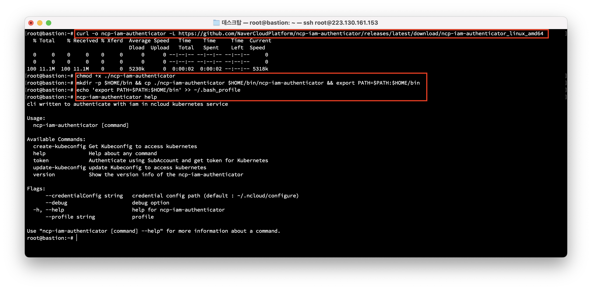

3. IAM 인증 kubeconfig 생성
```bash
export NCLOUD_ACCESS_KEY=ACCESSKEYIDACCESSKEY
export NCLOUD_SECRET_KEY=SECRETACCESSKEYSECRETACCESSKEYSECRETACCE
export NCLOUD_API_GW=https://ncloud.apigw.ntruss.com
```

4. ncp-iam-authenticator update-kubeconfig 명령 사용
```bash
ncp-iam-authenticator update-kubeconfig --region <region-code> --clusterUuid <cluster-uuid>
```
5. ncp-iam-authenticator create-kubeconfig 명령 사용
```bash
ncp-iam-authenticator create-kubeconfig --region <region-code> --clusterUuid <cluster-uuid> --output kubeconfig.yaml
```

6. 생성된 kubeconfig 파일로 kubectl 명령 테스트
```bash
kubectl get namespaces --kubeconfig kubeconfig.yaml
```

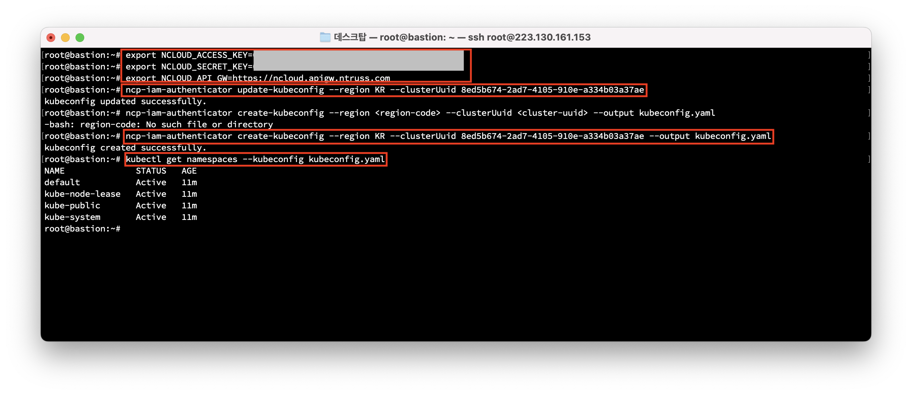


## EFK 설치
## elasticsearch.yaml
```yaml
apiVersion: apps/v1
kind: Deployment
metadata:
  name: elasticsearch
  labels:
    app: elasticsearch
spec:
  replicas: 1
  selector:
    matchLabels:
      app: elasticsearch
  template:
    metadata:
      labels:
        app: elasticsearch
    spec:
      containers:
      - name: elasticsearch
        image: elastic/elasticsearch:7.10.1
        env:
        - name: discovery.type
          value: "single-node"
        ports:
        - containerPort: 9200
        - containerPort: 9300
---
apiVersion: v1
kind: Service
metadata:
  labels:
    app: elasticsearch
  name: elasticsearch
  namespace: default
spec:
  ports:
  - name: elasticsearch-rest
    nodePort: 30482
    port: 9200
    protocol: TCP
    targetPort: 9200
  - name: elasticsearch-nodecom
    nodePort: 30930
    port: 9300
    protocol: TCP
    targetPort: 9300
  selector:
    app: elasticsearch
  type: NodePort
```

## fluntd.yaml
```yaml
# Fluentd를 관리하는 서비스 어카운트 생성
apiVersion: v1
kind: ServiceAccount
metadata:
  name: fluentd
  namespace: default
  labels:
    app: fluentd
---
# 생성한 서비스 어카운트에 권한(Role)생성
apiVersion: rbac.authorization.k8s.io/v1
kind: ClusterRole
metadata:
  name: fluentd
  labels:
    app: fluentd
rules:
  - apiGroups:
      - ""
    resources:
      - pods
      - namespaces
    verbs:
      - get
      - list
      - watch
---
# 권한(Role) 연결
kind: ClusterRoleBinding
apiVersion: rbac.authorization.k8s.io/v1
metadata:
  name: fluentd
roleRef:
  kind: ClusterRole
  name: fluentd
  apiGroup: rbac.authorization.k8s.io
subjects:
  - kind: ServiceAccount
    name: fluentd
    namespace: default
---
# Fluentd 파드를 Daemonset 타입으로 배포
apiVersion: apps/v1
kind: DaemonSet
metadata:
  name: fluentd
  namespace: default
  labels:
    app: fluentd
spec:
  selector:
    matchLabels:
      app: fluentd
  template:
    metadata:
      labels:
        app: fluentd
    spec:
      serviceAccountName: fluentd
      tolerations:
        - key: node-role.kubernetes.io/master
          effect: NoSchedule
      containers:
        - name: fluentd
          image: fluent/fluentd-kubernetes-daemonset:v1.4.2-debian-elasticsearch-1.1
          # Fluentd에 대한 환경변수 설정.
          env:
            - name:  FLUENT_ELASTICSEARCH_HOST
              value: "elasticsearch.efk-stack.svc.cluster.local"
            - name:  FLUENT_ELASTICSEARCH_PORT
              value: "9200"
            - name: FLUENT_ELASTICSEARCH_SCHEME
              value: "http"
            - name: FLUENTD_SYSTEMD_CONF
              value: disable
          resources:
            limits:
              memory: 512Mi
            requests:
              cpu: 100m
              memory: 200Mi
          volumeMounts:
            - name: varlog
              mountPath: /var/log
            - name: varlibdockercontainers
              mountPath: /var/lib/docker/containers
              readOnly: true
      terminationGracePeriodSeconds: 30
      volumes:
        - name: varlog
          hostPath:
            path: /var/log
        - name: varlibdockercontainers
          hostPath:
            path: /var/lib/docker/containers
```

## kibana.yaml
```yaml
# Kibana에 접근가능한 외부 IP 노출
apiVersion: v1
kind: Service
metadata:
  name: kibana
  namespace: default
  labels:
    app: kibana
spec:
  ports:
    - port: 5601
  selector:
    app: kibana
  type: LoadBalancer
---
# Kibana 배포
apiVersion: apps/v1
kind: Deployment
metadata:
  name: kibana
  namespace: default
  labels:
    app: kibana
spec:
  replicas: 1
  selector:
    matchLabels:
      app: kibana
  template:
    metadata:
      labels:
        app: kibana
    spec:
      containers:
        - name: kibana
          image: docker.elastic.co/kibana/kibana:7.10.1
          resources:
            limits:
              cpu: 1000m
            requests:
              cpu: 100m
          env:
            - name: ELASTICSEARCH_HOSTS
              value: http://elasticsearch:9200
          ports:
            - containerPort: 5601
```

```bash
kubectl apply -f elasticsearch.yaml
kubectl apply -f fluntd.yaml
kubectl apply -f kibana.yaml
```

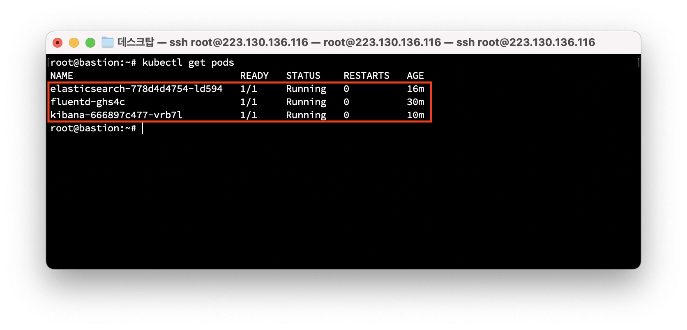

EFK를 모두 생성하면 네이버클라우드 콘솔에서 로드밸런서가 생성된 것을 확인할 수 있다.

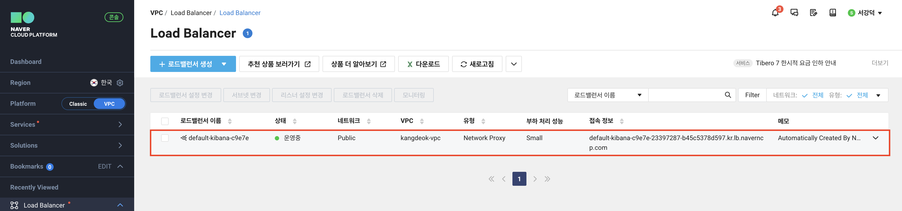

LB의 도메인 혹은 public ip주소 + 키바나의 포트인 5061로 접속

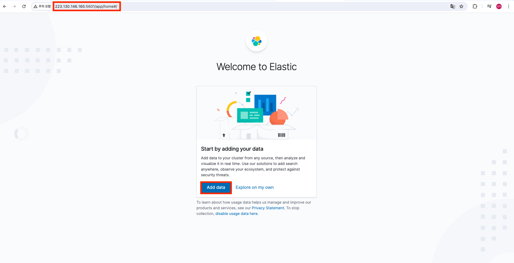

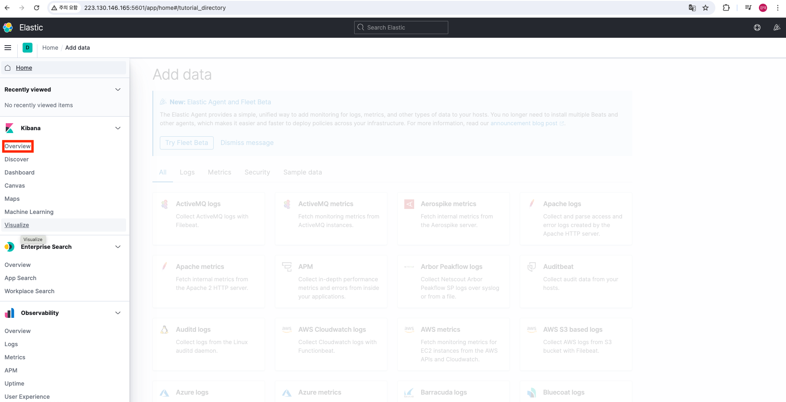

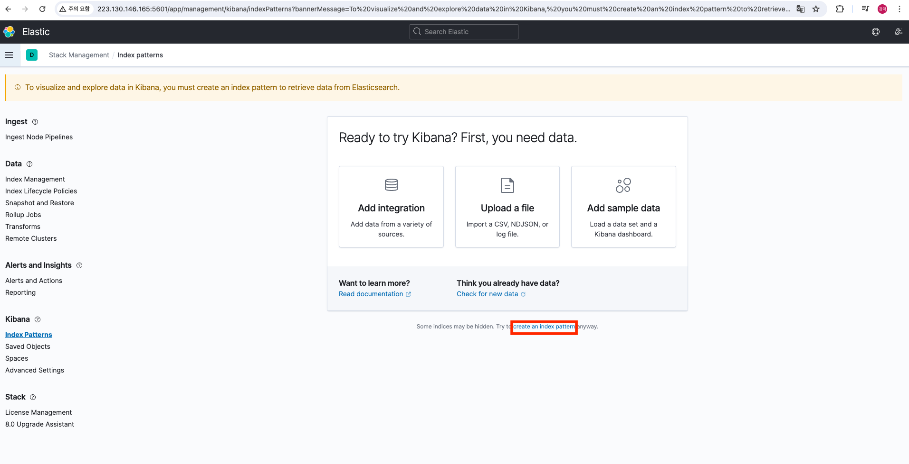

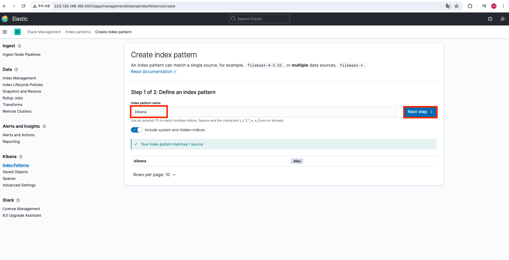

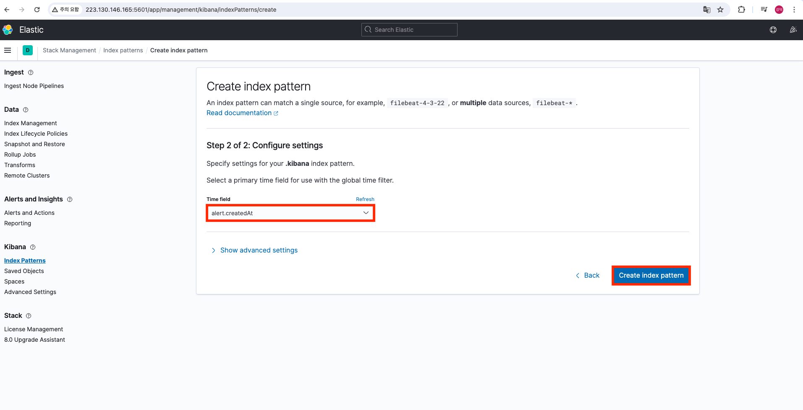

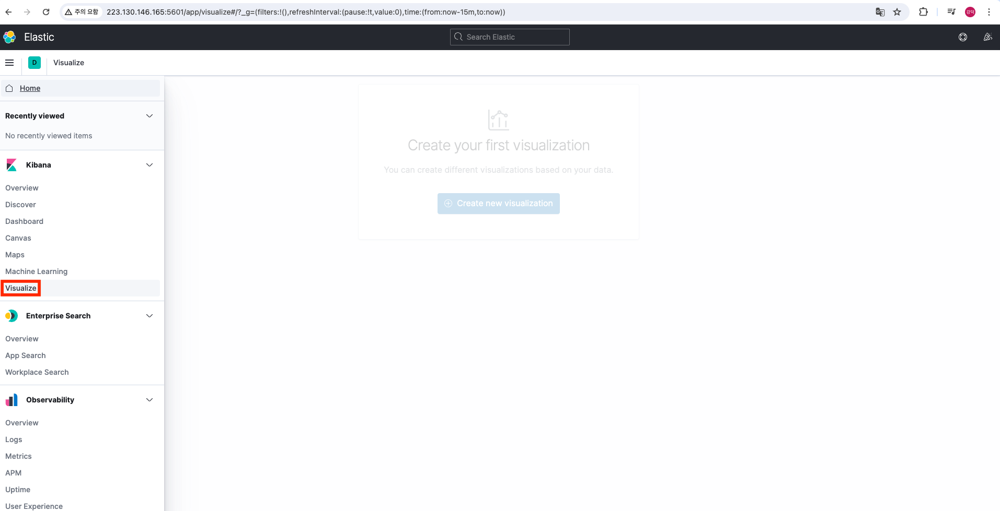

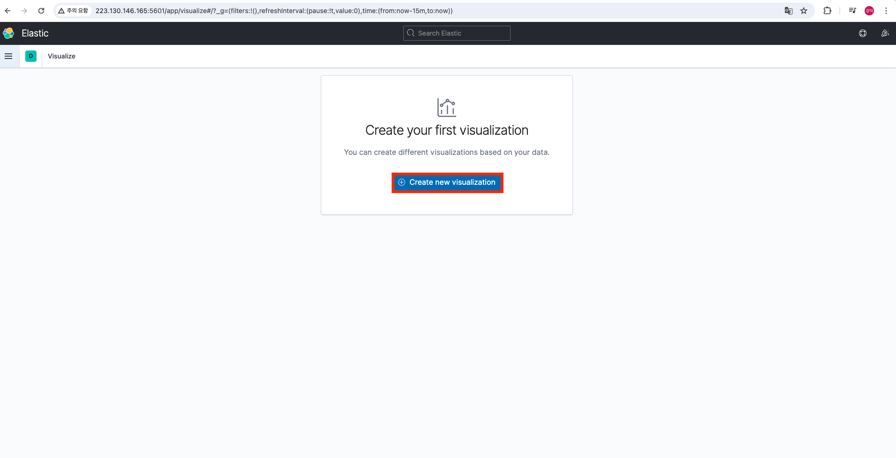


# 출처
이미지와 내용의 출처는 네이버클라우드 강의 (제목: [EFK로 쿠버네티스 로그 수집 및 분석하기](https://www.youtube.com/watch?v=hvkmbQf5uvE))입니다.