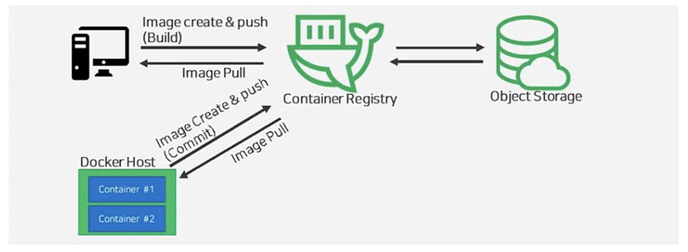
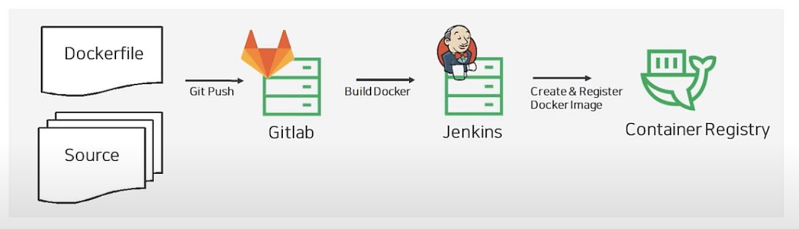

# Container Registry
Container 이미지 저장을 위한 완전 관리형 이미지 저장소

## 특징
- NCP Object Storage 상품과 연동하여 안전하고 확장 가능하며 신뢰할 수 있는 서비스
- Docker Registry API V2 지원을 통해 기존의 Docker CLI 사용 가능
- SubAccount와 Key를 이용한 강력한 접근 제어 제공



# Docker CLI를 통한 Contatiner Image 관리
* Container Registry 로그인
```bash
docker login -u {ACCESS-KEY} -p {SECREY-KEY} {CONTAINER REGISTRY END-POINT}
```

* Cotainer 구동 및 확인
```bash
docker run -d --name {container_name} -p {external port}:{internal port} {image_name}
```

* 이미지 commit
```bash
docker commit {CONTAINER} {REPOSITORY}:{tag}
```

* Container Registry에 이미지 업로드
```bash
docker push {NAME}:{tag}
```

* 이미지 pull
```bash
docker pull {IMAGE}:{tag}
```

# 실습


