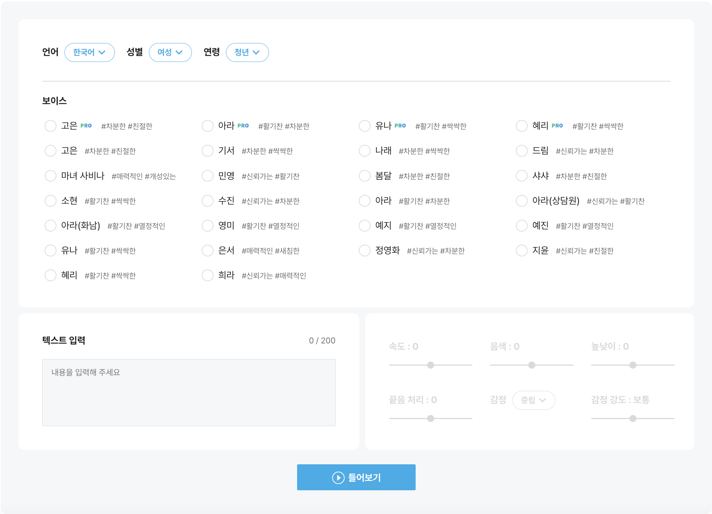
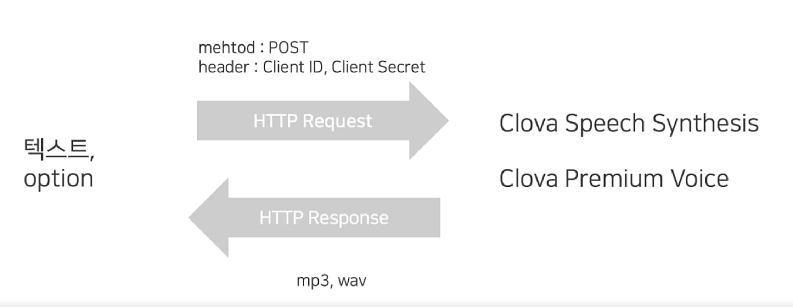
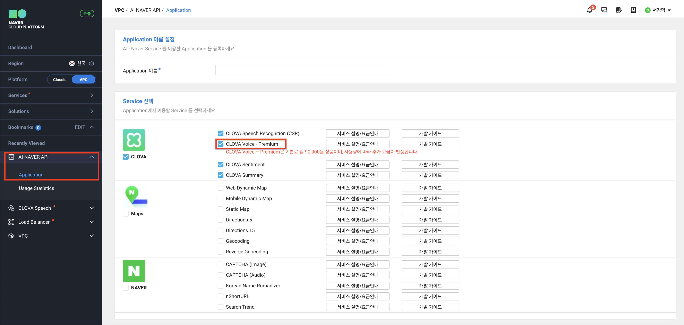

# TTS란?
Text To Speech의 약자로 텍스트를 음성으로 변환시켜주는 `음성합성 서비스`

텍스트를 정확히 인식하고 자연스럽게 읽는 것이 중요
* 음색의 유사성: 목소리 톤이 비슷한가
* 음소의 유사성: 발음이 유사한가
* 준언어적 요소의 유사성: 말소리의 음향적 성질이 유사한가
* 언어적 유사성: 문장 구성 방식이 유사한가
* 언어외적 요소의 유사성: 말하기 습관이 유사한가


# CLOVA Voice
네이버 클라우드 플랫폼은 CLOVA의 AI 기술로 자연스럽고 깨끗한 합성음을 제공하는 CSS(Clova Speech Synthesis)/CPV(Clova Premium Voice) 서비스를 통합하여 `CLOVA Voice` 서비스를 새롭게 출시

* 텍스트를 음성으로 변환
* 자연스러운 합성음
* 총 100가지의 합성음 제공 (2024.4 기준)
* REST API 제공
* 한국어, 영어, 중국어, 일본어, 대만어, 스페인어 제공 (2024.4 기준)



## REST API 지원
HTTP 기반의 REST API 제공

사용자 인증(로그인)이 필요하지 않은 비로그인 Open API



### 요청 헤더

|Header|Description|
|------|-----------|
|X-NCP-APIGW-API-KEY-ID|앱 등록 시 발급받은 `Client ID`|
|X-NCP-APIGW-API-KEY|앱 등록 시 발급 받은 `Client Secret`|
|Content-Type|`application/x-www-form-urlencoded`로 고정|

### 요청 파라미터

|Parameter Name|타입|설명|기본값|필수|
|--------------|---|---|----|---|
|speaker|String|음성 합성에 사용할 목소리 종류|없음|Y|
|text|String|음성 합성할 문장|없음|Y|
|volume|Integer|음성 볼륨|0|N|
|speed|Integer|음성 속도|0|N|
|pitch|Integer|음성 피치|0|N|
|emotion|Integer|음성 감정|0|N|
|emotion-strength|Integer|감정의 강도|1|N|
|format|String|음성 포멧|mp3|N|
|sampling-rate|integer|샘플링 레이트|24000|N|
|alpha|integer|음색|0|N|
|end-pitch|integer|끝음 처리|0|N|

#### 예시
```shell
curl -i -X POST \
	-H "Content-Type:application/x-www-form-urlencoded" \
	-H "X-NCP-APIGW-API-KEY-ID:{애플리케이션 등록 시 발급받은 client id값}" \
	-H "X-NCP-APIGW-API-KEY:{애플리케이션 등록 시 발급받은 client secret값}" \
	-d 'speaker=nara&text=만나서 반갑습니다&volume=0&speed=0&pitch=0&format=mp3' \
 'https://naveropenapi.apigw.ntruss.com/tts-premium/v1/tts'
```
```java
// 네이버 음성합성 Open API 예제
import java.io.*;
import java.net.HttpURLConnection;
import java.net.URL;
import java.net.URLEncoder;
import java.util.Date;

public class APIExamTTS {

    public static void main(String[] args) {
        String clientId = "YOUR_CLIENT_ID";//애플리케이션 클라이언트 아이디값";
        String clientSecret = "YOUR_CLIENT_SECRET";//애플리케이션 클라이언트 시크릿값";
        try {
            String text = URLEncoder.encode("만나서 반갑습니다.", "UTF-8"); // 13자
            String apiURL = "https://naveropenapi.apigw.ntruss.com/tts-premium/v1/tts";
            URL url = new URL(apiURL);
            HttpURLConnection con = (HttpURLConnection)url.openConnection();
            con.setRequestMethod("POST");
            con.setRequestProperty("X-NCP-APIGW-API-KEY-ID", clientId);
            con.setRequestProperty("X-NCP-APIGW-API-KEY", clientSecret);
            
            // post request
            String postParams = "speaker=nara&volume=0&speed=0&pitch=0&format=mp3&text=" + text;
            con.setDoOutput(true);
            DataOutputStream wr = new DataOutputStream(con.getOutputStream());
            wr.writeBytes(postParams);
            wr.flush();
            wr.close();
            int responseCode = con.getResponseCode();
            BufferedReader br;
            
            if(responseCode==200) { // 정상 호출
                InputStream is = con.getInputStream();
                int read = 0;
                byte[] bytes = new byte[1024];
                // 랜덤한 이름으로 mp3 파일 생성
                String tempname = Long.valueOf(new Date().getTime()).toString();
                File f = new File(tempname + ".mp3");
                f.createNewFile();
                OutputStream outputStream = new FileOutputStream(f);
                while ((read =is.read(bytes)) != -1) {
                    outputStream.write(bytes, 0, read);
                }
                is.close();
            } else {  // 오류 발생
                br = new BufferedReader(new InputStreamReader(con.getErrorStream()));
                String inputLine;
                StringBuffer response = new StringBuffer();
                while ((inputLine = br.readLine()) != null) {
                    response.append(inputLine);
                }
                br.close();
                System.out.println(response.toString());
            }
        } catch (Exception e) {
            System.out.println(e);
        }
    }
}
```


### 응답
`MP3` 또는 `WAV` 바이너리 데이터


## Appication 등록
API를 사용하기 위해 네이버클라우드 플랫폼 콘솔에서 애플리케이션을 등록하여 `client id`와 `client secret`을 발급 받아야한다.



# 출처
이미지와 내용의 출처는 네이버클라우드 강의 (제목: [Clova Premium Voice란 무엇일까?](https://www.edwith.org/aincloud/lecture/61677))입니다.