# OCR이란?
Optical Character Recognition의 약자로 광학문자인식 기술

인쇄물 상의 글자와 이미지를 디지털 데이터로 변환해주는 자동 인식 솔루션에 사용

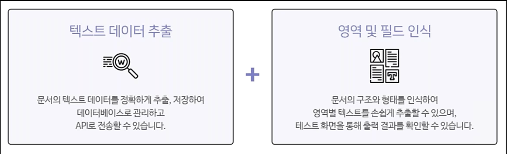

## OCR Builder
정형화된 문서에서 원하는 영역에 대한 어노테이션 필드 설정 후 `key-value` 관계를 추출

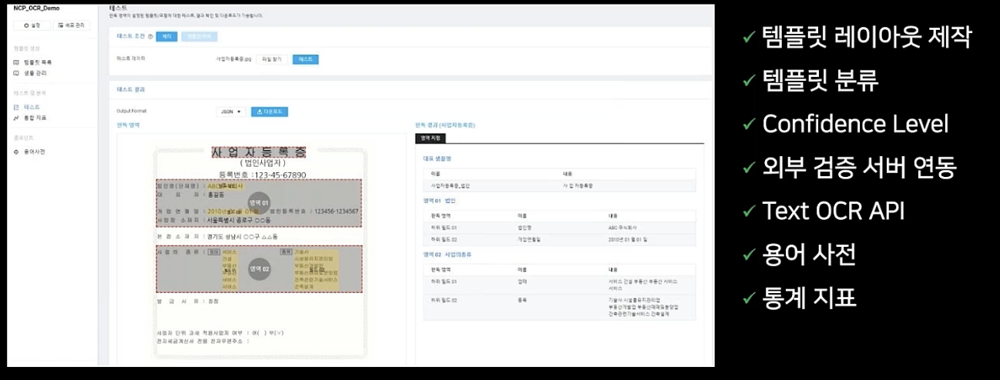

## OCR API
애플리케이션에서 OCR 기능을 호출해서 사용 가능하게 custom API를 제공  
API 게이트워이를 자동 연동하면 APIGW Invoke URL이 나온다. 외부 애플리케이션에서 API Invoke URL를 호출해서 OCR 기능을 사용할 수 있다.

## OCR Process

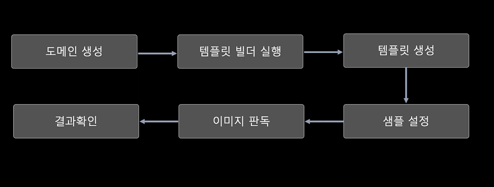
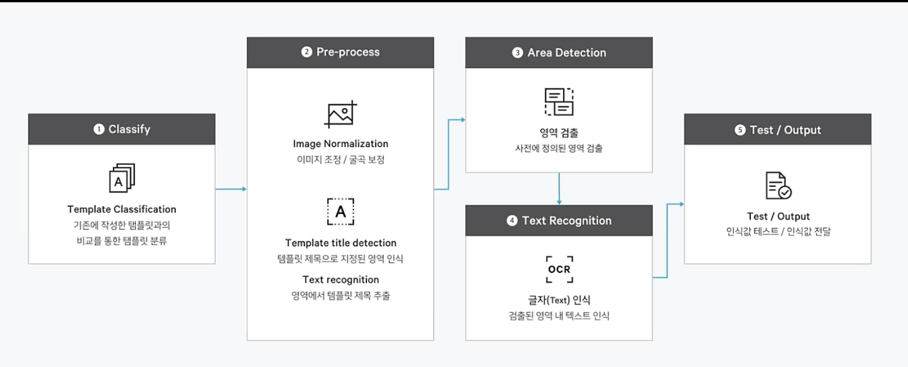

# OCR 실습

## 도메인 생성
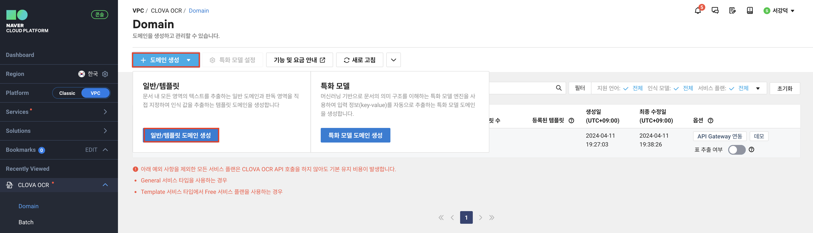

## 테스트를 위한 배포

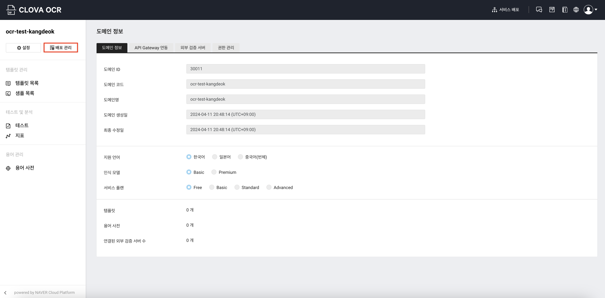
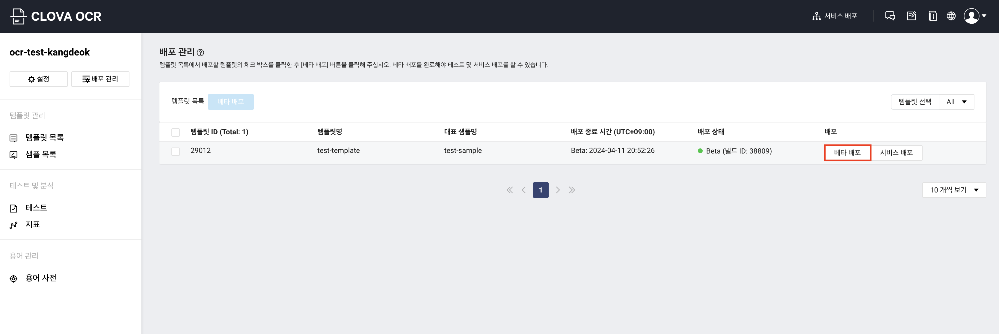

## 템플릿 생성
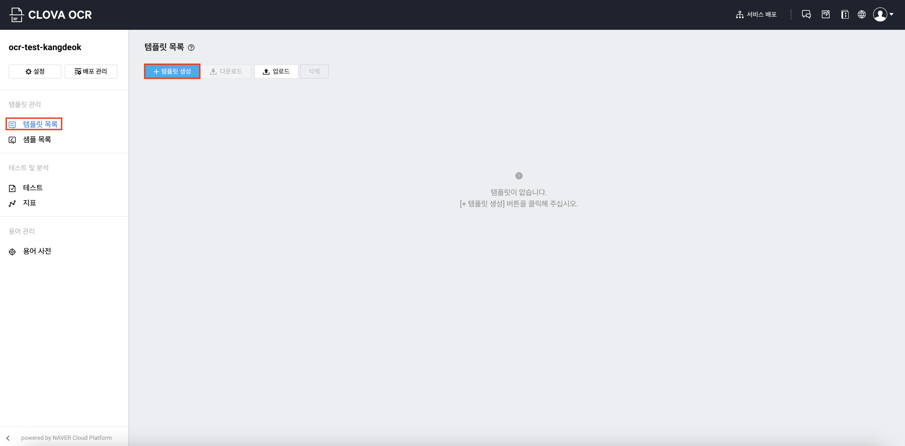
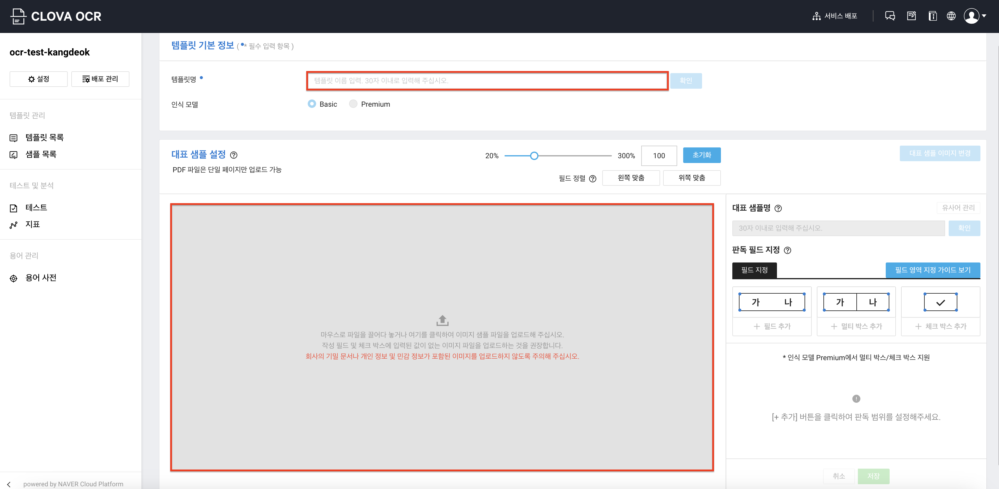
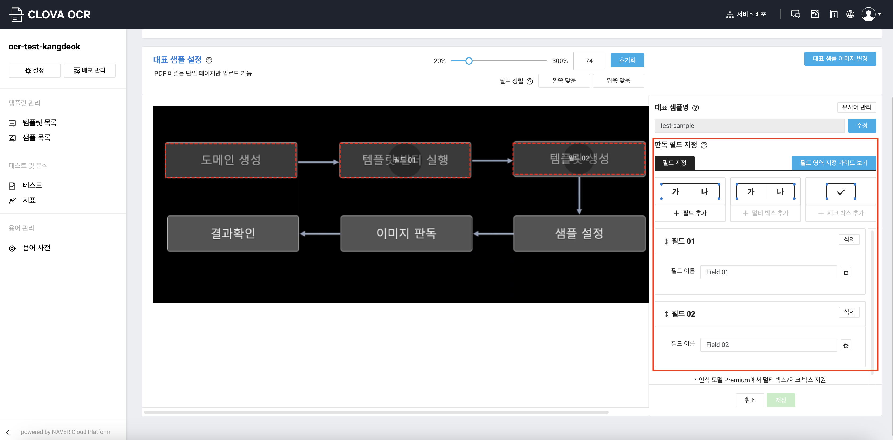

## 테스트
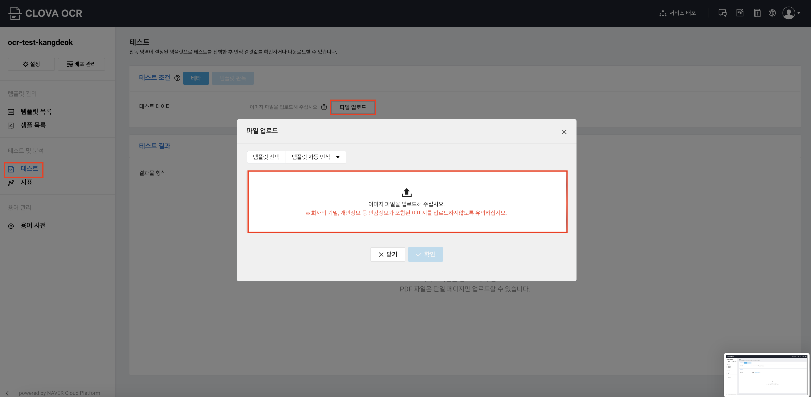
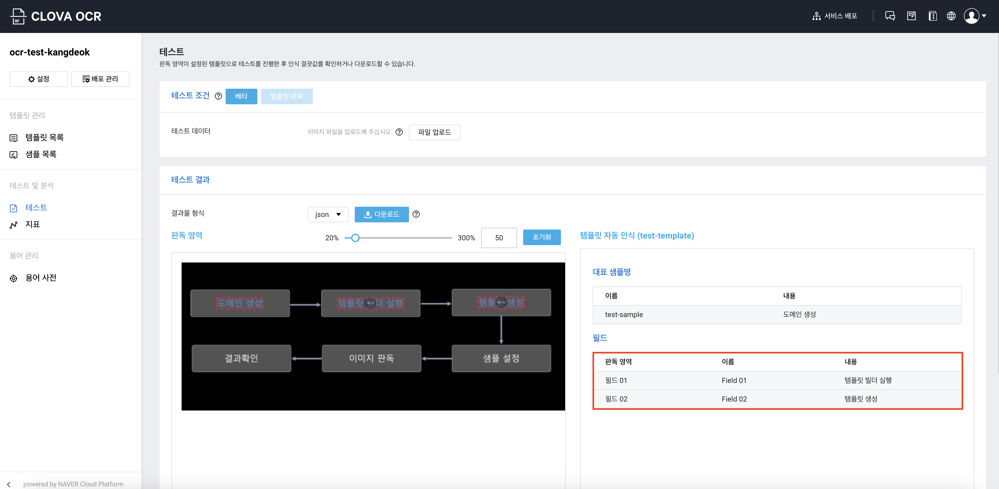

# 출처
이미지와 내용의 출처는 네이버클라우드 강의 (제목: [네이버클라우드플랫폼의 OCR 서비스를 소개합니다.](https://www.edwith.org/aincloud/lecture/61678?isDesc=false))입니다.