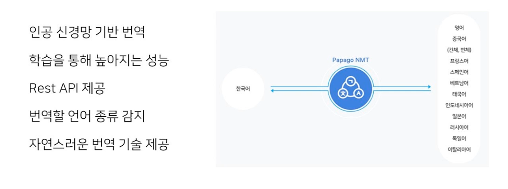
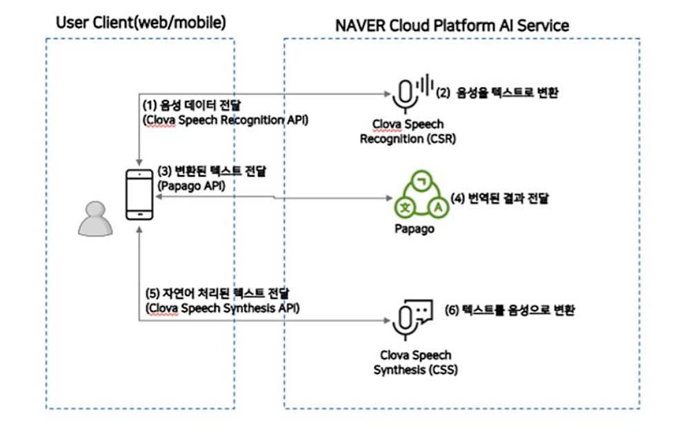
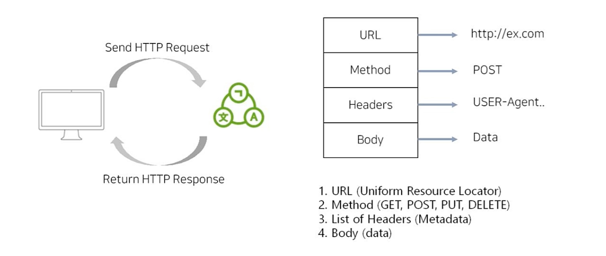
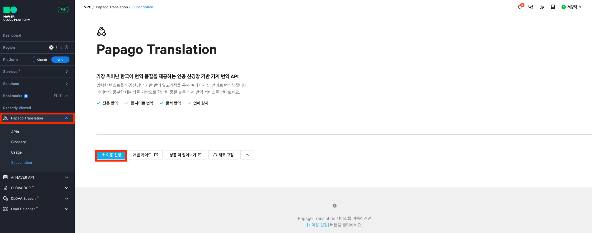
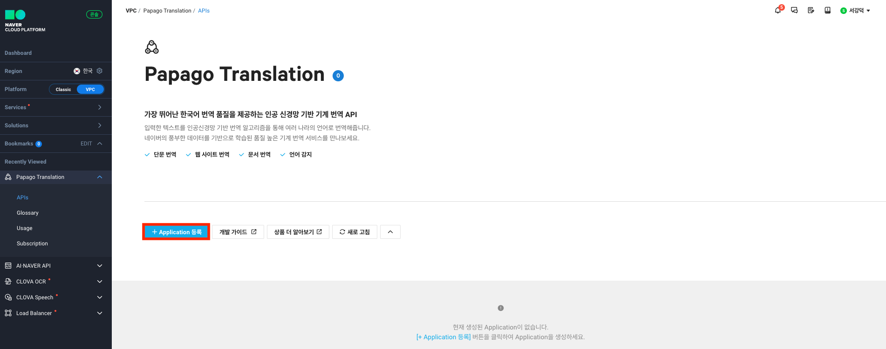
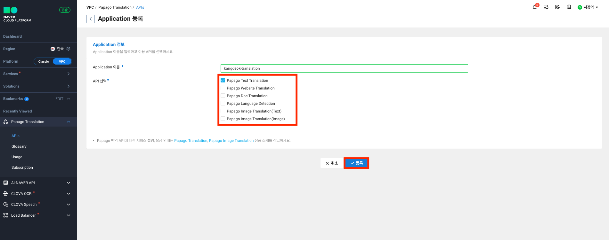
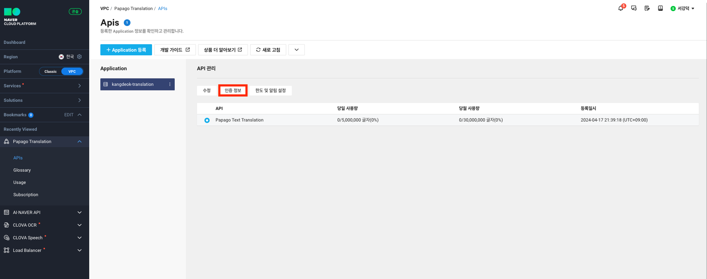
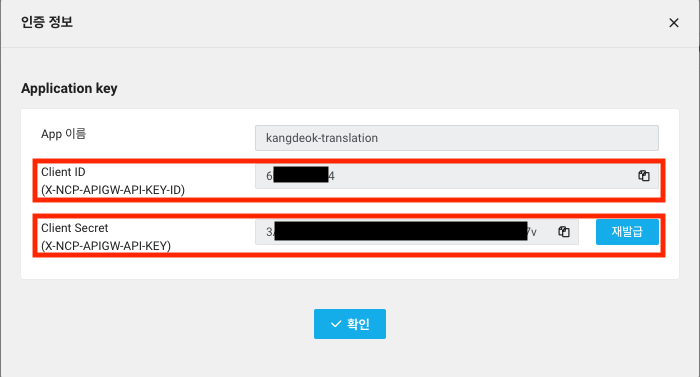
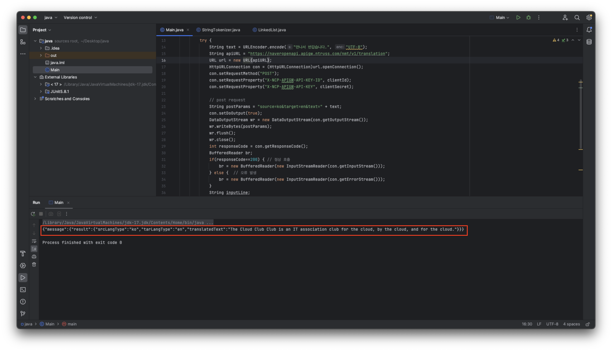

# Papago NMT
파파고 NMT란 네이버에서 개발한 `인공 신경망 기반 번역기술`(Nueral Machine Translatoin)을 의미한다.

입력된 문장을 쪼개지 않고 맥락을 바탕으로 전체 번역이 가능



## 문맥을 이해하는 똑똑한 번역 기술 제공
원문  
`백조` 한 마리가 살았습니다.  

번역  
Once upon a time there lived `100000000000000`.

There lived a `swam`.

번역 기술이 미흡한 번역기는 동물 백조를 숫자 100조로 잘못 번역하는 일이 종종 발생한다.  
파파고 번역은 원문의 문맥을 파악하여 숫자 백조가 아닌 동물 백조로 자연스러운 번역이 가능하다.

## Clova와 연동


## Papago API
REST API 지원



### Request
#### EndPoint & Method

|API 명|메서드|EndPoint URL|Return|
|------|----|------------|------|
|텍스트 번역 API|POST|`https://naveropenapi.apigw.ntruss.com/nmt/v1/translation`|JSON|
|언어감지 API|POST|`https://naveropenapi.apigw.ntruss.com/langs/v1/dect`|JSON|

#### Request Header

|헤더명|설명|
|------|-----------|
|X-NCP-APIGW-API-KEY-ID|앱 등록 시 발급받은 `Client ID`|
|X-NCP-APIGW-API-KEY|앱 등록 시 발급 받은 `Client Secret`|

#### Request Body

| 파라미터       | 타입     | 필수 여부 | 설명                                                                                        |
|--------------|---------|----------|--------------------------------------------------------------------------------------------|
| source       | String  | Y        | 원본 언어(source language)의 언어 코드. auto로 설정 시, 자동으로 소스 언어를 감지                 |
| target       | String  | Y        | 목적 언어(target language)의 언어 코드                                                |
| text         | String  | Y        | 번역할 텍스트                                                                          |
| glossaryKey  | String  | N        | 클라우드 콘솔에서 용어집 기능을 사용하는 경우, 해당 용어집의 glossaryKey에 대응             |
| replaceInfo  | String  | N        | 치환 번역을 지정 (공백 포함)                                                            |


#### 예시

```shell
POST /nmt/v1/translation HTTP/1.1
HOST: naveropenapi.apigw.ntruss.com
User-Agent: curl/7.49.1
Accept: */*
Content-Type: application/x-www-form-urlencoded; charset=UTF-8
X-NCP-APIGW-API-KEY-ID: {애플리케이션 등록 시 발급받은 client id 값}
X-NCP-APIGW-API-KEY: {애플리케이션 등록 시 발급받은 client secret 값}
Content-Length: 51
```


### Response
#### Response Body

| 필드명           | 타입      | 설명              |
|----------------|----------|------------------|
| srcLangType    | string   | 원본 언어 코드     |
| tarLangType    | string   | 번역 결과 언어 코드 |
| translatedText | string   | 번역된 문장        |

#### 예시

```json
{
    "message": {
        "result": {
            "srcLangType": "en",
            "tarLangType": "ko",
            "translatedText": "파파고는 최고의 번역기입니다"
        }
    }
}
```

# Papago API 실습

## 이용 신청
이용 신청하기 버튼 클릭 후 약관 동의


## 어플리케이션 등록
어플리케이션 버튼 클릭


이름과 원하는 기능을 선택 후 등록


인증 정보에서 Client ID와 Secret을 확인



## API 사용
```java
// 네이버 Papago Text Translation API 예제
public class Main {

    public static void main(String[] args) {
        String clientId = "YOUR_CLIENT_ID";//애플리케이션 클라이언트 아이디값";
        String clientSecret = "YOUR_CLIENT_SECRET";//애플리케이션 클라이언트 시크릿값";
        try {
            String text = URLEncoder.encode("클라우드 클럽 동아리는 클라우드의, 클라우드에 의한, 클라우드를 위한 IT 연합 동아리이다.", "UTF-8");
            String apiURL = "https://naveropenapi.apigw.ntruss.com/nmt/v1/translation";
            URL url = new URL(apiURL);
            HttpURLConnection con = (HttpURLConnection)url.openConnection();
            con.setRequestMethod("POST");
            con.setRequestProperty("X-NCP-APIGW-API-KEY-ID", clientId);
            con.setRequestProperty("X-NCP-APIGW-API-KEY", clientSecret);

            // post request
            String postParams = "source=ko&target=en&text=" + text;
            con.setDoOutput(true);
            DataOutputStream wr = new DataOutputStream(con.getOutputStream());
            wr.writeBytes(postParams);
            wr.flush();
            wr.close();
            int responseCode = con.getResponseCode();
            BufferedReader br;
            if(responseCode==200) { // 정상 호출
                br = new BufferedReader(new InputStreamReader(con.getInputStream()));
            } else {  // 오류 발생
                br = new BufferedReader(new InputStreamReader(con.getErrorStream()));
            }
            String inputLine;
            StringBuffer response = new StringBuffer();
            while ((inputLine = br.readLine()) != null) {
                response.append(inputLine);
            }
            br.close();
            System.out.println(response.toString());
        } catch (Exception e) {
            System.out.println(e);
        }
    }
}
```



예제 코드와 자세한 내용은 (제목: [네이버클라우드 플랫폼 API 가이드](https://api.ncloud-docs.com/docs/ai-naver-papagonmt))에서 확인 가능

# 출처
이미지와 내용의 출처는 네이버클라우드 강의 (제목: [Papago API 활용하기](https://chat.openai.com/c/15c520f1-347f-4e8c-b710-207de9cc409d))입니다.