# Cloud Functions
네이버클라우드 플랫폼 Cloud Functions란 코드에만 집중할 수 있는 서버리스 컴퓨팅 서비스

* **서버리스 환경**
  * 서버와 관련된 업무를 하지 않아도 개발자가 원하는 프로그래밍 언어로 코드를 작성하여 Cloud Functions에서 바로 실행 가능하다. 또한 코드를 수정하면 즉시 반영되기 떄문에 개발 속도를 향상 시킬 수 있다.
* **On-demand Execution & Metering**
  * 항상 요청과 동일한 횟수의 코드 실행이 보장되며 요청이 없을 경우 코드가 실행되지 않는다.
  * 실행 요청 횟수와 액션 실행에 걸리는 시간에 따라 요금이 측정되어 효율적인 비용 운영이 가능하다.
* **다양한 연동 선택지**
  * 서버리스 백엔드를 구축하여 웹, 모바일, IoT 등 다양한 API 요청을 처리할 수 있고, 코드 엔드포인트가 노출되지 않게 Gateway를 연동하여 MSA 구축이 가능하다.
  * 네이버클라우드 플랫폼의 다양한 서비스와 연동하여 리소스에 접근할 수 있다.

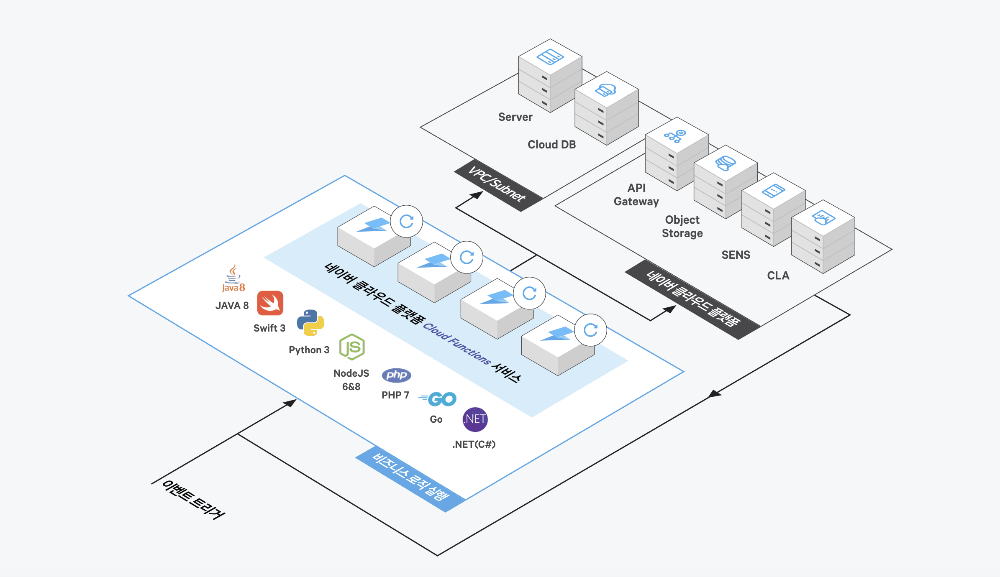

# VOD Station
네이버클라우드 플랫폼 VOD Station이란 한 번에 처리하는 원스톱 VOD 서비스

* **한 번에 처리하는 인코딩과 송출**
  * 여러 가지 서비스를 고민할 필요 없이 VOD Station으로 인코딩과 송출을 한 번에 처리할 수 있다.
* **영상 속성에 따른 합리적인 요금 계산**
  * 작한 영상의 길이와 코딩 후 변환된 해상도에 따라 책정된 요금을 지불한다.
* **고품질 스트리밍**
  * 시청 환경을 고려해 영상을 패키지화 하고 HTTP 라이브 스트리밍(HLS) 형식으로 송출하는 안정적인 스트리밍을 지원한다.
* **간편한 CDN 생성**
  * VOD 스트리밍 서비스에 최적화된 CDN을 간편하게 생성하고 사용할 수 있도록 CDN 선택 옵션을 제공한다.
* **서비스 간 유연한 연동**
  * 인코딩, 보안, 비디오 플레이어 등 VOD 서비스에 필요한 서비스끼리 유연하게 연동할 수 있는 환경을 제공한다.


# 시나리오
1. 사용자가 동영상 업로드
2. 업로드 된 동영상을 네이버클라우드 `Object Storage`에 저장
3. `Cloud Functions`에서 파일 업로드를 감지해 `VOD Station` 실행
4. `VOD Station`에서 원본 파일을 인코딩하여 Object Storage에 저장
5. 사용자는 비디오 플레이어 서비스 `Video Player`에서 접속 환경에 따라 최적의 화질로 시청

## 실습 환경 셋팅
실습을 하기 위해서 VPC 1개, Private Subnet 1개, Object Storage bucket 2개가 필요하다.

### VPC 및 서브넷 설정

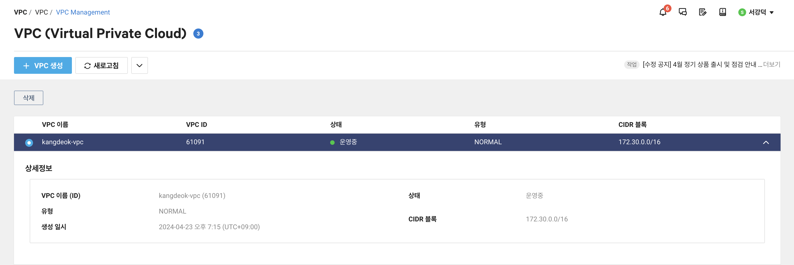

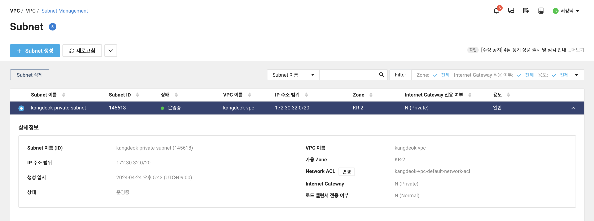

> ❗️서브넷은 `KR-2`로 생성


### Object Storage 생성
업로드 용 bucket과 인코딩 된 영상을 저장하기 위한 bucket 두개를 준비

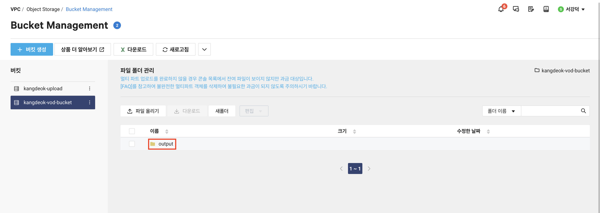

## VOD Station 설정
### Category 생성
카테고리에서 인코딩 할 화질을 선택하고 인코딩 된 파일을 저장할 경로를 설정할 수 있다.

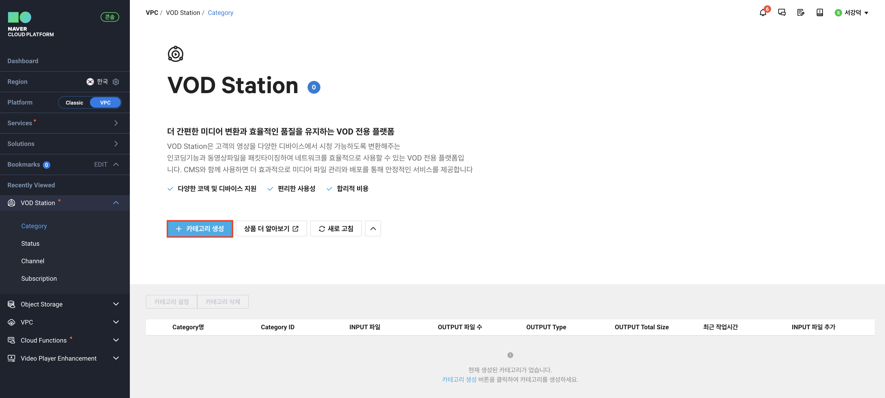

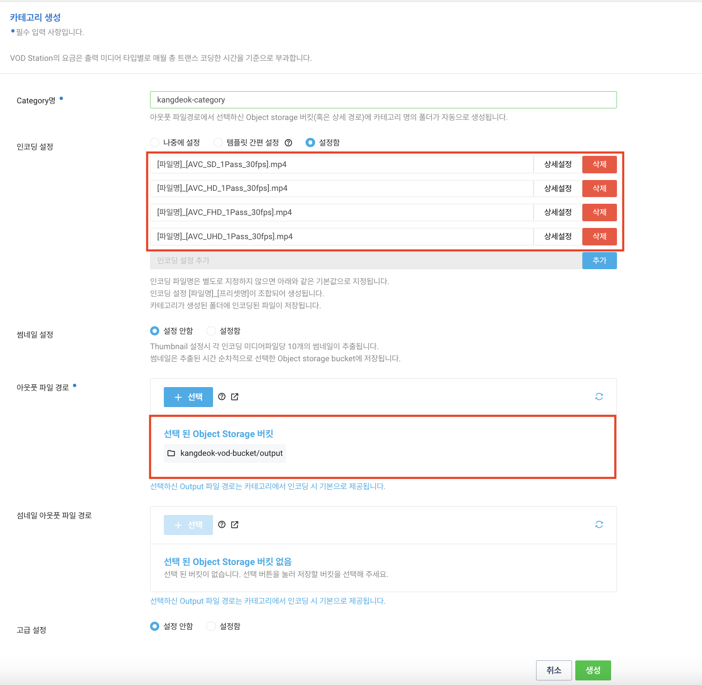


### Global Edge 생성
CDN 서비스를 이용하기 위해서 Global Edge Profile를 생성해야한다.

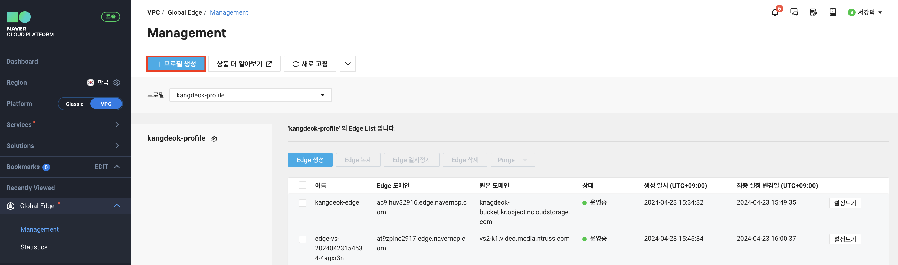

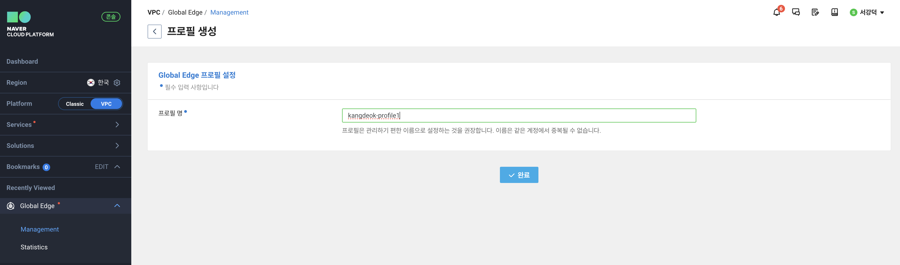

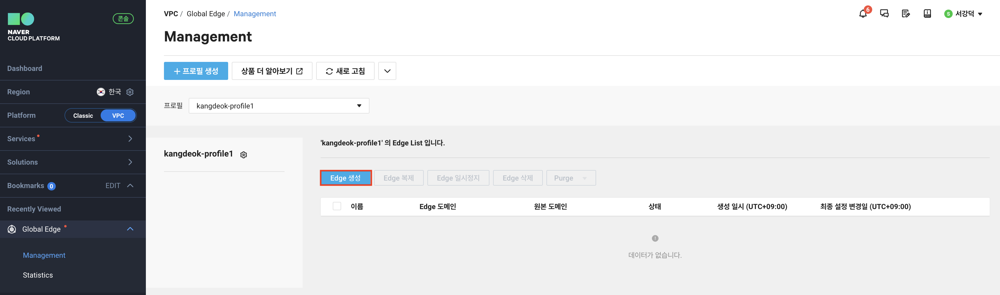

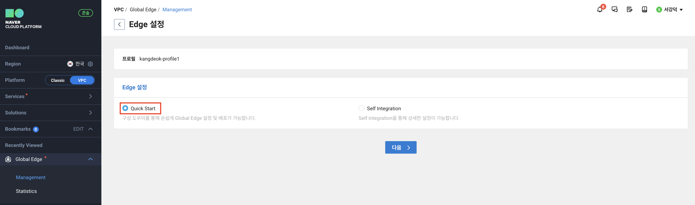

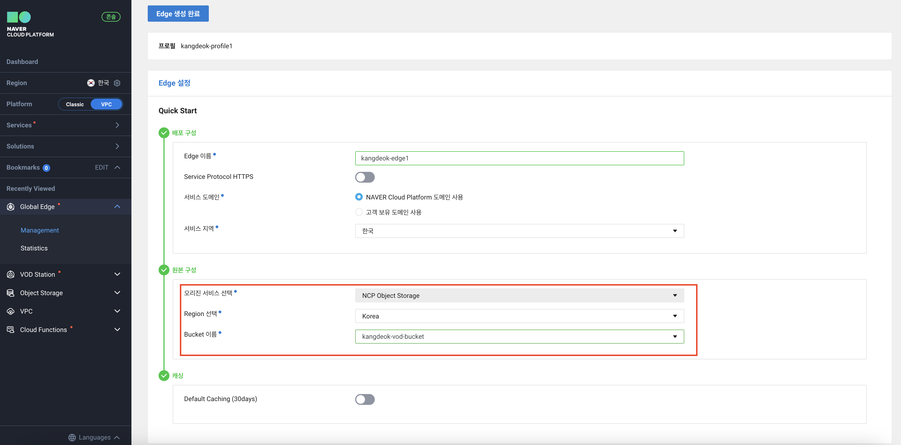

### Channel 생성
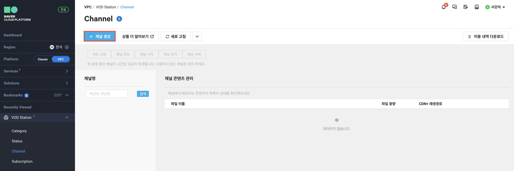

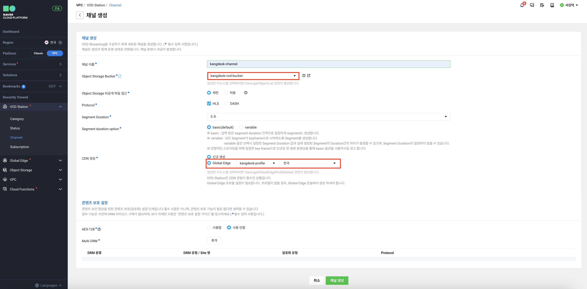

## Cloud Functions 설정
### Trigger 생성
Object Storage에 파일이 업로드 되는걸 감지하기 위해 트리거가 필요하다.

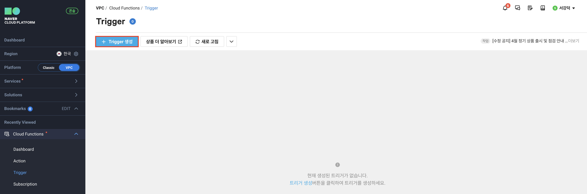

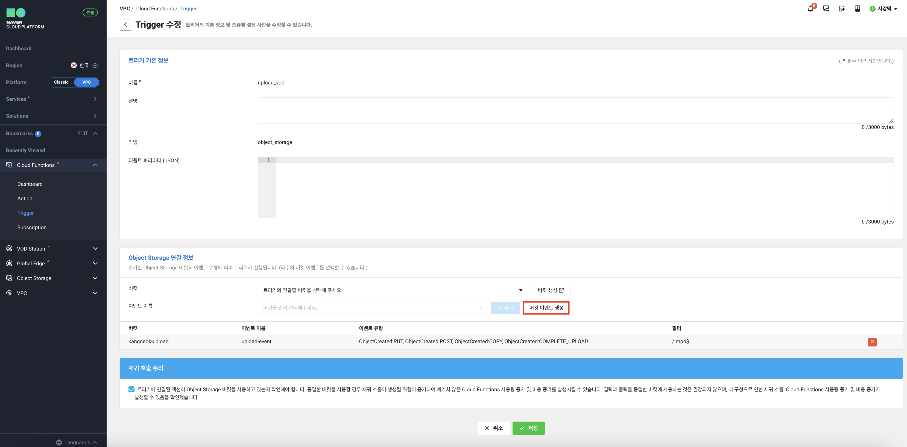

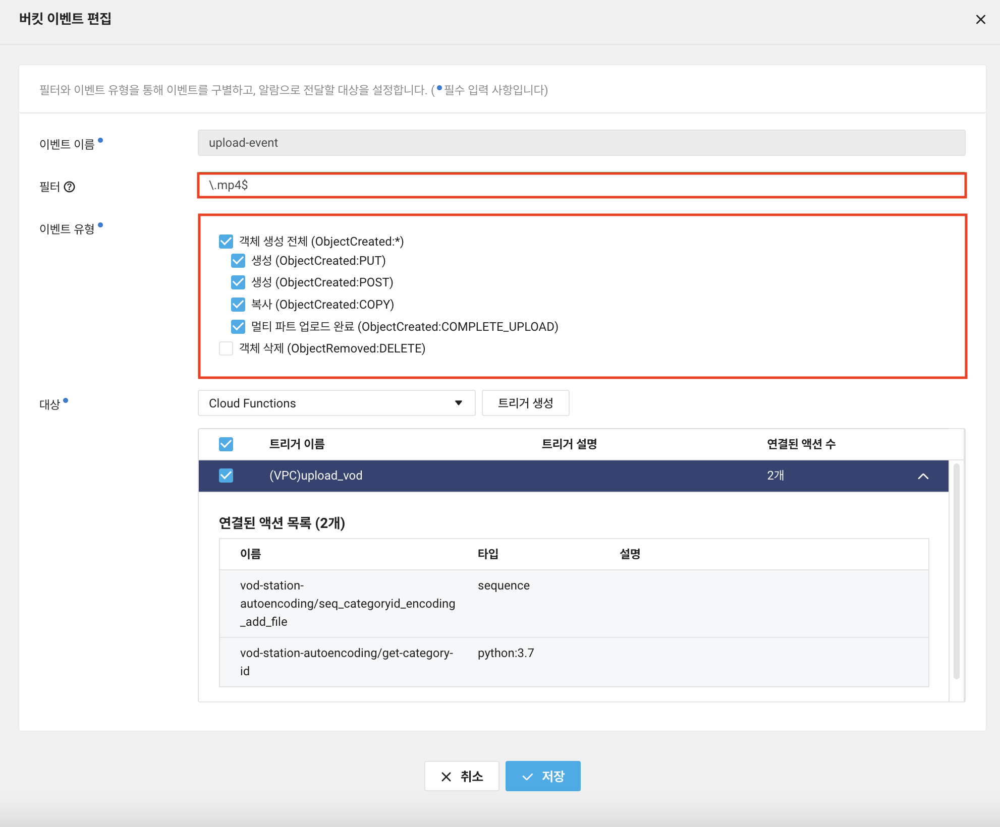

### Package 생성
Cloud Function에서 수행되는 작업을 하나로 묶어서 실행 가능하다.

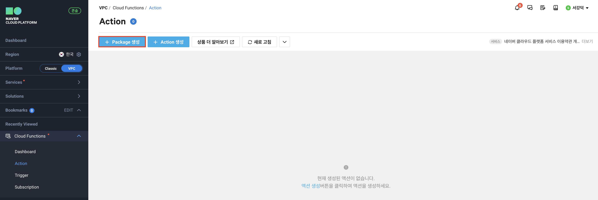

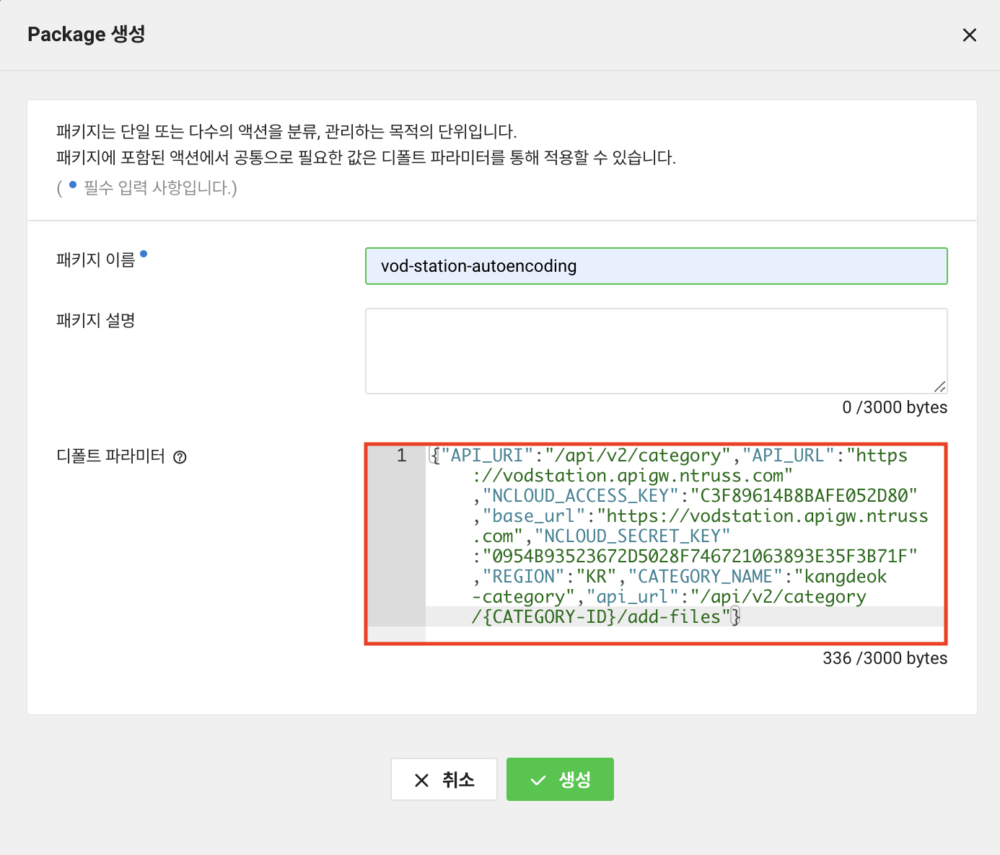

디폴트 파라미터
```json
{
  "API_URL":"https://vodstation.apigw.ntruss.com",
  "NCLOUD_ACCESS_KEY":"{사용자 access key}",
  "NCLOUD_SECRET_KEY":"{사용자 secret key}",
  "REGION":"KR",
}
```

### Action 생성
#### 카테고리 id 가져오기
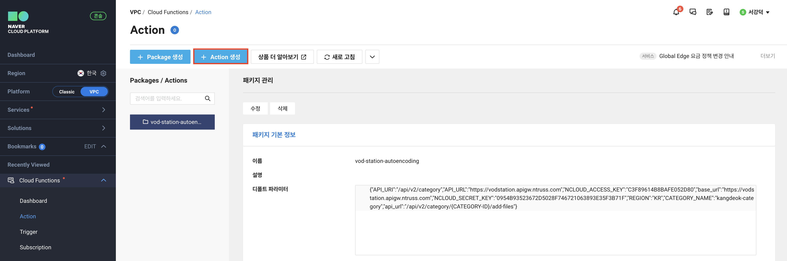

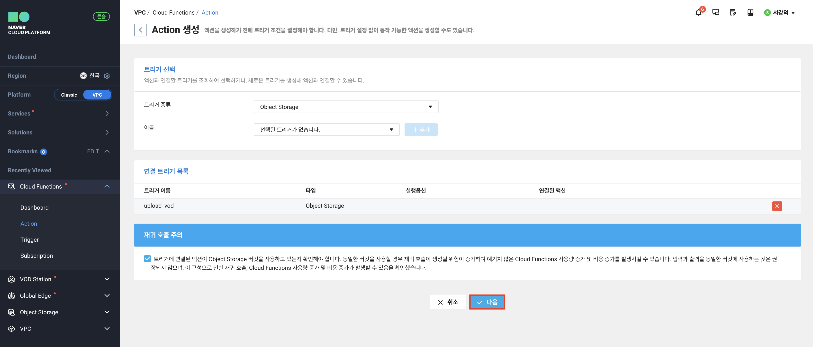
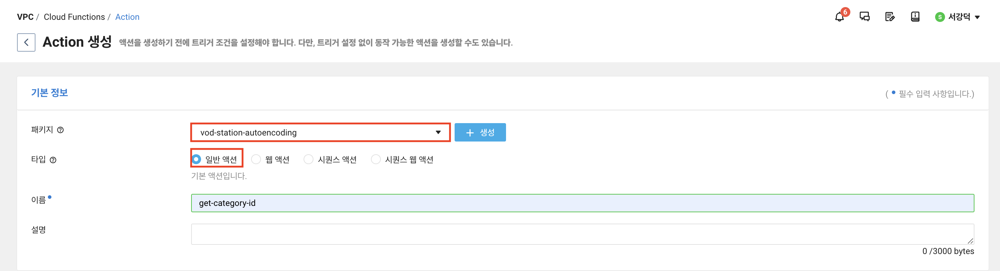
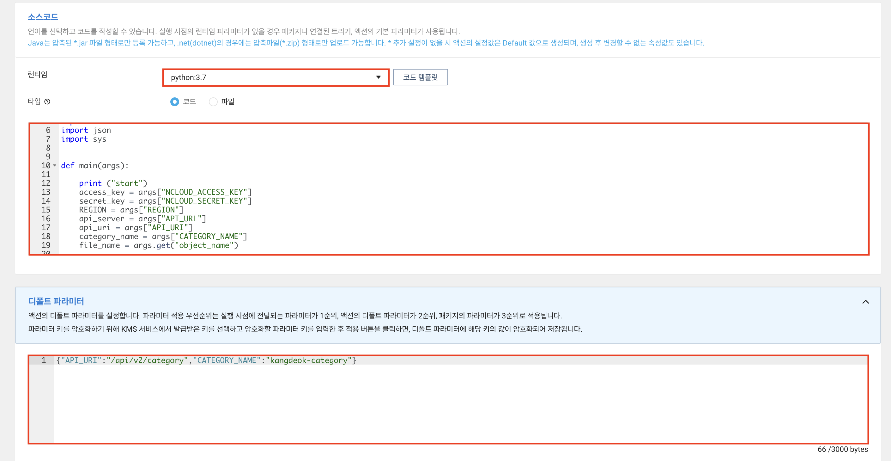

소스코드
```python
import hashlib
import hmac
import base64
import requests
import time
import json
import sys

 
def main(args):
     
    print ("start")
    access_key = args["NCLOUD_ACCESS_KEY"]
    secret_key = args["NCLOUD_SECRET_KEY"]
    REGION = args["REGION"]
    api_server = args["API_URL"]
    api_uri = args["API_URI"]
    category_name = args["CATEGORY_NAME"]
    file_name = args.get("object_name")
     
    timestamp = int(time.time() * 1000)
    timestamp = str(timestamp)
 
    secret_key = bytes(secret_key, 'UTF-8')
 
    method = "GET"
    uri = api_uri + "?pageNo=1&pageSizeNo=1"
       
    message = method + " " + uri + "\n" + timestamp + "\n" + access_key
    message = bytes(message, 'UTF-8')
    signingKey = base64.b64encode(hmac.new(secret_key, message, digestmod=hashlib.sha256).digest())
     
    http_header = {
            'x-ncp-apigw-signature-v2': signingKey,
            'x-ncp-apigw-timestamp': timestamp,
            'x-ncp-iam-access-key': access_key,
            'X-NCP-REGION_CODE': "KR",
            'cache-control': "no-cache",
            'pragma': 'no-cache',
            'Content-Type': 'application/json'
            }
 
    response = requests.get(api_server + uri, headers=http_header)
    data = json.loads(response.text)
     
    for i in data['content']:
        category_id = str(i["id"])
        #print("Category_ID : " + category_id)
        #print("file_name : " + file_name)
  
    return {"category_id" : category_id, "file_name" : file_name}
```

디폴트 파라미터
```json
{
  "API_URI":"/api/v2/category",
  "CATEGORY_NAME":"{생성한 카테고리 이름}"
}
```

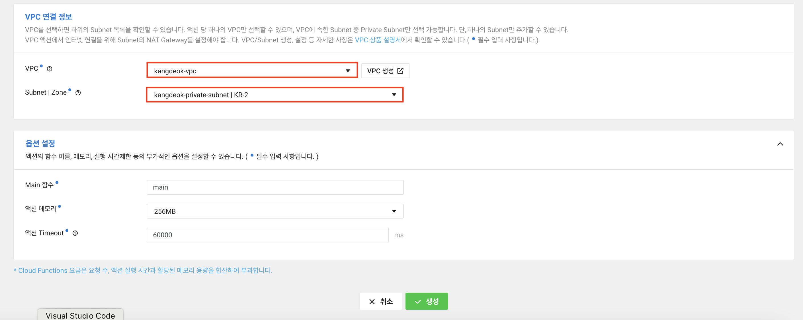


#### 파일 인코딩

> ❗️ 트리거를 설정 없이 생성

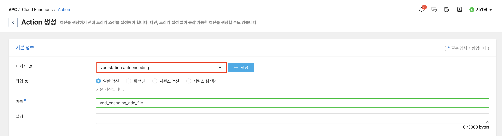
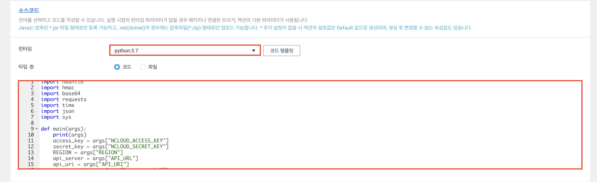

소스코드
```python
import hashlib
import hmac
import base64
import requests
import time
import json
import sys
 
def main(args):
    print(args)
    access_key = args["NCLOUD_ACCESS_KEY"]
    secret_key = args["NCLOUD_SECRET_KEY"]
    REGION = args["REGION"]
    api_server = args["API_URL"]
    api_uri = args["API_URI"]
    category_id = str(args["category_id"])
    file_name = args["file_name"]
    content_type="application/json"
    #print ("Category_ID : " + category_id)
     
    api_uri = api_uri.replace("{category_id}",category_id)
    #print ("api_uri : " + api_uri)
     
     
    timestamp = int(time.time() * 1000)
    timestamp = str(timestamp)
    secret_key = bytes(secret_key, 'UTF-8')
    method = "PUT"
 
    message = method + " " + api_uri + "\n" + timestamp + "\n" + access_key
    message = bytes(message, 'UTF-8')
    signingKey = base64.b64encode(hmac.new(secret_key, message, digestmod=hashlib.sha256).digest())
     
    http_header = {
            'x-ncp-apigw-signature-v2': signingKey,
            'x-ncp-apigw-timestamp': timestamp,
            'x-ncp-iam-access-key': access_key,
            'x-ncp-region_code':'KR',
            'accept':'application/json; charset=utf-8',
            'Content-Type':'application/json; charset=utf-8'
            }
    
    body = {
            "bucketName": "kangdeok-upload",
            "pathList": [
            file_name
            ],
            "notificationUrl" : "https://nkvn154klb.apigw.ntruss.com/vod-addfile-callback/V1/RQwMorEEXA" #콜백 URL 정의
        }
         
    response = requests.put(api_server + api_uri, headers = http_header, json = body)
 
    data = json.loads(response.text)
    #print (data)
     
    return data
```

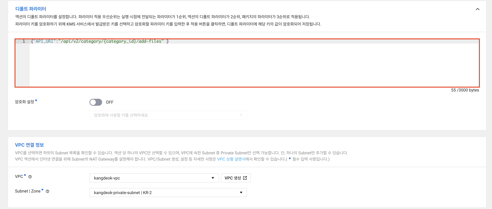

디폴트 파라미터
```json
{
  "API_URI":"/api/v2/category/{category_id}/add-files" 
}
```

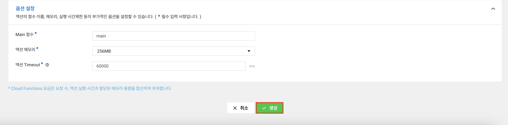

### 실행 순서 설정
두개의 액션의 순서를 설정한다.

> ❗️ 트리거 설정해야 함

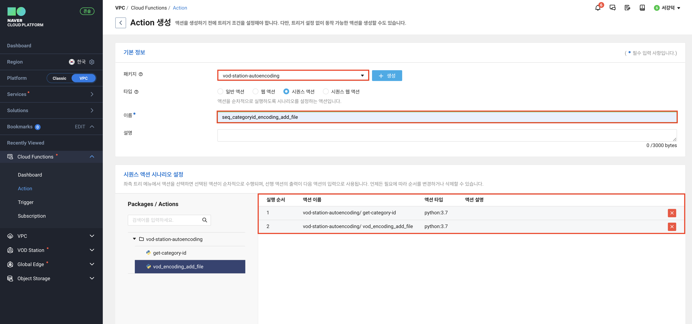


## 결과 확인

1. mp4 파일을 Object Storage에 업로드 한다.
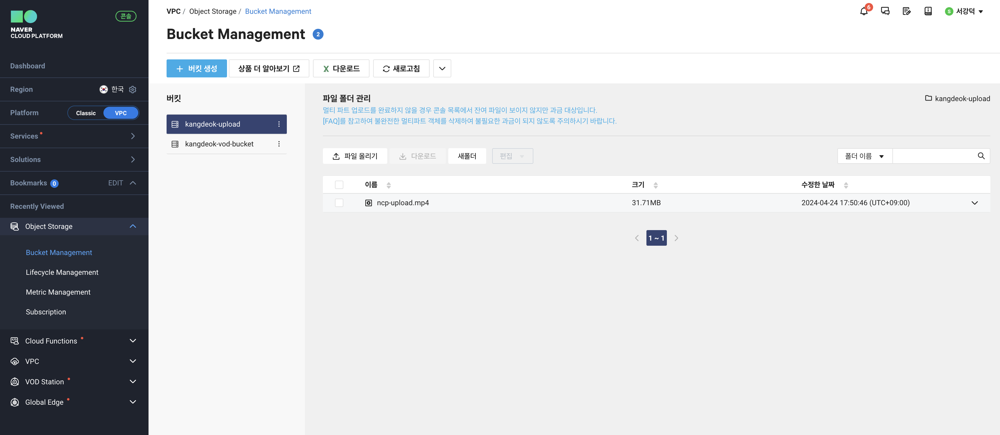

2. trigger 동작 확인
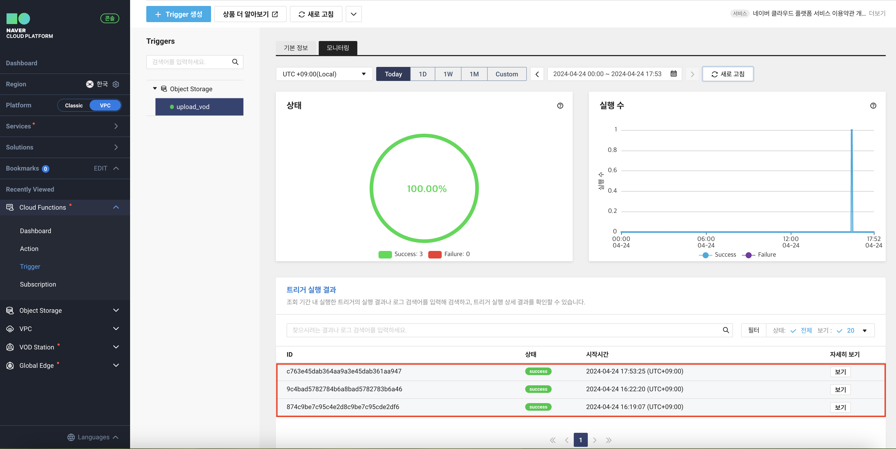

3. cloud functions 실행 확인
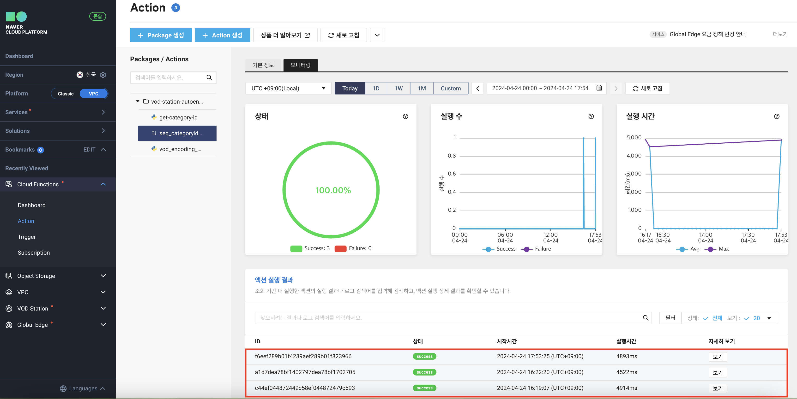

4. vod station 동작 확인
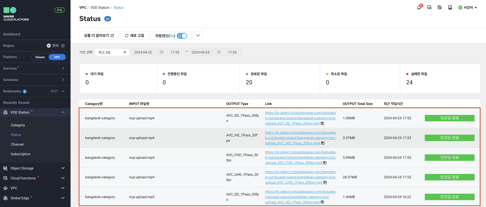

5. 인코딩 파일 확인
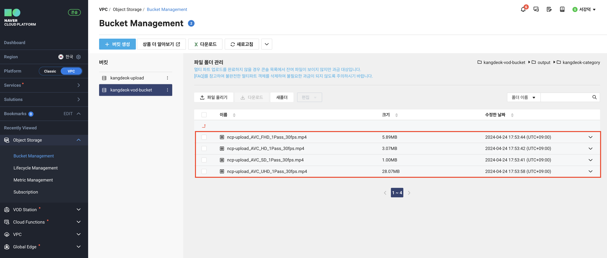

# 출처
이미지와 내용의 출처는 네이버클라우드 블로그 (제목: [동영상 서비스 자동화 하기](https://blog.naver.com/n_cloudplatform/223003916024))입니다.
