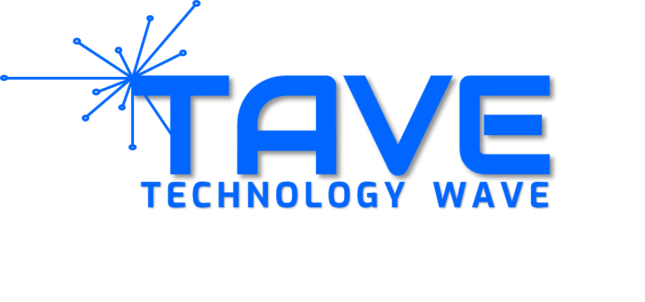

## 개요

4차산업 혁명 동아리 `TAVE` 9기 앱 프로젝트 1팀으로 진행한 식물 관리 어플.  
물 주기 알림, 식물에 대한 일기, SNS와 같은 일기 공유 서비스  

## 사용기술

 
 

## 내가 맡은 부분 - Spring Boot server 구축
### 회원가입
* 회원 아이디, 비밀번호, 이메일, 프로필 사진으로 가입 ✔️
* 비밀번호 확인
* 이메일 인증 🔜

### 로그인
* ID/PW 입력 ✔️
* JWT 토큰 발급 ✔️
* 아이디 찾기
* 비밀번호 재설정

