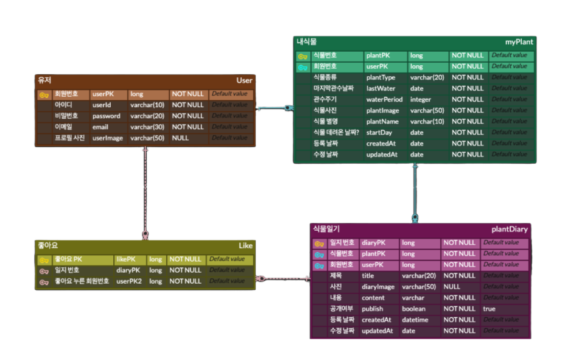
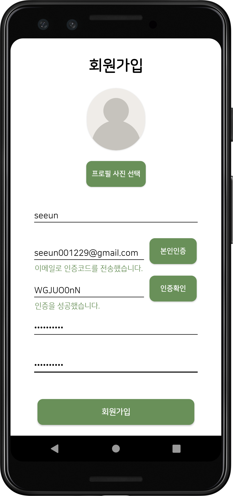
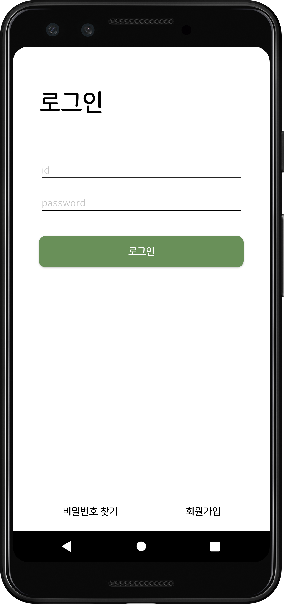
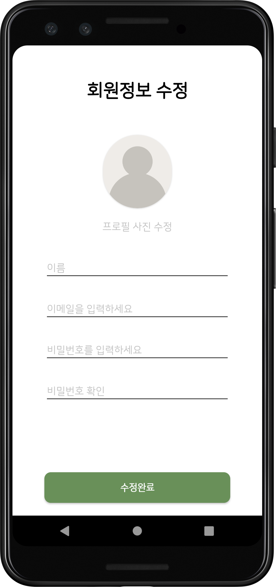
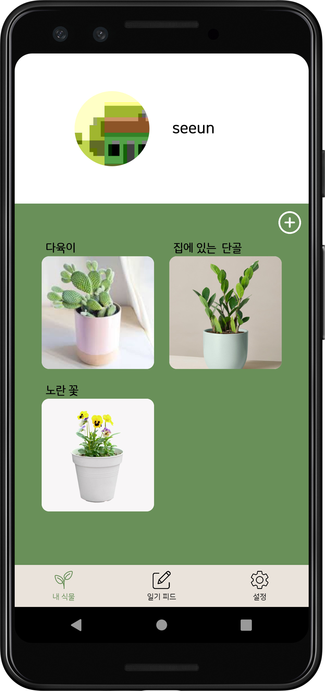
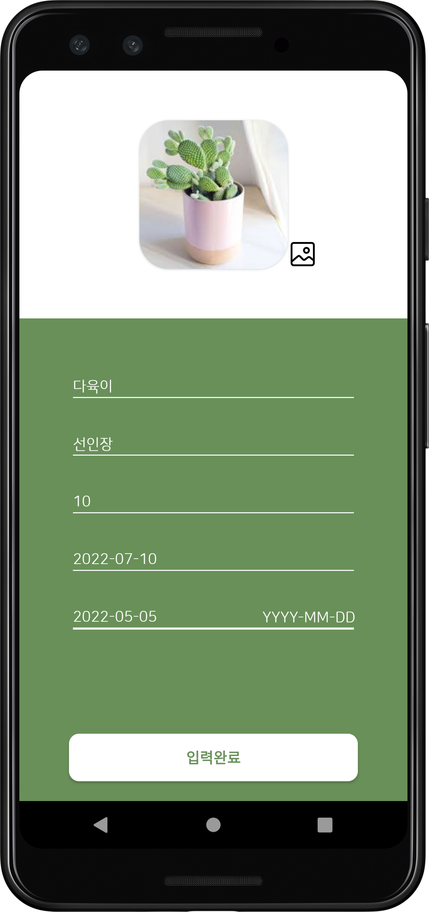
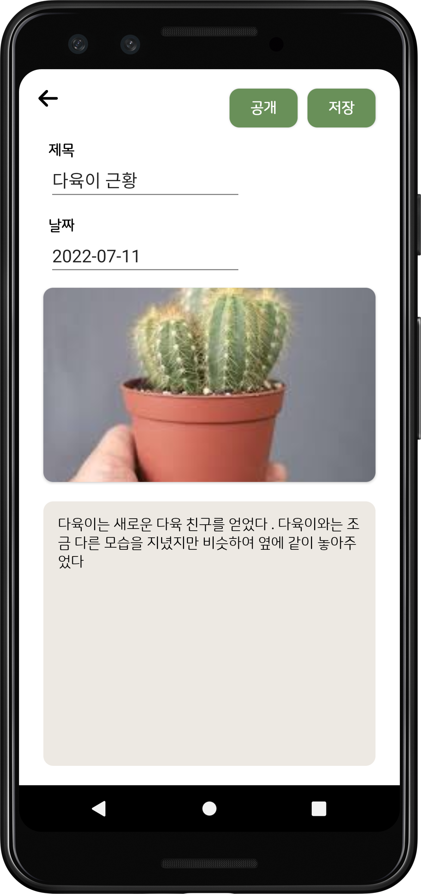
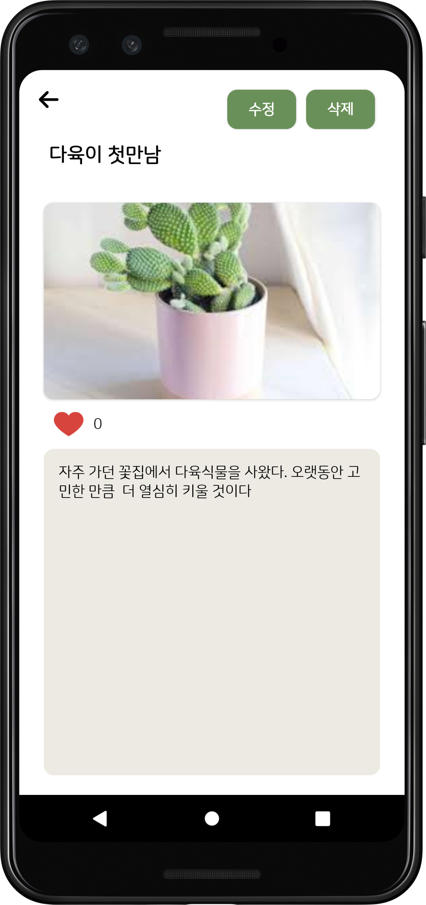

## 개요

4차산업 혁명 동아리 `TAVE` 9기 앱 프로젝트 1팀으로 진행한 식물 관리 어플.  
물 주기 알림, 식물에 대한 일기, SNS와 같은 일기 공유 서비스  

## 사용기술

 
 

## 내가 맡은 부분 - Spring Boot server 구축
### 회원가입
* 회원 아이디, 비밀번호, 이메일, 프로필 사진으로 가입 ✔️
* 비밀번호 확인 ✔️
* 이메일 인증 ✔️
* 아이디 중복 확인 ✔️

### 로그인
* ID/PW 입력 ✔️
* JWT 토큰 발급 ✔️
* 아이디 찾기 ✔️
* 비밀번호 재설정 ✔️
* 이메일로 임시 비밀번호 발급 ✔️

### 회원 정보 수정
* 회원 아이디 변경 ✔️
* 회원 이미지 변경 ✔️

### AWS 배포
* EC2 생성 ✔️
* RDS 연결 ✔️
* 배포 ✔️

## ERD 다이어그램

## 화면 구성

|회원가입|로그인|회원정보 수정|
|:----:|:--:|:-------:|
||||

|내 식물 리스트|내 식물 추가|내 식물 일기 추가|
|:----:|:--:|:-------:|
||||

|식물 피드|내 식물 일기|일기 상세보기|
|:----:|:--:|:-------:|
||||

## 느낀점
스프링으로 하는 첫 프로젝트이자 협업 또한 처음으로 진행했다. 특히 github로 Pull request를 처음 사용해봐서 협업에서 어떻게 깃허브를 쓰는지 많이 배웠다. 스프링 부트로 Rest API 서버를 구현하는 과정에서 생각하지 못한 예외사항이나 고려사항, 오류가 너무 많이 나왔지만 팀원들이 내가 생각하지 못한 해결책을 떠올려서 나는 아직 많이 부족하다고 느꼈다. 또한 Swagger, JWT, SMTP 등 처음 사용해 보는 기술도 적용시킨게 정말 좋았다. 앞으로 `리펙토링`, `클린 코드`, `테스트 주도 개발`에 대해서 알아야겠다.

## 코드

