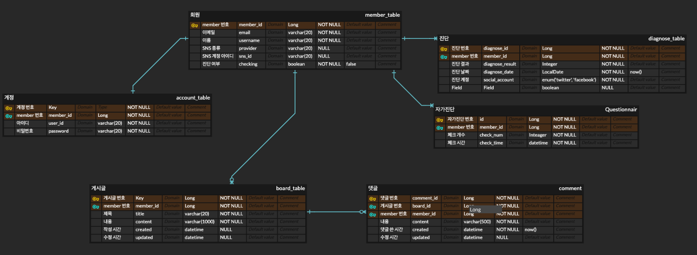
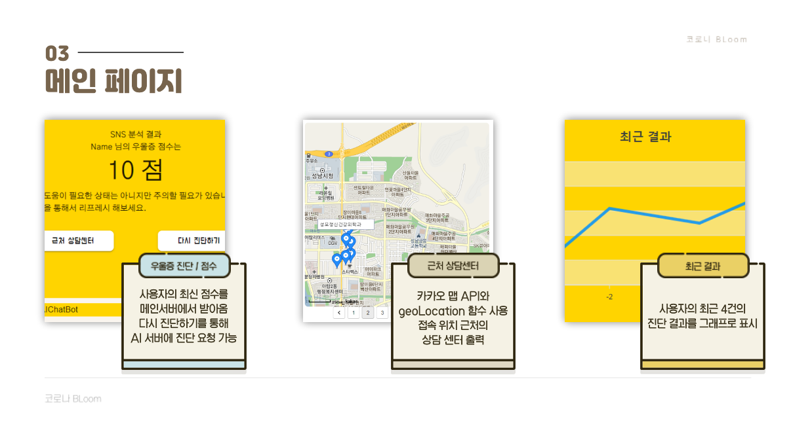
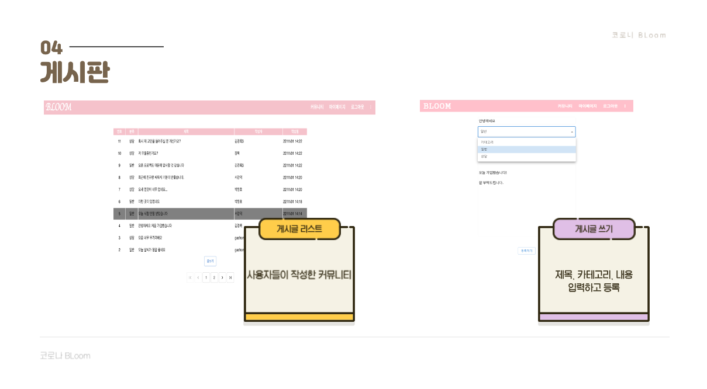
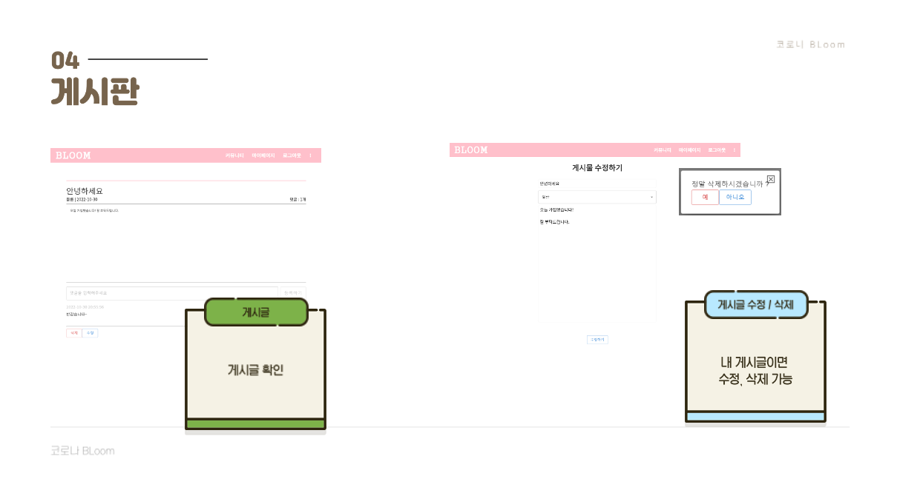
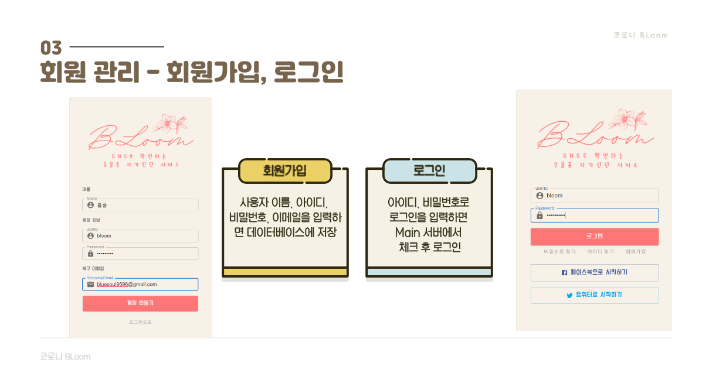
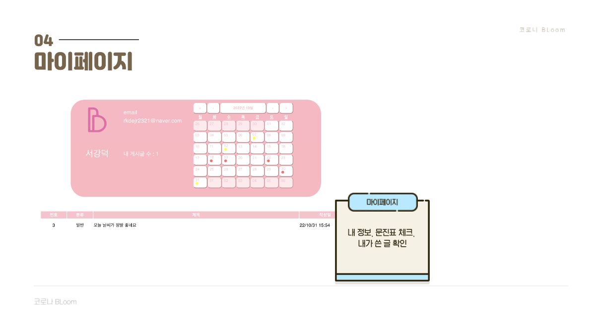
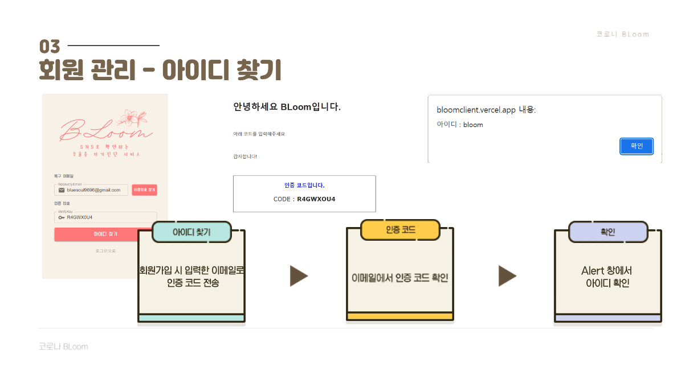
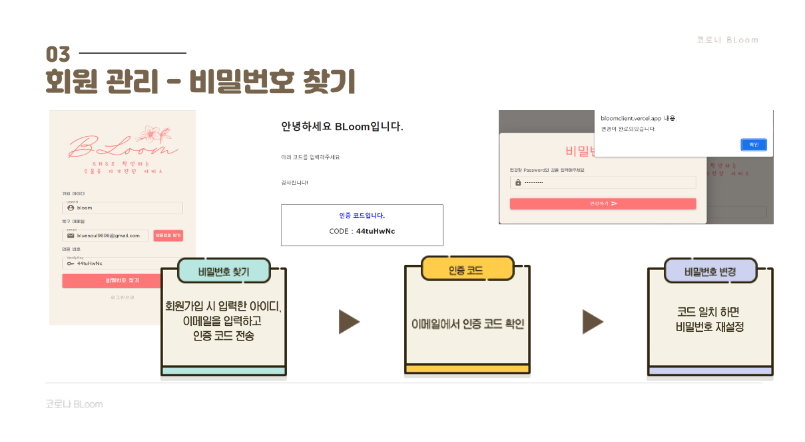
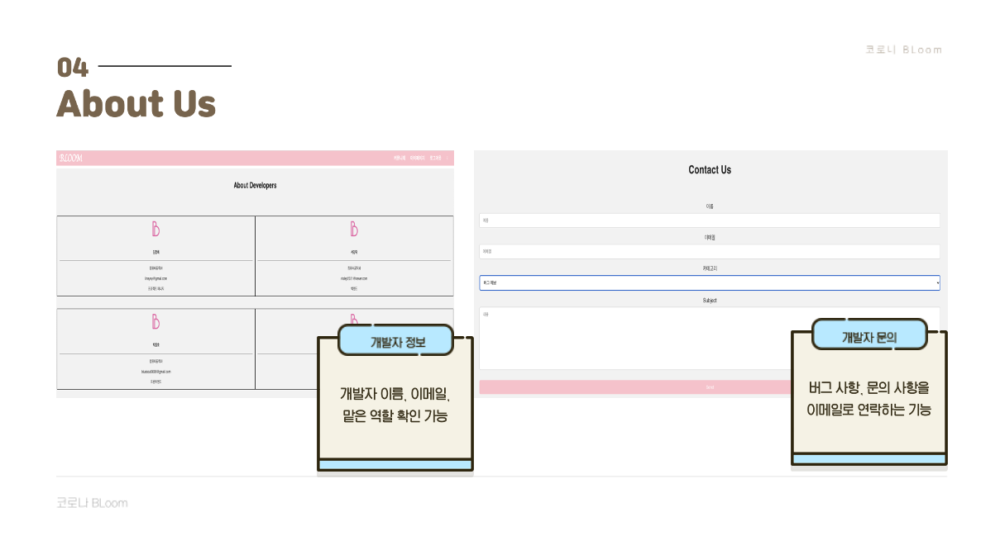

## 개요

가천대학교 컴퓨터공학과 졸업 프로젝트  
사용자의 SNS 피드 내용 10개를 AI 모델에 넣어 우울증을 판별해준다. 의사가 아닌 사람이 진단하는 행위는 법적으로 금지되어있으므로 명확한 판단이 아닌 일정 수치 이상이면 근처 정신의학과 병원을 추천해주는 등 사용자가 스스로 병원에 방문하게 서비스를 제공한다

## 기술 스택
#### AI

#### Front-end

#### Back-end

#### DataBase

#### Deploy

## 내가 맡은 부분 - Spring Boot server 구축

### 우울증 분석
* 사용자의 피드를 스크랩할 스크랩 서버에서 SNS 피드 10개 배열로 가져오기 ✔️
* 사용자 피드를 우울증 분석 서버에 요청하고 우울증 수치 응답 받음 ✔️
* 우울증 수치 DB에 저장 ✔️
* 최근 4건의 우울증 분석 결과 응답 ✔️
* 사용자의 자가 진단 내용 DB에 저장 ✔️

### 게시판
* 게시글 CRUD ✔️

### 회원가입
* 회원 아이디,비밀번호, 이름, 이메일로 가입 ✔️
* 비밀번호 확인 ✔️
* 이메일 인증 ✔️
* 아이디 중복 확인 ✔️

### 로그인
* ID/PW 입력 ✔️
* JWT 토큰 발급 ✔️
* 아이디 찾기 ✔️
* 비밀번호 재설정 ✔️
* 이메일로 임시 비밀번호 발급 ✔️

### Ngrok 배포
* 로컬 배포 ✔️

## ERD 다이어그램

## 화면 구성

|메인 화면|진단 하기|
|:----:|:----:|
|||

|게시판|게시글 수정, 삭제|
|:----:|:----:|
|||

|회원가입|마이페이지|
|:----:||:----:
||||

|아이디 찾기|비밀번호 찾기|
|:----:|:----:|
|||

|개발자 정보|
|:----:|
||

## 느낀점
학교 졸업 프로젝트로 4명이 한 팀이 되어서 진행했다. 조장이 먼저 주제와 AI 모델을 어느정도 완성이 되어 있어서 AI 모델을 시각화 해줄 웹 서비스 개발을 시작했다. DB 구성과 API 서버를 혼자 구축해보는 프로젝트는 처음이라 부담 되었지만 마지막 2주동안 많은 노력 끝에 완성했다. AI, 스크래핑 서버와 요청, 응답을 위해 `WebClient`를 처음 써봤고, 게시판 페이징을 구현해 본 적이 없어서 이게 정말 힘들었지만 스프링 JPA가 제공하는 `Pageable`을 Controller와 Respostory에 파라미터로 사용하면 자동으로 페이징을 구현할 수 있었다. 이때 정말 스프링의 위대함을 깨달았다. 이번 프로젝트도 역시 12주 안에 완성해야 했고 200장이 넘어가는 보고서도 작성 해야 했기 때문에 시간에 쫒겨 구현을 위한 코딩을 했던 것 같다. 다음 프로젝트때는 좀 더 클린코드를 생각하면서 프로젝트를 하고싶은 생각이 들었다. 

## 코드

