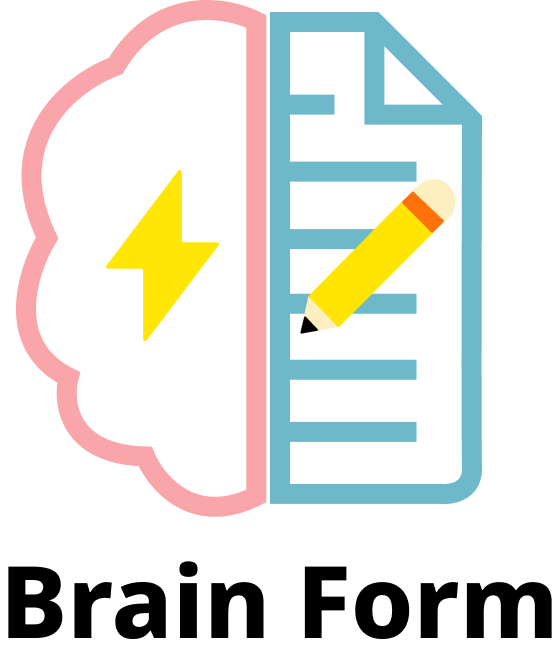
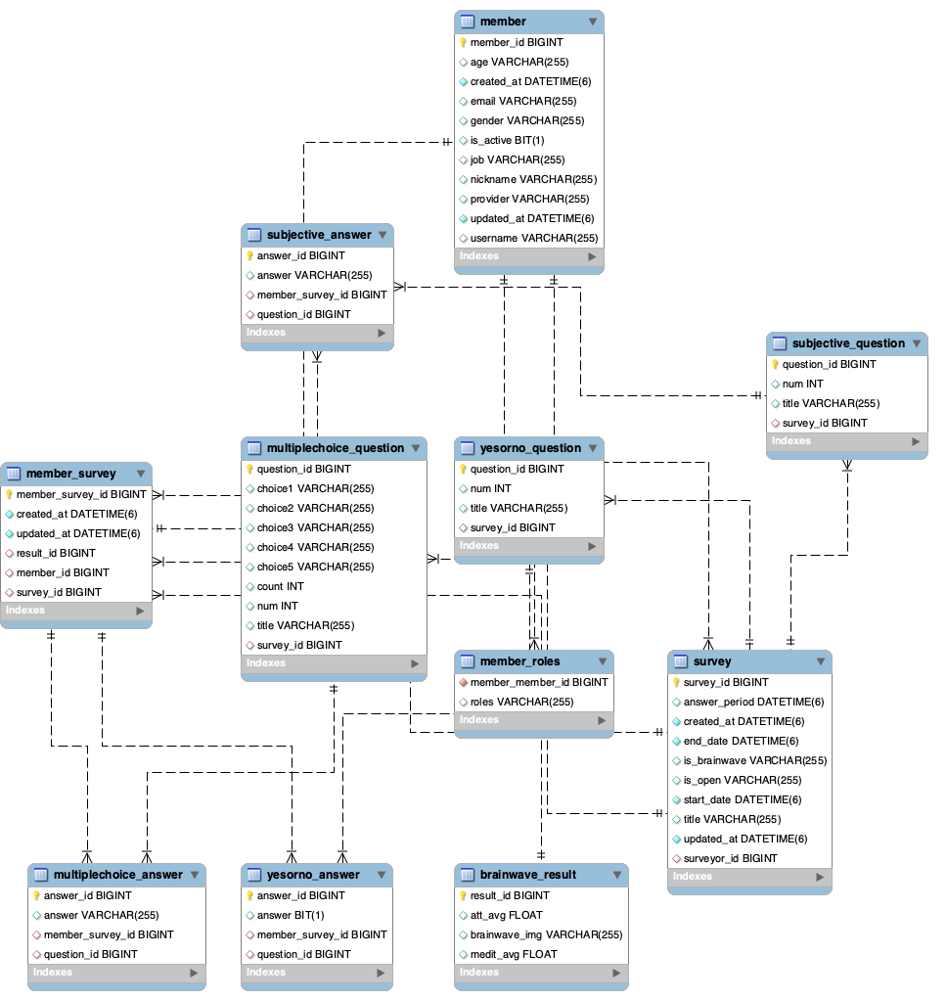

## 개요

**KEA(Kakao Enterprise SW Academy)** 2기 프로젝트  
본 서비스(Brain Form)는 뇌파 측정 및 분석 결과를 활용한 설문조사 서비스이다. 뇌파 측정 기기를 활용하여 사용자의 뇌파를 측정하고, 측정값을 분석 및 활용함으로써 설문 조사의 응답률과 통계 정보의 다양성 및 신뢰성을 크게 향상시킬 수 있다.

### 기술 스택
#### Client Application

#### Front-end

#### Back-end

#### DataBase

#### DevOps

> 가천대학교 On-premise 환경에서 구현

## Monolithic Architecture

## Microservices Architecture

## ERD

## 문제 해결
### 1. 뇌파를 측정할 유저와 설문 식별
뇌파 측정 프로그램은 `Edge-Device`이기 때문에 누가 어떤 설문에 대한 뇌파를 측정하는지 확인을 할 수 없었다. 우리는 뇌파 측정 프로그램에서 랜덤 코드를 만들고 사용자가 설문 응답을 하기 직전에 이 랜덤 코드를 입력하여 누가 어느 설문을 하는지 서버 ArrayList로 메모리에 저장해두고 뇌파 측정 프로그램은 GET 요청으로 코드 값이 존재하여 뇌파 코드, User Id, Survey Id를 응답 받으면 뇌파를 측정하게 설계 했다.

### 2. 눈 세번 깜빡임으로 자동 설문 종료
뇌파 측정 프로그램에서 Eye Blink 즉, 눈을 깜빡였는지 확인할 수 있다. 뇌파 프로그램에서 배열 안에 Eye Blink 값이 3번 이상 연속으로 존재한다면 설문을 종료하는 기능을 구현하려고자 했다. 그러나 실시간으로 뇌파 데이터를 서버에서 받아 뇌파 값을 확인하고 설문을 종료하는게 트래픽 낭비가 있을 것이라고 판단하여 스프링부트와 리액트를 `웹 소켓`으로 연결하고 서버에 Flag 값을 지정해 True이면 응답 중, False면 응답 종료 로직을 구현해 뇌파 프로그램에서 3번 이상 깜빡였다는 걸 감지하면 측정된 뇌파 정보와 False 값을 서버에 전달한다. 서버는 Flage가 False면 연결된 웹 소켓으로 설문을 종료하라고 알려주고 리액트에서 설문을 종료해 응답한 내용을 다시 서버로 전달하게 해결 했다.

### 3. 설문 응답 필터 적용
응답 통계에서 성별, 연령대, 직업, 뇌파 신뢰도 적용에 따른 결과를 데이터베이스에서 가져와야 하기 때문에 동적 SQL을 사용해야 했다. 처음에는 JPQL로 구현하려 했지만 가독성과 자동완성, 오류 해결 등 개발의 효율적인 측면과 동적 쿼리를 작성해야한다는 점에서 JPQL보다 `querydls`을 사용하게 되었다.  
또한 BoolenBuilder 대신 `BooleanExpression`을 사용해 코드의 가독성과 재사용성을 높였다.
## 회고
이번 프로젝트를 하면서 기능 구현뿐만 아니라 요구사항 정의서, API 명세서, 다이어그램, UX/UI 등 실무에서 필요한 산출물도 작성하고 Edge-Device를 사용해 재밌는 기능 구현을 해봐서 좋은 프로젝트였다. 비록 MSA로 전환하고 로컬에서 실행은 되지만 더 나아가 컨테이너로 만들고 쿠버네티스를 적용하는 단계까지 완성하지 못한 아쉬움도 남아있다. 앞으로는 DDD(Domain Driven Design)에 대해 공부하고 쿠버네티스, 모니터링까지 해봐야겠다고 동기부여가 된 프로젝트였다.  
15주 동안 같이 협업한 팀원들 너무 고생했고 곧 8주짜리 실무 프로젝트가 기다리고 있으니 남은 시간 부족한 부분과 아쉬운 점 잘 정리해서 실무 프로젝트도 성공적으로 마쳐야곘다. 

## 코드
ㅊ,