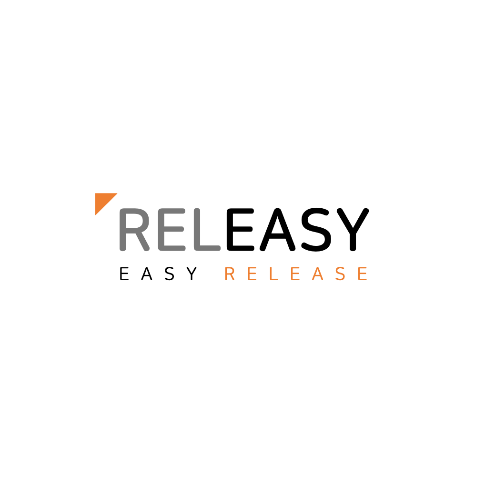

## 개요

**KEA(KakaoEnterprise SW Academy)** 2기 실무 프로젝트  
Releasy는 협업과 프로젝트 관리를 혁신적으로 변화시키는 릴리즈 노트 공유 서비스로 그룹 협업을 간소화하고 프로젝트 관리를 더욱 효과적으로 만들어준다. 여기에는 몇 가지 핵심 기능이 있다.

1. **그룹 및 프로젝트 생성**
Releasy를 사용하면 그룹을 생성하고 프로젝트를 쉽게 만들고 그룹 내에서 프로젝트를 관리하고 참여할 멤버를 초대할 수 있다.

2. **릴리즈 노트 작성**
프로젝트에 대한 릴리즈 노트를 작성하고 업데이트 하여 프로젝트의 진행 상황과 변경 사항을 모든 멤버와 공유할 수 있다.

3. **이슈 관리**
프로젝트에서 이슈를 생성하고 관리하고 각 이슈들은 트리 형식으로 표시되어 하위 이슈와의 관계를 명확히 볼 수 있다.

4. **릴리즈 노트와 이슈 연결**
릴리즈 노트를 작성할 때 관련 이슈를 추가하여 이를 통해 특정 릴리즈 버전과 연결된 이슈들을 트리 형식으로 확인할 수 았다.

5. **중요도 판단과 경험치 시스템**
ChatGPT를 활용하여 이슈의 중요도를 평가하고 프로젝트 매니저(PM)에게 부담을 덜어준다. 또한 프로젝트 멤버들은 할당된 이슈를 해결하면 중요도에 따른 경험치를 획득하고, 경험치에 따라 뱃지와 이슈 해결 잔디를 획득하여 이슈 해결에 대한 동기부여를 얻을 수 있다.

### 기술 스택

#### Front-end

#### Back-end

#### DataBase

#### Infra

#### Cooperation

#### Test

> KiC(Kakao i Cloude)에 배포 및 운영

## 시연 영상
[유튜브](https://youtu.be/Qzu5EQ1IBpI?feature=shared)

## UI/UX

## ERD

## System Architecture

## 문제 해결
### 알림 실시간 처리
릴리즈 노트 생성, 이슈 생성, 이슈 할당, 이슈 해결, 이슈 배정 등 다양한 활동에 대한 실시간 알람 기능을 구현하려고 했다. 가장 간단한 방식으로 백엔드에서 특정 활동이 발생하면 DB에 저장하고 프론트에서 polling 방식으로 몇초에 한번씩 알람 테이블을 조회해서 해결할 수 있을 것이다. 그러나 트래픽 낭비가 발생하여 서버 부하에 대한 문제점이 있다. 결국 Message Queue를 사용하여 성능과 안전성을 보장했다. Apache Kafka와 RabbitMQ 중 우리는 학기중에 Kafka로 대용량 데이터를 처리하는 실습을 진행 해봤기 떄문에 이번에는 `RabbitMQ`를 적용하기로 했다. 또 하나 고려해야할 점이 실시간 알람은 양뱡향 통신이 필요 없었기 때문에 `SSE(Server Sent Event)`를 사용하여 서버에서 클라이언트로 메세지를 전달해주는 방식이 더 적합하다고 판단하여 SSE를 적용하여 실시간 알람을 구현했다.

### Full-Text Search vs Elasticsearch
이슈 검색 기능을 구현하는 중에 검색 기능 하면 Elasticsearch가 먼저 떠올라 적용하려고 했지만 막연히 요즘 많이 사용한다고 해서 기술을 선택하기 보다 서비스에 적합한 이유가 있어야 한다. 따라서 1만건의 데이터를 MySQL과 Elasitcsearch에 저장해두고 조회했다. MySQL full-text search를 사용했을 떄는 약 7초가 걸렸고 Elasticsearch를 사용했을 때는 0.9초가 걸렸다. `Elasticsearch`의 성능이 월등히 좋아 기술을 선택하고 구현헀다.

### 온/오프라인
프로젝트 내 다른 팀원이 현재 온라인인지 오프라인인지 표시해주는 기능을 구현하려고 했다. 사용자가 로그인하면 MySQL Member 테이블에 isActive 값을 true로 바꿔주고 polling하여 로그인 여부를 확인하려 했으나 역시 과도한 트래픽을 줄이기 위해 `Redis`에 로그인 여부를 저장하여 빠르게 읽어오고 만료시간을 짧게 설정하여 일정 시간 요청을 보내지 않으면 값을 삭제하게 구현했다.

## 회고
이번 프로젝트는 지난 프로젝트와 달리 실무적 협업에 중점을 두었다. Jira, git flow 전략, 코드 컨벤션, PR template 등을 적용하여 효율적인 협업을 진행할 수 있었다. 또한 SSE, RabbitMQ, Elasticsearch, Docker Swarm 등 새로운 기술을 적용해보고 고도화 시킬 수 있는 프로젝트여서 좋은 경험이였다. 지난 프로젝트에서는 마감 기한이 길었기 때문에 처음에는 대충하다 마지막에 밤새면서 완성도가 다소 떨어지는 모습을 보였는데 이번에는 일일 스크럼을 진행하며 프로젝트의 상황을 서로 공유하고 앞으로의 계획을 검토하는 시간을 가졌기 때문에 처음 설계에서 구현하고자 하는 부분을 모두 완성했다. 기획에 있어서 서로 의견 충돌이 있었지만 다들 그만큼 프로젝트에 대한 열정과 애착이 있었기 때문이라고 생각한다. 8주라는 짧은 시간동안 매일 학교에 나와 프로젝트를 진행한 팀원들 모두 고생했고 6달의 KEA 교육과정을 무사히 수료해서 다행이다. 

## 코드
