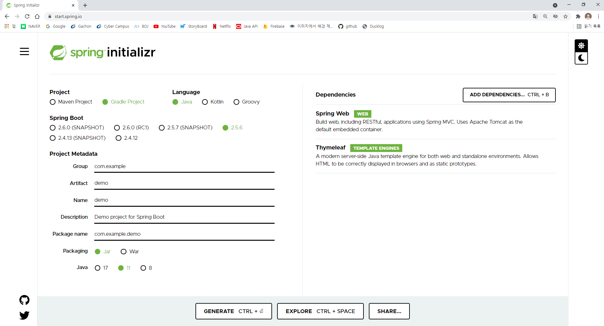

## Spring FrameWork란?
: Java 플랫폼을 위한 오픈 소스 애플리케이션 프레임워크로 간단히 Spring이라 부른다.

## Sping Boot란?

: Spring FrameWork 기반의 프로젝트를 간편하게 만들수있는 FrameWork이다.

## Spring Boot 시작하기
### 스프링 프로젝트 생성
[https://start.spring.io](https://start.spring.io) 접속  
스프링 프로젝트를 자동으로 생성해주는 Web site  

프로젝트 선택:  
- Project: Gradle Project - 요즘 많이 쓴다고 함   
 Maven Project를 사용하고싶으면 선택해도 됨  
- Spring Boot: 가장 높은 버전 선택
 SNAPSHOT과 같은 영어가 뒤에 붙어있으면 정식버전이 아님  
- Language: Java  
- Packgin: Jar  
- Java: 11  
- groupId: hello - 프로젝트를 식별해주는 아이디  
- artifactId: hello-spring - 버전 정보를 생략한 이름(jar)  
- Dependencies: Spring Web, Thymleaf(html 템플릿) - 필요한 dependency 추가 GNTERRATE 클릭 후 압축 해제 

### 프로젝트 시작
- 이클립스나 인텔리제이를 통해 압축 해제한 파일을 열면 END  

## 참고사항
* 앞으로의 spring 입문 포스팅은 [인프런 강의](https://www.inflearn.com/roadmaps/373)를 참고하여 작성합니다 
* 강의중 인텔리제이가 이크립스보다 편리하고 실제로 강사님이 인텔리제이를 사용중이여서 앞으로 인텔리제이를 사용할 예정입니다. 

