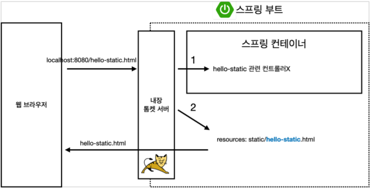

##  정적 컨텐츠
정적 컨텐츠는 html 파일을 그대로 웹브라우저에 띄우는 방식으로  앞서 실행 해봤던 welcome Page와 동작이 같다.  
resource/static/hello-static.html을 생성하고 run해보자.
~~~html
<!DOCTYPE HTML>
<html>
<head>
    <title>static content</title>
    <meta http-equiv="Content-Type" content="text/html; charset=UTF-8" />
</head>
<body>
정적 컨텐츠 입니다.
</body>
</html>
~~~
localhost:8080/hello-static.html로 접속해보면 출력되는걸 알 수 있다.
### 동작방식

웹 브라우저에서 요청 -> 톰켓 서버에서 요청 받음 -> spring한테 hello-static.html 알림  
-> spring은 우선 컨트롤러에서 hello-static 컨트롤러를 확인 -> Mapping이 안되면 hello-static.html 파일을 찾고 웹 브라우저에 반환 -> 웹 브라우저는 html 출력

## MVC
MVC는 Modle, View, Controller의 약자
* Model은 애플리케이션의 정보(데이터) 
* View는 텍스트, 체크박스 항목 등과 같은 사용자 인터페이스 요소
* Controller는 데이터와 비즈니스 로직 사이의 상호동작을 관리

### Controller 생성
src/main/java/hello.hellospring(폴더명이 다를 수 있음) 밑에 controller라는 폴더를 하나 생성 후, HelloController.java 파일을 생성하자.
~~~java
@Controller
public class HelloController {
        @GetMapping("hello-mvc")
        public String helloMvc(@RequestParam("name") String name, Model model){
        model.addAttribute("name",name);// key, value
        return "hello-template";
    }
}
~~~
@RequestParam("가져올 데이터 이름")[데이터 타입][데이터를 담을 변수] 형식으로 사용하면 된다.  
이제 View의 역할을 할 resource/template 밑에 hello-templete.html도 생성하자.
~~~html
<html xmlns:th="http://www.thymeleaf.org">
<body>

hello! empty

</body>
</html>
~~~
localhost:8080/hello-mvc?name=spring으로 접속해보면 hello empty에서 hello spring으로 바뀌는걸 볼 수 있다.
### 동작방식

웹 브라우저에서 요청 -> 톰켓 서버에서 요청 받고 스프링에게 전달 -> hello-mvc 컨트롤러 발견함 -> helloMVC 메소드에서 key는 name, value는 spring으로 모델을 만들어 viewResolver에게 전달
-> viewResolver는 return 값인 hello-template와 똑같은 이름을 가진 html파일을 찾아 변환 후 웹 브라우저에 반환 -> 웹 브라우저는 html 출력

### MVC 장단점
* 장점
    * 단순하고 직관적
    * 각 구성 요소를 독립적으로 개발하기 때문에 효율적
* 단점
    * View는 Model을 이용하기 때문에 의존성을 완벽히 분리 시킬수 없다.
    * 코드가 복잡해질 가능성이 높고, 유지보수가 어렵다.

## API

데이터 구조 포멧을 클라이언트에게 전달하는 방식. 클라이언트가 화면 구성을 하고 데이터는 api에서 가져오는 방식이나 서버간의 통신에서 주로 쓰인다.
기존에 생성했던 컨트롤러에 새로 코드를 추가하자.
~~~java
 @GetMapping("hello-string")
 @ResponseBody // http body부분에 데이터를 직접 넣겠다는 의미
 public String helloString(@RequestParam("name") String name) {
 return "hello " + name;
}
~~~
이전에 사용했던 방식과 달리 view가 없고 hello name이라는 문자가 그대로 출력된다.  
localhost:8080/hello-string?name=spring에 들어가면 볼 수 있다.  
사실 이런 방법은 거의 안쓰고 아래의 방법을 자세히 보자.  
역시 기존에 생성했던 컨트롤러에 새로 코드를 추가하자.  
~~~java
@GetMapping("hello-api")
@ResponseBody
public Hello helloApi(@RequestParam("name") String name){
    Hello hello = new Hello();
    hello.setName(name);
    return hello;
    }
static class Hello {
    private String name;
    public String getName() {
        return name;
    }

    public void setName(String name) {
        this.name = name;
    }
}
~~~
localhost:8080/hello-api?name=spring에 접속하여 확인 할 수 있다. 그런데 api 처음 실행했던 결과와 다른 화면을 볼 수 있을것이다.  
그 이유는 바로 Json으로 반환했기 때문이다.  
### 동작방식

앞서 봤던 MVC의 방식과 거의 비슷하지만 스프링에서 처리 방법이 다르다.  
viewResolver를 사용하지 않고 HttpMessageConverter가 동작한다.  
- 기본 문자 처리: StringHttpConverter
- 기본 객체 처리: StrginJackSon2HttpMessageConverter

## 참고사항
- JackSon2는 객체를 Json 방식으로 변환해주는 라이브러리 버젼2를 의미한다.  
- 스프링에 여러 format으로 변환 시키는 HttpMessageConverter가 기본적으로 탑재되어있고 깊이있게 들어가서 내가 원하는 format으로 변환할 수 있지만 강사님이 말하길 실무에서 거의 손대지않는다고 한다.
