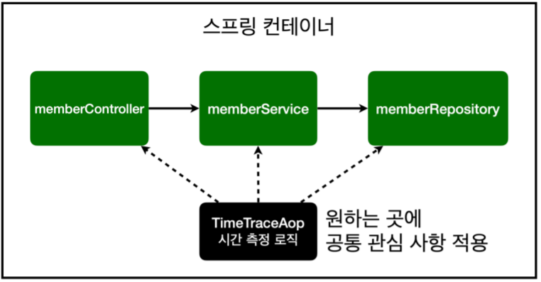

## AOP란?
Aspect-Oriented Programming의 약자로 직역하자면 관점 지향 프로그래밍이라는 뜻으로 애플리케이션 전체에 걸쳐 사용되는 기능을 재사용하도록 지원하는 것이다.  
예를 들어 모든 메소드의 호출 시간을 측정하고 싶다고 가정하자.  
~~~java
void Method1(){
    long start = System.currentTimeMills();
    ...
    long end =  System.currentTimeMills();
    long timeMS = end - start;
}
~~~
위와 같이 선언하여 측정할 수도 있지만 수 많은 메소드에 하나씩 다 선언 해줘야하고 각 메소드에서 시간을 측정하는 기능은 핵심 관심 사항이 아니기 때문에 핵심 관심 사항과 공통 관심사항이 섞여 유지보수가 어렵다. 그러나 AOP를 적용하면 해결할 수 있다.

## AOP 적용
AOP를 적용하기 위해서 TimeTraceAop 클래스를 하나 만들자.
~~~java
@Aspect
@Component
public class TimeTraceAop {

    @Around("execution(* hello.hellospring..*(..))")//hello.hellospring안에 들어있는 모든 메소드를 타겟으로 지정
    public Object execute(ProceedingJoinPoint joinPoint) throws Throwable {
        long start = System.currentTimeMillis();
        System.out.println("START: " + joinPoint.toString());
        try {
            return joinPoint.proceed();

        }finally {
            long finish = System.currentTimeMillis();
            long timeMS = finish - start;
            System.out.println("END: " + joinPoint.toString() + " " + timeMS + "ms");
        }
    }
}
~~~
- @Aspect: 여러 객체의 공통으로 적용되는 공통 관심 사항
- @Around: 메소드가 실행되기 전 후로 공통 관심 사항을 적용
- JoinPoint: 부가 기능이 수행되는 시점

스프링을 실행시켜보면 어떤 메소드가 언제 실행되고 끝나는지 보여준다.

## AOP 동작 방식
AOP가 적용된 의존 관계

spring이 구동될때 AOP가 적용되어있는 객체들은 proxy라는 가짜 객체를 앞에다 생성하고 스프링 컨테이너에 등록이 된다. memberController가 프록시로 감싸져있는 memberService를 호출하고 공통 관심 사항을 모두 수행하면 joinPoint.proceed() 메소드로 실제 memberService가 호출이 된다.

## 참고
이 외에도 AOP에 선언할 수 있는 많은 어노테이션이 있으므로 필요하다면 찾아보는걸 권장한다.