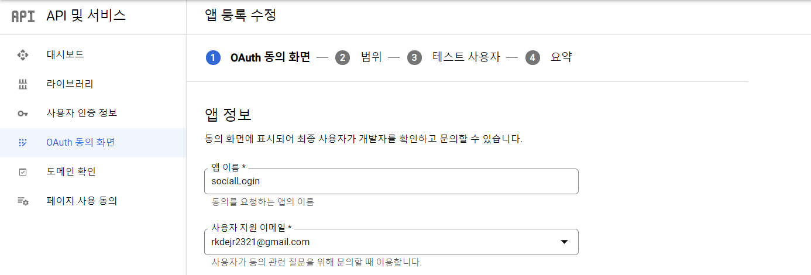
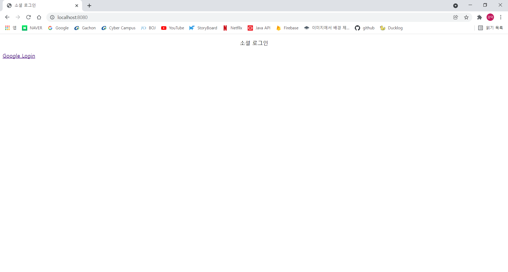
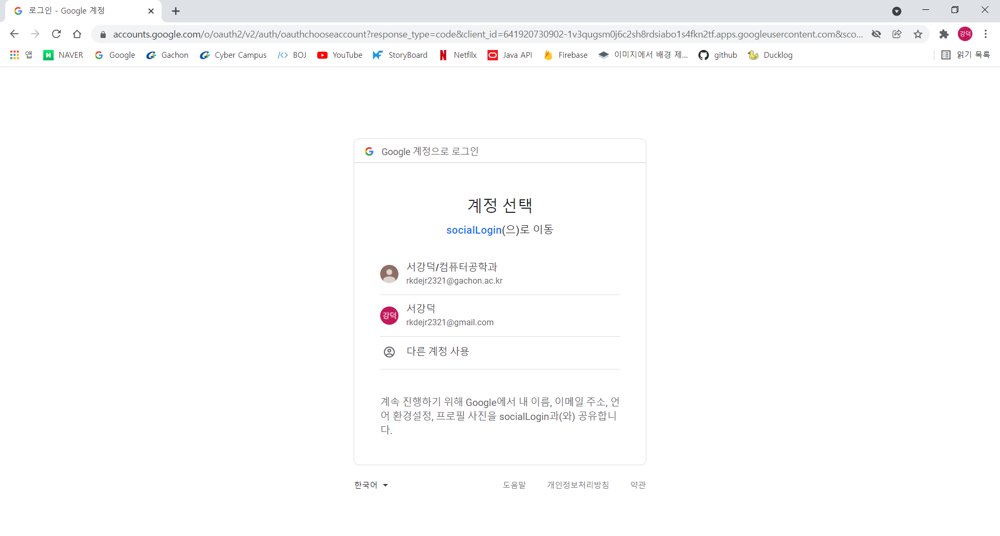

## 구글 클라이언트 Key 발급
[Google Cloude Platform](https://console.cloud.google.com/) 접속

프로젝트 만들기 선택

 프로젝트 이름을 정해주고 위치는 조직 없음으로 만들기를 눌러준다.  

 외부를 선택하고 만들기  

앱 이름과 이메일을 입력하고 다음   

 단순 로그인을 할때 이름과 이메일에 대한 정보만 필요하므로 범위 추가  

사용자 인증 정보 만들기를 눌러 OAuth 클라이언트 ID 선택  

웹 애플리케이션을 선택하고

URI에  
http://localhost:8080/login/oauth2/code/google을 입력 후 생성

클라이언트 ID와 비밀번호를 얻었다면 이제 스프링 코드를 작성하면 된다.

## application-oauth.properties
application.properties와 동일한 경로에application-oauth.propertie를 생성하고 아래의 코드를 추가.
~~~
spring.security.oauth2.client.registration.google.client-id=클라이언트 ID
spring.security.oauth2.client.registration.google.client-secret=클라이언트 비밀번호
spring.security.oauth2.client.registration.google.scope=profile, email
~~~

## application.properties
application-oauth.properties를 만들었다면 application.properties에 아래의 코드를 추가.
~~~
spring.profiles.include=oauth
~~~

## build.gradle
build.gradle에 필요한 의존성 추가.
~~~
implementation 'org.springframework.boot:spring-boot-starter-oauth2-client'
~~~

## User.java 생성
~~~java
@Getter
@NoArgsConstructor
@Entity
public class User{
    @Id @GeneratedValue(strategy = GenerationType.IDENTITY)
    private Long id;

    @Column (nullable = false)
    private String name;

    @Column (nullable = false)
    private String email;

    @Column
    private String picture;

    @Enumerated(EnumType.STRING)
    @Column(nullable = false)
    private Role role;

    @Builder
    public User(String name, String email, String picture, Role role) {
        this.name = name;
        this.email = email;
        this.picture = picture;
        this.role = role;
    }
    public User update(String name, String picture) {
        this.name = name;
        this.picture = picture;
        return this;
    }
    public String getRoleKey() {
        return this.role.getKey();
    }

    public Long getId() {
        return id;
    }

    public String getName() {
        return name;
    }

    public void setId(Long id) {
        this.id = id;
    }

    public void setName(String name) {
        this.name = name;
    }

    public void setEmail(String email) {
        this.email = email;
    }
}
~~~

## Role.java 생성
~~~java
@Getter
@RequiredArgsConstructor
public enum Role {
    GUEST("ROLE_GUEST", "손님"),
    USER("ROLE_USER", "일반 사용자");

    private final String key;
    private final String title;

    public String getKey() {
        return key;
    }
}
~~~

## UserRepository.java  생성
~~~java
public interface UserRepository extends JpaRepository<User, Long> {
    Optional<User> findByEmail(String email);
}
~~~

## OAuthAttributes.java 생성
~~~java
@Getter
public class OAuthAttributes {
    private Map<String, Object> attributes;
    private String nameAttributeKey, name, email, picture;
    @Builder
    public OAuthAttributes(Map<String, Object> attributes,
                           String nameAttributeKey,
                           String name, String email, String picture) {
        this.attributes = attributes;
        this.nameAttributeKey = nameAttributeKey;
        this.name = name;
        this.email = email;
        this.picture = picture;
    }
    public static OAuthAttributes of(String registrationId,
                                     String userNameAttributeName,
                                     Map<String, Object> attributes) {
        return ofGoogle(userNameAttributeName, attributes);
    }
    public static OAuthAttributes ofGoogle(String userNameAttributeName,
                                           Map<String, Object> attributes) {
        return OAuthAttributes.builder()
                .name((String) attributes.get("name"))
                .email((String) attributes.get("email"))
                .picture((String) attributes.get("picture"))
                .attributes(attributes)
                .nameAttributeKey(userNameAttributeName)
                .build();
    }
    public User toEntity() {
        return User.builder()
                .name(name)
                .email(email)
                .picture(picture)
                .role(Role.GUEST)
                .build();
    }
}
~~~

## SecurityConfig.java 생성
~~~java
@RequiredArgsConstructor
@EnableWebSecurity
public class SecurityConfig extends WebSecurityConfigurerAdapter {
    private final CustomOAuth2UserService customOAuth2UserService;
    @Override
    protected void configure(HttpSecurity http) throws Exception {
        http
                .csrf().disable()
                .headers().frameOptions().disable()
                .and()
                .authorizeRequests()
                .antMatchers("/", "/css/**", "/images/**", "/js/**", "/h2/**", "/h2-console/**").permitAll()
                .antMatchers("/api/v1/**").hasRole(Role.USER.name())
                .anyRequest().authenticated()
                .and()
                .logout().logoutSuccessUrl("/")
                .and()
                .oauth2Login().userInfoEndpoint().userService(customOAuth2UserService);
    }
}
~~~

## CustomOAuth2UserService.java 생성
~~~java
@RequiredArgsConstructor
@Service
public class CustomOAuth2UserService implements OAuth2UserService<OAuth2UserRequest, OAuth2User> {
    private final UserRepository userRepository;
    private final HttpSession httpSession;
    @Override
    public OAuth2User loadUser(OAuth2UserRequest userRequest) throws OAuth2AuthenticationException {
        OAuth2UserService<OAuth2UserRequest, OAuth2User> delegate = new DefaultOAuth2UserService();
        OAuth2User oAuth2User = delegate.loadUser(userRequest);
        // 현재 로그인 진행 중인 서비스를 구분하는 코드
        String registrationId = userRequest
                .getClientRegistration()
                .getRegistrationId();
        // oauth2 로그인 진행 시 키가 되는 필드값
        String userNameAttributeName = userRequest.getClientRegistration()
                .getProviderDetails()
                .getUserInfoEndpoint()
                .getUserNameAttributeName();
        // OAuthAttributes: attribute를 담을 클래스 (개발자가 생성)
        OAuthAttributes attributes = OAuthAttributes
                .of(registrationId, userNameAttributeName, oAuth2User.getAttributes());
        User user = saveOrUpdate(attributes);
        // SessioUser: 세션에 사용자 정보를 저장하기 위한 DTO 클래스 (개발자가 생성)
        httpSession.setAttribute("user", new SessionUser(user));
        return new DefaultOAuth2User(
                Collections.singleton(new SimpleGrantedAuthority(user.getRoleKey())),
                attributes.getAttributes(),
                attributes.getNameAttributeKey()
        );
    }
    private User saveOrUpdate(OAuthAttributes attributes) {
        User user = userRepository.findByEmail(attributes.getEmail())
                .map(entity -> entity.update(attributes.getName(), attributes.getPicture()))
                .orElse(attributes.toEntity());
        return userRepository.save(user);
    }
}
~~~

## SessionUser.java 생성
~~~java
@Getter
public class SessionUser implements Serializable {
    private String name, email, picture;
    public SessionUser(User user) {
        this.name = user.getName();
        this.email = user.getEmail();
        this.picture = user.getPicture();
    }
}
~~~

## Controller 추가
~~~java
@RequiredArgsConstructor
@Controller
public class homeController {
    private final HttpSession httpSession;

    @GetMapping("/")
    public String index(Model model) {
        try{
            SessionUser user = (SessionUser) httpSession.getAttribute("user");
            model.addAttribute("userName",user.getName());
            model.addAttribute("userEmail",user.getEmail());
            model.addAttribute("userImg",user.getPicture());
        }catch (NullPointerException e){
        }
        return "index";
    }
}
~~~

## index.html 생성
~~~html
<!DOCTYPE HTML>
<html xmlns:th="http://www.thymeleaf.org" xmlns:sec="http://www.w3.org/1999/xhtml">
<head>
    <title>소셜 로그인</title>
    <meta http-equiv="Content-Type" content="text/html; charset=UTF-8" />
</head>
<body>

    소셜 로그인

    

        

            
            사용자 님, 안녕하세요.
            이메일
            <a href="/logout" class="btn btn-sm btn-info active" role="button">Logout</a>
        

        

            <!-- 스프링 시큐리티에서 기본 제공하는 URL - 별도 컨트롤러 작성 필요 없음 -->
            <a href="/oauth2/authorization/google" class="btn btn-sm btn-success active" role="button">Google Login</a>
        

    

    

        <a href="/posts/save" role="button" class="btn btn-primary float-right">글 등록</a>
    

</body>
</html>
~~~

## 결과
<html>
<head>
	<meta charset='utf-8'>
	<meta name="viewport" content="width=device-width,initial-scale=1.0,minimum-scale=1.0,maximum-scale=1.0,user-scalable=no">
	
</head>
<body>

	<input type="radio" name="slide" id="slide01" checked>
	<input type="radio" name="slide" id="slide02">
	<input type="radio" name="slide" id="slide03">
	

		<ul class="slidelist">
			<li>
				<a>
					<label for="slide03" class="left"></label>
					
					<label for="slide02" class="right"></label>
				</a>
			</li>
			<li>
				<a>
					<label for="slide01" class="left"></label>
					
					<label for="slide03" class="right"></label>
				</a>
			</li>
			<li>
				<a>
					<label for="slide02" class="left"></label>
					
					<label for="slide01" class="right"></label>
				</a>
			</li>
		</ul>
	

</body>
</html>

## help❗❗
컨트롤러의 원래 코드는 아래와 같다.
~~~java
@RequiredArgsConstructor
@Controller
public class homeController {
    private final HttpSession httpSession;

    @GetMapping("/")
    public String index(Model model) {
        SessionUser user = (SessionUser) httpSession.getAttribute("user");
        if(user!=null) { 
            model.addAttribute("userName", user.getName()); 
        } 
        return "index";
    }
}
~~~

그런데 스프링을 실행하면 NullPointerException 에러가 발생하면서 'user' is null이라고 나오는데 해결하지 못하였다. 그래서 결국 예외처리로 코드를 수정했다.
아마 다른 블로그에는 위에 코드로 설명 되어있을 것이다. 해결방법 아시는분은 댓글 부탁드립니다...(블로그가 구글에 나오려나..)