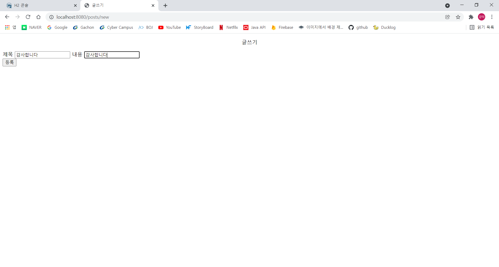
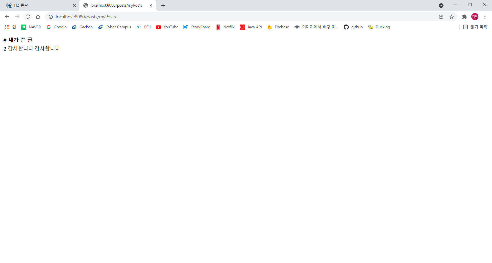
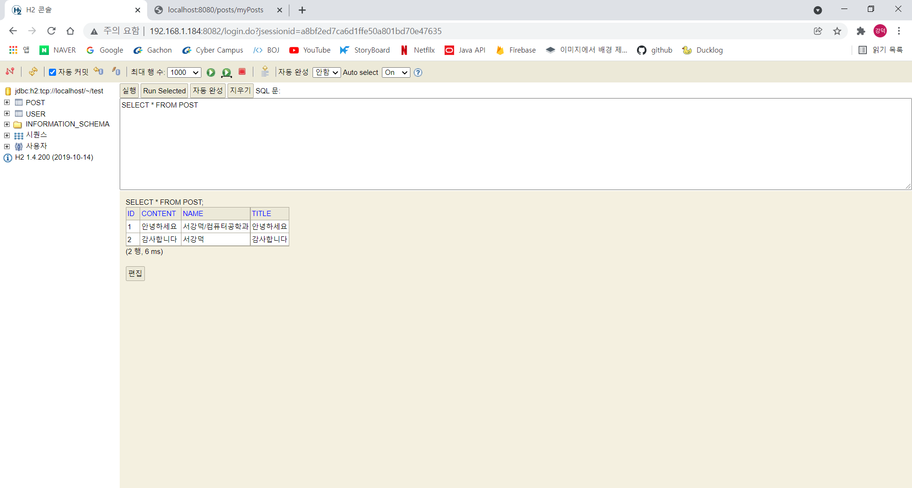

## 개요
앞선 포스팅에서 구글로 소셜 로그인을 구현했다. 그럼 이제 글쓰기를 만들어 보자. 로그인 상태에서만 글을 쓸 수 있고 내가 쓴 글을 확인할 수 있게 만들 것이다.

## Post.java 생성
쓴 글을 담을수 있는 post 객체를 만들자. 우선 작성자와 제목, 내용정도만 필요하다.
~~~java
@Getter
@NoArgsConstructor
@Entity
public class Post {
    @Id
    @GeneratedValue(strategy = GenerationType.IDENTITY) // 자동생성
    private Long id;
    private String name;
    private String title;
    private String content;

    public Post(String name, String title, String content) {
        this.name = name;
        this.title = title;
        this.content = content;
    }

    public String getName() {
        return name;
    }

    public String getTitle() {
        return title;
    }

    public String getContent() {
        return content;
    }

    public Long getId() {
        return id;
    }
}
~~~

## postForm.java 생성
html에서 title과 content를 받고 Post 객체로 넘겨줄 postForm을 만들자
~~~java
public class postForm {
    private String name;
    private String title;
    private String content;

    public postForm(String name, String title, String content) {
        this.name = name;
        this.title = title;
        this.content = content;
    }

    public String getName() {
        return name;
    }

    public String getTitle() {
        return title;
    }

    public String getContent() {
        return content;
    }
}
~~~

## postSaveController.java 생성 
웹 브라우저에서 입력받은 데이터를 DB에 저장하는 컨트롤러 생성 로그인한 session의 이름을 post 작성자로 넣어 DB에 저장해야한다.
~~~java
@Controller
public class postSaveController {
    private final postSaveService postSaveService;
    private final HttpSession httpSession;

    @Autowired
    public postSaveController(postSaveService postSaveService, HttpSession httpSession){
        this.postSaveService = postSaveService;
        this.httpSession = httpSession;
    }
    @GetMapping("/posts/new")
    public String post(){
        return "/posts/save";
    }

    @PostMapping(value = "/posts/new")
    public String postSave(postForm postform) {
        SessionUser user = (SessionUser) httpSession.getAttribute("user");
        Post post = new Post(user.getName(),postform.getTitle(),postform.getContent());
        postSaveService.savePost(post);
        return "redirect:/";
    }
}
~~~

## PostRepository.java 생성
~~~java
@Repository
public interface PostRepository{
    Post save(Post post);
    List<Post> findAll();

}
~~~

## JpaPostRepository.java 생성
~~~java
public class JpaPostRepository implements PostRepository {
    private final EntityManager em;

    public JpaPostRepository(EntityManager em) {
        this.em = em;
    }

    @Override
    public Post save(Post post) {
        em.persist(post);
        return post;
    }

    @Override
    public List<Post> findAll() {
        return em.createQuery("select m from Post m",Post.class)
                .getResultList();
    }
}
~~~

## SpringDataJpaPostRepository.java 생성
~~~java
public interface SpringDataJpaPostRepository extends JpaRepository<Post, Long>, PostRepository{
    Post save(Post post);
    List<Post> findAll();
}
~~~

## save.html 작성
글을 쓸 수 있는 html을 작성
~~~html
<!DOCTYPE HTML>
<html xmlns:th="http://www.thymeleaf.org" xmlns:sec="http://www.w3.org/1999/xhtml">
<head>
    <title>글쓰기</title>
    <meta http-equiv="Content-Type" content="text/html; charset=UTF-8" />
</head>
<body>

    글쓰기

    <form action="/posts/new" method="post">
        

            <label for="title">제목</label>
            <input type="text" id="title" name="title" placeholder="제목을 입력하세요">
            <label for="content">내용</label>
            <input type="text" id="content" name="content" placeholder="내용을 입력하세요">
        

        <button type="submit">등록</button>
    </form>

 <!-- /container -->

</body>
</html>
~~~
그리고 홈 화면(index.html)에 글 쓰기 버튼 코드를 추가
~~~html
      <a href="/posts/new" role="button" class="btn btn-primary float-right">글 등록</a>
~~~

## homeController에 추가
~~~java
    @GetMapping("/posts/myPosts")
    public String myPostList(Model model){
        SessionUser user = (SessionUser) httpSession.getAttribute("user");
        List<Post> posts = postService.findPost();
        model.addAttribute("posts",posts);
        model.addAttribute("userName",user.getName());
        return "posts/myPosts";
    }
~~~

## myPosts.html 작성
로그인한 계정이 쓴 글만 확인할 수 있게 html 작성
~~~html
<html xmlns:th="http://www.thymeleaf.org">
<body>

    

        <table>
            <thead>
            <tr>
                <th>#</th>
                <th>내가 쓴 글</th>
            </tr>
            </thead>
            <tbody>
            <tr th:each="post : ${posts}">
                

                    <td th:text="${post.id}"></td>
                    <td th:text="${post.title}"></td>
                    <td th:text="${post.content}"></td>
                

            </tr>
            </tbody>
        </table>
    

 <!-- /container -->
</body>
</html>
~~~
컨트롤러에서 model로 posts 리스트와 로그인한 session의 name을 넘겨 받으면 반복문을 돌면서 posts의 이름과 session name이 일치하는 post만 출력한다.

## 결과
<html>
<head>
	<meta charset='utf-8'>
	<meta name="viewport" content="width=device-width,initial-scale=1.0,minimum-scale=1.0,maximum-scale=1.0,user-scalable=no">
	
</head>
<body>

	<input type="radio" name="slide" id="slide01" checked>
	<input type="radio" name="slide" id="slide02">
	<input type="radio" name="slide" id="slide03">
    <input type="radio" name="slide" id="slide04">
	

		<ul class="slidelist">
			<li>
				<a>
					<label for="slide04" class="left"></label>
					
					<label for="slide02" class="right"></label>
				</a>
			</li>
			<li>
				<a>
					<label for="slide01" class="left"></label>
					
					<label for="slide03" class="right"></label>
				</a>
			</li>
			<li>
				<a>
					<label for="slide02" class="left"></label>
					
					<label for="slide04" class="right"></label>
				</a>
			</li>
            			<li>
				<a>
					<label for="slide03" class="left"></label>
					
					<label for="slide01" class="right"></label>
				</a>
			</li>
		</ul>
	

</body>
</html>

DB에는 두 사람의 글이 하나씩 들어있지만 내가 쓴 글을 확인해보면 로그인 한 아이디가 쓴 글만 보여진다.