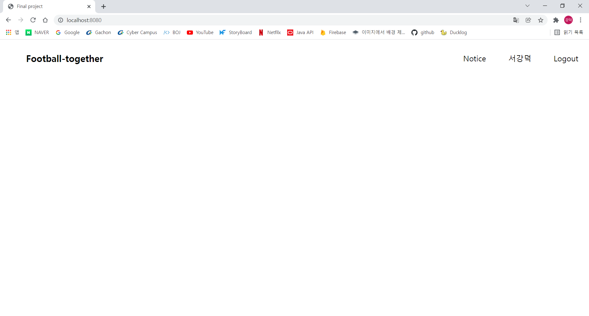

## 로그인 구현
웹 기능에 필수인 로그인 기능을 구현해 보고자 한다. 정말 간단하게 loginForm으로 id와 pwd를 사용자가 입력하면 DB에서 findById로 회원가입이 되어있는지 확인 후 입력한 pwd와 DB에 저장되어있는 pwd가 같으면 로그인이 진행되게 구현할 것이다.  
우선 MemberLoginService.java를 생성
~~~java
@Service
public class MemberLoginService {
    private final MemberRepository memberRepository;

    public MemberLoginService(MemberRepository memberRepository) {
        this.memberRepository = memberRepository;
    }

    public boolean login(LoginForm loginForm){
        Optional<Member> member = memberRepository.findById(loginForm.getId());
        if (member.isEmpty()){
            return false;
        }
        Member loginMember = member.get();
        return loginForm.getPwd().equals(loginMember.getPwd());
    }
}
~~~

## 컨트롤러 추가
~~~java
@PostMapping("member/login")
    public String login(LoginForm loginForm){
        // 로그인 실패
        if (loginForm.getId().isEmpty() || loginForm.getPwd().isEmpty() || !memberLoginService.login(loginForm)){
            return "member/login";
        }
        // 로그인 성공
        else {
            Member loginMember = memberRepository.findById(loginForm.getId()).get();
            return "redirect:/";
        }

    }
~~~
id와 pwd를 입력하지 않았거나 입력한 id가 존재하지 않는 경우는 로그인 실패로 Login 화면을 다시 띄워주고 아닌 경우는 home으로 이동한다.  
 
## Session 동작 방식
1. 웹 클라이언트가 서버에게 요청을 보내면 서버는 클라이언트를 식별하는 session id를 생성한다.
2. 서버는 session id로 key와 value를 저장하는 Httpsession을 생성하고, session id를 저장하고있는 쿠키를 생성하여 클라이언트한테 전송한다.
3. 클라이언트는 서버 측에 요청을 보낼 때, session id를 가지고 있는 쿠키를 전송한다.
4. 서버는 쿠키의 session id로 Httpsession을찾는다.

## Session 장점
- 회원과 관련된 정보는 클라이언트에서 가지고 있지 않다. 
- 추정 불가능한 세션 아이디만 쿠키를 통해 주고받기에 보안에서 많이 안전해졌다.

## Session 기능
- 세션 생성
    - 세션 키는 중복이 안되며 추정 불가능한 랜덤 값이어야 한다.
    - 세션 키에 매칭될 값(value)가 있어야 한다. 
    - 이렇게 생성된 세션 키를 응답 쿠키에 저장해 클라이언트에 전달해야 한다. 
- 세션 조회
    - 클라이언트가 요청한 세션아이디 쿠키 값으로 세션 저장소에 저장된 값을 조회할 수 있어야 한다. 
- 세션 만료
    - 클라이언트가 요청한 세션아이디 쿠키 값으로 세션 저장소에 보관한 세션 엔트리를 제거해야 한다.

## 구현
HttpSession에서 로그인용으로 사용할 세션 id는 여기저기서 사용될 것이기 때문에 따로 인터페이스를 만든다.
~~~java
public interface SessionConstants {
    String LOGIN_MEMBER = "loginMember";
}
~~~

위에서 작성한 controller에 몇가지 코드를 추가하여 최종 코드는 다음과 같다.
~~~java
@PostMapping("member/login")
public String login(LoginForm loginForm, HttpServletRequest request, BindingResult bindingResult){
    // 로그인 실패
    if (loginForm.getId().isEmpty() || loginForm.getPwd().isEmpty() || !memberLoginService.login(loginForm)){
        return "member/login";
    }
    // 로그인 성공
    else {
        Member loginMember = memberRepository.findById(loginForm.getId()).get();
        HttpSession session = request.getSession();
        session.setAttribute(SessionConstants.LOGIN_MEMBER,loginMember);
        session.setMaxInactiveInterval(1800);//1800초
        return "redirect:/";
    }
}
~~~
requset의 getSession()메서드는 서버에 생성된 세션이 있다면 세션을 반환하고, 없다면 세 세션을 생성하여 반환한다.
~~~java
HttpSession session = request.getSession();
~~~

setAttribute는 name,value 쌍으로 객체 Object를 저장한다.
~~~java
session.setAttribute(SessionConstants.LOGIN_MEMBER,loginMember);
~~~

대부분의 사용자들은 로그아웃 버튼을 직접 누르지않고 브라우저를 종료한다. 그러나 HTTP는 비연결성으로 서버에서 클라이언트가 웹 브라우저를 종료 했는지 안했는지 알 방법이 없다. 세션을 무한히 유지한다면 JSESSIONID를 탈취당한 경우 시간이 흘러도 해당 쿠키로 악용될 수 있고 기본적으로 세션은 메모리에 저장되기 때문에 성능저하는 물론이고 OutOfMemoryException이 발생할 수 있다. 따라서 시간이 지나면 세션을 삭제하는 코드가 있어야하는데 이게 바로 그 코드이다.
~~~java
session.setMaxInactiveInterval(1800);//1800초뒤에 세션 삭제 
~~~

## 로그아웃
~~~java
@GetMapping("member/logout")
public String logoutV3(HttpServletResponse response, HttpServletRequest request) {
    HttpSession session = request.getSession(false);
    if (session != null) {
        session.invalidate(); // 세선 제거
    }
    return "redirect:/";
}
~~~

## 결과
<html>
<head>
	<meta charset='utf-8'>
	<meta name="viewport" content="width=device-width,initial-scale=1.0,minimum-scale=1.0,maximum-scale=1.0,user-scalable=no">
	
</head>
<body>

	<input type="radio" name="slide" id="slide01" checked>
	<input type="radio" name="slide" id="slide02">
	<input type="radio" name="slide" id="slide03">
    <input type="radio" name="slide" id="slide04">
	

		<ul class="slidelist">
			<li>
				<a>
					<label for="slide04" class="left"></label>
					
					<label for="slide02" class="right"></label>
				</a>
			</li>
			<li>
				<a>
					<label for="slide01" class="left"></label>
					
					<label for="slide03" class="right"></label>
				</a>
			</li>
			<li>
				<a>
					<label for="slide02" class="left"></label>
					
					<label for="slide04" class="right"></label>
				</a>
			</li>
            			<li>
				<a>
					<label for="slide03" class="left"></label>
					
					<label for="slide01" class="right"></label>
				</a>
			</li>
		</ul>
	

</body>
</html>
