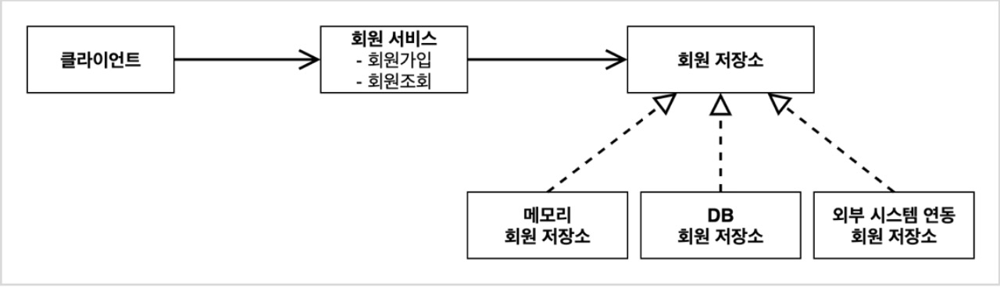
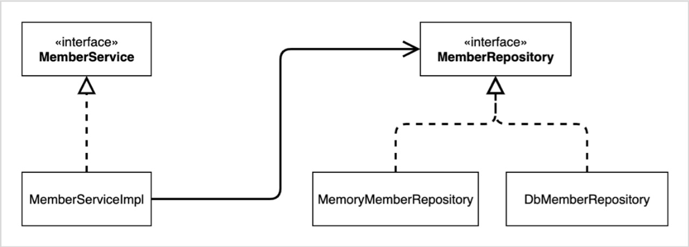
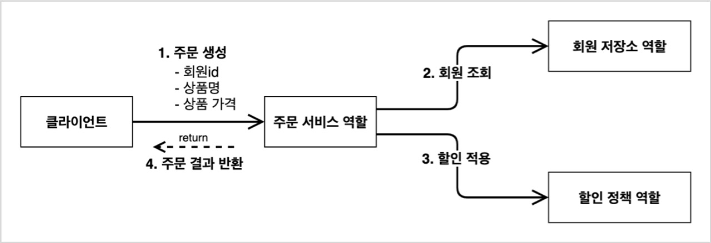
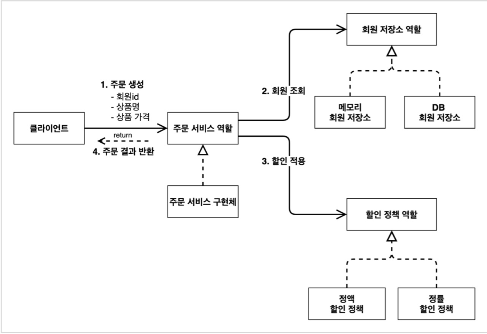
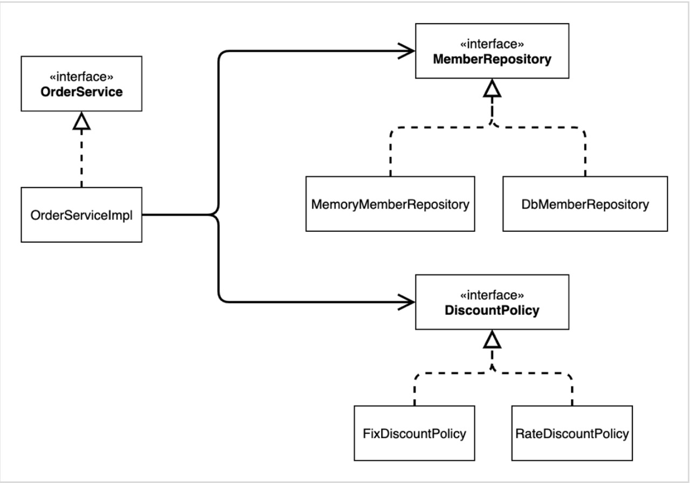
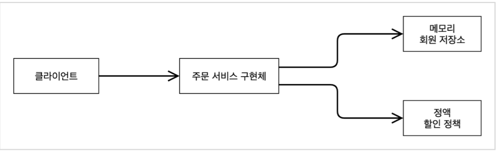
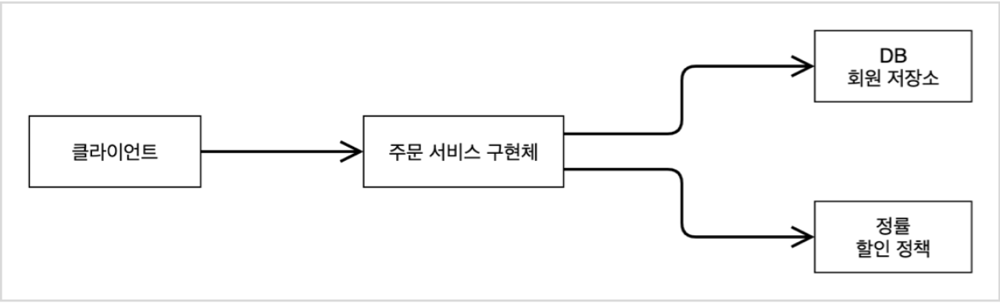

## 회원 도메인 설계
### 요구사항
* 회원 가입, 조회 기능
* VIP, 일반 등급
* 회원 데이터 저장소는 미확정(DB or 외부 시스템)

회원 도메인 협력 관계
  

회원 클래스 다이어그램
  

회원 객체 다이어그램
  

### 회원 엔티티
등급
~~~java
public enum Gade {
    BASIC, VIP;
}
~~~
회원 클래스
~~~java
public class Member {
    private Long id;
    private String name;
    private Grade grade;

    public Member(Long id, String name, Grade grade) {
        this.id = id;
        this.name = name;
        this.grade = grade;
    }
    // getter, setter
    ... 
}
~~~

### 회원 저장소
저장소 인터페이스
~~~java
public interface MemberRepository {
    void save(Member member);
    Member findById(Long memberId);
}
~~~
메모리 저장소 구현체
* 데이터베이스가 확정이 안되었기 때문에 간단한 메모리 저장소로 우선 개발 진행
* HashMap은 동시성 이슈가 발생할 수 있다. 이런 경우 ConcurrentHashMap 사용 권장

~~~java
public class MemoryMemberRepository implements MemberRepository{
    private static Map<Long, Member> store = new HashMap<>();

    @Override
    public void save(Member member) {
        store.put(member.getId(), member);
    }

    @Override
    public Member findById(Long memberId) {
        return store.get(memberId);
    }
}
~~~

### 회원 서비스
서비스 인터페이스
~~~java
public interface MemberService  {
    void join(Member member);
    Member findMember(Long memberId);

}
~~~
서비스 구현체
~~~java
public class MemberServiceImpl implements MemberService{
    private final MemberRepository memberRepository = new MemoryMemberRepository();
    
    @Override
    public void join(Member member) {
        memberRepository.save(member);
    }

    @Override
    public Member findMember(Long memberId) {
        return memberRepository.findById(memberId);
    }
}
~~~

### 회원가입 테스트
~~~java
public class MemberServiceTest  {
    MemberService memberService = new MemberServiceImpl();

    @Test
    void join(){
        //given: 주어진 데이터
        Member member = new Member(1L,"memberA",Grade.VIP);
        //when: 시험할 로직
        memberService.join(member);
        Member findMember = memberService.findMember(1L);
        //then: 로직 수행후 기대값
        Assertions.assertThat(member).isEqualTo(findMember);
    }
}
~~~

### 회원 도메인의 문제점
MemberServiceImpl는 MemberService 인터페이스를 상속받은 클래스이다. 그런데 코드를 보면 MemberRepository 인터페이스와 MemoryMemberRepository 구현체 모두 의존하고 있어 OCP, DIP 모두 위반한다.

## 주문과 할인 도메인 설계
### 요구사항
* 회원은 상품 주문
* 회원 등급에 따라 할인 정책 
    * VIP는 1000원 할인
* 추후 할인 정책이 바뀔 가능성이 높다.

주문 도메인 협력, 역할, 책임

1. 주문 생성: 클라이언트는 주문 서비스에 주문 생성을 요청
2. 회원 조회: 할인을 위해서는 회원 등급이 필요하다. 그래서 주문 서비스는 회원 저장소에서 회원 조회
3. 할인 적용: 주문 서비스는 회원 등급에 따른 할인 여부를 할인 정책에 위임
4. 주문 결과 반환: 주문 서비스는 할인 결과를 포함한 주문 결과를 반환

주문 도메인 전체

주문 도메인 클래스 다이어그램

주문 도메인 객체 다이어그램1

주문 도메인 객체 다이어그램2

저장소와 할인 정책이 바뀌어도 역할과 협력 관게를 재사용할 수 있다.

### 할인 정책 
인터페이스
~~~java
public interface DiscountPolicy {
    /**
     *
     * @return 할인 대상 금액
     */
    int discount(Member member, int price);
}
~~~
정액 할인 정책 구현체
~~~java
public class FixDiscountPolicy  implements  DiscountPolicy{
    private int discountFixAmount = 1000;
    
    // VIP면 1000원 할인
    @Override
    public int discount(Member member, int price) {
        if(member.getGrade() == Grade.VIP) {
            return discountFixAmount;
        }
        else{
            return 0;
        }
    }
}
~~~

### 주문 엔티티
~~~java
public class Order {
    private Long memberId;
    private String itemName;
    private int itemPrice;
    private int discountPrice;

    public Order(Long memberId, String itemName, int itemPrice, int discountPrice) {
        this.memberId = memberId;
        this.itemName = itemName;
        this.itemPrice = itemPrice;
        this.discountPrice = discountPrice;
    }

    public int calculatePrice(){
        return itemPrice - discountPrice;
    }

    @Override
    public String toString() {
        return "Order{" +
                "memberId=" + memberId +
                ", itemName='" + itemName + '\'' +
                ", itemPrice=" + itemPrice +
                ", discountPrice=" + discountPrice +
                '}';
    }

    // getter, setter
    ...
}
~~~

### 주문 서비스
주문 서비스 인터페이스
~~~java
public interface OrderService {
    Order createOrder(Long memberId, String itemName, int itemPrice);
}
~~~

주문 서비스 구현체
~~~java
public class OrderServiceImpl implements OrderService {
    private final MemberRepository memberRepository = new MemoryMemberRepository();
    private final DiscountPolicy discountPolicy = new FixDiscountPolicy();

    @Override
    public Order createOrder(Long memberId, String itemName, int itemPrice) {
        Member member = memberRepository.findById(memberId);
        int discountPrice = discountPolicy.discount(member, itemPrice);

        return new Order(memberId,itemName, itemPrice, discountPrice);
    }
}
~~~
* 주문 생성 요청이 오면, 회원 정보를 조회하고, 할인 정책을 적용한 다음 주문 객체를 생성해서 반환한다. 
* 메모리 회원 리포지토리와, 고정 금액 할인 정책을 구현체로 생성한다.

### 주문 테스트
~~~java
public class OrderServiceTest {
    MemberService memberService = new MemberServiceImpl();
    OrderService orderService = new OrderServiceImpl();

    @Test
    void createOrder(){
        Long memberId = 1L;
        Member member = new Member(memberId, "memberA", Grade.VIP);
        memberService.join(member);

        Order order = orderService.createOrder(memberId, "itemA", 10000);
        Assertions.assertThat(order.getDiscountPrice()).isEqualTo(1000);
    }
}
~~~

### 주문 서비스와 할인 정책 문제점
OrderServiceImpl를 보면 인터페이스(MemberRepository, DiscountPolicy)와 구현체(MemoryMemberRepository, FixedDiscountPolicy)를 모두 의존하고 있어 DIP위반이다. 또한 할인 정책이 변경되면 클라이언트 코드를 수정해야하기 때문에 OCP를 위반한다.

