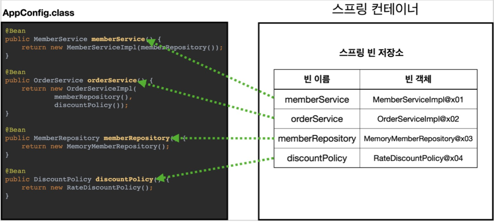
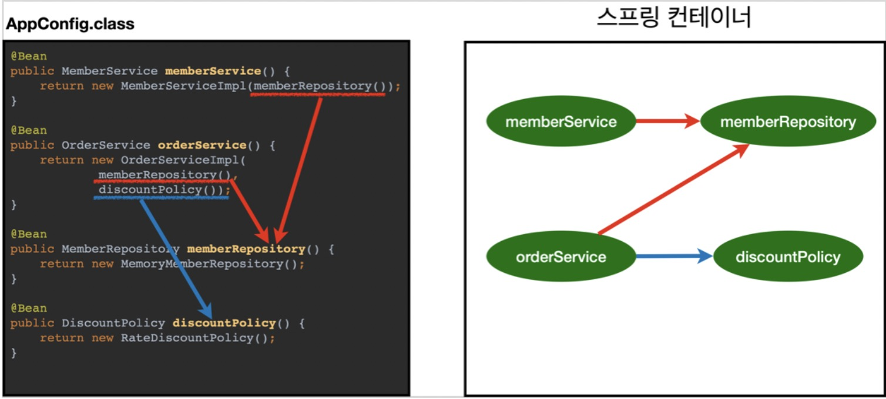

## AppConfig 변경
기존 코드
~~~java
public class AppConfig {

    public MemberService memberService() {
        return new MemberServiceImpl(memberRepository());
}
    public OrderService orderService() {
        return new OrderServiceImpl(
                memberRepository(),
                discountPolicy());
}
    public MemberRepository memberRepository() {
        return new MemoryMemberRepository();
}
    public DiscountPolicy discountPolicy() {
          return new FixDiscountPolicy();
        return new RateDiscountPolicy();
    }
}
~~~
변경 코드
~~~java
@Configuration
public class AppConfig  {

    @Bean
    public MemberService memberService(){
        return new MemberServiceImpl(memberRepository());
    }
    @Bean
    public MemberRepository memberRepository() {
        return new MemoryMemberRepository();
    }
    @Bean
    public OrderService orderService(){
        return new OrderServiceImpl(memberRepository(), discountPolicy());
    }
    @Bean
    public DiscountPolicy discountPolicy(){
        //return new FixDiscountPolicy();
        return new RateDiscountPolicy();
    }
}
~~~

## 스프링 컨테이너
메인 메소드 안에 아래의 코드를 선어해주면 스프링 컨테이너가 생성된다. 
~~~java
ApplicationContext applicationContext = new AnnotationConfigApplicationContext(AppConfig.class);
~~~
여기서 스프링 컨테이너는 @Configuration이 붙은 클래스를 찾아 설정 정보로 사용하고, @Bean이 붙은 메소드의 반환 객체를 스프링 컨테이너에 메소드 이름(memberService, memberRepository...)으로 등록한다.  
필요한 스프링 빈을 찾으려면 applicationContext.getBean()으로 찾을 수 있다.  

## 스프링 컨테이너 생성

* new AnnotationConfigApplicationContext(AppConfig.class)
* 스프링 컨테이너를 생성할 때는 구성 정보를 지정해주어야 한다. 여기서는 AppConfig.class 를 구성 정보로 지정했다.

## 스프링 빈 등록

* 파라미터로 넘어온 설정 클래스 정보를 사용해서 등록한다.  
* 일반적으로 메소드 이름으로 등록이 되지만 @Bean(name="...")으로 직접 부여할 수도 있다.
* 스프링 빈 이름이 같으면 한쪽 빈이 무시되거나 기존 빈을 덮어버리는 오류가 생겨 주의해야한다.

## 의존관계

설정 정보를 참조하여 의존관계를 자동으로 주입(DI)해준다.
