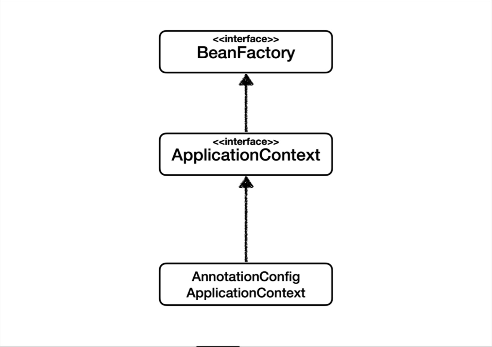

## 스프링 빈이란?
Spring IoC 컨테이너가 관리하는 자바 객체를 빈(Bean)이라고 부른다.

## 조회
### 기본
가장 기본적으로 AnnotationConfigApplicationContext의 메소드로 조회
* .getBean("빈 이름", 타입)
* .getBean(타입)

조회 대상이 없으면 NoSuchBeanDefinitionException: No Bean name: 'xxx' available 발생

~~~java
    AnnotationConfigApplicationContext ac = new AnnotationConfigApplicationContext(AppConfig.class);

    @Test
    @DisplayName("빈 이름으로 조회")
    void findBeanByName(){
        MemberService memberService = ac.getBean("memberService", MemberService.class);
        assertThat(memberService).isInstanceOf(MemberServiceImpl.class);
    }
    @Test
    @DisplayName("이름 없이 타입 으로 조회")
    void findBeanByType(){
        MemberService memberService = ac.getBean(MemberService.class);
        assertThat(memberService).isInstanceOf(MemberServiceImpl.class);
    }

    @Test
    @DisplayName("구체 타입으로 조회")
    void findBeanByName2 (){
        MemberService memberService = ac.getBean("memberService", MemberServiceImpl.class);
        assertThat(memberService).isInstanceOf(MemberServiceImpl.class);
    }

    @Test
    @DisplayName("빈 이름으로 조회X")
    // 예외가 터져야 테스트 성공
    void findBeanByNameX(){
        //MemberService xxxx = ac.getBean("xxxx", MemberService.class);
        assertThrows(NoSuchBeanDefinitionException.class,
                () -> ac.getBean("xxxx", MemberService.class));
    }
~~~

### 둘 이상
타입으로 조회 시, 같은 타입의 스프링 빈이 두개이상 존재하면 오류 발생
* .getBeansOfType()으로 조회

~~~java
 AnnotationConfigApplicationContext ac = new AnnotationConfigApplicationContext(sameBeanConfig.class);

    @Test
    @DisplayName("타입으로 조회시 같은 타입이 둘 이상 있으면 중복 오류가 발생한다")
    void findBeanByTypeDuplicate(){
        assertThrows(NoUniqueBeanDefinitionException.class,
                () -> ac.getBean(MemberRepository.class));
    }

    @Test
    @DisplayName("타입으로 조회시 같은 타임이 둘 이상 있으면, 빈 이름을 지정하면 된다")
    void findBeanByName(){
        MemberRepository memberRepository = ac.getBean("memberRepository1",MemberRepository.class);
        assertThat(memberRepository).isInstanceOf(MemberRepository.class);
    }

    @Test
    @DisplayName("특정 타입을 모두 조회하기")
    void findBeanByType(){
        Map<String, MemberRepository> beansOfType = ac.getBeansOfType(MemberRepository.class);
        for (String key : beansOfType.keySet()) {
            System.out.println("key = " + key + " value = " + beansOfType.get(key));
        }
        System.out.println("beansOfType = " + beansOfType);
        assertThat(beansOfType.size()).isEqualTo(2);
    }
    
    //두개의 같은 타입의 스프링 빈 등록
    @Configuration
    static class sameBeanConfig {

        @Bean
        public MemberRepository memberRepository1() {
            return new MemoryMemberRepository();
        }

        @Bean
        public MemberRepository memberRepository2() {
            return new MemoryMemberRepository();
        }
    }
~~~

## 상속관계 조회
부모 타입으로 조회하면 상속 받은 자식 타입도 함께 조회된다.

~~~java
    AnnotationConfigApplicationContext ac = new AnnotationConfigApplicationContext(TestConfig.class);

    @Test
    @DisplayName("부모 타입으로 조회시, 자식이 둘 이상 있으면 오류가 난다.")
    void findBeanByParentTypeDuplicate(){
        assertThrows(NoUniqueBeanDefinitionException.class,
                ()-> ac.getBean(DiscountPolicy.class));
    }

    @Test
    @DisplayName("부모 타입으로 조회시, 자식이 둘 이상 빈 이름을 지정하면 된다.")
    void findBeanByParentTypeBeanName() {
        RateDiscountPolicy rateDiscountPolicy = ac.getBean("rateDiscountPolicy", RateDiscountPolicy.class);
        assertThat(rateDiscountPolicy).isInstanceOf(RateDiscountPolicy.class);
    }

    @Test
    @DisplayName("특정 하위 타입으로 조히")
    void findBeanBySubType(){
        RateDiscountPolicy bean = ac.getBean(RateDiscountPolicy.class);
        assertThat(bean).isInstanceOf(RateDiscountPolicy.class);
    }

    @Test
    @DisplayName("부모 타입으로 모두 조회")
    void findAllByParentType(){
        Map<String, DiscountPolicy> beansOfType = ac.getBeansOfType(DiscountPolicy.class);
        assertThat(beansOfType.size()).isEqualTo(2);
        for (String key : beansOfType.keySet()) {
            System.out.println("key = " + key + " value = " + beansOfType.get(key));
        }
    }

    @Test
    @DisplayName("부모 타입으로 모두 조회 하기 - Object")
    void findAllBeanByObjectType(){
        Map<String, Object> beansOfType = ac.getBeansOfType(Object.class);
        for (String key : beansOfType.keySet()) {
            System.out.println("key = " + key + " value = " + beansOfType.get(key));
        }
    }
    @Configuration
    static class TestConfig {
        @Bean
        public DiscountPolicy  rateDiscountPolicy() {
            return new RateDiscountPolicy();
        }
        @Bean
        public DiscountPolicy fixDiscountPolicy() {
            return new FixDiscountPolicy();
        }
    }
~~~

## BeanFactory

BeanFactory는 스프링 컨테이너의 최상위 인터페이스로 스프링 빈을 관리하고 조회하는 역할을 한다.  
ApplicationContext가 상속 받았기 때문에 .getBean() 메소드를 사용할 수 있는 것이다.  

## ApplicationContext의 부가 기능

* 메시지소스를 활용한 국제화 기능
    * 예를 들어서 한국에서 들어오면 한국어로, 영어권에서 들어오면 영어로 출력 
* 환경변수
    * 로컬, 개발, 운영등을 구분해서 처리 
* 애플리케이션 이벤트
    * 이벤트를 발행하고 구독하는 모델을 편리하게 지원
* 편리한 리소스 조회
    * 파일, 클래스패스, 외부 등에서 리소스를 편리하게 조회

BeanFactory의 대부분의 기능을 ApplicationContext가 가지고있기 때문에 BeanFactory를 직접 사용할 일이 거의 없다.

## 메타정보
스프링과 관련된 설정은 java와 지금은 잘 사용하지않는 XML 두 가지의 방법있다. 두 가지의 방법이 되는 이유는 **BeanDefinition**이라는 추상화가 있기 가능하다.  
스프링 컨테이너는 java 코드인지 XML 파일인지 몰라도 되고 BeanDefinition이라는 것만 알면 된다.

새로운 형식의 설정 정보가 생성되면 BeanDefinitionReader를 만들어 BeanDefinition이 생성된다.

### BeanDefinition 정보
* BeanClassName: 생성할 빈의 클래스 명(자바 설정 처럼 팩토리 역할의 빈을 사용하면 없음) 
* factoryBeanName: 팩토리 역할의 빈을 사용할 경우 이름, 예) appConfig 
* factoryMethodName: 빈을 생성할 팩토리 메서드 지정, 예) memberService
* Scope: 싱글톤(기본값)
* lazyInit: 스프링 컨테이너를 생성할 때 빈을 생성하는 것이 아니라, 실제 빈을 사용할 때 까지 최대한 생성을 지연처리 하는지 여부
* InitMethodName: 빈을 생성하고, 의존관계를 적용한 뒤에 호출되는 초기화 메서드 명 
* DestroyMethodName: 빈의 생명주기가 끝나서 제거하기 직전에 호출되는 메서드 명 
* Constructor arguments, Properties: 의존관계 주입에서 사용한다. (자바 설정 처럼 팩토리 역할의 빈을 사용하면 없음)

## 메타 정보 확인
~~~java
    // AnnotationConfigApplicationContext ac = new AnnotationConfigApplicationContext(AppConfig.class);
    GenericXmlApplicationContext ac = new GenericXmlApplicationContext("appConfig.xml");
    @Test
    @DisplayName("빈 설정 메타정보 확인")
    void findApplicationBean(){
        String[] beanDefinitionNames = ac.getBeanDefinitionNames();
        for (String beanDefinitionName : beanDefinitionNames) {
            BeanDefinition beanDefinition = ac.getBeanDefinition(beanDefinitionName);

            if (beanDefinition.getRole() == BeanDefinition.ROLE_APPLICATION){
                System.out.println("beanDefinitionName = " + beanDefinitionName +
                        " beanDefinition = " + beanDefinition);
            }
        }
    }
~~~

## 정리
* BeanDefinition을 직접 생성해서 스프링 컨테이너에 등록할 수 도 있지만 거의 사용하지 않는다.
* 스프링이 다양한 형태의 설정 정보를 BeanDefinition으로 추상화해서 사용하는 것 정도만 이해하면 된다.
* 가끔 스프링 코드나 스프링 관련 오픈 소스의 코드를 볼 때, BeanDefinition 이라는 것이 보일 때가 있다. 이때 이러한 메커니즘을 떠올리면 된다.
