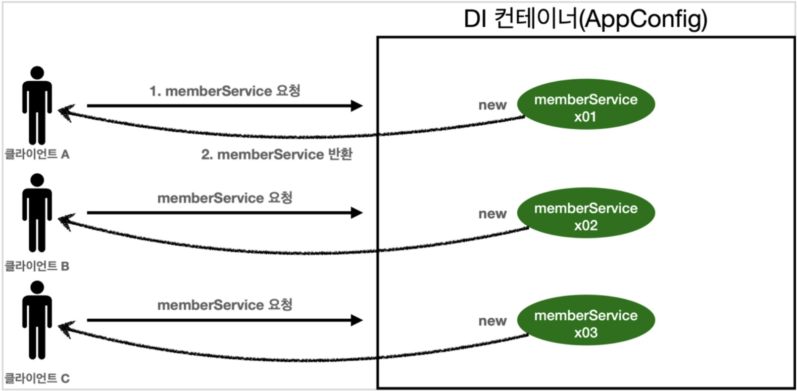
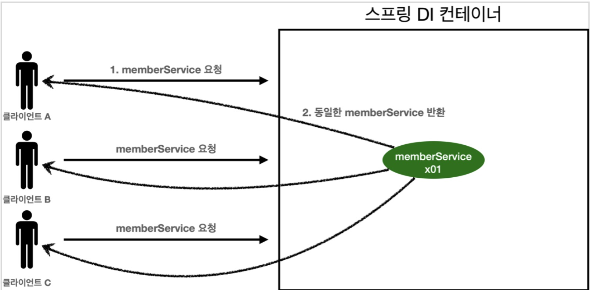
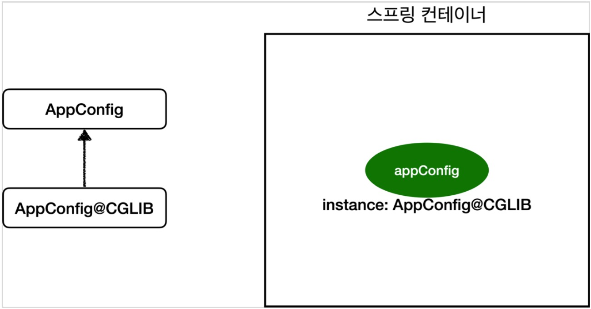

## 싱글톤 패턴이란?
* 클래스의 인스턴스가 **1개**만 생성되는 것을 보장하는 디자인 패턴

순수한 DI 컨테이너

위 그림과 같이 순수한 DI 컨테이너에서 클라이언트가 특정 서비스를 호출하면 각각 다른 인스턴스가 생성된다. 100번 요청하면 100개의 객체가 생성되고 소멸되어 메모리 낭비가 심하다. 이를 해결하기 위해서는 요청 될 때마다 사용할 공용 객체를 생성해 재사용하면 된다. 이런 방법을 싱글톤 패턴이라 부른다.  

~~~java
public class SingletonService {
    
    // 딱 1개의 객체 인스턴스만 생성되게 static으로 선언
    private static final SingletonService instance = new SingletonService();

    // 객체 인스턴스가 필요할때 사용할 메소드
    public static SingletonService getInstance(){
        return instance;
    }

    // 외부에서 객체 생성을 막기위해 생성자를 private로 선언 
    private SingletonService(){
    }

    public void logic(){
        System.out.println("싱글톤 객체 로직 호출");
    }

}
~~~

## 싱글톤 패턴 문제점
### 코드 자체가 많이 들어간다.
* static 인스턴스 생성
* getInstance() 정의
* private 생성자

### 의존 관계상 클라이언트가 구체 클래스에 의존한다 -> DIP 위반
* getInstance()로 구체 클래스를 참조하기 때문에 인터페이스로 구현이 불가능하다.

### 클라이언트가 구체 클래스에 의존한다. -> OCP를 위반할 가능성이 높다.
* 구체 클래스가 바뀌면 클라이언트 코드도 변경해야한다.

### 테스트하기 어렵다.
* 인스턴스를 미리 설정하여 고정시켜두기 때문에 유연한 테스트가 어렵다.

###  유연성이 떨어진다.
* 내부 속성을 변경하거나 초기화 하기 어렵다.
* private 생성자로 자식 클래스를 만들기 어렵다.
* DI를 사용하기 어렵다.

실제로 많이 사용하는 패턴이지만 비효율/비생산적인 패턴이기 때문에 안티패턴이라 불린다.

## 싱글톤 컨테이너
스프링 컨테이너는 싱글톤 패턴의 문제점을 해결하면서, 객체 인스턴스를 1개로 관리한다.  
지금까지 봤던 스프링 빈이 바로 싱글톤으로 관리되는 빈이다.  

## 싱글톤 컨테이너 특징
* 싱글톤 패턴을 적용하지 않아도, 객체 인스턴스를 싱글톤으로 관리
* 싱글톤 패턴을 위한 코드 제거
* DIP, OCP, 테스트, private 생성자로 부터 자유롭게 싱글톤 사용 가능

스프링 컨터이너가 싱글톤 컨테이너 역할을 하기 때문에 싱글톤 패턴의 단점을 해결하면서 객체를 싱글 톤으로 유지할 수 있다.  
싱글톤 레지스트리: 싱글톤 객체를 생성하고 관리하는 기능

~~~java
@Test
    @DisplayName("스프링 컨테이너와 싱글톤")
    void springContainer(){

        //AppConfig appConfig = new AppConfig();
        ApplicationContext ac = new AnnotationConfigApplicationContext(AppConfig.class);

        //1. 호출할 때 마다 객체를 생성
        MemberService memberService1 = ac.getBean("memberService",MemberService.class);

        //2. 호출할 때 마다 객체를 생성
        MemberService memberService2 = ac.getBean("memberService",MemberService.class);

        //참조값이 같은 것을 확인
        System.out.println("memberService1 = " + memberService1);
        System.out.println("memberService2 = " + memberService2);

        //memberService1 == memberService2
        assertThat(memberService1).isSameAs(memberService2);
    }
~~~

싱글톤 컨테이너 적용 후

* 이미 만들어진 객체 1개를 클라이언트들이 공유하기 때문에 메모리 낭비가 적어 효율적이다.

## 싱글톤 방식 주의사항
* 무상태(stateful)로 설계해야 한다.
    * 특정 클라이언트에 의존적인 필드가 있으면 안된다.
    * 특정 클라이언트가 값을 변경할 수 있는 필드가 있으면 안된다!
    * 가급적 읽기만 가능해야 한다.
    * 필드 대신에 자바에서 공유되지 않는, 지역변수, 파라미터, ThreadLocal 등을 사용해야 한다.

예시코드
~~~java
public class StatefulService {

    private int price; // 상태를 유지하는 필드

    public void order(String name, int price) {
        System.out.println("name = " + name + " price = " + price);
        this.price = price; // 여기가 문제!
    }

    public int getPrice() {
        return price;
    }
}
~~~
~~~java
class StatefulServiceTest {

    @Test
    void statefulServiceSingleton(){
        ApplicationContext ac = new AnnotationConfigApplicationContext(TestConfig.class);
        StatefulService statefulService1 = ac.getBean(StatefulService.class);
        StatefulService statefulService2 = ac.getBean(StatefulService.class);

        //ThreadA: A사용자 10000원 주문
        statefulService1.order("userA",10000);
        //ThreadB: B사용자 10000원 주문
        statefulService2.order("userB",20000);

        //ThreadA: 사용자A 주문 금액 조회
        int price = statefulService1.getPrice();
        System.out.println("price = " + price);

        Assertions.assertThat(statefulService1.getPrice()).isEqualTo(20000);

    }

    static class TestConfig {

        @Bean
        public StatefulService statefulServices() {
            return new StatefulService();
        }
    }
}
~~~
userA가 10000원 주문 -> Service 객체의 price = 10000 -> userB 20000원 주문 -> 10000원이였던 Service 객체의 price가 20000원으로 변경 -> userA와 userB는 price를 공유하고 있기 때문에 조회하면 마지막에 주문한 20000원이 나오게 된다. 실제로 이런 상황이 발생하면 막대한 복구 비용과 손해가 발생하므로 **공유되는 필드가 있으면 주의**해야한다.

## @Configuration과 싱글톤
AppConfig 클래스를 보면 new MemoryMemberRepository() 메소드가 두번 호출되는걸 볼 수 있다. 그러면 각각 다른 2개의 MemoryMemberRepository 객체가 생성되어 싱글톤 패턴이 깨질 것이라고 생각하지만 테스트를 통해 memberRepository 인스턴스는 공유되어 사용되는걸 확인할 수 있다.  
또한 스프링 컨테이너가 각각 @Bean을 호출해서 스프링 빈을 생성하기 때문에 memberRepostitory()는 총 3번 호출되어야 하는데 로그를 확인해보면 memberService, memberRepository, orderService 모두 1번씩만 호출된다.

## @Configuration과 바이트코드 조작의 마법
스프링 컨테이너는 싱글톤 레지스트리기 때문에 스프링 빈이 싱글톤이 되도롤 보장해주어야 하지만 자바 코드만 보면 3번 호출되는게 맞다. 스프링이 자바 코드까지 조작하기 위해 클래스의 바이트코드를 조작하는 라이브러리를 사용한다.

~~~java
    @Test
    void configurationDeep() {
        ApplicationContext ac = new AnnotationConfigApplicationContext(AppConfig.class);
        //AppConfig도 스프링 빈으로 등록된다.
        AppConfig bean = ac.getBean(AppConfig.class);
        System.out.println("bean = " + bean.getClass());
        
}
~~~

AnnotationConfigApplicationContext 파라미터로 넘긴 AppConfig도 스프링 빈으로 등록이 된다.  
순수 클래스라면 class hello.core.클래스명이 나와야하지만  
Appconfig 스프링 빈을 조회해보면 class hello.core AppConfig$$EnhancerBySpringCGLIB$$bd479d70  
그 이유는 스프링이 CGLIB라는 바이트코드 조작 라이브러리를 사용해서 AppConfig 클래스를 상속 받은 임의의 클래스를 만들고 새로 만들 클래스를 스프링 빈으로 등록한 것이다.

임의의 다른 클래스가 싱글톤이 보장되도록 해준다.

### AppConfig@CGLIB 예상코드
~~~java
@Bean
public MemberRepository memberRepository() {
        if (memoryMemberRepository가 이미 스프링 컨테이너에 등록되어 있으면?) { return 스프링 컨테이너에서 찾아서 반환;
        } else { 
            //스프링 컨테이너에 없으면 기존 로직을 호출해서 MemoryMemberRepository를 생성하고 스프링 컨테이너에 등록 
            return 반환
        } 
}
~~~

* @Bean이 붙은 메서드마다 이미 스프링 빈이 존재하면 존재하는 빈을 반환하고, 스프링 빈이 없으면 생성해서 스프링 빈으로 등록하고 반환하는 코드가 동적으로 만들어진다.
* 덕분에 싱글톤이 보장되는 것이다.
* AppConfig@CGLIB는 AppConfig의 자식 타입이므로, AppConfig 타입으로 조회 할 수 있다.

## @Configuration 적용하지않고 @Bean 등록
위에 코드에서 @Configuration을 지우고 스프링 빈을 조회하면 순수 클래스로 등록이 된다. 또한 MemberRepository도 3번 호출되어 싱글톤을 보장해주지 않는다.  
그러나 스프링 설정 정보는 항상 @Configuration을 사용하면 되니 크게 고민 안해도 된다.