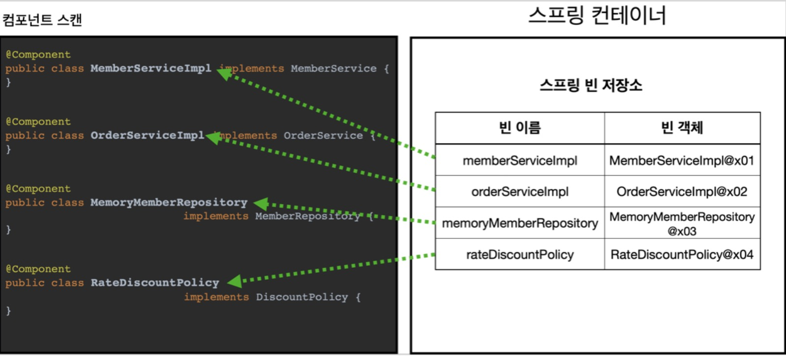
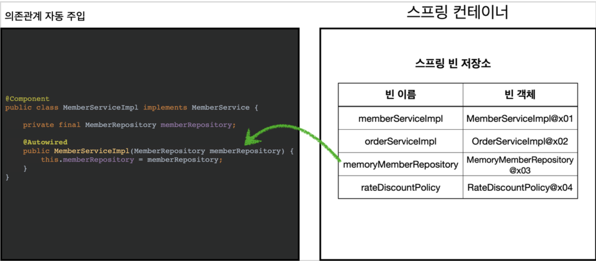

## 컴포넌트 스캔
개발자가 개발하다보면 등록할 스프링 빈이 수십, 수백개가 넘어가는데 수동으로 등록하다 보면 시간도 오래걸리고 누락될 가능성이 커진다.  
* @Component: 어노테이션을 사용하면 자동으로 스프링 빈을 등록해준다. 이런 기능을 컴포넌트 스캔이라 부른다.
* @Autowired: 의존관계 자동주입

AutoAppConfig.class
~~~java
@Configuration
@ComponentScan(
        excludeFilters = @ComponentScan.Filter(type = FilterType.ANNOTATION, classes = Configuration.class)
)
public class AutoAppConfig {
}
~~~
이전에 만들어두었던 AppConfig, TestConfig도 함께 등록되기 때문에 excludeFilter를 이용해 컴포넌트 스캔 대상에서 제외  
각 구현체 클래스(MemoryMeberRepositroy, MemberServiceImpl, RateDiscountPolicy...)에 **@Component** 추가
~~~java
@Component
public class RateDiscountPolicy implements DiscountPolicy(){
    ...
}
~~~
의존관계 주입이 필요하면 생성자에 **@Autowired** 추가
~~~java
@Autowired
    public MemberServiceImpl(MemberRepository memberRepository) {
        this.memberRepository = memberRepository;
    }
~~~

AnnotationConfigApplicationContext를 사용하는 것은 기존과 동일. 파라미터로 AutoAppConfig.class를 넘겨준다.

@ComponentScan

* @ComponentScan은 @Component 어노테이션이 붙은 모든 클래스를 스프링 빈으로 등록
* 이름은 클래스명을 사용하되 맨 앞글자만 소문자로 변경
* @Component("설정할 이름")으로 직접 이름을 설정할 수도 있다.

@Autowired

* @Autowired가 붙은 생성자를 스프링 컨터이너가 자동으로 해당 스프링 빈을 찾아서 주입한다.
* 기본 조회 전략은 타입이 같은 빈을 찾는 것

## 컴포넌트 스캔 탐색 위치
탐색 위치를 지정하지 않으면 모든 자바 클래스 심지어는 라이브러리까지 스캔하기 때문에 시간이 오래걸린다.  
default는 @ComponentScan 어노테이션이 붙은 패키지부터 탐색을 시작한다.
~~~java
@ComponentScan(
    basePackages = "패키지 명"
)
~~~
해당 패키지명부터 하위 패키지를 모두 탐색
~~~java
@ComponentScan(
    basePackagesClasses = 클래스 명.class
)
~~~
해당 클래스가 속한 패키지를 탐색 시작위치로 지정  
프로젝트 최상단에 AppConfig와 같은 설정 정보를 두면 하위 패키지는 모두 컴포넌트 스캔 대상이 되기 때문에 @ComponentScan 사용하고 basePackages를 생략한다. 
> 스프링부트의 대표 시작 정보인 @springBootApplication를 프로젝트 시작 루트 위치에 두는 것이 관례(@ComponentScan이 포함되어있음)

## 컴포넌트 스캔 기본 대상
* @Component: 컴포넌트 스캔 대상
* @Controller: 스프링 MVC 컨트롤러 사용
* @Service: 스프링 비지니스 로직에서 사용
* @Repository: 스프링 데이터 접근 계층에서 사용 
* @Configuration: 스프링 설정 정보에서 사용

해당 어노테이션 command + 클릭으로 들어가보면 @Component가 붙어있는걸 확인할 수 있다.  

컴포넌트 스캔의 용도 뿐만 아니라 다음 애노테이션이 있으면 스프링은 부가 기능을 수행한다. 
* @Controller : 스프링 MVC 컨트롤러로 인식
* @Repository : 스프링 데이터 접근 계층으로 인식하고, 데이터 계층의 예외를 스프링 예외로 변환해준다. 
* @Configuration : 앞서 보았듯이 스프링 설정 정보로 인식하고, 스프링 빈이 싱글톤을 유지하도록 추가 처리를 한다.
* @Service : @Service 는 특별한 처리를 하지않고 개발자들이 비즈니스 계층을 인식하는데 도움이 된다.

> userDefaultFilters=false로 지정하면 기본 스캔 대상들이 제외된다. default는 true

## 필터
* includeFilters: 컴포넌트 스캔 대상을 추가 지정
* excluedFilters: 컴포넌트 스캔 대상에서 제외
~~~java
@ComponentScan(
    includeFilters = @Filter(type = FilterType.옵션, classes = 클래스 명.class,
    excludeFilters = @Filter(type = FilterType.옵션, classes = 클래스 명.class)
)
~~~
FilterType 옵션
* ANNOTATION: 기본값, 애노테이션을 인식해서 동작한다. ex) org.example.SomeAnnotation
* ASSIGNABLE_TYPE: 지정한 타입과 자식 타입을 인식해서 동작한다. ex) org.example.SomeClass
* ASPECTJ: AspectJ 패턴 사용 ex) org.example..*Service+
* REGEX: 정규 표현식 ex) org\.example\.Default.*
* CUSTOM: TypeFilter 이라는 인터페이스를 구현해서 처리 ex) org.example.MyTypeFilter

> includeFilter는 @Component 사용으로 쓸 일이 거의 없지만 excludeFilter는 간혹 사용할 경우가 있다.  
> 되도록이면 스프링 부트에서 제공하는 기본 설정을 맞추어 사용하자.

## 중복 등록과 충돌
같은 이름의 빈을 수동 빈 등록과 자동 빈 등록을 하면 `수동 빈 등록이 우선권`을 가진다.  
그러나 최근 스프링 부트에서 여러가지 애매한 상황을 방지하고자 이름이 충돌되면 오류가 발생하게 기본 값을 변경 하였다.  
resources/~.properties 파일안에 `spring.main.allow-bean-definition-overriding=true`로 바꾸면 수동 빈이 우선권을 가져 자동 빈을 오버라이딩 한다. 